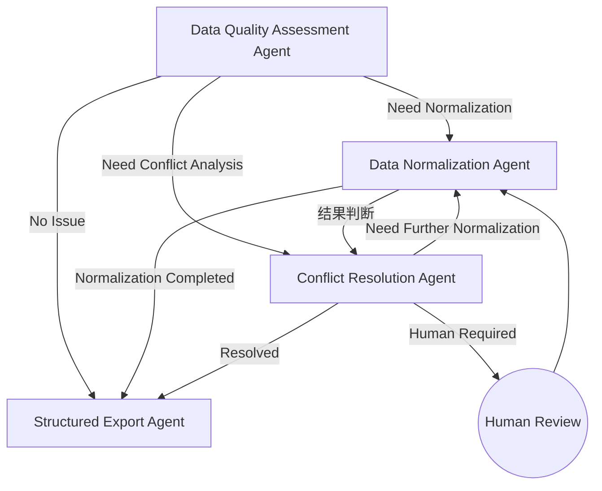

### ==各各agent模块设计及交互流程设计及功能职责设计==
**Data Quality Assessment Agent**：负责对输入数据进行质量评估，生成 Data Quality Report，包括数据是否需要规范化处理、是否存在冲突以及数据质量等级，为 LangGraph 的条件路由提供依据。

**Data Normalization Agent**：根据 Data Quality Report 或 Conflict Resolution Report，对数据执行标准化处理，包括字段统一、Schema Mapping、单位转换、缺失值处理、重复值处理以及格式规范化。在处理过程中，若检测到超出标准化能力范围的数据冲突，则提交至 Conflict Resolution Agent 进行进一步分析。

**Conflict Resolution Agent**：对存在冲突的数据进行分析，结合来源可信度、上下文信息及规则判断冲突是否能够自动解决；若无法保证结果可靠，则请求人工介入，并生成最终的 Conflict Resolution Report。结束该步骤后调用normalization模块。

**Structured Export Agent**：对经过规范化及冲突处理后的数据进行统一组织，生成标准化 CSV、Metadata、Traceability 信息以及最终的数据质量报告，供后续分析和前端展示。


### ==该图设计下的需要进行的workflow判断==：
**加入条件优先级判断:如果既需要conflict也需要normalization**
解决办法：如果conflict为true，那么normlization模块为false，之后再由conflict处理后调整为true再投入normlization模块

**异常处理与错误回退路径缺失：流程图未展示任何异常处理分支（如 Agent 内部执行失败、外部服务超时）。在生产环境中，任何一步报错都需要明确的降级或重试策略。添加异常处理节点，允许将错误数据导出为异常记录，并通知人工介入或终止流程。**
解决办法：每个 Agent 执行结束后均返回执行状态（Execution Status），包括 Success、Retry 和 Failed 三种状态。LangGraph 根据状态决定是否重试、进入人工介入流程或提前终止工作流。当 Agent 连续多次执行失败或输出结果置信度低于设定阈值时，将自动进入 Human error Review 节点，并保留当前执行状态与日志，保证工作流具有容错能力。

**缺少循环终止与收敛条件：B⇄C 的循环若无循环计数器或状态收敛判断，可能在极端数据上陷入无限循环。例如数据冲突无法自动解决且人工未介入，或每次规范化都产生新的冲突。**
解决办法：为避免 Data Normalization Agent 与 Conflict Resolution Agent 之间出现无限循环，系统在 Workflow 中维护当前处理状态（Workflow State）及循环计数器（Iteration Counter）。每完成一次规范化—冲突处理循环，系统重新评估数据质量。当满足以下任一条件时结束循环：（举例具体细则需要进行重判断）
数据质量满足预设标准；
不再检测到新的冲突；
达到最大迭代次数（如 3 次）；
Agent 判断当前问题无法继续自动优化。
若超过最大迭代次数仍未收敛，则自动进入 Human Review 节点，由人工完成最终决策。

### ==state设计==
**建议采用分层state设计，有层级管控的感觉**
下面是清洗数据部分之后的state设计：
```text
Global Workflow State(全局状态)
│
├── Context State （由意图识别的agent给出）
Context（研究领域、目标 Schema、单位规范、质量规则等）不仅质量模块需要，前面的检索、解析模块同样需要。为后续模块提供参考值
├── Research Data State      （前半部分）
└── Quality Module State     （后半部分）

Quality Module State
│
├── Data State (数据状态)
├── Report State (agent生成的report)
├── Workflow State(langgraph进行流程的控制)
└── Output State(最终输出状态)

Data State
│
├── Input Data(提取的数据源)
├── Current Data(Normalization,Conflict,Human等模块进行修改的部分，当前workflow处理的数据)
├── Human Modified Data(人工修改的部分方便进行回溯)
└── Data Trace(记录处理轨迹)

Report State
(用于记录agent生成的类似日志文件的东西)
│
├── Quality Report(用于是否进行比如normlizationagent或者是别的模块)
├── Conflict Report(是否需要人，或者是置信度计算，是否能够调用normlization等等)
└── Normalization Report(用于状态的记录，记录某数据进行了什么处理方法)

Workflow State
│
├── Current Node   （当前正在执行的 Agent）
├── Execution Status
│      当前 Agent 的执行状态（Success、Retry、Failed、Human Review记录是否成功，重复次数，人工的复检相关信息）
├── Iteration Counter （Workflow 已完成的循环次数，用于防止Normalization 与 Conflict 无限循环）
├── Route Decision （用于记录下一节点路径，可进行一个动态的调整）
└── Workflow History
       记录整个 Workflow 的执行轨迹（Agent 调用顺序、关键决策、状态变化）

Output State
│
├── Structured Data （最终处理的结构化数据）
├── Metadata （数据说明）
├── Traceability （数据来源可回溯，以及经过哪些处理）
└── Quality Summary （告诉查询者数据的质量）
```

**state与agent对应的流程**
| 流程节点                              | 主要读写的 State                                                                                                              |
| --------------------------------- | ------------------------------------------------------------------------------------------------------------------------ |
| **Data Quality Assessment Agent** | 读取 `Data State`、写入 `Quality Report`、更新 `Workflow State`                                                                  |
| **Data Normalization Agent**      | 读取 `Current Working Data` 和 `Quality/Conflict Report`、更新 `Current Working Data`、写入 `Processing Report`                   |
| **Conflict Resolution Agent**     | 读取 `Current Working Data` 和 `Processing Report`、写入 `Conflict Report`、必要时更新 `Workflow State`（Human Review、Route Decision） |
| **Structured Export Agent**       | 读取 `Current Working Data`、`Report State` 和 `Data Trace`，生成 `Output State`                                                |


### ==子agent具体设计==

==**采取的设计方法及结构**==
| 模块               | 内容                            |
| ---------------- | ----------------------------- |
| Agent Name       | Data Quality Assessment Agent |
| Goal             | 唯一职责                          |
| Input            | 读取哪些 State                    |
| Output           | 输出哪些 Report                   |
| Read State       | Data State / Context State    |
| Write State      | Report State / Workflow State |
| Assessment Logic | 内部完成哪些质量评估                    |
| Decision         | Workflow 路由依据                 |
| Tool Capability  | 需要哪些工具能力                      |
| Failure Strategy | Retry / Human Review / Failed |

#### Data Quality Assessment Agent具体设计
| 模块               | 内容                            |
| ---------------- | ----------------------------- |
| Goal             |Data Quality Assessment Agent 是整个数据质量模块的入口节点，负责对解析后的科学数据进行整体质量评估，识别数据中存在的规范化需求、冲突风险及质量问题，并生成标准化的 Data Quality Report，为后续 Workflow 提供条件路由依据。
|