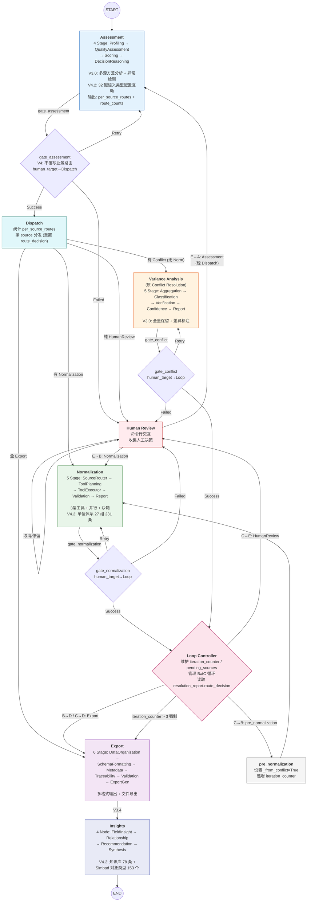

# Quality Module (SubGraph 4) 总架构设计方案 V4.3

> **版本**: V3.0 — 基于实际代码的完整架构文档
> **核心变更**: 从 V1.0 "冲突检测+裁决淘汰" 升级为 V3.0 "多源方差特征化+异常检测+全量保留标注"
> **更新 (2026-08-03, V4.2)**: 配置体系完整化 + 文档全面对齐 —
>   - 新增 Insights 模块 (V3.4 接入: Export → Insights → END)
>   - 配置体系: semantic_types_astrophysics 32 键 / entity_types_astrophysics 153 个 Simbad 类型 /
>     unit_conversions_astrophysics 27 组 231 条 / target_schema_astrophysics 28 字段 / 知识库 78 条
>   - 各模块设计文档已与源码逐段对齐 (模块版本见 1.3)
> **更新 (2026-08-04, V4.3)**: VizieR 目录 schema 扩展 —
>   - 字段别名 349 → 1178（database_catalog_properties 919 + 标准字段 259, 覆盖 23 个 VizieR 目录 1072 列）
>   - 单位组 27 → 34 / 231 → 257 条（+7 个 VizieR 记法新组 + 4 组记法别名 solMass/solRad/solLum/log(cm.s**-2)）
>   - semantic_types 7 键 units 同步 VizieR 记法; 数据源 vizier_catalogs_schema.json + query_results_progress_final.json
>   - 新脚本 gen_catalog_schema.py（行级合并/幂等/备份回滚）; 零 LLM 全链路验证 test_real_data_e2e_mock.py
> **最后更新**: 2026-08-04

---

## 一、总图设计 (Main Graph)

### 1.1 图结构 (Mermaid)



### 1.2 路由规则

**Gate 层 (V4 新增, 三处):**

| Gate | 来源 | 出口 | 说明 |
|------|------|------|------|
| `gate_assessment` | Assessment | Retry / Failed→E / Success→Dispatch | V4 fix: **不覆写** Assessment 业务路由; Failed→E 时 human_target=Dispatch (人工修改后重新分发) |
| `gate_normalization` | Normalization | Retry / Failed→E / Success→Loop | human_target=Loop (E 修改后回 Loop 重入 Normalization) |
| `gate_conflict` | Conflict | Retry / Failed→E / Success→Loop | human_target=Loop |

**Dispatch 分发逻辑:**

| 条件 | 目标 |
|------|------|
| 全部 HumanReview | → HumanReview |
| 有 Normalization | → Normalization 优先 (先清洗格式再分析) |
| 有 Conflict (无 Normalization) | → Conflict |
| 全 Export | → Export |

**B⇄C 循环 (Normalization ↔ Variance):**

| 步骤 | 说明 |
|------|------|
| B 完成 → Loop | 读 validation 结果; route_decision="Conflict" → C (B→C) |
| C 判定 unit_error | 写 resolution_plan → route_decision="Normalization" → pre_normalization → B (C→B) |
| C 判定 cross_id_error | → HumanReview (C→E) |
| C 判定 resolved | route_decision="Export" (C→D) |
| 最大 3 次循环 | iteration_counter > MAX_LOOP(3) → 强制 Export |

**E→A/B (Human Review 出口, V4 经 gate/dispatch 簿记):**

| 人工选择 | 路由 | 说明 |
|---------|------|------|
| 提交裁决 | E→B (Normalization) | 执行 human_replace/annotate 动作 (actions_to_normalize) |
| 无法判断 | E→A (Assessment) | 重新评估 (经 Dispatch 重新分发) |
| 取消 | 保留状态 | 下次可恢复 |

**终点链 (V3.4):** Export → Insights → END — 洞察节点消费导出数据与质量摘要, 生成 DataInsightsReport。

### 1.3 各模块版本

| 模块 | 版本 | 核心特征 |
|------|------|---------|
| Assessment | V3.1 / V4.2 | 多源方差分析 + 异常检测 + 配置驱动 (32 键语义类型) |
| Normalization | V2.3 / V4.3 | 3层工具体系 + 并行处理 + 安全沙箱 + V4.3: VizieR 目录映射 1178 别名/34 组单位 |
| Variance Analysis (原 Conflict) | V3.0 / V4.2 | 方差原因分类 + 异常验证 + 全量保留标注 |
| Export | V1.0 / V4.2 | 6 Stage 输出 + V2 Schema 兼容 + 15 列 CSV |
| Insights | V3.4 / V4.2 | 4 节点洞察生成 + 知识库 RAG + Simbad 对象类型体系 |
| HumanReview | V1.0 / V4.2 | 命令行交互 + E→A/B 双向路由 + gate 簿记 |

---

## 二、State 设计

### 2.1 分层架构

```
QualityGraphState (LangGraph StateGraph, Annotated[_merge_dict] 递归合并)
│
├── context_state      — 上下文 (由上游子图传入)
│   ├── research_domain, target_schema, standard_units
│   ├── quality_rules, clarified_intent
│
├── data_state         — 数据流
│   ├── input_data      (提取子图传入, 只读)
│   ├── current_data    (当前 Workflow 处理的数据, 可修改)
│   ├── human_modified_data (人工修改快照)
│   ├── data_trace      (数据处理轨迹, 列表拼接)
│   └── entity_index    (实体→记录映射)
│
├── report_state       — 各 Agent 报告
│   ├── quality         (Assessment: profile + sources + multi_source_variance
│   │                    + scoring + per_source_routes + conditional_routes)
│   ├── normalization   (Normalization: source_plan + tool_registry
│   │                    + modifications + validation + report)
│   ├── conflict        (Variance: aggregation + classification + verification
│   │                    + annotation_confidence + resolution_report)
│   └── insights        (Insights V3.4: field_insights + relationships
│                        + recommendations + narrative)
│
├── workflow_state     — 流程控制
│   ├── current_node, execution_status, iteration_counter (循环计数)
│   ├── retry_counter, route_decision, pending_sources (循环簿记)
│   ├── workflow_history (列表拼接)
│   ├── run_id, graph_version, created_at
│   ├── llm_call_count, tool_call_count
│   └── __human_review_needed__, __human_review_data__,
│       __human_review_decision__ (HumanReview 打断标记)
│
└── output_state       — 最终输出
    ├── structured_data, metadata, traceability, quality_summary
    ├── insights        (V3.4: DataInsightsReport)
    ├── schema_version ("2.0.0"), export_format ("json")
    └── exported_files (拼接), output_dir
```

### 2.2 Reducer 机制

```
_merge_dict 递归合并:
  - dict 值 → 递归合并
  - list 值 + key 在拼接白名单 → 拼接 (并去重, V4 fix)
  - list 值 + key 不在白名单 → 覆盖 (如 records, sources)
  - 其他 → right 覆盖 left

拼接白名单 (_LIST_APPEND_KEYS):
  workflow_history, data_trace, issues, base_logs, adapted_logs, generated_logs,
  errors, variances, anomalies, annotations, anomaly_flags,
  variance_cause_evidence, annotation_suggestions,
  exported_files   (V3.5 fix: Export + Insights 各阶段导出文件累积, 不互相覆盖)
```

### 2.3 State 与 Agent 对应关系

| Agent | 主要读取 | 主要写入 |
|-------|---------|---------|
| Assessment (4 Stage) | data_state.input_data, context_state | report_state.quality, workflow_state |
| Normalization (5 Stage) | data_state.current_data, report_state.quality, context_state | data_state.current_data, report_state.normalization |
| Variance (5 Stage) | report_state.quality.multi_source_variance, report_state.normalization.validation (B→C), data_state | report_state.conflict, workflow_state.route_decision |
| Export (6 Stage) | data_state, report_state, context_state | output_state (structured_data/metadata/traceability/quality_summary) |
| Insights (4 Node) | data_state.current_data, report_state.quality, output_state | report_state.insights, output_state.insights |
| HumanReview | report_state.conflict, report_state.quality, data_state | workflow_state (route_decision, __human_review_decision__) |

---

## 三、路由与流程控制

### 3.1 核心文件

| 文件 | 职责 |
|------|------|
| `graph.py` (198 行) | Main Graph 编排: 节点注册 + Gate 条件边 + Dispatch + Loop 管理 + Insights 终点 |
| `routers.py` | 控制层: Retry Controller + Gate + Router + Loop Controller (零业务逻辑) |

### 3.2 路由函数总览

```python
# graph.py 中的路由函数:
_route_after_gate(node, next_node, human_target)  # Gate 通用路由 (V4 fix: 不覆写业务路由)
_route_after_gate_assessment  # = _route_after_gate(A, DISPATCH, human_target=DISPATCH)
_route_after_gate_normalization # = _route_after_gate(B, LOOP, human_target=LOOP)
_route_after_gate_conflict    # = _route_after_gate(C, LOOP, human_target=LOOP)

# routers.py 中的控制函数:
check_retry(state, node)      # 检查执行状态, 决定是否重试 (Success/Retry/Failed/HumanReview)
gate(state)                   # 状态闸门: Retry→重入 / Failed→HumanReview / Success→正常路由
route_after_dispatch(state)   # Dispatch → Norm / Conflict / Export / HumanReview
route_after_loop(state)       # Loop → Export / pre_normalization / HumanReview / 强制 Export
route_after_human_review(state) # HumanReview → Assessment / Normalization / Stay
dispatch_node(state)          # 按 per_source_routes 分发 + 重置 route_decision
loop_controller_node(state)   # 循环计数 + pending_sources 簿记 + 超限强制终止
```

### 3.3 异常处理流程

```
每个 SubGraph 执行后 → Gate 检查 execution_status:

  "Success" → 正常路由到下一节点
  "Retry"   → retry_count < MAX_RETRIES → 重入当前 SubGraph
            → retry_count >= MAX_RETRIES → Failed (V4: 不再直接 HumanReview)
  "Failed"  → HumanReview (经 gate human_target: Assessment→Dispatch, Norm/Conflict→Loop)
  "HumanReview" → 停留在 HumanReview 等待人工决策

V4 fix:
  - Gate 不覆写业务 route_decision (修复 B→C 路由被 gate 吞掉的 bug)
  - Dispatch 重新分发时重置 route_decision
  - Validation Retry 耗尽 → needs_conflict ? Conflict : Export (修复恒 Export 死代码)
```

### 3.4 循环终止条件

```
B⇄C 循环 (Normalization ↔ Variance Analysis):
  iteration_counter 管理, 最大值 MAX_LOOP = 3 (configs/quality_rules.yaml loop_control)

  正常收敛:
    - Variance: route=Export → Export (C→D)
    - Variance: route=Normalization → pre_normalization → Normalization (C→B)
    - Normalization: route=Conflict → Loop → Conflict (B→C)

  强制终止:
    - iteration_counter > MAX_LOOP → 强制 Export
    - 保留完整日志供人工参考

  HumanReview 打断:
    - Variance: route=HumanReview → HumanReview (C→E, 经 Loop 清理 pending_sources)
    - Assessment: Failed → HumanReview (A→E, 经 gate human_target=Dispatch)
```

---

## 四、各 Agent 详细设计

### 4.1 Data Quality Assessment Agent (V3.1 / V4.2)

| 维度 | 内容 |
|------|------|
| **Agent Name** | Data Quality Assessment Agent |
| **版本** | V3.1 (V4.2 配置驱动) |
| **Goal** | 对输入科学数据进行整体质量评估，识别数据质量问题，**区分正常多源差异与真正异常**，为 per-source 路由提供决策依据 |
| **关键约束** | **仅负责评估，不修改数据。** 同一天体的多源观测差异不是冲突，全量保留 |
| **修改数据** | ❌ 否 |

**4 Stage 流水线 (assessment_graph.py, 87 行):**

```
Stage 1: ProfilingAgent (8 Tools, 0 LLM)
  → 纯统计观测: Dataset/Schema/Field/Source/Metadata/Distribution/SemanticType/Outlier
  → SemanticTypeInferrer: 32 键配置驱动 (V4.2, quality_rules.yaml semantic_types_astrophysics)

Stage 2: QualityAssessmentAgent (5 per-source Tools + 1 全局方差, 并行处理)
  → extraction_quality + completeness + consistency + format + source_reliability
  → 全局: analyze_multi_source_variance() (V3.0 核心, Cohen's d 效应量 + 95% CI)
  → Engine E1: AdaptiveThresholdEngine / E2: LLMCompletenessAnalyzer

Stage 3: QualityScoringAgent (0 LLM)
  → 加权评分 (领域自适应权重) + 非线性惩罚 + 置信度校准

Stage 4: DecisionReasoningAgent (0 LLM, 规则引擎)
  → 检查清单 + 决策矩阵 (Quality × Repair Cost) + 全局 cross_id 检查 (V3.1)
  → 输出: per_source_routes + conditional_routes + route_counts
```

**路由决策顺序 (源码):**

```python
if extr_score < 0.3:           → HumanReview (提取质量极差)
elif issues_found:             → Normalization (优先修复)
elif has_anomaly:              → Conflict (真正异常)
elif has_variance:             → Export (正常多源差异, 保留)
else:                          → Export (完美数据)
# 再经决策矩阵 (Quality × Repair Cost) 修正
# Repair Cost: anomaly_count>=3 或 issue_count>=10 → High; >=1/>=3 → Medium
# _ROUTE_SEVERITY = {Export:0, Normalization:1, Conflict:2, HumanReview:3}, 聚合取最严重
```

**检查清单 (6 项 issues + 异常/方差判定 + 全局检查):**

| # | 检查项 | 检测方式 | 路由 |
|---|--------|---------|------|
| 1 | 别名字段 | present_fields - expected_fields 非空 | → Normalization |
| 2 | 格式问题 | format.total_issues > 0 | → Normalization |
| 3 | 缺失单位 | records_missing_unit > 0 | → Normalization |
| 4 | 缺失溯源 | records_missing_provenance > 0 | → Normalization |
| 5 | 单位不符标准 | record unit ≠ standard_unit (target_schema) | → Normalization |
| 6 | 单位不一致 | 同一字段多 unit 混用 | → Normalization |
| 7 | 多源异常 | has_conflicts (提取/单位/交叉ID/统计离群) | → Conflict |
| 8 | 全局交叉ID | multi_source_variance.anomalies 含 cross_id_error (V3.1) | → HumanReview |
| 9 | 多源方差 | has_variance (正常多源差异, 不阻断) | → Export |
| 10 | 提取质量 | extraction_quality.score < 0.3 | → HumanReview |

---

### 4.2 Data Normalization Agent (V2.3 / V4.2)

| 维度 | 内容 |
|------|------|
| **Agent Name** | Data Normalization Agent |
| **版本** | V2.3 (V4.2 单位体系 / V4.3 VizieR 扩展) |
| **Goal** | 根据 Quality Report 或 Conflict Report，对科学数据执行规范化处理 |
| **关键约束** | **唯一有权修改数据的 Agent。** 不负责判断数据质量或解决复杂冲突。Schema 完整性由 Assessment 负责 |
| **修改数据** | ✅ 是 |

**5 Stage 流水线 (normalization_graph.py, 138 行):**

```
Stage 1: SourceRouterAgent (0 LLM)
  → 读取 per_source_routes + conditional_routes
  → 筛选 Normalization sources (clean sources → Export)
  → 区分触发源: quality_report / conflict_report (resolution_plan.actions_to_normalize)

Stage 2: ToolPlanningAgent (LLM: Layer 3 动态生成)
  → Layer 1: 条件→Tool 映射 (6个确定性工具)
  → Layer 2: Rule-Adapted 规则注入 (确定性, 非 LLM)
  → Layer 3: LLM 动态生成 Python Tool (dry-run 5 条样本 → 全量)

Stage 3: NormalizationAgent (ToolExecutor, 并行)
  → 按 by_source 执行: conflict_actions 先行 → Layer1 → Layer2 → Layer3
  → 安全沙箱: 受限 globals + 模块白名单 + 禁 os/sys/network
  → ThreadPoolExecutor 并行 (每 source 独立沙箱)

Stage 4: ValidationAgent (0 LLM)
  → 4 维校验: Schema / Format / Conflict / Semantic + 空串单位缺失 (V4)
  → 冲突复检 (V4 fix: 不通过 → needs_conflict_analysis, 不再恒 Export)
  → Retry: 内部最多 1 次, Graph 层 retry_count < 2

Stage 5: ReportAgent (0 LLM)
  → 汇总 modifications → normalization_summary
  → route_decision: "Conflict" | "Export" (经 gate → Loop)
```

**3 层工具体系:**

| 层级 | 说明 | 示例 |
|------|------|------|
| Layer 1: Base (6个) | 确定性工具 | schema_mapping, field_standardizer, unit_converter, missing_value_handler, duplicate_handler, format_standardizer |
| Layer 2: Rule-Adapted | 规则注入参数 (确定性) | unit_converter + auto_target_units, missing_value_handler + override_strategy |
| Layer 3: Generated | LLM 动态生成 Python | 自定义清洗函数 (sandbox 执行, TTL=本次Workflow) |

**Condition → Tool 映射 (源码 9 条, 无 unit_mismatch 幽灵条件):**

| Condition | Tool |
|-----------|------|
| alias_fields / extra_fields | schema_mapping |
| format_issues | field_standardizer |
| unit_inconsistency | unit_converter |
| missing_units / missing_provenance / completeness_low | missing_value_handler |
| duplicate_records | duplicate_handler |
| general | format_standardizer |

**单位转换配置体系 (V4.2 → V4.3):**

```
schema_mapping.yaml:
  - unit_conversions_astrophysics: 34 组 257 条 (乘法约定 value_std = value × factor)
    * 原有 17 组 62 条: distance/mass/radius/luminosity/velocity/proper_motion/
      period/age/magnitude/temperature/extinction/parallax/metallicity/
      surface_gravity/redshift/planet_radius/planet_mass
    * V4.2 +10 组: flux_density (Jy系) / dispersion_measure (cm^-3 pc) /
      rotation_measure (rad/m^2) / frequency (Hz~THz) / energy (erg~EeV) /
      magnetic_field (G~T) / pressure (Pa~atm) / density (g/cm^3) / angle (deg~rad) /
      wavelength (nm~mm)
    * V4.3 +7 组: VizieR 记法新组 (surface_brightness/abundance/wavenumber/
      surface_density/percentage/area/composite) + 4 组记法别名
      solMass/solRad/solLum/log(cm.s**-2) — 27 → 34 组 / 231 → 257 条
    * 4 个 offset 因子: K↔°C (offset_273.15/offset_-273.15), °F→°C, °F→K (V4.2)
  - target_schema_astrophysics: 28 字段 (standard_unit + aliases + semantic_type)

quality_rules.yaml:
  - semantic_types_astrophysics: 32 键 (keywords/units/feasible_ranges/unit_category)
    * unit_category 驱动 category 推断 (V4.2 fix: planet_radius/planet_mass 独立组,
      修复与恒星 radius/mass 撞车 ~109x / ~3.3e5x)

V4.2 修复:
  - proper_motion arcsec/yr 因子倒置 (0.001 → 1000)
  - 维度守卫: target 不在 matched_cat 组 → no_conversion_rule (防 mag→pc)
  - target 非组基准换算修正: val × factor(unit) / factor(target)
  - unconverted 4 种 kind: missing_unit / no_target_unit / no_conversion_rule / 异常
```

---

### 4.3 Data Variance & Anomaly Detection Agent (V3.0, 原 Conflict Resolution)

| 维度 | 内容 |
|------|------|
| **Agent Name** | Data Variance & Anomaly Detection Agent (原名 Conflict Resolution Agent) |
| **版本** | V3.0 (V4.2 文档对齐) |
| **Goal** | 对多源测量差异分类原因、验证异常、**全量保留所有值并标注差异原因** |
| **关键约束** | **不决定"哪个值对"——天文学中所有观测值都有效。** 仅真正异常 (提取错误/单位错误/交叉ID错误) 才触发路由动作 |
| **修改数据** | ❌ 否 (只写报告) |

**V3.0 vs V1.0 关键差异:**

| 方面 | V1.0 (旧设计) | V3.0 (实际) |
|------|-------------|-----------|
| Stage 数量 | 6 (含 ResolutionReasoning) | 5 (移除 ResolutionReasoning, 移入 legacy/) |
| 核心逻辑 | 冲突检测 → 裁决淘汰 | 方差特征化 → 分类标注 |
| 数据操作 | 淘汰低置信度数据 | 全量保留, action=preserve_all |
| 路由 | 同左 | Export / Normalization / HumanReview |

**5 Stage 流水线 (conflict_graph.py, 151 行):**

```
Stage 1: VarianceAggregationAgent (0 LLM)
  → 读取 quality.multi_source_variance + normalization.validation.conflict_check (B→C 桥接)
  → 按 (entity_type, entity_name, field_name) 聚合
  → 无方差/异常 → 快速出口 (仍写 resolution_report)

Stage 2: DifferenceClassificationAgent (LLM: 仅 undetermined)
  → 规则分类 (置信度 >= 0.65 → 确定; LLM 失败→异常 0.2 / 未匹配 0.3)
  → 5 种原因: methodological/condition/temporal/measurement_uncertainty/duplicate

Stage 3: AnomalyVerificationAgent (0 LLM)
  → 4 类验证: 提取质量 + 单位一致性 + 统计离群 + 交叉ID + 重复检测
  → verdict: confirmed / likely / borderline / false_positive

Stage 4: AnnotationConfidenceAgent (0 LLM)
  → 分类置信度 (阈值 0.55) + 异常验证置信度 (阈值 0.50)
  → 低于阈值 → Retry (最多 2 次, V3.1 retry_count 递增防无限重入)

Stage 5: AnnotationReportAgent (LLM: 摘要)
  → 全量标注: action="preserve_all"
  → resolution_plan 契约: per-source normalize_unit action (from_unit/to_unit, to_unit 取
    target_schema 标准单位) + annotations_to_add
  → 路由: Export / Normalization / HumanReview (has_cross_id/has_critical → HR 优先)
```

**异常类型:**

| 异常类型 | 验证方式 | 路由动作 |
|---------|---------|---------|
| `extraction_error` | extraction_confidence < 0.3/0.5 | flag_for_review |
| `unit_error` | 不同source单位维度不匹配 | normalize_unit (→ Normalization) |
| `cross_id_error` | 同名entity被赋予不同entity_type | human_review (→ HumanReview) |
| `statistical_outlier` | 同方法+同条件+同单位且 d>2.0 (Cohen's d) | flag_for_review |

> ⚠️ 注: `tools/conflict/` 下 8 个工具文件 (VarianceExtractor 等) 保留但**未被任何代码调用** (V3.0 逻辑内联进 agents); `agents/legacy/resolution_reasoning_agent.py` 为已废弃的 V1.0 实现。

---

### 4.4 Structured Export Agent (V1.0 / V4.2)

| 维度 | 内容 |
|------|------|
| **Agent Name** | Structured Export Agent |
| **版本** | V1.0 (V4.2 文档对齐) |
| **Goal** | 对完成处理的数据统一组织与结构化输出, 生成标准格式文件、元数据、溯源信息及质量摘要 |
| **关键约束** | **仅负责数据组织与输出，绝不修改数据内容。** Workflow 倒数第二节点 (→ Insights) |
| **修改数据** | ❌ 否 |

**6 Stage 流水线 (export_graph.py, 109 行):**

```
Stage 1: DataOrganizationAgent
  → 正向白名单过滤临时字段 (V3.5: 只保留期望字段 + V2 字段 + _raw_field)
  → Schema 对齐 + 按 source 分组排序

Stage 2: SchemaFormattingAgent
  → 多格式导出: JSON/CSV(15列含raw_field)/CSV-Wide/JSON-Wide (V4 宽表折叠)
  → 单位标准化检查: _norm(° / ℃ 清洗) + unit_mismatch issue
  → 标准单位来源: target_schema_astrophysics 28 字段 (含 cm^-3 pc / Jy / rad/m^2)

Stage 3: MetadataGenerationAgent (LLM: 字段描述)
  → 字段定义 + 来源汇总 + 处理记录 (失败→模板 fallback)

Stage 4: TraceabilityConstructionAgent
  → 数据世系 + 逐条溯源 (original_unit/final_unit) + 决策链 + 来源-记录映射
  → trace_completeness 内嵌 (V3.5) + trace_id/DB provenance 四要素 (V4)

Stage 5: OutputValidationAgent
  → 5 维校验: Schema/数据/格式/溯源/质量一致性
  → 校验失败 → Failed + quarantine (V4, 不再"不阻塞导出")

Stage 6: StructuredExportGenerationAgent
  → Quality Summary 组装 + Output State + 文件导出 (7个)
  → 输出目录: output/{run_id[:8]}/ (EXPORT_OUTPUT_DIR / EXPORT_CSV_ENCODING 可配)
```

**三路汇聚入口:**

- **A→D**: Assessment → Dispatch → Export (无问题 + 多源方差数据)
- **B→D**: Normalization → Loop → Export (规范化完成)
- **C→D**: Variance → Loop → Export (方差已标注/异常已解决, 或 Loop 强制终止)

**出口 (V3.4):** Export → **Insights** → END — 下游消费 structured_data + quality_summary 生成数据洞察。

---

### 4.5 Human Review Agent (V1.0 / V4.2)

| 维度 | 内容 |
|------|------|
| **Agent Name** | Human Review Agent |
| **版本** | V1.0 (V4.2 文档对齐) |
| **Goal** | 展示无法自动处理的异常/冲突, 收集人工决策, 路由到 Normalization 或 Assessment |
| **关键约束** | **不修改数据。** 只收集决策并写入 workflow_state |
| **修改数据** | ❌ 否 |

**交互流程 (human_review_agent.py):**

```
Step 1: 检查已有决策 (__human_review_decision__) → 恢复模式 (跳过交互)
Step 2: 提取待审核项 (_extract_pending, 4 来源: conflict.resolution_report /
        quality 异常 / pending_sources / QHR-* 质量审核项) → human_review_items
Step 3: 展示摘要 (数量、字段、原因)
Step 4: 逐条展示 + 用户选择
Step 5: 全局出口:
  [1] Normalization (E→B, 转换 human_replace/annotate → actions_to_normalize)
  [2] Assessment (E→A, 经 Dispatch 重新评估)
  [3] 取消 (保留状态)
Step 6: 写入决策 (workflow_state)
```

**入口来源 (V4 gate 簿记):**

- **A→E**: Assessment Failed (经 gate_assessment, human_target=Dispatch → 重新分发)
- **C→E**: Variance 检测到 cross_id_error 等无法自动处理的异常 (经 gate_conflict, human_target=Loop)

---

### 4.6 Data Insights Agent (V3.4 / V4.2)

| 维度 | 内容 |
|------|------|
| **Agent Name** | Data Insights Agent (V3.4 接入主图) |
| **版本** | V3.4 (V4.2: Simbad 体系 + 知识库扩展) |
| **Goal** | 对导出的结构化数据生成科学洞察: 字段物理意义解读、跨字段物理关系、使用建议、综合叙述 |
| **关键约束** | **只读。** 不修改数据, 只写 report_state.insights / output_state.insights |
| **修改数据** | ❌ 否 |

**4 Node 线性流水线 (insights_graph.py, 63 行):**

```
START → FieldInsightAgent → RelationshipAgent → RecommendationAgent → SynthesisAgent → END

Node 1: FieldInsightAgent (LLM)
  → per-field 跨来源差异分析 (RAG 知识检索 + LLM 解读 + 确定性 observation 合并)
  → typical_range 确定性兜底 (entity_types 配置, V4.2: pulsar/DM 等复活)
  → LLM 失败 → 模板 fallback (observation 填充, interpretation="LLM 不可用")

Node 2: RelationshipAgent (LLM)
  → 字段对物理关系识别 (physical_law / correlation / conditional / no_relationship)
  → _kb_preset_relationships: 知识库预置关系兜底

Node 3: RecommendationAgent (LLM)
  → overall_grade (excellent/good/fair/poor) + 使用建议 + 局限性 + 注意事项
  → 确定性输入: low_confidence_records + coverage_gaps (仅 paper 来源)

Node 4: SynthesisAgent (LLM)
  → 3-5 句综合叙述 (DataInsightsReport)
```

**知识库体系 (V4.2, 78 条):**

```
data/insight_knowledge/astrophysics/ 5 个 yaml:
  reference_ranges 20 / measurement_theory 16 / astrophysical_models 16 /
  physical_laws 13 / methodology 13 = 78 条
条目结构: id / title / category / tags / applies_to(fields,entities,methods) /
          content / source / confidence

检索评分 (knowledge_store.py, 双向子串匹配):
  tags +3 / applies_to.fields +5 / applies_to.entities +3 (直接命中)
  applies_to.methods +3 / category +2 / 父类匹配 +2 (Simbad 祖先链, V4.2)
降级: 知识库缺失/为空 → search()=[] → 纯 LLM 模式
```

**Simbad 对象类型体系 (V4.2, entity_types_astrophysics):**

```
quality_rules.yaml entity_types_astrophysics:
  - 153 个类型 / 8 大类: stars 67, spectral 22, galaxies 19, ism 16,
    gravitation 9, galaxy_sets 8, star_sets 6, misc 6 (源自 Simbad otypes.list)
  - 3 层推断链: catalog_inference (5条, vizier_table_id 前缀) >
    field_inference (9条, 字段名) > field_class_inference (7条, 语义类型) >
    default_entity_type=galaxy
  - typical_ranges: 18 实体 (star/galaxy/agn/quasar/pulsar/...)
  - 消费层 tools/insight/entity_types.py: normalize_entity_type /
    infer_entity_type / entity_ancestors / get_typical_range (配置缺失全降级)

效果 (真实数据验证): 219 条全 "Unknown" → {star: 15, galaxy: 138}, Unknown 残留 0
```

---

## 五、配置文件体系 (V4.2 → V4.3)

```
configs/ (8 文件):
  ├── __init__.py            # 领域感知加载: {section}_{domain} 优先, 回退通用段
  │                          # 线程本地缓存 + _global_domain 全局兜底
  ├── quality_rules.yaml     # 质量规则 (21 段, ~900 行)
  │   ├── semantic_types / semantic_types_astrophysics  # 32 键 (5 字段规则)
  │   ├── entity_types_astrophysics                     # 153 类型 / 8 大类 (Simbad)
  │   ├── typical_ranges                                # 18 实体典型范围
  │   ├── domain_weights_* / journal_tiers_* / loop_control / consistency...
  ├── schema_mapping.yaml    # Schema 映射 (5 段, ~690 行, 含 1178 别名)
  │   ├── target_schema / target_schema_astrophysics    # 28 字段 (standard_unit + 1178 别名, 含 database_catalog_properties 919)
  │   ├── unit_conversions / unit_conversions_astrophysics  # 34 组 257 条
  │   └── field_standardization
  ├── insight_prompts.yaml   # Insights 4 节点 prompt 模板 (+entity_type_reference)
  ├── domain_config.py       # 领域常量 (KB_TOP_K / ENTITY_TYPE_PARENT_SCORE 等)
  ├── llm_config.yaml        # LLM 配置 (DeepSeek, prompt_parsing)
  └── value_parser_rules.yaml

新增领域: 只需在 yaml 注册 {section}_{domain} 段, 无需改代码
生成脚本: scripts/gen_entity_types.py (153 类型) / gen_astro_units.py (34 组, 幂等) /
          append_knowledge.py (知识库追加, 幂等) /
          gen_catalog_schema.py (V4.3: VizieR 目录 schema 别名/单位生成, 幂等)
数据源: 项目根 vizier_catalogs_schema.json (23 目录 1072 列定义) + query_results_progress_final.json
        (25 天体多目录查询) → gen_catalog_schema.py 按 UCD+显式清单分类生成别名/单位补丁
        (行级合并、写前备份、写后验证、失败回滚、幂等)
```

---

## 六、文件结构总览

```
V1\子图4部分代码\
├── graph.py                              # Main Graph 编排 (V4.2, 198行)
├── routers.py                            # 控制层: Retry + Gate + Router + Loop
├── quality_state.py                      # State 定义 + Reducer + 工厂函数
│
├── Data_Assessment_agentV1/              # Assessment SubGraph (V3.1/V4.2)
│   ├── assessment_graph.py               # 4 Stage 流水线 (87行)
│   ├── ASSESSMENT_DESIGN_REPORT.md       # 设计报告 V3.0 (V4.2 更新, 885行)
│   └── agents/
│       ├── profiling_agent.py            # Stage 1: 8 Tools
│       ├── quality_assessment_agent.py   # Stage 2: 并行评估 + 方差分析
│       ├── quality_scoring_agent.py      # Stage 3: 加权评分 + 校准
│       └── decision_reasoning_agent.py   # Stage 4: 规则路由决策 (0 LLM)
│
├── Data_Normalization_agentV1/          # Normalization SubGraph (V2.3/V4.2)
│   ├── normalization_graph.py            # 5 Stage 流水线 (138行)
│   ├── NORMALIZATION_DESIGN_REPORT.md    # 设计报告 V2.3 (V4.2 更新, 485行)
│   ├── README.md
│   └── agents/
│       ├── source_router_agent.py        # Stage 1: 筛选 + 分流
│       ├── planning_agent.py             # Stage 2: 3层 Tool Planning
│       ├── normalization_agent.py        # Stage 3: Tool Executor + sandbox
│       ├── validation_agent.py           # Stage 4: 4维校验 + 冲突复检
│       └── report_agent.py               # Stage 5: Report + 路由
│
├── Data_Conflict_agentV1/                # Variance Analysis SubGraph (V3.0)
│   ├── conflict_graph.py                 # 5 Stage 流水线 (151行)
│   ├── CONFLICT_DESIGN_REPORT.md         # 设计报告 V3.0 (V4.2 更新, 503行)
│   ├── agents/                           # 5 个 Agent (逻辑内联, 0 Tools)
│   └── legacy/
│       └── resolution_reasoning_agent.py # ❌ 已废弃 (V3.0 移除)
│
├── Data_Export_agentV1/                  # Export SubGraph (V1.0/V4.2)
│   ├── export_graph.py                   # 6 Stage 流水线 (109行)
│   ├── EXPORT_DESIGN_REPORT.md           # 设计报告 V1.0 (V4.2 更新, 504行)
│   └── agents/                           # 6 个 Agent
│
├── Data_Insights_agentV1/                # Insights SubGraph (V3.4/V4.2)
│   ├── insights_graph.py                 # 4 Node 流水线 (63行)
│   ├── INSIGHTS_DESIGN_REPORT.md         # 设计报告 V3.4 (V4.2 新建, 540行)
│   └── agents/                           # 4 个 Agent (field/relationship/recommendation/synthesis)
│
├── Data_HumanReview_agentV1/             # Human Review (V1.0/V4.2)
│   ├── HUMAN_REVIEW_DESIGN_REPORT.md     # 设计报告 V1.0 (V4.2 更新, 284行)
│   └── human_review_agent.py             # 命令行交互
│
├── configs/                              # 配置文件体系 (8 文件, 见第五章)
│   ├── __init__.py / domain_config.py / llm_config.yaml
│   ├── quality_rules.yaml / schema_mapping.yaml
│   ├── insight_prompts.yaml / value_parser_rules.yaml
│
├── models/                               # Pydantic v2 数据模型
│   ├── grounded_data.py / source.py / record.py
│   └── insights.py                       # DataInsightsReport (V3.4)
│
├── tools/                                # 工具层
│   ├── assessment/                       # 16 个工具 (含 source_utils)
│   ├── normalization/                    # 6 个工具
│   ├── conflict/                         # 8 个工具 (V3.0 未被调用, 保留)
│   ├── export/                           # 6 个工具
│   ├── insight/                          # 6 个工具 (context_builder/knowledge_store/entity_types...)
│   └── _parse_utils.py / source_utils.py
│
├── data/insight_knowledge/astrophysics/  # 知识库 (V4.2: 78 条, 5 个 yaml)
│
├── scripts/                              # 配置生成脚本 (V4.2 / V4.3)
│   ├── gen_entity_types.py               # 153 类型生成
│   ├── gen_astro_units.py                # 单位组生成 (幂等)
│   ├── append_knowledge.py               # 知识库追加 (幂等)
│   └── gen_catalog_schema.py             # V4.3: VizieR 目录 schema 别名/单位生成
│
├── utils/                                # 工具函数
│   ├── llm.py / logger.py / retry.py
│
├── schemas/                              # LLM 输出 Schema (Pydantic)
│
└── test/                                 # 测试
    ├── mock_data.py                      # 天文 Mock 数据
    ├── test_fix_regression.py            # V4 回归 (23 用例, 含单位/实体类型)
    ├── test_insights_graph.py            # Insights 测试 (12 用例)
    ├── test_main_graph_routing.py        # 主图路由 (9 用例)
    ├── test_real_data_e2e_mock.py        # V4.3: 零 LLM 全链路验证
    └── ...                               # assessment/normalization/e2e 等
```
