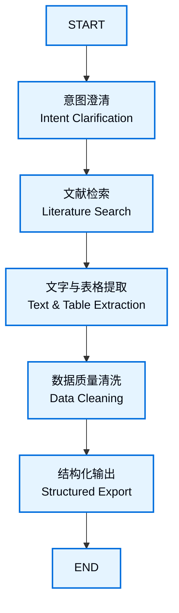
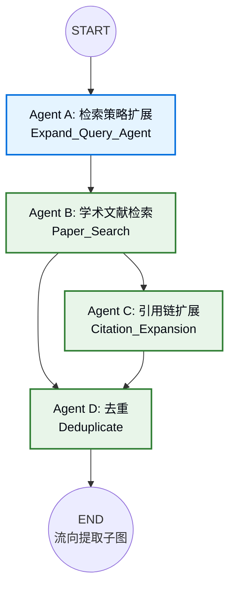
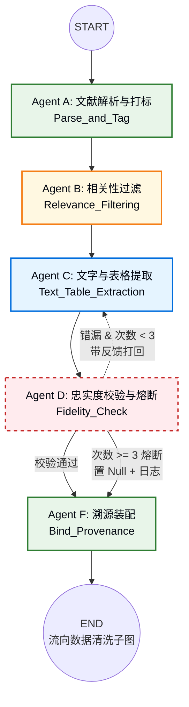
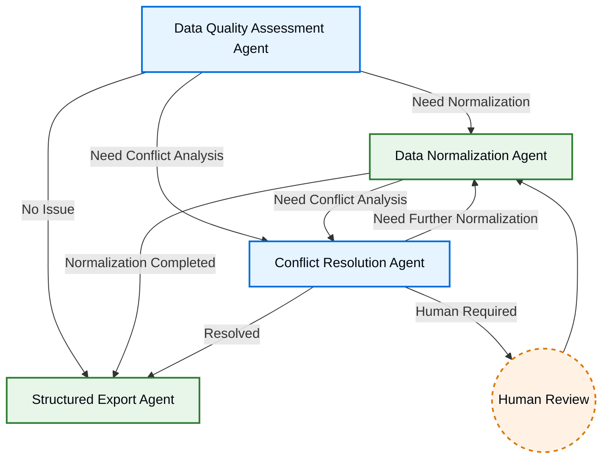

# 科学文献数据管道 — V1 简化方案

---

## 1. V1 总体目标与范围

### 1.1 核心定位

V1 是一个**以科学文献为核心的自动化数据提取管道**。用户输入自然语言科学查询，系统自动检索学术论文、解析文献中的**文字与表格数据**、进行质量校验，最终输出结构化的科学数据集。

### 1.2 V1 范围界定

| 维度         | V1 范围                                                      | 不在 V1 范围                                         |
| ------------ | ------------------------------------------------------------ | ---------------------------------------------------- |
| **数据来源** | 仅学术文献（OpenAlex / Semantic Scholar），不做数据库检索和网页检索 | 多源异构数据的全面覆盖                               |
| **数据类型** | 文献中的文字段落和表格                                       | 文献中的图片、图表（VLM 提取）                       |
| **人工介入** | 仅在意图确认阶段（HITL 确认表单）和冲突无法自动解决时        | Data Quality Assessment Agent 不设 Human Review 分支 |
| **工具调用** | 精简版——仅保留文字/表格处理所需工具                          | 图片解析、复杂多模态校验工具                         |
| **输出**     | 结构化数据 + 元数据 + 溯源信息 + 质量摘要                    | 完整的多态溯源协议（简化版溯源即可）                 |

### 1.3 V1 预期目标

1. **端到端跑通**：从用户输入自然语言查询 → 文献检索 → 文字/表格提取 → 数据清洗 → 结构化输出，全流程自动化可运行。
2. **文献优先**：检索模块以学术论文为主要数据源，验证 OpenAlex / Semantic Scholar API 接入与引用链扩展的有效性。
3. **文字 + 表格提取**：实现 PDF 文字段落和表格的解析、提取、校验闭环，暂不涉及图片/VLM。
4. **基础质量保障**：数据规范化（字段映射、单位转换、缺失值处理）+ 冲突检测（版本去重、来源比对），不设质量评估的人工审核。
5. **最小可行 Agent 数**：每个子图仅保留核心 Agent，降低首版开发复杂度。

---

## 2. V1 总图



### 2.1 V1 工作流各步骤

| 步骤               | 职责                                          | V1 简化说明                                                  |
| ------------------ | --------------------------------------------- | ------------------------------------------------------------ |
| **意图澄清**       | 解析用户自然语言查询，提取检索参数            | 与完整版相同，保留 3 个 Agent                                |
| **文献检索**       | 检索学术论文 + 引用链扩展 + 去重              | 仅保留文献检索单支路，不做数据库和网页检索                   |
| **文字与表格提取** | 解析 PDF 文字和表格，提取目标数据，校验忠实度 | 去掉 VLM 图片提取，保留文字/表格的提取与熔断校验             |
| **数据质量清洗**   | 字段标准化、去重、缺失值处理、冲突检测        | **不设 Data Quality Assessment Agent 的 Human Review 分支**；工具精简为文字/表格场景 |
| **结构化输出**     | 生成结构化数据 + 元数据 + 溯源 + 质量摘要     | 与完整版一致                                                 |

---

## 3. V1 子图设计

### 3.1 意图澄清子图（V1 不变）

与完整版一致，保留全部 3 个 Agent：

- **Agent A (Evaluate_Intent)**：意图解析与槽位填充
- **Agent B (Ask_User_Guided)**：HITL 引导式追问
- **Agent C (Confirm_Intent)**：HITL 最终确认

### 3.2 文献检索子图（V1 简化）

V1 仅保留文献检索单支路：检索策略扩展 → 论文检索 → 引用链扩展 → 去重。不接入开放数据库和网页检索。



**V1 简化要点：**

- **Agent A (Expand_Query)**：将意图参数翻译为文献检索式（同义词扩展 + API 参数打包），与完整版一致；
- **Agent B (Paper_Search)**：调用 OpenAlex / Semantic Scholar API 检索论文元数据，V1 唯一检索源；
- **Agent C (Citation_Expansion)**：从检索结果中筛选种子论文，通过图谱 API 扩展前后向引用文献；
- **Agent D (Deduplicate)**：基于 DOI 精确去重 + 标题语义去重，合并种子论文与引文扩展结果；
- **不做** Database_Search 和 Web_Search，对应的 State 字段（`raw_databases`、`raw_web_supplements`）在 V1 中不创建，Agent D 仅处理 `raw_papers` + `citation_papers` 两个输入池。

### 3.3 文字与表格提取子图（V1 简化）



**V1 简化要点：**

| 变更项                  | 完整版                                     | V1                                                      |
| ----------------------- | ------------------------------------------ | ------------------------------------------------------- |
| Agent A 定位            | 通用格式标准化（PDF/网页/数据库）          | **仅处理 PDF 文献**                                     |
| Agent C 提取方式        | LLM + VLM（图片）                          | **仅 LLM（文字和表格）**                                |
| Agent C Tool Capability | LLM + VLM + Trace ID Validator             | **LLM + Trace ID Validator（去掉 VLM）**                |
| Agent D 校验范围        | 文字 + 表格 + 图片提取值                   | **仅文字和表格提取值**                                  |
| Agent A Tool Capability | PDF Parser + DOM Stripper + XPath/JSONPath | **PDF Parser + Table Extractor（去掉网页/数据库工具）** |

### 3.4 数据质量清洗子图（V1 简化）



**V1 简化要点：**

| 变更项                                      | 完整版                                                      | V1                                                           |
| ------------------------------------------- | ----------------------------------------------------------- | ------------------------------------------------------------ |
| **Assessment → Human Review**               | 有（`A --> E`）                                             | **去掉**。质量评估不触发人工审核，仅输出 Quality Report 供路由决策 |
| **Human Review → Assessment**               | 有（`E --> A`）                                             | **去掉**。人工修正后的数据不回流至评估节点                   |
| **Data Quality Assessment Tool Capability** | 7 个工具（含 Source Validation、Image Quality Check 等）    | **精简为 4 个**：Missing Value Detection、Schema Validation、Field Consistency Checker、Duplicate Detection。去掉来源可信度检查（纯文献场景下 DOI 已保证） |
| **Conflict Resolution Agent**               | 6 个 Stage，含 Evidence Collection 和 Confidence Evaluation | **保留 6 个 Stage，但证据来源简化**：仅比对文献元数据（DOI、标题、作者、年份），不涉及多源异构比对 |

**Agent 工具精简对照：**

| Agent                       | 完整版 Tool Capability | V1 保留                                                      |
| --------------------------- | ---------------------- | ------------------------------------------------------------ |
| **Data Quality Assessment** | 7 个工具               | 4 个：Missing Value Detection、Schema Validation、Field Consistency Checker、Duplicate Detection |
| **Data Normalization**      | 6 个工具               | 4 个：Schema Mapping Engine、Missing Value Handler、Duplicate Detection & Merge、Format Standardizer。去掉 Unit Converter（文献场景单位相对统一）和 Data Validation Checker |
| **Conflict Resolution**     | 5 个工具               | 3 个：Rule-based Conflict Checker、Multi-source Comparison Engine、Conflict Reasoning Module。去掉 Source Reliability Analyzer（DOI 保证来源）和 Confidence Evaluation Module（简化置信度逻辑） |
| **Structured Export**       | 5 个工具               | 5 个：完整保留（导出逻辑通用）                               |

### 3.5 循环终止条件（V1 简化）

Data Normalization ↔ Conflict Resolution 循环的最大迭代次数保持 **3 次**，但终止条件从 4 条简化为 3 条：

1. 数据质量满足预设标准；
2. 不再检测到新的冲突；
3. 达到最大迭代次数（3 次）。

> V1 去掉 "Agent 判断当前问题无法继续自动优化" 这一主观判断条件，减少 Agent 决策复杂度。

---

## 4. grounded_data 接口定义（前后端对接 JSON）

> **重要：** `grounded_data` 是提取子图（前半部分）产出、数据清洗子图（后半部分）消费的核心 JSON。此格式一经确定即作为前后端接口契约，V1 不可更改。
>
> **设计原则：** 提取子图的职责是"忠实抄写原文"。它只负责：①解析 PDF 文字和表格 → ②提取目标字段值 → ③绑定溯源坐标（page + bbox）→ ④输出。提取失败的数据直接丢弃（不传 null 记录），置信度评估和数据质量评分由下游清洗子图负责。

### 4.1 JSON Schema (Draft 2020-12)

```json
{
  "$schema": "https://json-schema.org/draft/2020-12/schema",
  "$id": "https://sci-pipeline/v1/grounded_data",
  "title": "Grounded Data — V1 Extraction Output",
  "description": "提取子图最终产物，承载溯源锚定的结构化科学数据，供下游清洗子图消费。",
  "type": "object",
  "required": ["schema_version", "sources", "records"],
  "properties": {
    "schema_version": {
      "type": "string",
      "const": "1.0.0",
      "description": "接口版本号，用于前后端兼容校验。"
    },
    "sources": {
      "type": "array",
      "description": "本次提取涉及的所有源文献。",
      "items": {
        "type": "object",
        "required": ["source_id", "source_type", "title", "access_path"],
        "properties": {
          "source_id": {
            "type": "string",
            "description": "源文献全局唯一标识，建议使用 DOI（如 10.xxx/xxx）或内部 hash。"
          },
          "source_type": {
            "type": "string",
            "const": "paper",
            "description": "V1 固定为 paper。"
          },
          "doi": {
            "type": ["string", "null"],
            "description": "DOI，若无法获取则为 null。"
          },
          "title": {
            "type": "string",
            "description": "文献标题。"
          },
          "authors": {
            "type": "array",
            "items": { "type": "string" },
            "description": "作者姓名列表。"
          },
          "year": {
            "type": ["integer", "null"],
            "description": "出版年份。"
          },
          "journal": {
            "type": ["string", "null"],
            "description": "期刊/会议名称。"
          },
          "access_path": {
            "type": "string",
            "description": "PDF 获取 URL 或本地缓存路径。"
          },
          "retrieval_priority": {
            "type": "number",
            "description": "检索子图分配的优先级评分。"
          }
        }
      }
    },
    "records": {
      "type": "array",
      "description": "成功提取的数据记录列表。每行一条，独立溯源。提取失败的字段不出现。",
      "items": {
        "type": "object",
        "required": ["record_id", "source_id", "field_name", "field_value", "trace_id", "provenance", "extraction_method"],
        "properties": {
          "record_id": {
            "type": "string",
            "description": "本条记录全局唯一标识。格式：{source_id}_{field_name}_{n}。"
          },
          "source_id": {
            "type": "string",
            "description": "外键 → sources[].source_id。"
          },
          "field_name": {
            "type": "string",
            "description": "科学字段名，使用 snake_case（如 yield_strength、tensile_strength、temperature）。"
          },
          "field_value": {
            "description": "提取值。number 或 string，不含 null。",
            "oneOf": [
              { "type": "number" },
              { "type": "string" }
            ]
          },
          "field_unit": {
            "type": ["string", "null"],
            "description": "单位（如 MPa、K、wt%）。若字段无量纲则为 null。"
          },
          "trace_id": {
            "type": "string",
            "description": "溯源 ID，对应 hard_mapping_dict 的 key，格式如 doc1_p3_tb2_r1。"
          },
          "provenance": {
            "type": "object",
            "properties": {
              "page": {
                "type": ["integer", "null"],
                "description": "PDF 页码（1-based）。若无法确定则为 null。"
              },
              "bbox": {
                "type": ["array", "null"],
                "items": { "type": "number" },
                "minItems": 4,
                "maxItems": 4,
                "description": "边界框 [x0, y0, x1, y1]，单位 pt。前端据此在原文 PDF 上高亮定位。若无法确定则为 null。"
              }
            }
          },
          "extraction_method": {
            "type": "string",
            "enum": ["llm_text", "llm_table"],
            "description": "提取方式：llm_text（从文字段落提取）或 llm_table（从表格提取）。"
          }
        }
      }
    }
  }
}
```

### 4.2 JSON 实例

```json
{
  "schema_version": "1.0.0",
  "sources": [
    {
      "source_id": "10.1016/j.msea.2023.145678",
      "source_type": "paper",
      "doi": "10.1016/j.msea.2023.145678",
      "title": "High-temperature tensile properties of 7075 aluminum alloy",
      "authors": ["Zhang, W.", "Li, H.", "Chen, Y."],
      "year": 2023,
      "journal": "Materials Science and Engineering: A",
      "access_path": "https://doi.org/10.1016/j.msea.2023.145678",
      "retrieval_priority": 0.95
    },
    {
      "source_id": "10.1007/s11661-022-06789",
      "source_type": "paper",
      "doi": "10.1007/s11661-022-06789",
      "title": "Effect of aging treatment on mechanical properties of Al-Zn-Mg-Cu alloy",
      "authors": ["Wang, X.", "Liu, J."],
      "year": 2022,
      "journal": "Metallurgical and Materials Transactions A",
      "access_path": "/cache/10.1007_s11661-022-06789.pdf",
      "retrieval_priority": 0.87
    }
  ],
  "records": [
    {
      "record_id": "10.1016_j.msea.2023.145678_yield_strength_1",
      "source_id": "10.1016/j.msea.2023.145678",
      "field_name": "yield_strength",
      "field_value": 450,
      "field_unit": "MPa",
      "trace_id": "doc1_p3_tb2_r1",
      "provenance": {
        "page": 3,
        "bbox": [120, 340, 280, 355]
      },
      "extraction_method": "llm_text"
    },
    {
      "record_id": "10.1016_j.msea.2023.145678_tensile_strength_1",
      "source_id": "10.1016/j.msea.2023.145678",
      "field_name": "tensile_strength",
      "field_value": 520,
      "field_unit": "MPa",
      "trace_id": "doc1_p3_tb2_r2",
      "provenance": {
        "page": 3,
        "bbox": [120, 356, 280, 371]
      },
      "extraction_method": "llm_table"
    },
    {
      "record_id": "10.1016_j.msea.2023.145678_temperature_1",
      "source_id": "10.1016/j.msea.2023.145678",
      "field_name": "temperature",
      "field_value": 200,
      "field_unit": "°C",
      "trace_id": "doc1_p3_tb1_h1",
      "provenance": {
        "page": 3,
        "bbox": [100, 300, 150, 315]
      },
      "extraction_method": "llm_text"
    },
    {
      "record_id": "10.1007_s11661-022-06789_yield_strength_2",
      "source_id": "10.1007/s11661-022-06789",
      "field_name": "yield_strength",
      "field_value": 438,
      "field_unit": "MPa",
      "trace_id": "doc2_p5_tb1_r3",
      "provenance": {
        "page": 5,
        "bbox": [90, 420, 250, 435]
      },
      "extraction_method": "llm_table"
    },
    {
      "record_id": "10.1007_s11661-022-06789_temperature_2",
      "source_id": "10.1007/s11661-022-06789",
      "field_name": "temperature",
      "field_value": 120,
      "field_unit": "°C",
      "trace_id": "doc2_p5_tb1_h2",
      "provenance": {
        "page": 5,
        "bbox": [90, 396, 150, 411]
      },
      "extraction_method": "llm_text"
    }
  ]
}
```

### 4.3 字段说明表

#### 顶层字段

| 字段             | 类型     | 必填 | 说明                                   |
| ---------------- | -------- | ---- | -------------------------------------- |
| `schema_version` | string   | 是   | 固定 `"1.0.0"`。前后端据此校验兼容性。 |
| `sources`        | Source[] | 是   | 源文献列表。V1 仅含 `paper` 类型。     |
| `records`        | Record[] | 是   | 成功提取的数据记录。每行独立溯源。     |

#### Source 字段

| 字段                 | 类型            | 必填 | 说明                       |
| -------------------- | --------------- | ---- | -------------------------- |
| `source_id`          | string          | 是   | 全局唯一标识，优先用 DOI。 |
| `source_type`        | string          | 是   | V1 固定 `"paper"`。        |
| `doi`                | string \| null  | 否   | DOI，无法获取时为 null。   |
| `title`              | string          | 是   | 文献标题。                 |
| `authors`            | string[]        | 否   | 作者列表。                 |
| `year`               | integer \| null | 否   | 出版年份。                 |
| `journal`            | string \| null  | 否   | 期刊/会议名。              |
| `access_path`        | string          | 是   | PDF URL 或本地缓存路径。   |
| `retrieval_priority` | number          | 否   | 检索优先级评分（0-1）。    |

#### Record 字段

| 字段                | 类型               | 必填 | 说明                                                         |
| ------------------- | ------------------ | ---- | ------------------------------------------------------------ |
| `record_id`         | string             | 是   | 全局唯一，格式 `{source_id}_{field_name}_{n}`。              |
| `source_id`         | string             | 是   | 外键 → `sources[].source_id`。                               |
| `field_name`        | string             | 是   | 科学字段名（snake_case）。                                   |
| `field_value`       | number \| string   | 是   | 提取值。不含 null——失败的记录直接丢弃。                      |
| `field_unit`        | string \| null     | 否   | 单位。无量纲时为 null。                                      |
| `trace_id`          | string             | 是   | 溯源 ID，对应 `hard_mapping_dict` key。                      |
| `provenance.page`   | integer \| null    | 否   | PDF 页码（1-based）。前端高亮定位用。                        |
| `provenance.bbox`   | [number×4] \| null | 否   | 边界框 `[x0, y0, x1, y1]`，单位 pt。前端据此在原文 PDF 上画框。 |
| `extraction_method` | string             | 是   | `"llm_text"` 或 `"llm_table"`。                              |

### 4.4 使用约定

1. **field_name 命名**：使用 snake_case，尽量采用领域标准术语（如 `yield_strength` 而非 `YS`）。同一数据集内相同 field_name 的语义必须一致。
2. **trace_id 格式**：`{doc_short_id}_p{page}_{type}{table_id}_{row_id}`。其中 `type` 为 `p`（段落）、`tb`（表格）、`h`（表头）。例如 `doc1_p3_tb2_r1` = 文献1第3页第2张表第1行。
3. **提取失败处理**：字段经 3 次重试仍无法通过忠实度校验时，提取子图直接丢弃该字段（不出现在 records 中）。下游清洗子图只需处理成功提取的 records，不需要处理 null 或熔断标记。
4. **溯源高亮**：前端拿到 record 后，根据 `source_id` 定位到文献 PDF，根据 `provenance.page` + `provenance.bbox` 在原文上画框高亮。不需要提取子图附带原文片段。
5. **去重**：同一个 record_id 不应重复出现。若同一数据点出现在多个来源中，各生成独立 record，由下游 Conflict Resolution Agent 负责合并。
6. **扩展性**：V2 将在 `source_type` 中新增 `"database"`、`"web"`，在 `extraction_method` 中新增 `"vlm_image"`。

### 4.5 ClarifiedIntent（意图澄清子图输出）

> `ClarifiedIntent` 是子图 1（意图澄清）的最终产物。经过 Agent A 解析 + Agent B 追问 + Agent C 确认后，输出用户真实意图的干净抽象。下游检索子图用它构建查询策略，清洗子图的 Data Quality Assessment Agent 用它判断提取到的数据是否符合用户预期。

**Pydantic 模型：**

```python
# models/clarified_intent.py

from pydantic import BaseModel, Field


class ClarifiedIntent(BaseModel):
    """用户真实意图的结构化抽象——领域无关、字段泛化。"""

    entities: list[str] = Field(
        default_factory=list,
        description="用户查询的目标实体。如 ['Al-7075', 'Ti-6Al-4V'] 或 ['SN 1987A']",
    )

    properties: list[str] = Field(
        default_factory=list,
        description="用户关心的属性/字段。如 ['yield_strength', 'tensile_strength', 'elongation']",
    )

    conditions: dict[str, str] = Field(
        default_factory=dict,
        description="用户指定的约束条件，key-value 形式。如 {'temperature': '200-400°C', 'year': '2015-2025'}",
    )
```

**JSON 实例：**

```json
{
  "entities": ["Al-7075", "Al-6061"],
  "properties": ["yield_strength", "tensile_strength", "elongation", "hardness"],
  "conditions": {
    "temperature": "200-400°C",
    "year": "2015-2025",
    "processing": "T6 heat treatment"
  }
}
```

**字段说明：**

| 字段         | 类型           | 说明                                                         |
| ------------ | -------------- | ------------------------------------------------------------ |
| `entities`   | list[str]      | 目标实体。可以是材料牌号、天体名称、化合物、基因名等——不限领域。 |
| `properties` | list[str]      | 目标属性。可以是力学性能、物理常数、观测值等——不限领域。     |
| `conditions` | dict[str, str] | 约束条件，key-value 形式。温度范围、年份、实验条件等。可以为空 `{}`。 |

---

## 5. V1 项目文件结构

> **环境：** LangGraph + LangChain，Python 3.11+，Pydantic v2 + TypedDict。终端运行，无前端。  
> **协作：** 子图 1-3 为前半部分，子图 4 为后半部分，同一仓库按子图分工。  
> **当前阶段：** 以下为骨架目录，具体 Node 和 tools 文件后续填充。

```
sci_literature_pipeline/
│
├── app.py                              # CLI 入口，组装 main_graph 并运行
├── requirements.txt
├── README.md
│
├── models/                             # [接口契约] Pydantic v2 数据模型
│   ├── __init__.py
│   ├── source.py                       # Source（源文献）
│   ├── record.py                       # Record（提取记录）、Provenance
│   └── grounded_data.py                # GroundedData（顶层容器，含 schema_version）
│
├── schemas/                            # [接口契约] JSON Schema
│   ├── __init__.py
│   └── grounded_data_v1.json
│
├── state/                              # LangGraph State（TypedDict）
│   ├── __init__.py
│   ├── intent_state.py
│   ├── retrieval_state.py
│   ├── extraction_state.py
│   └── quality_state.py                # 保持不变（内部再定义四个子State即可）
│
├── pipeline/
│   ├── __init__.py
│   │
│   ├── intent/
│   │   ├── __init__.py
│   │   ├── graph.py
│   │   └── agents/
│   │       ├── evaluate_intent/
│   │       │   └── __init__.py
│   │       ├── ask_user_guided/
│   │       │   └── __init__.py
│   │       └── confirm_intent/
│   │           └── __init__.py
│   │
│   ├── retrieval/
│   │   ├── __init__.py
│   │   ├── graph.py
│   │   └── agents/
│   │       ├── expand_query/
│   │       │   └── __init__.py
│   │       ├── paper_search/
│   │       │   └── __init__.py
│   │       ├── citation_expansion/
│   │       │   └── __init__.py
│   │       └── deduplicate/
│   │           └── __init__.py
│   │
│   ├── extraction/
│   │   ├── __init__.py
│   │   ├── graph.py
│   │   └── agents/
│   │       ├── format_standardization/
│   │       │   └── __init__.py
│   │       ├── relevance_filtering/
│   │       │   └── __init__.py
│   │       ├── data_extraction/
│   │       │   └── __init__.py
│   │       ├── fidelity_validation/
│   │       │   └── __init__.py
│   │       └── bind_provenance/
│   │           └── __init__.py
│   │
│   └── quality/                        # ← 你的模块（优化）
│       ├── __init__.py
│       ├── graph.py                    # Quality 子图
│       │
│       └── agents/
│           │
│           ├── assessment/
│           │   ├── __init__.py
│           │   ├── agent.py            # Agent入口
│           │   ├── node.py             # Assessment节点
│           │   ├── prompt.py           # Prompt
│           │   └── report.py           # Quality Report生成
│           │
│           ├── normalization/
│           │   ├── __init__.py
│           │   ├── agent.py
│           │   ├── node.py
│           │   ├── prompt.py
│           │   └── report.py
│           │
│           ├── conflict/
│           │   ├── __init__.py
│           │   ├── agent.py
│           │   ├── node.py
│           │   ├── prompt.py
│           │   └── report.py
│           │
│           └── export/
│               ├── __init__.py
│               ├── agent.py
│               ├── node.py
│               ├── prompt.py
│               └── report.py
│
├── tools/
│   ├── __init__.py
│   │
│   ├── evaluate_intent/
│   │   └── __init__.py
│   ├── expand_query/
│   │   └── __init__.py
│   ├── paper_search/
│   │   └── __init__.py
│   ├── citation_expansion/
│   │   └── __init__.py
│   ├── deduplicate/
│   │   └── __init__.py
│   ├── format_standardization/
│   │   └── __init__.py
│   ├── relevance_filtering/
│   │   └── __init__.py
│   ├── data_extraction/
│   │   └── __init__.py
│   ├── fidelity_validation/
│   │   └── __init__.py
│   ├── bind_provenance/
│   │   └── __init__.py
│   │
│   ├── assessment/                     # ← 你的工具细化
│   │   ├── __init__.py
│   │   ├── profiling.py
│   │   ├── completeness.py
│   │   ├── consistency.py
│   │   ├── format_checker.py
│   │   ├── source_checker.py
│   │   ├── conflict_detector.py
│   │   └── quality_scoring.py
│   │
│   ├── normalization/
│   │   ├── __init__.py
│   │   ├── schema_mapping.py
│   │   ├── field_standardizer.py
│   │   ├── unit_converter.py
│   │   ├── missing_value_handler.py
│   │   └── duplicate_handler.py
│   │
│   ├── conflict/
│   │   ├── __init__.py
│   │   ├── identify.py
│   │   ├── classify.py
│   │   ├── evidence.py
│   │   ├── reasoning.py
│   │   ├── confidence.py
│   │   └── report_generator.py
│   │
│   └── export/
│       ├── __init__.py
│       ├── csv_writer.py
│       ├── metadata_builder.py
│       ├── traceability_builder.py
│       └── quality_summary.py
│
├── configs/
│   ├── __init__.py
│   ├── prompts.py                      # 保持原来的统一 Prompt 管理
│   ├── quality_rules.yaml
│   └── schema_mapping.yaml
│
└── utils/
    ├── __init__.py
    ├── logger.py
    └── retry.py
```

### 5.1 结构说明

| 目录                   | 职责                                                         | 归属         |
| ---------------------- | ------------------------------------------------------------ | ------------ |
| `models/`              | Pydantic v2 模型，定义 grounded_data 的 Source、Record、GroundedData。**接口契约，双方共享，改前要沟通。** | 共享         |
| `schemas/`             | JSON Schema 文件，与 models/ 保持同步，供外部校验和文档参考。 | 共享         |
| `state/`               | LangGraph TypedDict State 定义。4 个子图各自一个文件。       | 共享         |
| `pipeline/intent/`     | 子图1：意图澄清。3 Agent，后续按设计文档补充 Node 文件。     | 前半         |
| `pipeline/retrieval/`  | 子图2：文献检索。4 Agent，后续按设计文档补充 Node 文件。     | 前半         |
| `pipeline/extraction/` | 子图3：文字与表格提取。5 Agent，后续按设计文档补充 Node 文件。 | 前半         |
| `pipeline/quality/`    | 子图4：数据清洗与质检。4 Agent，后续按设计文档补充 Node 文件。 | 后半（队友） |
| `tools/`               | 按 Agent 分组的工具函数。前半的 Agent 工具由你维护，后半的由队友维护。 | 各写各的     |
| `configs/`             | Prompt 模板 + YAML 规则。共享但各自扩展。                    | 共享         |
| `utils/`               | 日志、重试等通用工具。                                       | 共享         |

### 5.2 Agent 清单（供建目录参考）

| 子图              | Agent                   | 内部 Node 数          |
| ----------------- | ----------------------- | --------------------- |
| 意图澄清          | evaluate_intent         | 4                     |
| 意图澄清          | ask_user_guided（HITL） | 1                     |
| 意图澄清          | confirm_intent（HITL）  | 1                     |
| 文献检索          | expand_query            | 3                     |
| 文献检索          | paper_search            | 3                     |
| 文献检索          | citation_expansion      | 4                     |
| 文献检索          | deduplicate             | 4                     |
| 文字与表格提取    | format_standardization  | 4                     |
| 文字与表格提取    | relevance_filtering     | 3                     |
| 文字与表格提取    | data_extraction         | 4                     |
| 文字与表格提取    | fidelity_validation     | 4                     |
| 文字与表格提取    | bind_provenance         | 4                     |
| 数据清洗与质检    | assessment              | 4                     |
| 数据清洗与质检    | normalization           | 4                     |
| 数据清洗与质检    | conflict                | 6                     |
| 数据清洗与质检    | export                  | 6                     |
| **合计 16 Agent** |                         | **59 Node（待填充）** |

---

## 6. V1 预期效果

V1 完成后，系统将具备以下端到端能力：

### 4.1 典型用户场景

**输入：** 用户在 Web 界面输入自然语言查询，如：

> "帮我找近十年关于铝合金 7075 高温拉伸强度的文献数据，温度范围 200-400°C"

**输出：** 系统经过全自动流水线处理后，返回：

1. **结构化数据表**：包含材料牌号、温度、拉伸强度、屈服强度、延伸率等字段的科学数据行，每行附带文献 DOI 和溯源锚点；
2. **文献清单**：经过去重和优先级排序的相关论文列表（含标题、作者、年份、DOI、摘要）；
3. **数据质量摘要**：告知用户数据的完整性（缺失率）、一致性（是否存在矛盾值）、整体可信度。

### 4.2 各子图预期产出

| 子图               | 预期输入         | 预期输出                                           | 关键指标                                                  |
| ------------------ | ---------------- | -------------------------------------------------- | --------------------------------------------------------- |
| **意图澄清**       | 用户自然语言查询 | `extracted_parameters`（目标实体、属性、约束条件） | 最多 3 轮追问内完成意图确认                               |
| **文献检索**       | 结构化意图参数   | `deduplicated_assets`（去重文献清单 + 获取路径）   | 核心论文召回，引用链扩展发现关键词盲区文献                |
| **文字与表格提取** | 文献 PDF         | `grounded_data`（带溯源锚点的结构化数据）          | 每行数据可追溯到原文段落/表格行；提取失败字段自动熔断标记 |
| **数据清洗与导出** | 带溯源锚点的数据 | 标准化 CSV/JSON + 元数据 + 质量报告                | 字段规范化、冲突检测、质量评分                            |

### 4.3 V1 达成标准

1. **全流程自动化**：用户输入查询后，无需任何人工干预即可得到结构化结果（仅在意图确认阶段有 HITL 确认）；
2. **文献检索覆盖**：能够通过 OpenAlex / Semantic Scholar API 检索文献，并利用引用链扩展发现种子文献的前后向引用；
3. **文字与表格提取**：LLM 从 PDF 解析后的文字段落和表格中提取目标数值，每行数据可追溯到原文位置；
4. **基础质量保障**：去重、缺失值检测、Schema 校验、冲突检测全链路运转；
