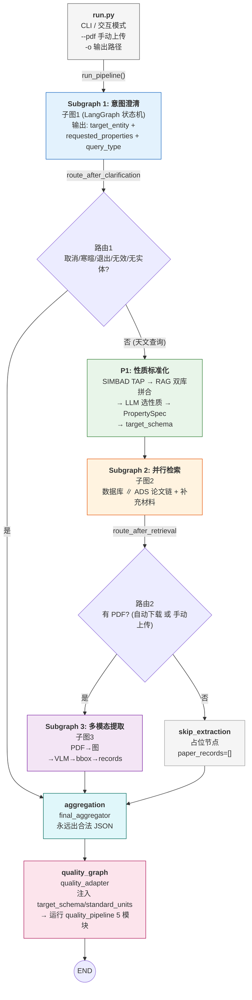
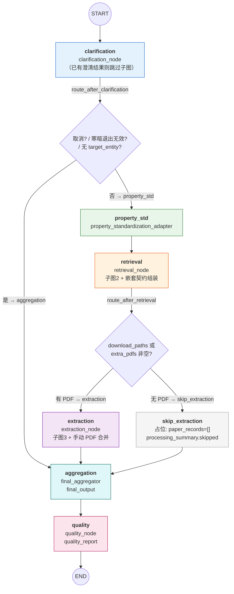
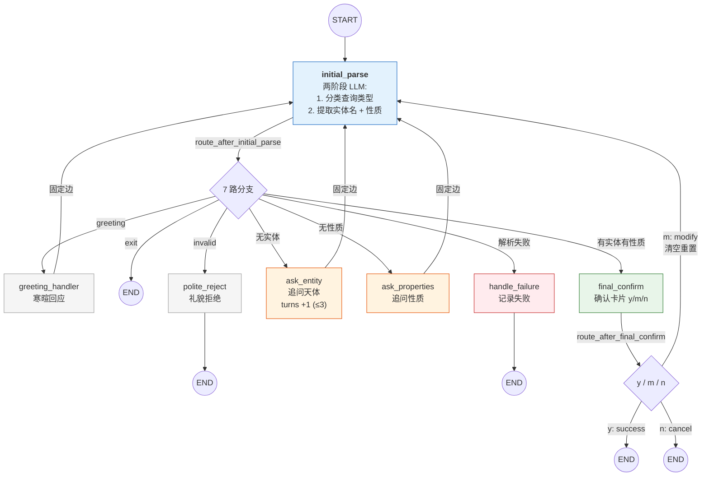
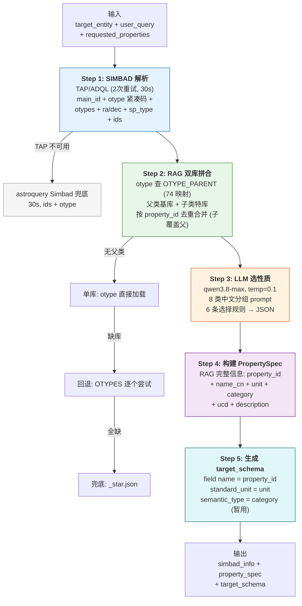
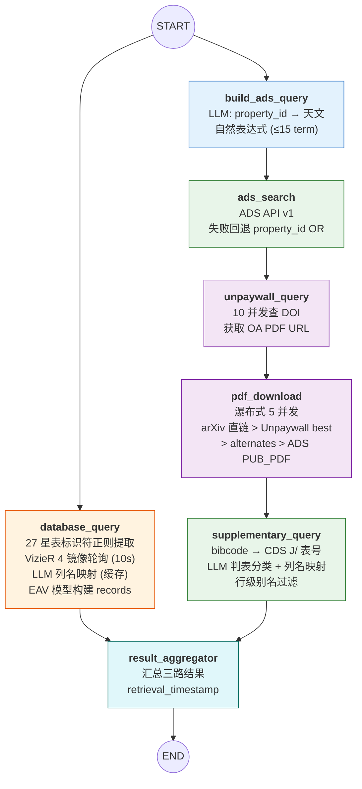
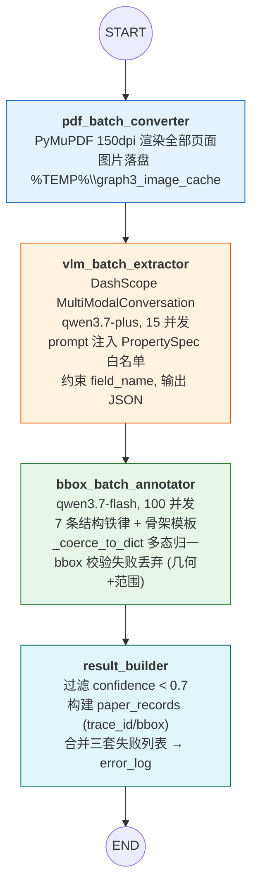
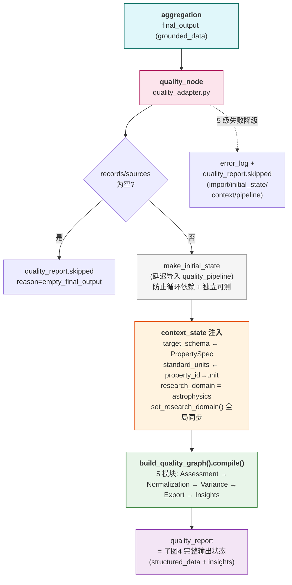

# AstroQuery Final 系统设计文档

> **版本**: V2.0 — 依据合并后代码 (astroquery_ai + quality_pipeline) 逐模块细化
> **最后更新**: 2026-08-07

## 赛事题目
本方向鼓励参赛团队围绕真实科研中的数据获取、整理与应用场景，搭建能够查找、解析、整合多源科学数据，并形成可分析、可追溯、可复用结果的 AI 应用。重点考察应用是否能够处理多源异构数据，保留清楚的数据来源和处理过程，支撑后续科研分析、影响力评估、知识图谱构建或证据推理，并在发现错误或收到反馈后完成修正。 
==**方向1. 科学数据整合与影响力分析应用**==
参赛团队可以围绕多源科学数据查找整合或学术影响力预测搭建 AI 应用。作品应面向明确的数据使用场景，说明输入需求、数据来源、处理流程、结构化输出方式和结果解释逻辑。可以从下面两个维度选题：
==**A. 科学数据查找、解析与整合**==
面向“从科学问题到可用数据”的研究场景，参赛团队可以搭建能够根据用户输入的研究目标或数据需求，自动查找、解析和整合多源科学数据的 AI 应用。例如，用户输入“我希望研究 Ia 型超新星光变曲线”，应用应能够自动查找相关论文、开放数据库、表格、补充材料和图像数据，从正文、表格、附件或图表中提取可用信息，并整理输出合并后的多源 CSV 表格。应用应能够完成数据清洗、字段对齐、来源标注和结构化输出；如涉及论文图像或图表，还应能够说明图表数据的识别、提取或校验方式。

1）参赛团队可自行选择数据来源及目标领域。初赛评价将关注提交作品在其问题子领域内数据查找是否完备，来源是否可追溯，清洗整合是否可靠，输出格式是否便于后续分析。
2）科研影响力分析方向将关注预测结果是否合理，解释是否清楚，偏差识别是否具体，实验结果是否可复现。
3）多源科学数据整合方向，如应用能够自动识别缺失数据、重复数据、单位不一致、图表坐标轴或图例解析错误，并完成修正或寻求人类建议后修正，可考虑加分。

## 概述

AstroQuery 是一个**天文数据检索与提取 AI workflow**。用户以自然语言提出天文查询（如"M31 的距离和金属丰度"），系统自动完成天体识别、性质标准化、多路数据检索、论文 VLM 提取、数据聚合、质量清洗与洞察生成。

核心设计理念：**PropertySpec 是系统中枢**——RAG 性质库提供的标准性质名 + 标准单位表是字段名唯一白名单和单位归一基准，三条提取路径（数据库 / 论文 VLM / 补充材料）全部归一到它，下游质量管线也只认它。

```
用户自然语言 ──► 意图澄清 ──► 性质标准化(P1) ──► 三路检索 ──► 多模态提取
                                                              │
   用户 ◄── 洞察 ◄── 质量管线 ◄── 聚合出 JSON ◄──────────────┘
```

---

## 数据场景

本流水线针对的数据场景：**针对单个天体的、多性质、多来源的数值型物理量查询与整合**。

### 场景定义

| 维度 | 描述 |
|------|------|
| **用户形态** | 天文学研究者/爱好者以自然语言提问（中文或英文，口语化），如"M31 的距离和金属丰度" |
| **查询粒度** | 单查询 = 单天体（`target_entity`）+ 一个或多个物理性质（`requested_properties`），如 M31 + {distance, fe_h, stellar_mass} |
| **数据性质** | 数值型物理量为主：距离（Mpc/kpc/pc）、金属丰度（dex）、光度、质量、磁场、流量密度等；带单位、带不确定度（如 "24.47 ± 0.12"）、带测量条件（condition_tags） |
| **覆盖空间** | 由 RAG 性质库界定：100 个 SIMBAD 紧凑码类型 × 3293 条标准性质（astrometry/photometry/spectroscopy/physical 等 8 类） |
| **数据规模** | 单查询量级：0-10 篇成功下载论文 + 8-9 个命中星表 + 若干补充材料表，records 数十至数百条（一次全量端到端约 219 条） |

### 三路数据来源（同一物理量可能从多路获得）

| 来源 | 数据形态 | 获取方式 | 记录特征 |
|------|---------|---------|---------|
| **数据库**（VizieR 27 星表） | 结构化查询结果（表行） | 天体标识符正则提取 → 星表查询 → LLM 列名映射到 PropertySpec | EAV 模型；provenance 四要素（db_table/key_column/key_value/raw_column）；`extraction_method="database_query"` |
| **论文**（ADS 检索 + Unpaywall/arXiv 下载 PDF） | 非结构化文献中的表格/正文数据 | VLM 从 PDF 页面图像提取 + bbox 定位 | 带 `trace_id` / `provenance.page`+`bbox` / `extraction_confidence`（<0.7 过滤）；`extraction_method="vlm_table"/"vlm_text"` |
| **补充材料**（CDS J/ 表） | 论文附带的半结构化表格 | bibcode 推导表号 → CDS 查询 → LLM 列名映射 | 与数据库 records **完全同构**，仅 `source_kind="supplement"` 区分 |

### 场景核心挑战（为什么需要整套流水线）

1. **字段名异构**：同一物理量三种写法——星表列名（`Plx`）、论文提取词（`parallax`）、用户口语（`视差`）→ 全部经 LLM 归一到 PropertySpec 的 property_id
2. **单位不统一**：距离可能以 Mpc/kpc/pc/ly/au 混出，流量密度 Jy/mJy/uJy 混出 → 下游 quality_pipeline 按 target_schema 标准单位换算留痕
3. **多源冲突**：论文 A 报 M31 距离 0.77 Mpc、论文 B 报 785 kpc（实为同一值不同单位）、星表报另一值 → Assessment 检测冲突（Cohen's d）→ Variance 特征化标注
4. **非结构化提取不确定**：VLM 提取有置信度、bbox 校验失败即丢弃、PDF 下载可能失败 → 错误上浮不中断
5. **数据质量参差**：缺失单位/溯源、格式脏（~≈<>≤ 前缀）、别名混用、重复记录 → Normalization 清洗 + Validation 校验

### 输出形态

```python
final_output = {
    "schema_version": "2.0.0",
    "sources": [...],   # 两类来源混合: paper(文献, 14 字段) + database(星表, 9 字段)
                        #   + supplementary(补充材料, 同 database 结构)
    "records": [...],   # 三类 records 混合, 按 source_id 关联
    "query_metadata": {...}, "simbad_info": {...}, "error_log": [...],
}
# 再经 quality_pipeline → structured_data(长表/宽表 JSON + CSV) + traceability + insights
```

**典型混合场景**：如"M31 的距离与金属丰度"——20 篇文献（VLM 提取）+ 5 个 VizieR 目录（数据库查询）+ 若干 CDS 补充表，同一物理量多路来源，正是质量管线要处理的冲突/单位/缺失问题的来源。

**场景边界**（明确不适用）：批量/大样本检索（如"全天空 10 万颗星"）、非天文查询（greeting/invalid 直接出空结果）、无实体查询（无 target_entity 时直接聚合出空 JSON）。

---

## 一、整体架构

```
run.py（入口 CLI）
  │
  ├─ 子图1 意图澄清（LangGraph 状态机、LLM 交互式追问）
  ├─ P1 性质标准化（SIMBAD 解析 + RAG 双库拼合 + LLM 选性质 → PropertySpec）
  ├─ 子图2 并行检索（database_query ∥ ads_search → unpaywall → pdf → supplementary）
  ├─ 子图3 多模态提取（PDF 转图 → VLM 提取 → bbox 标注 → result_builder）
  ├─ 聚合层（三路 sources/records 合并 → final_output）
  └─ quality_pipeline（Assessment → Normalization → Conflict → Export → Insights）
```

### 1.1 总系统流程图



### 1.2 技术栈与外部依赖

| 类别 | 技术 |
|------|------|
| 编排 | Python + LangGraph（状态机，子图嵌套主图） |
| LLM | OpenAI 兼容 API（DashScope qwen 系列：qwen3.8-max 选性质 / qwen3.7-plus 提取 / qwen3.7-flash bbox+ADS 查询构造）+ DeepSeek（quality_pipeline 洞察） |
| 天文数据 | astroquery（SIMBAD）、VizieR TAP/HTTP（27 星表）、SIMBAD TAP/ADQL |
| 文献 | ADS API v1、Unpaywall API、arXiv 直链 |
| 多模态 | DashScope SDK `MultiModalConversation.call()` + PyMuPDF（PDF 转图）+ Pillow |
| 数据处理 | Pydantic v2、PyYAML、json_repair |

| 外部服务 | 用途 |
|----------|------|
| SIMBAD | 天体识别 + otype 紧凑码 + 别名 |
| VizieR | 27 个星表数据查询 |
| ADS | 论文元数据检索 |
| Unpaywall | OA PDF 定位 |
| CDS | 补充材料 J/ 表 |
| DashScope | VLM 多模态 + LLM 文本 |
| DeepSeek | quality_pipeline 洞察 |

### 1.3 目录结构

```
astroquery_final/
├── run.py                         # 入口 CLI
├── astroquery_ai/                 # 前三子图 + 主图装配（本次合并产物）
│   ├── main_graph.py              # 主图：7 节点 + 2 路由（199 行）
│   ├── adapters.py                # 适配层：子图 → 主图节点（381 行）
│   ├── aggregator.py              # 最终聚合节点（96 行）
│   ├── property_standardization.py# P1 性质标准化（610 行，系统中枢）
│   ├── quality_adapter.py         # quality 接缝适配器（149 行）
│   ├── state.py                   # MainGraphState（超集投影）
│   ├── subgraph1/                 # 意图澄清子图（7 节点 + 2 路由）
│   ├── subgraph2/                 # 并行检索子图（7 节点，两路并行）
│   └── subgraph3/                 # 多模态提取子图（4 节点串行）
├── quality_pipeline/              # 子图4 质量管线（独立可测）
├── rag_properties/                # RAG 性质库（100 JSON）
├── config.yaml / llm_config.yaml / catalog_config.json  # 配置
└── output/                        # 结果输出目录
```

---

## 二、分层设计

### 2.1 入口层 `run.py`

**职责**：CLI 交互 + 结果输出。接收命令行参数或进入交互模式收集查询语句，调用 `run_pipeline()`，将 `final_output` 写入 JSON 文件并打印终端摘要。不参与业务逻辑。

**设计要点**：
- 交互模式收集 query 和可选 PDF 路径，其余追问由子图 1 在流水线内部完成
- 输出始终为 JSON（任何降级路径都出合法结构，records 可能为空）
- 错误日志随 final_output 一起输出
- PDF 路径校验：不存在直接退出（返回码 2），不进入流水线
- 手动 PDF 以 `--pdf` 可重复参数传入，最终由 Node 3 的 `_merge_extra_pdfs` 合并进 `download_paths`（合成 bibcode `USER_UPLOAD_{序号}`，在 records 的 source_id 中可追溯）

**CLI 参数**：

| 参数 | 说明 |
|------|------|
| `query`（位置参数，可选） | 自然语言查询；省略进入交互模式 |
| `--pdf PATH`（可重复） | 手动上传的 PDF 路径 |
| `-o PATH` | 输出 JSON 路径（默认 `output/result_<query_id>.json`） |
| `-v` | 打开 DEBUG 日志（第三方库降噪：httpx/httpcore/urllib3/PIL/openai） |

**退出码**：`0` 成功 / `2` PDF 不存在 / `130` 用户中断（KeyboardInterrupt）。

### 2.2 主图装配层 `main_graph.py` + `adapters.py`

**职责**：将三个子图包装成 LangGraph 主图的 7 个节点（clarification → property_std → retrieval → extraction/skip → aggregation → quality → END），管理节点间路由和状态流转。

**主图拓扑（与代码逐行对应）**：



**路由决策（两处，均与设计文档有意偏离，已确认）**：

| 路由 | 条件 | 目标 | 偏离说明 |
|------|------|------|---------|
| `route_after_clarification` | `clarification_status == "cancelled"` | aggregation | 原设计写 END，改走 aggregation 兑现"永远输出 JSON"约定 |
| | `query_type in ("greeting","exit","invalid")` | aggregation | 同上（非天文查询 → 空结果） |
| | 无 `target_entity` | aggregation | 检索无从下手 |
| | 其余 | property_std | 正常流程 |
| `route_after_retrieval` | `download_paths` 或 `extra_pdfs` 非空 | extraction | 原设计只看 download_paths；Node 2 零下载但用户手动传了 PDF 时需进 Node 3 |
| | 都为空 | skip_extraction | 占位保证键存在 |

**主图状态**：`MainGraphState`——统筹三个子图的"超集投影"，只声明跨子图流转的字段（如 `target_entity`、`property_spec`、`database_results`、`paper_records`），各子图内部工作字段保留在子图自己的 state 中。错误日志统一为 `Annotated[List, add]` 累加器。

| 字段 | 产生者 | 消费者 | 说明 |
|------|--------|--------|------|
| `user_query` | 入口 | 子图1 / P1 | 原始自然语言 |
| `query_id` | 入口 | 全部 | UUID，贯穿三子图 |
| `extra_pdfs` | 入口 | Node 3 | 手动上传 PDF 列表 |
| `target_entity` / `requested_properties` / `query_type` / `clarification_status` | Node 1 | P1 / Node 2 / Node 3 | 澄清结果 |
| `conversation_history` | Node 1 | 追溯 | 完整对话历史 |
| `simbad_info` | P1 | Node 2 / Node 3 / 聚合 | main_id/otype/otypes/sp_type/ra/dec |
| `property_spec` | P1 | Node 2 / Node 3 / quality | **系统中枢**：字段白名单 + 标准单位表 |
| `target_schema` | P1 | quality | 子图4 消费 |
| `database_results` / `paper_results` | Node 2（适配层组装） | Node 3 / 聚合 | 嵌套结构 |
| `supplementary_sources` / `supplementary_records` | Node 2 | 聚合 | CDS J/ 表 |
| `retrieval_timestamp` | Node 2 | 聚合 | 时间戳 |
| `paper_records` / `processing_summary` | Node 3 | 聚合 | bbox 溯源记录 |
| `final_output` | 聚合 | quality | 下游唯一消费结构 |
| `quality_report` | quality | 终端/洞察 | 子图4 完整输出状态 |
| `error_log` | 全部 | 聚合 / 终端 | `Annotated[List, add]` 累加 |

**适配器设计（核心架构决策）**：

每个子图外覆一个"包装节点"（在 `adapters.py` 中），负责三件事：

1. **输入投影**：从主图状态提取子图所需字段，按子图键名传入（如 `user_query` → 子图1 的 `original_query`）
2. **输出映射**：把子图返回映射回主图的嵌套契约（如子图2 的扁平字段 → `database_results` / `paper_results` 嵌套结构；`downloaded_papers` → `paper_results.download_paths` 契约改名）
3. **失败隔离**：子图抛异常时记录 error_log 并返回降级状态（如 `_empty_retrieval()` 空壳、`paper_records=[]`），保证主图永远能走到 aggregation 出 JSON

设计理由：三个子图源码零改动，所有接口差异被适配层吸收。`error_log` 只返回**增量**而非全量列表，避免 `add` reducer 重复累加。

**适配层细节**：

| 包装节点 | 输入投影 | 输出映射 | 失败降级 |
|----------|---------|---------|---------|
| `clarification_node` | `user_query` → `original_query` | 7 个澄清字段平铺上浮 | `clarification_status="failed"` + error_log |
| `property_standardization_adapter` | 直接透传 state | `simbad_info` / `property_spec` / `target_schema` | error_log（P1 内部已分级失败） |
| `retrieval_node` | `simbad_info` → `simbad_*` 字段（B2 收敛，无二次 SIMBAD 查询） | 嵌套 `database_results` / `paper_results`；`simbad_info` 合并而非覆盖（B3 fix） | `_empty_retrieval()` 空壳 + error_log |
| `extraction_node` | `download_paths` + `extra_pdfs` → 合并列表（`_merge_extra_pdfs`） | `paper_records` / `processing_summary` | 空壳 processing_summary（total/failed=pdf_count） |
| `skip_extraction_node` | — | 占位（`skipped=True, skip_reason=no_pdf_available`） | — |

### 2.3 子图 1：意图澄清

**职责**：将用户的自然语言输入澄清为结构化检索参数（`target_entity` + `requested_properties`）。

**内部拓扑（7 节点 + 2 路由）**：



**节点职责**：

| 节点 | 职责 |
|------|------|
| `initial_parse` | 两阶段 LLM 调用——先规则+LLM 分类查询类型（astronomical / greeting / exit / invalid），再 LLM 提取实体名和性质 |
| `greeting_handler` | 寒暄/闲聊回应，回到 initial_parse |
| `polite_reject` | 非天文查询礼貌拒绝，直接 END |
| `ask_entity` | 追问天体名称，`clarification_turns` +1 |
| `ask_properties` | 追问所需物理性质，回 initial_parse |
| `handle_failure` | 解析失败处理，END |
| `final_confirm` | 展示确认卡片（天体 + 性质），y/m/n 三选一；m 时清空重置、n 时取消 |

**设计要点**：
- 追问上限 3 轮（由 `clarification_turns` 计数，仅 ask_entity 递增，范围 0-3）
- `properties_asked` 标志防止重复询问性质
- `exit_intent_detected`：关键词识别（算了/不查了/退出/取消/放弃）
- CLI 模式：5 处 `input()` 交互；Web 模式已设计好 Headless Protocol（`interaction_response` / `pending_interaction` 字段），前端搭建时激活
- 输出字段：`user_confirmed` + `clarification_status`（confirmed/modified/failed/cancelled）+ `query_type` + `conversation_history`（与 chat_history 同内容，作为最终输出字段）

### 2.4 P1：性质标准化（系统中枢）

**职责**：将用户查询中的口语化天体名和性质转化为标准的 PropertySpec 和 target_schema。

**流程四步骤**：



**① SIMBAD 解析（主 + 兜底双路径）**：

- **主路径**：SIMBAD TAP 服务 `sim-tap/sync`，单条 ADQL 多表 JOIN（`basic` × `ident` × `alltypes` × `ids`），按任意名称匹配（不限于 main_id，避免通俗名找不到，如 Vega→* alf Lyr），`FORMAT=csv`。2 次重试（网络抖动容错，30s 超时）
- **兜底**：TAP 不可用时 astroquery Simbad（`add_votable_fields('ids','otype')`，30s 超时）
- 两条路径输出 otype 格式一致（紧凑码：AGN / dS* / BLL / OpC / s*r / SB*）、别名格式一致，对下游完全透明

**② RAG 双库拼合（核心设计）**：

- `OTYPE_PARENT` 字典：维护 SIMBAD 分类 1/2/4/5 的层级关系，共 **74 个 otype → 4 个父类**：

| 父类 | 覆盖子类（举例） |
|------|-----------------|
| `G`（星系） | AGN, SyG, Sy1, Sy2, rG, LIN, QSO, Bla, BLL, LSB, bCG, SBG, H2G, EmG, GiP, GiG, GiC, BiC（18 个） |
| `*`（恒星） | Ma*, bC*, sg*, WR*, N*, Psr, Y*O, TT*, Ae*, Be*, WD*, CV*, XB*, SN*, BD*, V* 等（56 个） |
| `Cl*`（恒星集合） | GlC, OpC, As*, St*, MGr（5 个） |
| `ClG`（星系集合） | IG, PaG, GrG, CGG, PCG, SCG, vid（7 个） |

- 查到子树映射后：加载父类基库（如 G.json 34 条大而全的星系性质）+ 子类特库（如 AGN.json 22 条 AGN 专属性质）
- 按 property_id 去重合并（子类覆盖父类同名项）
- 加载优先级链：**双库拼合 → 单库 otype → OTYPES 逐个回退 → `_star.json` 兜底**
- 设计理由：解决"星系 AGN（如 M31）用 AGN.json 缺 distance"的覆盖率矛盾，同时避免 OTYPES 脏数据投票

**③ LLM 选性质**：将双库拼合后的性质列表（通常 50-80 条）按 category 分组后传给 LLM（8 类中文分组：测光/光谱/物理/天体测量/变化性/分类/环境/标识），LLM 根据用户需求选出最相关的 subset → PropertySpec。模型：qwen3.8-max（独立模型，不共享 DASHSCOPE_MODEL），temperature=0.1，max_tokens=4096，输出容忍 markdown 围栏 + 正则提取 JSON。

**6 条选择规则**：

| 规则 | 说明 |
|------|------|
| 1 | 只能从性质库中选择，不得臆造 property_id |
| 2 | 宽泛请求（"radio properties"）→ 包含该类别所有相关性质 |
| 3 | 模糊请求（"基本参数"/"全部"）→ 选 10-15 个最基础的性质 |
| 4 | 空请求（未指定/回车/说"都行"）→ 选 10-15 个最基础的性质 |
| 5 | 用户关注精度时包含不确定度（如 fe_h_err） |
| 6 | 输出严格 JSON，无解释文字 |

**④ PropertySpec / target_schema 契约**：

```python
# PropertySpec（字段名白名单 + 标准单位表）
[
  {"property_id": "fe_h", "name_cn": "[Fe/H] 铁丰度", "unit": "dex",
   "category": "physical", "ucd": "phys.abund.Fe", "description": "..."}
]

# target_schema（供子图4 消费；semantic_type 暂用 RAG category 粗粒度语义类）
{"fields": [
    {"name": "fe_h", "standard_unit": "dex", "semantic_type": "physical",
     "ucd": "phys.abund.Fe", "description": "...", "criticality": "important"}
]}
```

**⑤ 错误分级**（每步失败返回 error_log，主图继续）：

| 步骤 | 失败行为 |
|------|---------|
| SIMBAD 解析失败 | 返回 error_log，P1 终止（无 simbad_info 则后续检索无从下手） |
| RAG 库未找到 | 返回 simbad_info + error_log（保留解析结果） |
| LLM 筛选失败 | 返回 simbad_info + error_log |
| PropertySpec 为空 | 返回 simbad_info + error_log |

### 2.5 子图 2：并行检索

**职责**：三路并行获取数据——数据库（27 星表 VizieR）、论文（ADS→Unpaywall→PDF）、补充材料（CDS J/ 表）。

**内部拓扑**：



**B2 收敛设计**：取消 simbad_resolver 入口节点——simbad_* 字段在 adapters 层从 P1 的 simbad_info 直接映射，子图 2 不再做二次 SIMBAD 查询。START 直接进入两路并行。

**三路设计**：

1. **数据库路**（database_query）：
   - 从 65 个别名中用 27 组正则提取 8-9 个星表的标识符（如 `Gaia DR3 5854...` → gaia_dr3 visier_table + key_column key_value）
   - 顺序查询 VizieR（带多镜像 fallback，单次 10s 超时，4 镜像轮询）
   - LLM 列名映射（column_mapper）：将 VizieR 原始列名映射到 PropertySpec 的 property_id，按（表 ID + PropertySpec 指纹）缓存
   - 空映射防毒：LLM 返回空的映射不写缓存，避免毒缓存使后续查询永不再试
   - EAV 模型归一：每行列拆为一条 record（含标准 property_id、原始值、原始单位、provenance 四要素），三态语义（无白名单→原始列名 / 有白名单无匹配→0条 / 有匹配→只输出映射列）

2. **论文路**：
   - `build_ads_query`：LLM 将 snake_case property_id 扩展为天文学自然表达式（同义词、单位、常见缩写），每个性质最多 2 个 term，总 term 不超过 15 个；失败回退原逻辑（property_id OR 拼接），不染流程
   - `ads_search`：优先用 LLM 构造的查询串，失败回退到 property_id OR 拼接
   - `unpaywall_query`：10 并发查 DOI → 获取 OA PDF URL
   - `pdf_download`：瀑布式下载（arXiv 直链 > Unpaywall best > alternates > ADS PUB_PDF），5 并发；失败论文记录（failed_downloads，含 reason）但不传给 Node 3
   - `supplementary_query`：从论文 bibcode 推导 CDS J/ 表号 → CDS 页面验证不存在 → LLM 判表分类（whole_entity 才保留）→ LLM 列名映射 → 行级别名过滤 → 构建 records

3. **数据库与补充材料 record 同构设计**：两者 provenance 均为 DB 四要素（db_table/key_column/key_value/raw_column），下游通过 `provenance.source_kind`（"database" vs "supplement"）区分来源，`is_database_record()` 依据 `extraction_method == "database_query"` 作类型判定——两条路完全同构、下游零适配。

**子图2 关键 state 字段**：

| 字段 | 说明 |
|------|------|
| `successful_catalogs` / `failed_catalogs` | 星表查询结果统计 |
| `database_sources` / `database_records` | EAV 模型输出 |
| `ads_query_string` / `ads_total_found` / `ads_papers_metadata` | 论文检索（前 50 篇） |
| `unpaywall_results` | {doi: [url, source]} |
| `downloaded_papers` | [{bibcode, local_path, file_size_mb, download_source}] |
| `failed_downloads` | [{bibcode, doi, title, reason}] |
| `paper_sources` | 仅成功下载论文的元数据 |
| `supplementary_sources` / `supplementary_records` | CDS J/ 表（source_kind="supplement"） |
| `error_log` | `Annotated[List, add]`（并行节点都追加） |

### 2.6 子图 3：多模态提取

**职责**：从下载的 PDF 论文中提取物理数据并标注 bbox 定位。

**内部拓扑（全串行）**：



**设计要点**：

| 节点 | 并发 | 模型 | 细节 |
|------|------|------|------|
| `pdf_batch_converter` | — | PyMuPDF | 150dpi 渲染全部页面，图片落盘到 `graph3_image_cache (TEMP)` |
| `vlm_batch_extractor` | 15 | qwen3.7-plus | DashScope SDK `MultiModalConversation.call()`，prompt 注入 PropertySpec 白名单约束 field_name，输出 JSON |
| `bbox_batch_annotator` | 100 | qwen3.7-flash | 百页图片 bbox 定位。提示词加固（7 条结构铁律 + 精确骨架模板）+ 递归归一化解析（`_coerce_to_dict` 处理 DashScope 多态返回）+ bbox 校验失败丢弃记录（几何+范围校验） |
| `result_builder` | — | — | 过滤 confidence < 0.7、构建 paper_records（含 trace_id / bbox / extraction_confidence）、合并三套失败列表到 error_log 上浮主图 |

### 2.7 聚合层 `aggregator.py`

**职责**：将三路 sources（数据库+论文+补充材料）和 records 合并为 `final_output`，永远产出合法 JSON。

**输出结构（下游唯一消费契约）**：

```python
final_output = {
    "schema_version": "2.0.0",
    "research_domain": "astrophysics",        # 领域标识
    "query_metadata": {                       # query_id / user_query / target_entity
        "query_id": ..., "user_query": ...,   # / requested_properties / retrieval_timestamp
        "target_entity": ..., "requested_properties": [...],
        "retrieval_timestamp": ...,
    },
    "simbad_info": {...},                     # 解析结果随输出保留
    "sources": [*db_sources, *paper_sources, *supp_sources],   # 数据库在前，论文在中，补充最后
    "records": [*db_records, *paper_records, *supp_records],
    "error_log": [...],                       # 继承上游错误 + 悬空检查结果
}
```

**设计要点**：
- 不重写字段名——数据库/论文各自保持原始结构，下游按 source_id 关联
- 补全 research_domain、query_metadata、simbad_info、error_log
- 悬空 source_id 检查（records 引用了不存在的 source → 记入 error_log 但不阻断）

### 2.8 quality_pipeline（质量管线）

**职责**：对 final_output 进行 Assessment → Normalization → Conflict → Export → Insights 全链路质量处理。

**接入架构（quality_adapter 接缝）**：



**与主图的接缝（quality_adapter.py）**：

| 步骤 | 动作 | 失败降级 |
|------|------|---------|
| 1 | 空数据检查（无 records 且无 sources） | `skipped: empty_final_output` |
| 2 | 延迟导入 quality_pipeline（`make_initial_state` + `build_quality_graph`） | `skipped: import_failed` |
| 3 | `make_initial_state(final_output)` 构建初始状态 | `skipped: initial_state_failed` |
| 4 | 注入 context_state：`target_schema`（field=property_id, standard_unit=unit, semantic_type=category, criticality=important）+ `standard_units`（field→unit 映射）+ `research_domain="astrophysics"` + `set_research_domain()` 全局同步 | `skipped: context_inject_failed` |
| 5 | `build_quality_graph().compile().invoke(initial_state)` | `skipped: pipeline_failed` |

设计原则：子图4 源码零改动——只用其公开入口 `make_initial_state` + `build_quality_graph`；上游 `final_output` 直接作为 grounded_data 传入。

**各阶段职责**（详情见 `quality_pipeline/总架构设计方案.md`）：

| 模块 | 版本 | 职责 | 修改数据 |
|------|------|------|---------|
| Assessment | V3.1 / V4.2 | 质量评估（4 Stage: Profiling → QualityAssessment → Scoring → Decision）+ per-source 路由决策（8 项检查 + 决策矩阵） | ❌ |
| Normalization | V2.3 / V4.3 | 规范化清洗（5 Stage，3 层工具体系 + 沙箱）— **唯一有权修改数据** | ✅ |
| Variance Analysis（原 Conflict） | V3.0 | 多源方差特征化 + 异常检测 + 全量保留标注 | ❌ |
| Export | V1.0 | 结构化输出（6 Stage）— 多格式 + 溯源 + 元数据 | ❌ |
| Insights | V3.4 | 科学数据洞察（4 Node）— 知识库 RAG + Simbad 类型体系 | ❌ |
| HumanReview | V1.0 | 命令行人工审核（E→A/B 双向路由） | ❌ |

所有 LLM 调用均有 try/except → template fallback 优雅降级（无 key 时管线不阻塞）。

---

## 三、关键设计决策（Why）

### 3.1 PropertySpec 作系统中枢

**问题**：三条提取路径（数据库列名、VLM 从 PDF 提取的 field_name、补充材料）各自产出的字段名不一致（"Plx" vs "parallax" vs "视差"），下游无法统一处理。

**决策**：RAG 性质库的 `property_id` + `unit` 组合作为全系统唯一的字段名白名单和标准单位表。三条路径都通过 LLM 映射到这个标准名。quality_pipeline 也只认这个标准名。这样：数据库路通过 column_mapper 映射列名 → property_id；VLM 通过 prompt 强制 field_name 对齐；补充材料同理。最终 quality_adapter 把 PropertySpec 转成 target_schema + standard_units 注入子图4 的 context_state，`unit_converter` 据此做原始单位 → 标准单位换算留痕——**一个中枢贯穿全部四层**。

### 3.2 适配层外覆子图

**问题**：三个子图有各自的 state 键名（如子图 2 的 `downloaded_papers` vs 主图的 `download_paths`）、各自的异常处理策略、各自的嵌套结构。如果让子图直接做主图节点，耦合重且改一个子图破坏全局。

**决策**：adapters.py 把每个子图包装成一个函数——投影输入、映射输出、失败降级。子图源码零改动。三个子图可以独立测试、独立部署。LangGraph 的 `Annotated[List, add]` reducer 配合包装节点只返回增量 error_log 的设计，保证并行分支写入不互相覆盖。

### 3.3 双库拼合（父类基库 + 子类特库）

**问题**：SIMBAD otype 有时偏"窄"——M31 的 otype 是 AGN，但 AGN.json 只有 22 个 AGN 专属性质（黑洞质量、发射线），用户问"距离"时找不到。OTYPES 管线分隔码投票又太脏（M31 的 OTYPES 首码是 QSO）。

**决策**：维护轻量级 `OTYPE_PARENT` 字典，编码 SIMBAD 分类 1/2/4/5 的层级关系（74 个 otype → 4 个父类）。查到这个 otype 是子树时，同时加载父类基库（如 G.json 34 条）和子类特库（如 AGN.json 22 条），去重合并后给 LLM 选。效果：M31 既保留了 AGN 的发射线/黑洞覆盖面，又有了 G 的 distance/stellar_mass 等通用性质。Token 量可控（通常 50-80 条）。

### 3.4 SIMBAD TAP + astroquery fallback

**问题**：SIMBAD TAP 服务间歇性高负载（完整 JOIN 查询 46s timeout），旧版 sim-id 接口返回不可预测的 verbose otype（`delSctV*` vs 紧凑码 `dS*`）。

**决策**：主路径用 TAP/ADQL（CSV 格式）直接查询，返回标准紧凑码，单条 ADQL 多表 JOIN 一次拿全字段（main_id/otype/otypes/ra/dec/sp_type/ids）。TAP 不可用时自动切换到 astroquery Simbad 兜底（astroquery 查询简易且稳定，曾全程正常）。两条路径的 otype 格式一致（紧凑码）、别名格式一致，对下游完全透明。

### 3.5 VizieR 多镜像 fallback

**问题**：CDS/VizieR 服务间歇性不可用，哈佛镜像 `vizier.cfa.harvard.edu` 超时率高（6/9 查询超时），导致 4.5 分钟死等。

**决策**：创建 `vizier_client.py` 共享模块，4 镜像轮询（哈佛 → 日本 → 剑桥 → 法国）。单次超时 10s（原 30s）。可重试异常（ReadTimeout/ConnectionError）→ 切镜像；不可重试异常直接抛。最坏单表耗时 40s（原 4.5 分钟）。

### 3.6 数据库与补充材料 record 同构

**问题**：两条路都是查 VizieR → 构建 records，但原代码各写各的——数据库路有 `build_database_records` 工厂函数，补充路内联 40 行且字段名不一致。

**决策**：统一 provenance 为 DB 四要素（db_table/key_column/key_value/raw_column）。`source_kind` 字段区分来源（"database" vs "supplement"）。下游 `is_database_record()` 依据 `extraction_method == "database_query"` 统一判类型——两条路处理方式相同、下游同一分支、零适配。

### 3.7 LLM 查询构造（ADS 论文检索）

**问题**：直接拼接 property_id 到 ADS 查询串（`"M31" AND (distance OR gas_phase_metallicity)`）命中率低——snake_case 词不会出现在论文全文里，ADS 的 Solr 全文检索匹配效果差。

**决策**：加一个轻量级 `build_ads_query` 节点（qwen3.7-flash，失败回退原逻辑）。LLM 负责将 snake_case property_id 扩展为天文学自然表达式（如同义词 distance modulus / metal abundance / O/H），每个性质最多 2 个 term，总 term 不超过 15 个。失败时回退到 property_id OR 拼接，不染流程。设计理由：LLM 失败路径不丢失原功能，成功路径显著提升召回率。

### 3.8 错误处理三原则

1. **永远产出 JSON**：任何降级路径都走到 aggregation，final_output 的顶层键集合恒定（sources/records 可能为空）
2. **错误上浮不中断**：所有子图异常被适配层捕获归入 error_log，管道继续
3. **优雅降级**：SIMBAD 挂了用 fallback → 还挂用 _star.json 兜底；LLM 挂了用规则/template；VizieR 挂了多镜像轮询 → 还挂跳过该表

### 3.9 两处"偏离设计文档"的路由修正

**问题**：早期设计文档（DESIGN.md）中：取消/非天文查询直接走 END；无自动下载 PDF 时跳过 Node 3。

**决策（已与用户确认）**：
1. `route_after_clarification` 的终止条件（cancelled / greeting / exit / invalid / 无实体）一律走 **aggregation** 而非 END——否则下游收到空响应，无法兑现"永远输出 JSON"的约定
2. `route_after_retrieval` 额外判断 `extra_pdfs`——Node 2 零下载但用户手动传了 PDF 时，不应错误跳过 Node 3

这两处修正已在代码注释中标注，主图拓扑以代码为准。

### 3.10 quality 接缝零侵入

**问题**：quality_pipeline 是独立发展的成熟子图（有自己的 configs/tools/state），直接改它适配上游会破坏独立性。

**决策**：quality_adapter.py 作为薄接缝——延迟导入（避免循环依赖 + 让包迁移独立可测）、只调公开入口（`make_initial_state` + `build_quality_graph`）、context_state 注入（target_schema/standard_units/research_domain + `set_research_domain()` 全局同步）。5 级失败全部降级为 `quality_report.skipped` + error_log，主图流程永不阻塞。PropertySpec 的 category 暂作 semantic_type 传入（粗粒度），子图4 内部有更细的 32 键语义类型推断兜底。

---

## 四、状态流转

### 4.1 主图状态生命周期

```
run_pipeline()
  initial: {user_query, query_id, extra_pdfs, error_log}

│ → clarification_node: target_entity, requested_properties, query_type,
│                      clarification_status, user_confirmed, conversation_history
│ → property_std: simbad_info, property_spec, target_schema
│ → retrieval_node: database_results, paper_results, supplementary_sources/records,
│                  retrieval_timestamp, simbad_info(合并 B3 fix)
│ → extraction_node: paper_records, processing_summary
│ → final_aggregator: final_output
└─► quality_node: quality_report
```

### 4.2 数据在各层之间的传递

```
用户: "M31 的距离"
  → 子图1: target_entity="M31", requested_properties=["距离"], query_type="astronomical"
  → P1: simbad_info{main_id, otype=AGN, aliases},
         property_spec[{property_id:"distance", unit:"Mpc"}],
         target_schema[{name:"distance", standard_unit:"Mpc", ...}]
  → 子图2: database_records[{field_name:"distance"}],
           paper_sources[{source_id=bibcode}],
           supplementary_records[{source_kind:"supplement"}]
  → 子图3: paper_records[{field_name:"distance", bbox:[...], provenance:{page, bbox}}]
  → 聚合: final_output{sources[db, paper, supp], records[db, paper, supp]}
  → quality: context_state{target_schema, standard_units} →
             unit_converter(原始→标准) → 清洗 → insights → quality_report
```

### 4.3 error_log 累加器机制

```
主图 error_log: Annotated[List[Dict], add]   # 跨节点累加
  ↑ 包装节点只返回【本次新增】条目，不回传子图内部全量列表（防重复累加）
  ↑ 子图内部错误：子图2/3 各自 error_log 独立通道，包装节点取其副本上浮一次

格式: [{"node": "retrieval_node", "error": "ReadTimeout: ...", "timestamp": "..."}]
消费: 聚合层写入 final_output.error_log → run.py 终端摘要（最多打印前 10 条）
```

---

## 五、外部服务依赖与容错

| 服务 | 用途 | 主策略 | 兜底 / 容错 |
|---|---|---|---|
| SIMBAD | 天体识别 + 类型判定 | TAP/ADQL 多表 JOIN → CSV（2 次重试 30s） | astroquery Simbad fallback → _star.json 兜底 |
| VizieR | 27 星表数据 | `vizier_client.py` 4 镜像轮询（哈佛→日本→剑桥→法国） | 单表失败跳过，不影响论文路 |
| ADS | 论文检索 | API v1 → 论文元数据 | LLM 查询构造失败→property_id OR 回退 |
| Unpaywall | OA PDF 定位 | 10 并发查 DOI | DOI 为空或无 URL → 跳过该论文 |
| arXiv | PDF 直接下载 | arXiv 直链优先 | 如无 arXiv ID → 走 Unpaywall/ADS |
| DashScope | VLM 多模态 + LLM 文本 | Qwen SDK / OpenAI 兼容 | 超时重试 + json_repair 修复；VLM 失败 → 失败列表上浮 |
| DeepSeek | quality_pipeline 洞察 | OpenAI 兼容 ChatOpenAI | template fallback（纯规则） |

**并发参数汇总**：VLM 提取 15 并发（qwen3.7-plus）/ bbox 标注 100 并发（qwen3.7-flash）/ Unpaywall 10 并发 / PDF 下载 5 并发 / VizieR 镜像轮询 4 镜像单次 10s。

---

## 六、配置集中管理

分为三类：

1. **环境变量**（`.env`）：API 密钥和模型/端点配置——DASHSCOPE_API_KEY / DASHSCOPE_BASE_URL（子图 1/P1/子图 3）、OPENAI_API_KEY / OPENAI_BASE_URL（quality_pipeline）、ADS_API_TOKEN / UNPAYWALL_EMAIL（子图 2）
2. **YAML 配置**（`config.yaml` / `llm_config.yaml`）：非密钥参数——星表配置、检索参数、LLM 温度/超时/模型名
3. **JSON 数据**（`catalog_config.json` 等）：星表正则 → VizieR 表映射、星表元数据、单位配置、RAG 性质库（100 文件、3293 条性质、74 个父类映射）

密钥管理：`.env` 单来源统一管理，subgraph1/2/3 各自通过 `load_dotenv` 两级回退链加载（包内 `.env` → 项目根 `.env` → 默认搜索）。config.yaml 中 api_key 字段清空，敏感字段优先从环境变量取值。

**quality_pipeline 独立配置体系**（详见其总架构设计方案）：`quality_rules.yaml`（32 语义键 / 153 对象类型 / 34 组单位）/ `schema_mapping.yaml`（28 字段 1178 别名）/ `insight_prompts.yaml` / `domain_config.py` / `llm_config.yaml`。领域通过 `set_research_domain()` 全局切换（astrophysics 段优先，回退通用段）。

---

## 七、RAG 性质库体系

- **数据来源**：100 个 JSON 文件对应 100 个 SIMBAD 紧凑码（分类 1/2/4/5），手动编制 + LLM 批量补单位
- **每个条目**：`{property_id, name_cn, unit, category, ucd, description}`
- **category 统一**：8 类英文（astrometry/photometry/spectroscopy/physical/classification/variability/environment/identification），原本 220 条中文 category 已映射为英文
- **选库机制**：OTYPE 查 `OTYPE_PARENT` 字典（74 映射）→ 双库拼合（父类基库 + 子类特库）→ LLM 筛选（6 条规则）
- **统计**：100 文件、3293 条性质、1 个孤儿文件（post_AGB_star.json）、9 条越界单位待人工确认

---

## 八、测试与验证

| 测试 | 位置 | 说明 |
|------|------|------|
| P1 集成测试 | `tests/test_p1_integration.py` | 性质标准化端到端 |
| 子图独立测试 | `astroquery_ai/tests/` | 三子图各自独立可测 |
| quality_pipeline 回归 | `quality_pipeline/test/` | 23 用例单元回归 + 12 Insights + 9 主图路由 + 零 LLM 全链路验证 |
| 合并审计 | `AUDIT_REPORT.md` | 合并质量审计报告 |
| 合并计划 | `docs/MERGE_PLAN*.md` | 合并计划与实施记录 |
| 服务加固 | `docs/CDS_SERVICE_HARDENING.md` | CDS 服务容错加固说明 |
