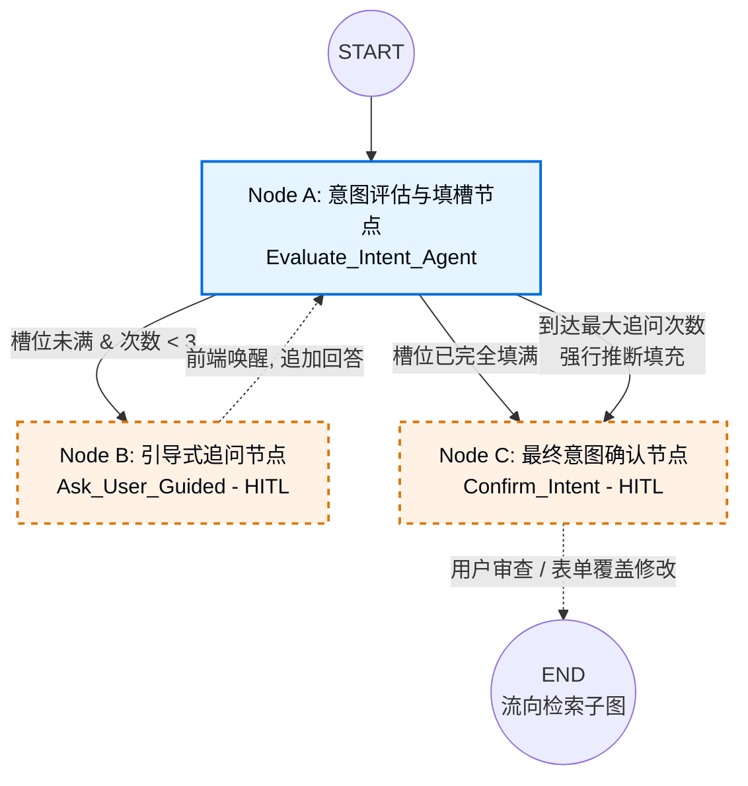
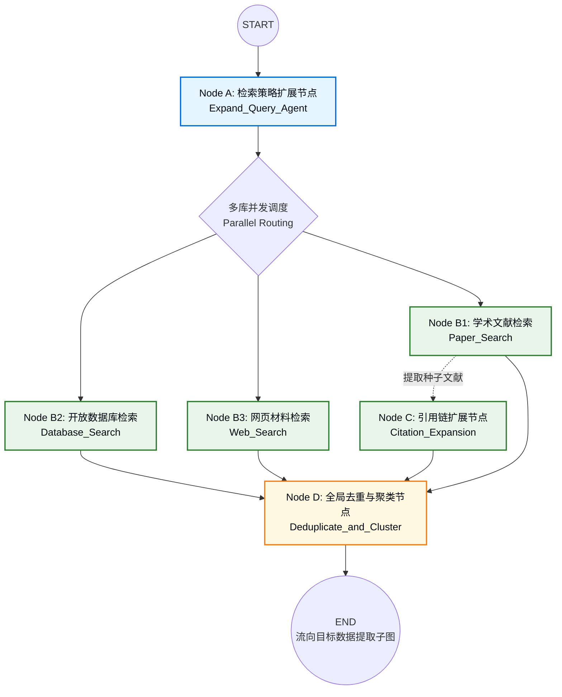
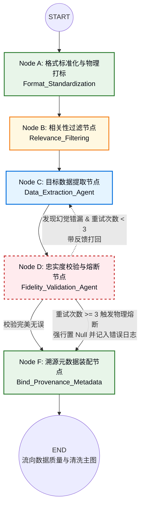

# 澄清

### 一、意图澄清子图

---

### 二、 子状态空间设计

| State 参数名           | 类型 (Type)   | 初始值       | 说明与用途                                                   |
| :--------------------- | :------------ | :----------- | :----------------------------------------------------------- |
| `query_context`        | Dict          | 继承自全局   | **[只读]** 包含用户的初始配置（如：泛读模式/精准提取模式）。决定了 Node A 对模糊度的容忍底线。 |
| `original_query`       | String        | 用户初次输入 | **[只读]** 用户的原始问题（如：“帮我找找某种合金的高温数据”）。 |
| `chat_history`         | List[Message] | `[]`         | **[读/写]** 存储 AI 的追问选项和用户的补充回答，供 Node A 上下文参考。 |
| `dynamic_task_schema`  | Dict          | `None`       | **[读/写]** AI 在第一回合基于领域知识“现场生成”的槽位检查清单（必填项/选填项）。 |
| `extracted_parameters` | Dict          | `{}`         | **[读/写]** 实时更新的已提取/已推断出的科学参数。**（子图的核心输出产物）** |
| `clarification_turns`  | Integer       | `0`          | **[读/写]** 追问计数器。用于触发兜底机制，防止死循环。       |
| `is_clear`             | Boolean       | `False`      | **[读/写]** 路由开关。为 True 时跳出追问循环，前往 Node C。  |
| `compromise_flag`      | Boolean       | `False`      | **[写]** 兜底标记。若为 True，警告下游该数据包含了 AI 的强制猜测（置信度降级）。 |

---

### 三、 节点执行逻辑与状态读写明细

#### 1. Node A: Evaluate_Intent_Agent (意图评估与填槽节点)

**定位：** 具备领域常识的动态规划师，负责解构任务和核对账单。

| 属性               | 内容规范                                                     |
| :----------------- | :----------------------------------------------------------- |
| **Goal (目标)**    | 基于问题动态生成需提取的参数清单，核对当前信息，决定是追问、强行猜测还是放行。 |
| **Read State**     | `original_query`, `query_context`, `chat_history`, `clarification_turns` |
| **Write State**    | `dynamic_task_schema`, `extracted_parameters`, `is_clear`, `compromise_flag` |
| **Action Logic**   | **步骤 1：** 若 `dynamic_task_schema` 为空，则根据提问生成专属检查清单。 **步骤 2：** 将 `chat_history` 中的信息映射到清单中，更新 `extracted_parameters`。 **步骤 3：** 检查必填项。 |
| **Route Decision** | **条件 1：** 全部填满 -> 调用工具 `submit_final_intent` -> 设置 `is_clear=True`，流向 Node C。 **条件 2：** 未填满且 `turns < 3` -> 调用工具生成带选项的追问 -> 流向 Node B。 **条件 3：** 未填满且 `turns >= 3` -> 调用工具 `force_submit_best_guess` 强行补齐参数 -> 设置 `compromise_flag=True` 及 `is_clear=True`，流向 Node C。 |

#### 2. Node B: Ask_User_Guided (引导式追问节点 - HITL)

**定位：** LangGraph 的原生挂起点，负责与前端交互，收集缺失线索。

| 属性               | 内容规范                                                     |
| :----------------- | :----------------------------------------------------------- |
| **Goal (目标)**    | 暂停程序运行，将大模型生成的追问文本及单选/多选 Options 发送给前端，等待用户确认缺失槽位。 |
| **Read State**     | `extracted_parameters` (用于前端展示当前已解析出的部分数据)  |
| **Write State**    | `chat_history`, `clarification_turns`                        |
| **Action Logic**   | **步骤 1：** 触发 `interrupt()` 挂起。 **步骤 2：** 接收到前端传回的用户补充信息（如：“我选 (A) B波段”）。 **步骤 3：** 将回答追加至 `chat_history`，并将 `clarification_turns` + 1。 |
| **Route Decision** | 唤醒后，**无条件路由回 Node A** 进行下一轮槽位检查。         |

#### 3. Node C: Confirm_Intent (最终意图确认节点 - HITL)

**定位：** 状态覆盖（State Overwrite）的核心节点，人类防线的最后一关。

| 属性               | 内容规范                                                     |
| :----------------- | :----------------------------------------------------------- |
| **Goal (目标)**    | 在进入高消耗的“检索子图”前，将拟定的终极检索参数清单展示给人类，允许人类进行最后的一键放行或暴力修改。 |
| **Read State**     | `extracted_parameters`, `compromise_flag` (若为True，前端需高亮警告：“部分参数为AI推测”) |
| **Write State**    | `extracted_parameters` (通过 State Patching 机制覆盖)        |
| **Action Logic**   | **步骤 1：** 触发 `interrupt()` 挂起，向前端渲染可编辑表单（Editable Form）。 **步骤 2：** 接收前端返回的最终 JSON。 **步骤 3：** 无论用户是直接点确认，还是修改了参数，直接用前端返回的 JSON 强行覆盖当前的 `extracted_parameters`。 |
| **Route Decision** | 唤醒后，**流出本子图，向图结构下游的“多库并发检索节点”放行**。 |

# 检索

### 一、 检索策略与并发子图

---

### 二、 子状态空间设计

| State 参数名          | 类型 (Type) | 初始值     | 说明与用途                                                   |
| :-------------------- | :---------- | :--------- | :----------------------------------------------------------- |
| `intent_params`       | Dict        | 继承自上游 | **[只读]** 意图子图输出的最终参数集合（即 `extracted_parameters`）。包含目标实体、必填条件等。 |
| `expanded_queries`    | Dict        | `{}`       | **[读/写]** Node A 生成的面向不同数据源的**具体 API 检索策略**（如同义词、布尔逻辑表达式、API 过滤参数）。 |
| `raw_papers`          | List[Dict]  | `[]`       | **[读/写/追加]** Node B1 检索到的学术论文原始元数据（包含 DOI、摘要、PDF 链接）。 |
| `raw_databases`       | List[Dict]  | `[]`       | **[读/写/追加]** Node B2 检索到的结构化开放数据（如 JSON/CSV 的概要信息）。 |
| `raw_web_supplements` | List[Dict]  | `[]`       | **[读/写/追加]** Node B3 检索到的 `.edu/.gov` 等权威网页及附件材料路径。 |
| `citation_papers`     | List[Dict]  | `[]`       | **[读/写/追加]** Node C 基于种子文献通过图谱 API 挖掘出的“引文/被引”扩展文献集。 |
| `deduplicated_assets` | List[Dict]  | `[]`       | **[写]** **【本子图最终输出产物】** 经 Node D 全局合并、去重、排优先级后的干净“资产清单”，供下游提取。 |

### 三、 节点执行逻辑与状态读写明细

#### 1. Node A: Expand_Query_Agent (检索策略扩展节点)

**定位：** 将人类意图翻译为机器友好的多源检索指令。

| 属性             | 内容规范                                                     |
| :--------------- | :----------------------------------------------------------- |
| **Goal (目标)**  | 大模型读取意图参数，发散思维，生成同义词、上下位词，并针对文献库、数据库、网页分别构建最佳的布尔检索式。 |
| **Read State**   | `intent_params`                                              |
| **Write State**  | `expanded_queries`                                           |
| **Action Logic** | **步骤 1：** 读取意图中的核心实体（如：特定超新星）。 **步骤 2：** 结合科学常识生成同义词扩展（如别名、不同命名规范）。 **步骤 3：** 分别打包生成适用于 OpenAlex、特定科学 API 和 Google Search 的查询载荷（Payload）。 |

#### 2. Node B1-B3: Parallel_Search_Agents (多库并发检索节点簇)

**定位：** 系统并发执行，互不阻塞，最大化召回率。

| 属性             | 内容规范                                                     |
| :--------------- | :----------------------------------------------------------- |
| **Goal (目标)**  | 根据生成的专属检索策略，并发调用外部 API 抓取原始数据。      |
| **Read State**   | `expanded_queries`                                           |
| **Write State**  | 对应写入 `raw_papers`, `raw_databases`, `raw_web_supplements` |
| **Action Logic** | **Paper_Search:** 调用论文库 API，抓取高相关度文献元数据。 **Database_Search:** 针对特定科学数据库接口提取结构化数据索引。 **Web_Search:** 限定权威域名（.edu/.gov），抓取特定实验组主页的补充 PDF/CSV。 *(注：此处的具体抓取数量控制机制在节点内部闭环完成)* |

#### 3. Node C: Citation_Expansion (引用链扩展节点)

**定位：** 突破关键词检索的局限，挖掘隐藏的高优文献。

| 属性             | 内容规范                                                     |
| :--------------- | :----------------------------------------------------------- |
| **Goal (目标)**  | 从 B1 抓取的文献中筛选出高被引/权威的“种子论文”，通过图谱 API 顺藤摸瓜提取其参考文献及引用文献。 |
| **Read State**   | `raw_papers`                                                 |
| **Write State**  | `citation_papers`                                            |
| **Action Logic** | **步骤 1：** 对 `raw_papers` 按相关度或被引量排序，提取 Top N 作为 Seed。 **步骤 2：** 调用 Semantic Scholar 或 OpenAlex 的 Graph API 进行上下游深度遍历。 **步骤 3：** 将挖掘出的新文献写入 `citation_papers` 池。 |

#### 4. Node D: Deduplicate_and_Cluster (全局去重与聚类节点)

**定位：** 清理整合

| 属性             | 内容规范                                                     |
| :--------------- | :----------------------------------------------------------- |
| **Goal (目标)**  | 对前置四个原始数据池（论文+数据库+网页+引文）进行全局盘点、去重、融合，输出一份最干净、无重复的待解析清单。 |
| **Read State**   | `raw_papers`, `raw_databases`, `raw_web_supplements`, `citation_papers` |
| **Write State**  | `deduplicated_assets`                                        |
| **Action Logic** | **步骤 1：** 强标识符去重（基于 DOI、PMID、URL 剔除完全重复的数据）。 **步骤 2：** 语义标题去重（应对同一篇论文的不同预印本或转正版本）。 **步骤 3：** 优先级合并（例如：如果同一数据在“开放数据库”和“论文PDF”中都存在，优先保留开放数据库的直达链接，丢弃高解析成本的PDF路径）。 **步骤 4：** 生成统一标准的 `deduplicated_assets` 列表。 |

# 提取

### 一、 目标数据提取与溯源校验子图

---

### 二、 子状态空间设计 

这个状态空间肩负着连接“脏数据源”和下游“完美结构化图谱”的重任。其中 `hard_mapping_dict` 是保证绝不产生坐标幻觉的“秘密账本”。

| State 参数名          | 类型 (Type) | 初始值     | 说明与用途                                                   |
| :-------------------- | :---------- | :--------- | :----------------------------------------------------------- |
| `raw_assets`          | List[Dict]  | 继承自上游 | **[只读]** 检索子图传来的干净资产列表（如 PDF 路径、网页 URL、API 响应）。 |
| `hard_mapping_dict`   | Dict        | `{}`       | **[读/写]** **【核心防幻觉字典】** 记录 `trace_id` 对应的绝对物理定位。如 `{"doc1_tb1_r2": {"box": [10,20,100,30], "page": 2}}`。大模型不可见。 |
| `filtered_blocks`     | List[str]   | `[]`       | **[读/写]** 注入了 `[ID: xxx]` 标记的 Markdown 文本块/图表，喂给提取大模型的真正原料。 |
| `extracted_draft`     | Dict        | `{}`       | **[读/写]** Node C 提取出的草稿数据，仅包含 `value` 和引用的 `trace_id`。 |
| `validation_feedback` | String      | `""`       | **[读/写]** Node D 发现错误时生成的纠错指南，传回给 Node C。 |
| `extraction_attempts` | Integer     | `0`        | **[读/写]** 循环计数器，用于触发早停熔断机制（最大设定为 3）。 |
| `grounded_data`       | Dict        | `{}`       | **[写]** **【本子图最终输出产物】** 严格符合“多态溯源协议”的结构化字典，完全适配你队友的后半部分设计。 |

---

### 三、 节点执行逻辑与状态读写明细

#### 1. Node A: Format_Standardization 

**定位：**负责切分与 ID 分配。

| 属性             | 内容规范                                                     |
| :--------------- | :----------------------------------------------------------- |
| **Goal (目标)**  | 剥离异构数据的解析难度，将所有数据统一转化为带有 `[ID:xxx]` 标签的通用序列，并建立物理坐标硬映射账本。 |
| **Read State**   | `raw_assets`                                                 |
| **Write State**  | `filtered_blocks` (未经相关性过滤的初始态), `hard_mapping_dict` |
| **Action Logic** | **PDF文件：** 调用文档解析引擎。提取文字段落、裁剪图片、拆解表格行。为每个碎片分配 `trace_id`，将对应的 `[x0, y0, x1, y1]` 及页码存入 `hard_mapping_dict`。 **网页数据：** 剥离冗余 DOM，提取核心节点打上 `trace_id`，将对应的 XPath 存入字典。 **开放数据：** 为数据库行赋予 `trace_id`，将 Primary Key/JSONPath 存入字典。 **输出：** 拼装成 `[ID: doc1_p2_tb1_r1] Yield: 450MPa` 格式的文本流。 |

#### 2. Node B: Relevance_Filtering 

**定位：** 初筛

| 属性             | 内容规范                                                     |
| :--------------- | :----------------------------------------------------------- |
| **Goal (目标)**  | 利用廉价的轻量级算法剔除与核心意图无关的段落，只保留可能包含目标数据的候选块。 |
| **Read State**   | 全局意图参数 (如包含的目标实体关键字), 包含 ID 的完整文本块  |
| **Write State**  | `filtered_blocks` (最终态)                                   |
| **Action Logic** | 利用 BM25 词频统计或轻量级 Embedding 模型（向量检索），找出包含核心实体/属性关键字的 Top K 个高潜段落和图表数据块，更新 `filtered_blocks` 抛给 LLM。 |

#### 3. Node C: Data_Extraction_Agent (目标数据提取节点)

**定位：** 提取

| 属性             | 内容规范                                                     |
| :--------------- | :----------------------------------------------------------- |
| **Goal (目标)**  | 根据目标 Schema，从过滤后的文本块中提取数值，并强制要求一字不差地“抄写”对应的 ID。 |
| **Read State**   | `filtered_blocks`, `validation_feedback` (若为重试，则附带指导建议) |
| **Write State**  | `extracted_draft`                                            |
| **Action Logic** | **输入提示词限制：** 绝对禁止捏造数字，绝对禁止输出坐标空间。仅从带有 `[ID:xx]` 的文本中提取内容。 **输出约束：** 输出 `{"field": "yield_strength", "extracted_value": "450 MPa", "trace_id": "doc1_p2_tb1_r1"}`。若遇到图片，则触发 VLM 视觉模型提取该图片的值并返回图片对应的 ID。 |

#### 4. Node D: Fidelity_Validation_Agent (忠实度校验与熔断节点)

**定位：** 核对，减少幻觉

| 属性             | 内容规范                                                     |
| :--------------- | :----------------------------------------------------------- |
| **Goal (目标)**  | 纯逻辑比对提取的数值是否真实存在于引用的 ID 文本中。执行“事不过三”的熔断降级。 |
| **Read State**   | `extracted_draft`, `filtered_blocks` (原始对照文本), `extraction_attempts` |
| **Write State**  | `validation_feedback`, `extraction_attempts` (递增)          |
| **Action Logic** | **步骤 1：** 验证 `trace_id` 是否合法存在。 **步骤 2：** 验证 `extracted_value` 是否是对应文本块的精确子串（或数值等价）。 **路由决策：** ► 若完全匹配：清除 feedback，放行流向 Node F。 ► 若不匹配且 `attempts < 3`：生成如“未在 ID:[x] 中找到 450MPa”的 feedback，`attempts` + 1，打回 Node C。 ► **若不匹配且 `attempts >= 3`**：触发物理熔断。强行将该字段的 `extracted_value` 设为 `Null`，附加 `is_compromised: True` 错误日志，放行流向 Node F。 |

#### 5. Node F: Bind_Provenance_Metadata (溯源元数据装配节点)

**定位：** 整合打包

| 属性             | 内容规范                                                     |
| :--------------- | :----------------------------------------------------------- |
| **Goal (目标)**  | 使用 `trace_id` 查阅“硬字典账本”，将大模型提取的值与真实的物理坐标/路径封装绑定，生成统一协议数据。 |
| **Read State**   | `extracted_draft`, `hard_mapping_dict`                       |
| **Write State**  | `grounded_data`                                              |
| **Action Logic** | **步骤 1：** 获取 `extracted_draft` 中的 `trace_id`。 **步骤 2：** 去 `hard_mapping_dict` 查询该 ID 对应的 `box`, `page`, `xpath` 等真实物理定位。 **步骤 3：** 无论值是提取成功的还是被强行置 Null 的，都将其组装为“多态溯源协议”的统一 JSON 格式写入 `grounded_data`，向全图放行。 |
