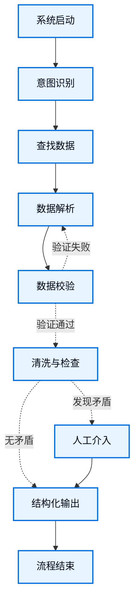

## 第一步：将工作流拆解为独立步骤

首先，明确流程中各个独立的步骤。每一个步骤都将成为一个节点（即执行特定功能的独立函数）。随后，建立这些步骤之间的连接关系。



图中的箭头展示了流转路径，实际的路由判断逻辑由每个节点内部的代码控制。

各节点具体职责定义如下：

*   **意图识别**：基于设定的研究领域，对用户需求进行解析并提取参数。
*   **查找数据**：调用子智能体，通过网络和数据库获取相关的科学文献与数据源。
*   **数据解析**：执行文档解析，提取所需数据及其在原文档中的边界框坐标。
*   **数据校验**：利用独立的审核智能体，将提取出的数据与原文档进行匹配验证。若发现不匹配，则要求重新提取。
*   **清洗与检查**：执行字段对齐、缺失值和重复值处理等数据整合工作。同时检测是否存在单位不一致或数据矛盾。
*   **人工介入**：当遇到系统无法自动解决的矛盾或图例错误时，挂起程序，向前端发送请求，交由人工修正。
*   **结构化输出**：完成验证和人工修正后，生成结构化数据，供前端实现溯源高亮展示。

> **提示：** 
> 部分节点会根据执行结果做出分支决策（如“数据校验”和“清洗与检查”），其他节点则按固定顺序流转（如“查找数据”流向“数据解析”，“人工介入”流向“结构化输出”）。

---

## 第二步：明确每个步骤的具体职责 

对于流程图中的每一个节点，需要确定其操作类型以及运行所需的上下文信息。操作类型分为以下四类：

*   **大语言模型节点**：用于理解、分析、生成文本或进行逻辑推理。
*   **数据节点**：用于从外部数据源检索信息。
*   **动作节点**：用于执行系统输出等外部动作。
*   **用户输入节点**：用于需要人工干预的场景。

### 大语言模型节点

*   **意图识别**
    *   **静态提示词**：目标研究领域设定、查询参数提取规则。
    *   **动态状态数据**：用户输入的原始需求文本。
    *   **预期输出**：用于指导下游搜索的结构化检索参数（如关键词、材料名称）。

*   **数据校验**
    *   **静态提示词**：数据交叉验证逻辑规则。
    *   **动态状态数据**：数据解析节点生成的初始结果、原始文献文本块。
    *   **预期输出**：验证通过状态；若失败，则输出错误反馈以供重试。

*   **清洗与检查**
    *   **静态提示词**：单位换算规则、数据去重与对齐准则。
    *   **动态状态数据**：经过校验的多源文献数据。
    *   **预期输出**：格式统一的数据集合；若存在无法调和的错误则抛出冲突标识。

### 数据节点

*   **查找数据**
    *   **输入参数**：意图识别节点生成的检索关键词。
    *   **重试策略**：需要。针对外部接口限流或网络超时，设置指数退避重试机制。
    *   **缓存机制**：针对常见查询设置缓存以减少接口调用开销。

*   **数据解析**
    *   **输入参数**：文档本地路径；若为校验退回重试，还需包含前置的错误反馈。
    *   **重试策略**：需要。主解析库执行失败时，回退至备用解析方案。
    *   **缓存机制**：按文档散列值缓存已提取的坐标和文本，避免重复解析。

### 动作节点

*   **结构化输出**
    *   **执行条件**：数据清洗完毕，或人工修正冲突之后。
    *   **重试策略**：不需要。
    *   **缓存机制**：不需要。
    *   **预期输出**：输出供前端渲染的最终数据结构（包含数值与原文档边界框坐标对应信息）。

### 用户输入节点

*   **人工介入**
    *   **决策上下文**：产生矛盾的数据点、相关文献原文片段、页面及坐标信息。
    *   **预期输入格式**：人工修正后的具体数值或文本。
    *   **触发条件**：发现无法通过预设规则解决的数据冲突、单位矛盾或解析错误。

---

## 第三步：设计状态

### 状态推导过程 

| 执行节点 | 节点需要读取的数据（输入） | 节点需要写入的数据（输出） | 对应的状态字段 |
| :--- | :--- | :--- | :--- |
| **系统启动** | 无 | 用户的原始提问 | `query` |
| **意图识别** | `query` | 提取出的检索词、目标实体 | `search_intent` |
| **查找数据** | `search_intent` | 下载完成的文献本地路径 | `pdf_paths` |
| **数据解析** | `pdf_paths`, `search_intent`<br>（若被退回，需读取 `validation_feedback`） | 提取的初始数据（含物理坐标） | `extracted_draft` |
| **数据校验** | `extracted_draft`, `pdf_paths` | 若验证失败，写入反馈并退回；<br>若验证通过，清空反馈信息。 | `validation_feedback` |
| **清洗与检查** | `extracted_draft` | 若存在矛盾，写入矛盾详情；<br>若无矛盾，写入处理后的数据。 | `conflict_details`<br>`cleaned_data` |
| **人工介入** | `conflict_details` | 人工修正后的数据 | `cleaned_data` |
| **结构化输出** | `cleaned_data` | 格式化的输出结果 | `final_data` |

### 状态数据结构定义

基于上述流转过程，全局状态数据结构定义如下（包含内部嵌套的字典结构，用于保证类型明确）：

```python
from typing import TypedDict, List, Dict, Optional

# --- 内部数据结构定义 ---

class SearchIntent(TypedDict):
    """意图识别节点输出的结果"""
    keywords: List[str]          # 检索关键词列表
    target_entity: str           # 需提取的目标实体
    
class BboxData(TypedDict):
    """单条提取数据的标准格式"""
    source_file: str             # 数据来源的文件名
    value: str                   # 提取的数值及单位
    page: int                    # 所在的页码
    bbox: List[float]            # 边界框坐标 [x_min, y_min, x_max, y_max]

class ConflictInfo(TypedDict):
    """触发人工介入的异常详情"""
    conflict_type: str           # 异常类型说明
    involved_data: List[BboxData]# 产生冲突的原始数据集合
    message: str                 # 提交至前端的提示信息

# --- 全局主状态定义 ---

class ResearchState(TypedDict):
    # 0. 系统初始输入
    query: str
    
    # 1. 意图识别结果
    search_intent: Optional[SearchIntent]
    
    # 2. 查找数据结果
    pdf_paths: Optional[List[str]]
    
    # 3. 数据解析初始结果
    extracted_draft: Optional[List[BboxData]]
    
    # 4. 数据校验反馈
    validation_feedback: Optional[str]
    
    # 5. 异常情况说明
    conflict_details: Optional[ConflictInfo]
    
    # 5/6. 清洗后或人工修正后的数据
    cleaned_data: Optional[List[BboxData]]
    
    # 7. 最终结构化输出结果
    final_data: Optional[Dict]
```

### 设计说明：

1.  **流程闭环**：节点间的数据流转形成闭环。例如数据解析节点在首次执行时反馈状态为空；若因提取错误被校验节点退回，第二次执行时将读取错误反馈，从而修正提取逻辑。
2.  **职责划分**：未经验证和清洗的数据作为初始结果存放，经过验证的最终数据分开存储，防止错误数据影响最终输出结果。
