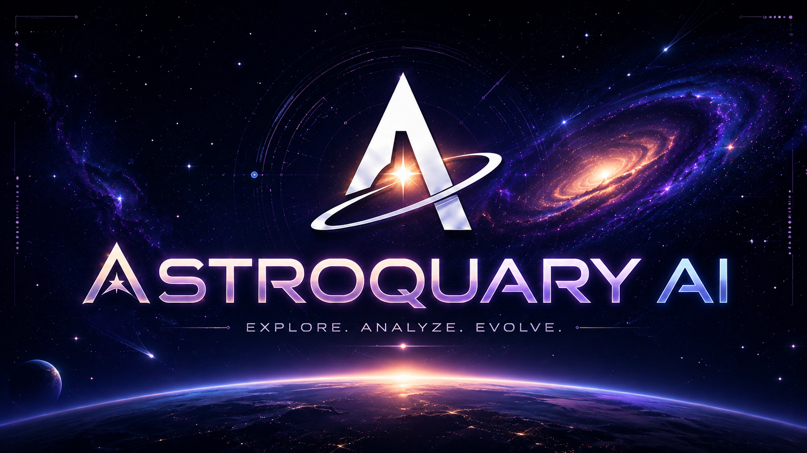
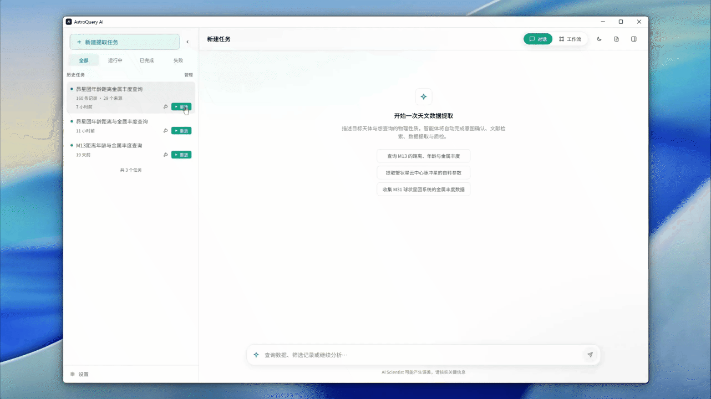
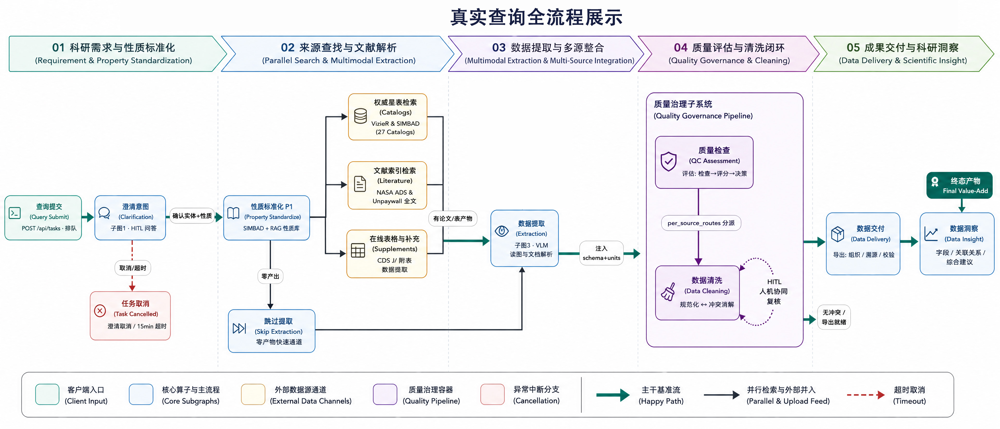
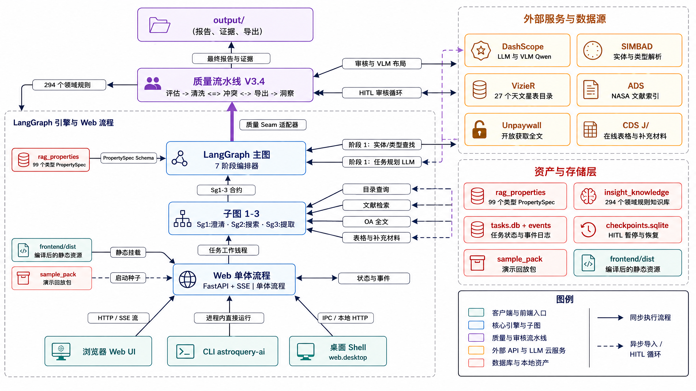
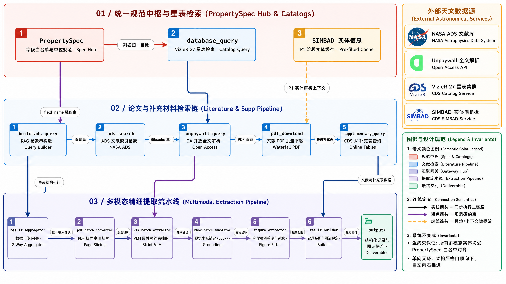
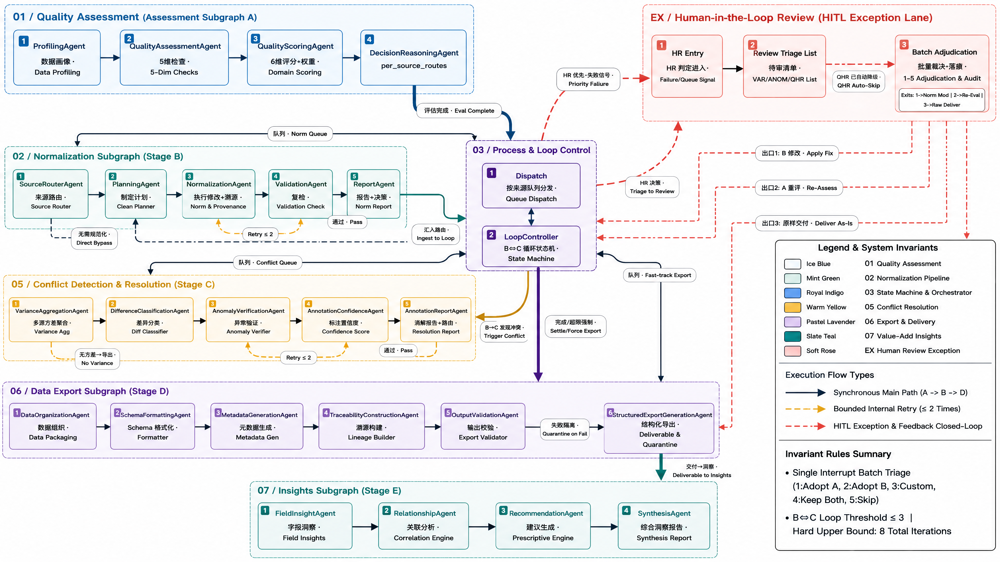
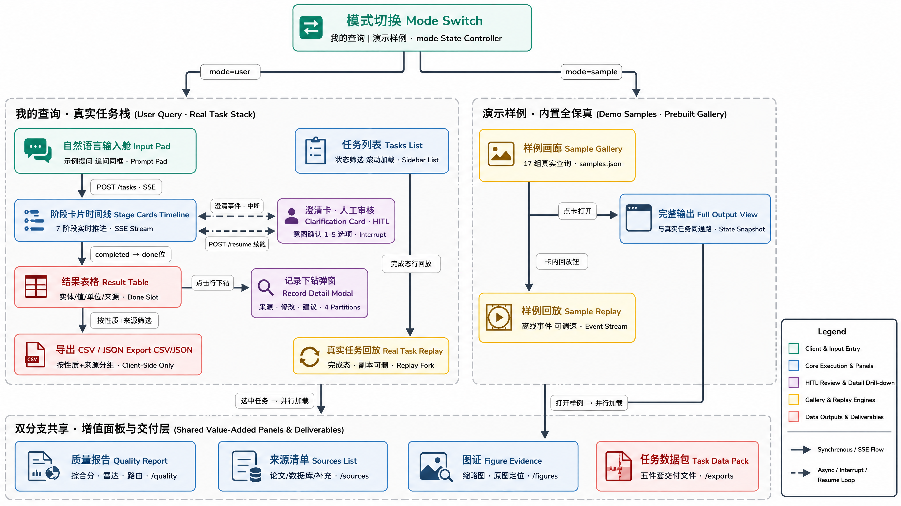

<div align="center">



### 用自然语言问天——从文献到结构化黄金数据的科研智能体

**2026 挑战杯 · 阿里云 AI 科研助手 | 赛题方向 1 · 科学数据整合与影响力分析**

[](https://python.org)
[](https://langchain.com)
[](https://dashscope.aliyun.com)

[](https://fastapi.tiangolo.com)
[](https://react.dev)

[](#-测试与质量)
[](#--内置窗口模式)
[](https://lijiamingeric28-tech.github.io/AI-Scientist-2026/)

**EXPLORE · ANALYZE · EVOLVE** — *查询 → 检索 → 提取 → 质检 → 数据科学可用*

</div>

> **作品定位**：面向天文科研数据获取的智能检索与数据整合系统 —— 研究者输入一句自然语言查询目标天体参数（如「M31 的距离和金属丰度」），系统自动完成意图解析与目标确认，并行检索多源专业星表与海量文献库；依托多模态大模型，从论文正文、复杂表格及科学图表中提取相关数值与图文佐证，并为每条数据生成可精确定位回溯的原文证据链。随后数据进入闭环质检流水线：多维校验单位格式与物理合理性，给出置信评分；自动规范清洗并全程修改留痕；对多源数据展开冲突分析与分歧归因，疑难异常流转人工复核。最终结合字段洞察在前端可视化呈现，并支持导出高可信度的结构化科研数据。

---

## 📺 演示demo

<div align="center">



*完整流程：任务提交 → SSE 实时流 → 质量雷达 → 记录表格 → 溯源图证（左键可点击查看）*

</div>

---

## 🎯 赛题背景与问题

科研数据散落在**异构来源**之中：天文星表（VizieR）、学术论文（ADS）、补充材料（CDS）……每个来源的字段命名、单位、精度、可信度都不尽相同，且论文中的数值往往埋藏在 PDF 图谱/表格里。传统流程需要研究者人工「检索 → 阅读 → 誊抄 → 核对」数百篇文献，耗时且错误率高。

**AstroQuery AI 把这个流程交给 Agent 流水线**，并最终落在一个最关键的问题上：

> 提取到的每一行数据，**质量是否可信？有没有被自动清洗过？清洗依据是什么？**

## 💡 核心方法

系统通过人机交互确认目标天体与所需性质，结合天文数据库展开**全别名**，并依据知识库生成**统一性质清单**；随后**并行检索**专业星表与文献论文，利用多模态大模型解析正文与图表提取数值，配合**文本层逆向定位**提供精准原文位置；最后通过质量流水线对字段格式与合理范围进行多维质检，由确定性规则完成**误差区间拆解**与**单位规范化**，并利用离群统计分析**自动归因多源测量冲突**，在保留原始分歧与全流程修改留痕的前提下完成结构化交付。

一次查询的六阶段闭环：

| 阶段 | 环节 | 内容 |
|------|:---:|------|
| 1 | 需求解析 | 自然语言意图理解 + 人机多轮澄清 → 天文数据库统一标识 + 全别名展开 → 领域知识库生成统一性质清单（字段白名单 + 标准单位） |
| 2 | 检索 | 基于性质清单并行检索多张专业星表，自动生成文献检索式，实现论文及附表数据的靶向筛选与下载 |
| 3 | 提取 | 多模态大模型逐页解析论文正文与复杂表格提取物理量数值，配合文本层逆向定位锁定真实坐标并筛选图表证据 |
| 4 | 质检 | 多维评估打分 + 确定性规则清洗 + 离群冲突检测；误差区间拆解与单位规范化，冲突显式归因并保留原始分歧，状态机闭环迭代 + 人机协同裁决 |
| 5 | 数据产出 | 输出标准化数据集，完整保留原始出处、页码坐标、逐字摘录与修改留痕，全要素深度可溯源 |
| 6 | 前端显示 | 多维数据检索、原文高亮定位回溯、图证画廊展示、冲突洞察分析与任务流交互回放 |

---

## ✨ 核心亮点

| # | 亮点 | 说明 |
|---|------|------|
| 1 | **PropertySpec 系统中枢** | 目标天体 → SIMBAD/otype → RAG 性质库（100 类 otype · 3,293 条性质定义）→ 字段名白名单 + 标准单位表，数据库/论文/补充材料三条提取路径全部归一 |
| 2 | **三路并行检索** | 25 个 VizieR 星表（LLM 列名归一）+ ADS 论文检索（RAG 标准名构造查询串）+ Unpaywall → PDF 瀑布式下载 + CDS J/ 补充材料 |
| 3 | **VLM 多模态提取** | 论文 PDF → 页图/bbox 标注 → 多模态模型批量提取（prompt 注入 PropertySpec 白名单），图证→记录逐条可溯源 |
| 4 | **三层动态工具** | 数据标准化的 Layer3（LLM 动态生成 Python 函数）在 **AST 白名单沙箱**内执行：dry-run 5 样本 → 自检 → 8s 超时 → 修复循环；生成失败安全回退 Base Tools |
| 5 | **统计冲突检测** | Cohen's d 效应量（含 95% CI）替代传统相对差异法——组内方差小时不会漏报（\|450-500\|/std=10 仍报 LARGE） |
| 6 | **6 维质量评分 + 雷达报告** | completeness / consistency / format / source_reliability / conflict_risk / extraction_quality 加权评分，置信度校准，可视化雷达图 |
| 7 | **质检路由决策** | 8 项检查清单 + 4×3 决策矩阵（Quality × Repair Cost）→ Export / Normalize / Conflict / HumanReview，最大 3 轮 B↔C 循环 |
| 8 | **HITL 人机协同** | 意图澄清（子图 1）+ 人工复核节点（interrupt/resume），需要人类判断时停下等输入 |
| 9 | **SSE 实时 Web + 事件回放** | FastAPI + 12 类事件流 / 断点续播 / 任意已完成任务「一键重放」（压缩倍率可调），演示级流畅度 |
| 10 | **桌面内置引擎** | 一个 `python -m web.desktop` 即开出原生窗口（WebView2），不依赖浏览器 |

---

## 🧭 系统架构图集


<div align="center">

**① 真实查询全流程** —— 一次查询的五阶段主线：需求与性质标准化 → 来源查找与文献解析 → 数据提取与多源整合 → 质量评估与清洗闭环 → 成果交付与科研洞察



**② 系统架构总览** —— LangGraph 主图编排 · 子图 1-3 契约 · Web 单体流程 · 外部服务与数据源 · 资产与存储层（100 类 otype 性质库 · 294 条天体物理先验知识）



**③ 检索与提取流水线** —— 01 规范中枢与星表检索（PropertySpec / VizieR 25 星表 / SIMBAD）→ 02 论文与补充材料检索链（ADS / Unpaywall / CDS）→ 03 多模态精细提取（页图切片 / VLM 约束提取 / bbox 定位 / 图证抽取）



**④ 质量管线（Quality Pipeline V3.4）** —— 评估 → 清洗 ⇄ 冲突 → 导出 → 洞察 + HITL 人工复核异常通道；B⇄C 状态机（循环阈值 ≤ 3，总迭代上限 8），Invariant Rules 约束每轮裁决



**⑤ 前端交互模式** —— 「我的查询 · 真实任务栈」与「演示样例 · 内置全保真」双模式切换 + 共享增值面板（质量报告 / 来源清单 / 图证 / 数据包）



</div>

---

## 🚀 快速开始
## 通过源码编译运行
### 1. 克隆仓库

```bash
git clone https://github.com/lijiamingeric28-tech/AI-Scientist-2026.git
cd AI-Scientist-2026/AstroQuery_AI

# 安装运行依赖（Python 3.10+，清单见 requirements.txt / pyproject.toml）
pip install -r requirements.txt
```

### 2. 配置 API Key（`AstroQuery_AI/.env`）
**我们提供一定量的api额度，可通过如下方式获取：**
使用从源码进行编译的方式进行配置.env文件需要从我们提交的文档中获得**夸克网盘**的链接，并从链接中下载.env文件，放置在AI-Scientist-2026/AstroQuery_AI目录下即可。
| 变量 | 必填 | 说明 |
|------|:---:|------|
| `DASHSCOPE_API_KEY` | ✅ | 阿里云百炼（Qwen 文本 + VLM 多模态），驱动澄清/提取/生成 |
| `DASHSCOPE_BASE_URL` | ✅ | 百炼兼容模式地址 |
| `ADS_API_TOKEN` | ⬜ | ADS 论文检索（不配则论文轨降级） |
| `UNPAYWALL_EMAIL` | ⬜ | Unpaywall 开放获取下载 |

### 3. 命令行（一条查询跑全流程）

```bash
python -m astroquery_ai "M31 的距离和金属丰度"
```

### 4. 前端构建（Web 界面 / 桌面窗口必需）

> 仓库不包含前端构建产物（`.gitignore` 排除 `frontend/dist/` 与 `frontend/node_modules/`）。
> **每次克隆或拉取代码后**，必须先安装依赖并构建，否则 `web.main` 找不到静态页面（窗口/页面会是空白 404）：

```bash
cd frontend                          # 当前已在 AstroQuery_AI/ 内
npm install                          # 网络慢可加 --registry=https://registry.npmmirror.com
npm run build
cd ..
```

### 5. Web 界面（SSE 实时流 + 回放 + 质量报告）

```bash
python -m web.main        # 浏览器模式 → http://127.0.0.1:8000
python -m web.desktop     # 内置窗口模式（WebView2，不依赖浏览器）
```

---
## 📦 通过release下载绿色包运行（Windows 桌面版）

我们现在已经把整个应用封装为 **exe + 依赖文件夹**形式，您可以直接下载后解压运行，无需配置环境，唯一需要进行配置的只有 `.env` 文件（放在 exe 同目录下，内容同源码方式，获取方式与上相同）。

**产物**：`AstroQueryAI-win64.zip`

| 使用事项 | 说明 |
|------|------|
| 启动 | 解压 → 双击 `AstroQueryAI.exe`（自动避让端口，窗口关闭即停服务） |
| API Key | 在 exe 同目录放 `.env`（`DASHSCOPE_API_KEY` 等，与源码方式同格式） |
| 演示样例 | **包内已内置** `sample_pack/`（18 组真实演示），首启自动导入，开箱即可回放演示；删除 exe 旁 `data/` 可重置后由包重导 |
| 数据目录 | exe 旁自动生成 `data/`（任务库）与 `output/`（图证/导出），删除即重置 |

---

## 🖥️ 功能总览

| 模块 | 能力 | 关键实现 |
|------|------|----------|
| 意图澄清 | 结构化拆解查询（目标/性质/约束） | 子图1 + HITL 澄清卡 |
| 性质标准化 | 天体 → 可检索性质清单 | SIMBAD + RAG 知识库（~100 otype） |
| 检索 | 星表/论文/补充材料三路并行 | VizieR 25 表 + ADS + Unpaywall + CDS |
| 提取 | PDF 图/表数值提取 | Qwen-VLM + bbox 精定位（图证可溯源） |
| 质量评估 | 8 项检查 + Cohen's d + 自适应阈值 | 4 Stage：Profiling→评估→评分→决策 |
| 标准化 | 别名/单位/缺失/去重/格式修正（留痕） | 6 基础工具 + LLM 自适应 + 沙箱生成工具 |
| 冲突裁决 | 7 策略加权证据融合 | SourceReliability/DomainRules/统计/上下文 4 维证据 |
| 导出 | 多格式结构化输出 + 全量溯源 | JSON/CSV/宽表 + 决策链 + 质量摘要 |
| 洞察 | 字段关系/推荐/上下文 | 子图 Insights |
| Web | 任务管理/实时流/回放/质量雷达 | FastAPI + SSE + React + 图证全屏查看 |

---

## 🔬 质量管线深度

- **评估八项检查**：别名字段 / 格式问题 / 缺失单位 / 缺失溯源 / 单位不符标准 / 单位不一致 / 跨来源冲突 / 完整性不完美
- **统计冲突**：Cohen's d（std 归一）→ 效应量三档 + 95% CI；`_ROUTE_SEVERITY` 聚合取最严路由
- **标准化沙箱**：AST 白名单（禁止 eval/import/dunder/裸 compile）+ 受限 exec + 8s 超时 + dry-run 验证 + 置信度阈值（<0.7 转人工）
- **双源路径**：A→C（评估直报）与 B→C（标准化后复查）都汇入冲突裁决，B↔C 最大 3 轮
- **6 维雷达**：评分可视化基于真实 `dimension_scores`（completeness…extraction_quality），含置信度校准（0.4×volume + 0.4×agreement + 0.2×sparsity）

## 🧪 测试与质量

```bash
# 测试/ruff 需要开发依赖（含 pytest + vcrpy）
pip install -r requirements-dev.txt

python -m pytest tests/ -m "not network"   # 521 项全 mock 离线 ✅
python -m pytest tests/                    # + 网络冒烟（需真实 API）
python -m ruff check .
```

- **521 项测试全绿**（全 mock、无网络、无 LLM）；全库 13 单元两阶段审计曾发现并修复 80 条确认问题（`HISTORY_VERSION/V3/docs/AUDIT_REPORT.md`）
- VCR 录制回放（`vcrpy`，见 requirements-dev.txt）支撑离线真实交互协议测试

## 📁 目录结构

```
AI-Scientist-2026/
├── AstroQuery_AI/             # ★ 主线代码
│   ├── astroquery_ai/         # 上游主图：澄清+检索+提取+quality 接缝
│   ├── subgraphs/             # 9 个子图（subgraph1/2/3 + data_* 质量管线）
│   ├── quality_pipeline/      # 质量管线共享设施（configs/models/tools/sandbox）
│   ├── web/                   # FastAPI 后端：任务/SSE/回放/桌面入口(desktop.py)
│   ├── frontend/              # React + Vite（7 阶段卡片/质量雷达/溯源查看）
│   ├── rag_properties/        # RAG 性质库（100 类 otype 标准单位）
│   ├── scripts/               # 运维/演示/实验脚本（提交任务、重建样例包等）
│   ├── sample_pack/           # 演示回放包（内置样例库）
│   ├── output/                # 本地运行产物（不提交）
│   ├── tests/                 # pytest 全 mock 离线测试
│   ├── requirements.txt       # 运行依赖（与 pyproject.toml 同步）
│   └── requirements-dev.txt   # 开发依赖（pytest/ruff/vcrpy…）
├── HISTORY_VERSION/           # 历史版本归档（V1/V2/V3 + 设计思路）
├── assets/                    # 标题图 / Logo / 演示 GIF / 架构图集 / 开发日志
├── site/                      # GitHub Pages 落地页
└── README.md
```

---

<div align="center">


**AstroQuery AI · 2026 挑战杯 · 阿里云 AI 科研助手**

`EXPLORE · ANALYZE · EVOLVE` — 让每一行科学数据都值得信赖 ✦

</div>
