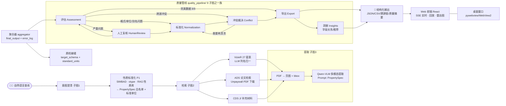

<div align="center">


### 用自然语言问天——从文献到结构化黄金数据的科研智能体

**2026 挑战杯 · 阿里云 AI 科研助手 | 赛题方向 1 · 科学数据整合与影响力分析**

[](https://python.org)
[](https://langchain.com)
[](https://dashscope.aliyun.com)

[](https://fastapi.tiangolo.com)
[](https://react.dev)

[](#-测试与质量)
[](#--内置窗口模式)

**EXPLORE · ANALYZE · EVOLVE** — *查询 → 检索 → 提取 → 质检 → 数据科学可用*

</div>

> **一句话**：输入一句自然语言（如「M31 的距离和金属丰度」），AstroQuery AI 自动完成意图澄清、27 个天文星表/文献库检索、VLM 多模态数据提取、8 项质量评估、自动标准化/冲突裁决（内置 LLM 动态工具 + 沙箱），最终输出可追溯、可复现、带 6 维质量评分与雷达报告的结构化黄金数据。

---

## 📺 演示

<div align="center">


*完整流程：任务提交 → SSE 实时流 → 质量雷达 → 记录表格 → 溯源图证（左键可点击查看）*

</div>

---

## 🎯 赛题背景与问题

科研数据散落在**异构来源**之中：天文星表（VizieR）、学术论文（ADS）、补充材料（CDS）……每个来源的字段命名、单位、精度、可信度都不尽相同，且论文中的数值往往埋藏在 PDF 图谱/表格里。传统流程需要研究者人工「检索 → 阅读 → 誊抄 → 核对」数百篇文献，耗时且错误率高。

**AstroQuery AI 把这个流程交给 Agent 流水线**，并最终落在一个最关键的问题上：

> 提取到的每一行数据，**质量是否可信？有没有被自动清洗过？清洗依据是什么？**

---

## ✨ 核心亮点

| # | 亮点 | 说明 |
|---|------|------|
| 1 | **PropertySpec 系统中枢** | 目标天体 → SIMBAD/otype → RAG 性质库 → 字段名白名单 + 标准单位表（~100+ otype），数据库/论文/补充材料三条提取路径全部归一 |
| 2 | **三路并行检索** | 27 个 VizieR 星表（LLM 列名归一）+ ADS 论文检索（RAG 标准名构造查询串）+ Unpaywall → PDF 瀑布式下载 + CDS J/ 补充材料 |
| 3 | **VLM 多模态提取** | 论文 PDF → 页图/bbox 标注 → 多模态模型批量提取（prompt 注入 PropertySpec 白名单），图证→记录逐条可溯源 |
| 4 | **三层动态工具** | 数据标准化的 Layer3（LLM 动态生成 Python 函数）在 **AST 白名单沙箱**内执行：dry-run 5 样本 → 自检 → 8s 超时 → 修复循环；生成失败安全回退 Base Tools |
| 5 | **统计冲突检测** | Cohen's d 效应量（含 95% CI）替代传统相对差异法——组内方差小时不会漏报（\|450-500\|/std=10 仍报 LARGE） |
| 6 | **6 维质量评分 + 雷达报告** | completeness / consistency / format / source_reliability / conflict_risk / extraction_quality 加权评分，置信度校准，可视化雷达图 |
| 7 | **质检路由决策** | 8 项检查清单 + 4×3 决策矩阵（Quality × Repair Cost）→ Export / Normalize / Conflict / HumanReview，最大 3 轮 B↔C 循环 |
| 8 | **HITL 人机协同** | 意图澄清（子图 1）+ 人工复核节点（interrupt/resume），需要人类判断时停下等输入 |
| 9 | **SSE 实时 Web + 事件回放** | FastAPI + 12 类事件流 / 断点续播 / 任意已完成任务「一键重放」（压缩倍率可调），演示级流畅度 |
| 10 | **桌面内置引擎** | 一个 `python -m web.desktop` 即开出原生窗口（WebView2），绿色免安装包（PyInstaller）双击即用 |

---

## 🧭 系统架构



### 质量决策矩阵（Assessment → 下游路由）

| | **Excellent** | **Good** | **Fair** | **Poor** |
|---|---|---|---|---|
| **Low 修复成本** | Export | Export | Normalization | Normalization |
| **Medium** | Export | Normalization | Normalization | Conflict |
| **High** | Normalization | Conflict | Conflict | **Human Review** |

---

## 🚀 快速开始

### 1. 环境

```bash
# Python 3.10+，依赖见 pyproject.toml（pip install -e . 自动安装）
cd AstroQuery_AI
pip install -e .
```

### 2. 配置 API Key（`AstroQuery_AI/.env`）

| 变量 | 必填 | 说明 |
|------|:---:|------|
| `DASHSCOPE_API_KEY` | ✅ | 阿里云百炼（Qwen 文本 + VLM 多模态），驱动澄清/提取/生成 |
| `DASHSCOPE_BASE_URL` | ✅ | 百炼兼容模式地址 |
| `ADS_API_TOKEN` | ⬜ | ADS 论文检索（不配则论文轨降级） |
| `UNPAYWALL_EMAIL` | ⬜ | Unpaywall 开放获取下载 |

### 3. 命令行（一条查询跑全流程）

```bash
python -m astroquery_ai "M31 的距离和金属丰度"
```

### 4. 前端构建（Web 界面 / 桌面窗口必需）

> 仓库不包含前端构建产物（`.gitignore` 排除 `frontend/dist/` 与 `frontend/node_modules/`）。
> **每次克隆或拉取代码后**，必须先安装依赖并构建，否则 `web.main` 找不到静态页面（窗口/页面会是空白 404）：

```bash
cd AstroQuery_AI/frontend
npm install                          # 网络慢可加 --registry=https://registry.npmmirror.com
npm run build
cd ..
```

### 5. Web 界面（SSE 实时流 + 回放 + 质量报告）

```bash
python -m web.main        # 浏览器模式 → http://127.0.0.1:8000
python -m web.desktop     # 内置窗口模式（WebView2，不依赖浏览器）
python packaging/launcher.py --desktop   # 绿色包/统一入口，双击 exe 即达
```

---

## 🖥️ 功能总览

| 模块 | 能力 | 关键实现 |
|------|------|----------|
| 意图澄清 | 结构化拆解查询（目标/性质/约束） | 子图1 + HITL 澄清卡 |
| 性质标准化 | 天体 → 可检索性质清单 | SIMBAD + RAG 知识库（~100 otype） |
| 检索 | 星表/论文/补充材料三路并行 | VizieR 27 表 + ADS + Unpaywall + CDS |
| 提取 | PDF 图/表数值提取 | Qwen-VLM + bbox 精定位（图证可溯源） |
| 质量评估 | 8 项检查 + Cohen's d + 自适应阈值 | 4 Stage：Profiling→评估→评分→决策 |
| 标准化 | 别名/单位/缺失/去重/格式修正（留痕） | 6 基础工具 + LLM 自适应 + 沙箱生成工具 |
| 冲突裁决 | 7 策略加权证据融合 | SourceReliability/DomainRules/统计/上下文 4 维证据 |
| 导出 | 多格式结构化输出 + 全量溯源 | JSON/CSV/宽表 + 决策链 + 质量摘要 |
| 洞察 | 字段关系/推荐/上下文 | 子图 Insights |
| Web | 任务管理/实时流/回放/质量雷达 | FastAPI + SSE + React + 图证全屏查看 |

---

## 🔬 质量管线深度

- **评估八项检查**：别名字段 / 格式问题 / 缺失单位 / 缺失溯源 / 单位不符标准 / 单位不一致 / 跨来源冲突 / 完整性不完美
- **统计冲突**：Cohen's d（std 归一）→ 效应量三档 + 95% CI；`_ROUTE_SEVERITY` 聚合取最严路由
- **标准化沙箱**：AST 白名单（禁止 eval/import/dunder/裸 compile）+ 受限 exec + 8s 超时 + dry-run 验证 + 置信度阈值（<0.7 转人工）
- **双源路径**：A→C（评估直报）与 B→C（标准化后复查）都汇入冲突裁决，B↔C 最大 3 轮
- **6 维雷达**：评分可视化基于真实 `dimension_scores`（completeness…extraction_quality），含置信度校准（0.4×volume + 0.4×agreement + 0.2×sparsity）

## 🧪 测试与质量

```bash
cd AstroQuery_AI
python -m pytest tests/ -m "not network"   # 370 项全 mock 离线 ✅
python -m pytest tests/                    # + 网络冒烟（需真实 API）
python -m ruff check .
```

- **370 项测试全绿**（全 mock、无网络、无 LLM）；全库 13 单元两阶段审计曾发现并修复 80 条确认问题（`docs/AUDIT_REPORT.md`）
- VCR 录制回放（dev extra `vcrpy`）支撑离线真实交互协议测试

## 📁 目录结构

```
AI-Scientist-2026/
├── AstroQuery_AI/             # ★ 主线代码
│   ├── astroquery_ai/         # 上游主图：澄清+检索+提取+quality 接缝
│   ├── subgraphs/             # 9 个子图（subgraph1/2/3 + data_* 质量管线）
│   ├── quality_pipeline/      # 质量管线共享设施（configs/models/tools/sandbox）
│   ├── web/                   # FastAPI 后端：任务/SSE/回放/桌面入口(desktop.py)
│   ├── frontend/              # React + Vite（7 阶段卡片/质量雷达/溯源查看）
│   ├── rag_properties/        # RAG 性质库（~100+ otype 标准单位）
│   ├── packaging/             # PyInstaller 绿色包（launcher + spec）
│   └── tests/                 # pytest 全 mock 离线测试
├── HISTORY_VERSION/           # 历史版本归档（V1/V2/V3 + 设计思路）
├── assets/                    # 标题图 / Logo / 演示 GIF / 开发日志
└── README.md
```

## 📚 文档

| 文档 | 位置 |
|------|------|
| 总架构设计方案（9 子图 + 主图装配） | `AstroQuery_AI/quality_pipeline/总架构设计方案.md` |
| 前端集成契约 | `AstroQuery_AI/docs/FRONTEND_INTEGRATION.md` |
| 开发日志（7.7–7.20 项目历程） | `assets/开发日志.md` |
| 历史审计报告（80 条确认问题修复，V3 归档） | `HISTORY_VERSION/V3/docs/AUDIT_REPORT.md` |
| 历史优化/修复状态（V3 归档） | `HISTORY_VERSION/V3/docs/OPTIMIZATION_STATUS.md` |

---

<div align="center">


**AstroQuery AI · 2026 挑战杯 · 阿里云 AI 科研助手**

`EXPLORE · ANALYZE · EVOLVE` — 让每一行科学数据都值得信赖 ✦

</div>
