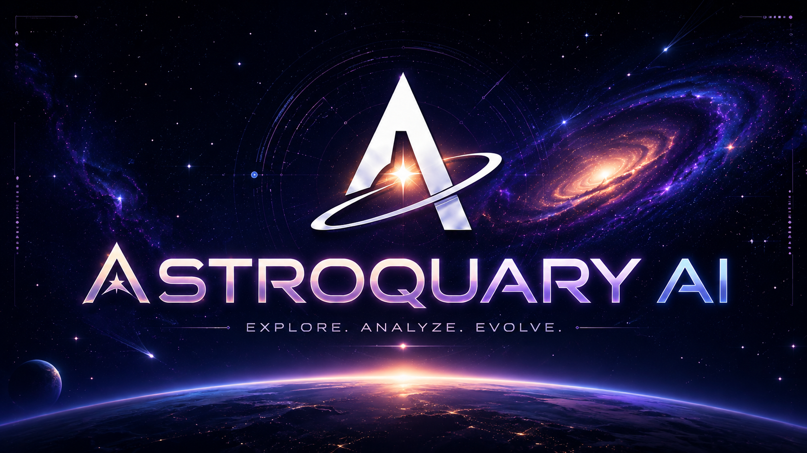

<div align="center">



### 用自然语言问天

**2026 挑战杯 · 阿里云 AI 科研助手 · 科学数据查找、解析与整合**

[](https://python.org)
[](https://langchain.com)
[](https://dashscope.aliyun.com)

[](https://fastapi.tiangolo.com)
[](https://react.dev)

[](#验证和构建)
[](#windows-桌面版)
[](https://lijiamingeric28-tech.github.io/AI-Scientist-2026/)

</div>

# AstroQuery AI

从一句自然语言提问出发，在 VizieR 星表、ADS 论文和官方附表中查找测量。每条结果保留作者原报、误差、测量条件和来源。研究者可以回查原件、比较资料、继续追问，并把所选数据和图像导出用于分析。

## Windows 桌面版

下载 Windows x64 压缩包，解压后双击 **AstroQueryAI.exe**。程序会启动本机服务，在自己的 WebView2 窗口中打开，关闭窗口即可退出。[下载 Windows 桌面版](https://github.com/lijiamingeric28-tech/AI-Scientist-2026/releases/download/desktop-2026.11.03/AstroQueryAI-win64.zip)

上方下载链接对应 `desktop-2026.11.03` 的六样例版本。本仓库当前源码包含 **7 个真实样例**，首位为 **SN 2014J · 多波段光变与红化**；源码更新不会自动替换已发布安装包。

可从「演示样例」直接查看已保存的查询。自己的查询和设置保存在程序旁的 `data/` 文件夹，换新版时请保留该文件夹。若系统缺少 WebView2 Runtime，先安装微软提供的 Evergreen x64 运行时。[微软 WebView2 下载页](https://developer.microsoft.com/microsoft-edge/webview2/)

## 从源码运行

使用 Python 3.12 或 3.13，以及 Node.js 22.12 以上版本。从仓库根目录执行下列命令。

```powershell
git clone https://github.com/lijiamingeric28-tech/AI-Scientist-2026.git
cd AI-Scientist-2026
python -m venv .venv
.\.venv\Scripts\Activate.ps1
python -m pip install -e ".[dev]"
cd frontend
npm ci
npm run build
cd ..
python -m uvicorn astroquery_ai.api.http:create_app --factory --host 127.0.0.1 --port 8781
```

浏览器访问 `http://127.0.0.1:8781/`。Windows 也可以在仓库根目录执行 `astroquery-desktop` 打开内置 WebView2 窗口。macOS 和 Linux 使用 `source .venv/bin/activate` 激活环境。开发前端时，在另一个终端进入 `frontend` 运行 `npm run dev`，开发服务器会把 API 请求转给本机 8781 端口。

**体验现有结果**　在左侧选择「演示样例」。建议从首位的 **SN 2014J · 多波段光变与红化** 开始，浏览 960 条测量、40 份去重资料、52 幅图像和 4 项性质；查看本篇解读、同性质跨来源对照，以及已保存的真实追问、知识引用、误差图和参数试算。旧版 **SN 2014J · 爆发峰值、红化与吸收线** 保留 Na I D 等值宽度 **5.8 Å**，可沿证据追到论文第 5 页。回放会重现当时的问题和答案，点击锁定的原答只推进播放。样例的测量、来源、图注、审核及阶段事件随项目提供，查看这些内容不需要密钥。论文 PDF 按需从公开来源取得，核对文件哈希后才用于显示原页和研究图像。来源无法提供同一版本时仍可查看原报、摘录和出处。

**开始自己的查询**　在「设置 → 服务连接」填写百炼的兼容接口地址和 API Key、ADS Token 及 Unpaywall 联系邮箱。连接就绪后，产品安装随包提供的 100 类性质库、对应知识库和软件资格记录。「使用偏好」可以调整 ADS 排序和每项性质的论文目标。已有查询沿用创建时的选择。

从源码运行时，个人数据默认写入根目录的 `runtime-data/`。也可以通过 `ASTROQUERY_DATA_ROOT` 指定已有数据目录。密钥由本机的服务连接设置管理，`.env.example` 列出了可用的环境变量。通过 wheel 安装时，数据默认写入当前用户的应用数据目录。

从旧的子目录结构升级时，如果根目录还没有对应文件，应用会读取旧 `AstroQuery/` 下的 `runtime-data/`、`paths.local.json` 和 `.env`。已有虚拟环境可以重新执行 `python -m pip install -e ".[dev]"`，让安装指向仓库根目录。

## 演示目录

| 案例 | 推荐看点 | 记录 / 来源 / 图像 |
|---|---|---:|
| **SN 2014J · 多波段光变与红化 · 首选演示** | 单篇资料解读、跨来源对照、多轮追问、准确知识引用和交互试算 | 960 / 49 / 52 |
| SN 2014J · 爆发峰值、红化与吸收线 | 峰值星等、色余和星际吸收线。从原页核对测量，再看红化的人工判断 | 154 / 35 / 55 |
| HD 209458 b | 比较不同研究给出的行星质量、半径和轨道倾角 | 46 / 35 / 27 |
| 织女星 | 对照论文拟合表，查看 9547 ± 17 K 的主值和统计误差 | 64 / 23 / 38 |
| PSR J0437−4715 | 从轨道周期找到 VizieR 原始行、目标名和误差列 | 35 / 55 / 19 |
| M45 昴星团 | 比较星团测距方法，区分统计误差和系统误差 | 45 / 23 / 37 |
| 大角星 | 浏览四项恒星大气性质、跨文献条件和多次审核 | 337 / 39 / 83 |

表中“来源”沿用样例目录的来源记录口径。最新样例在成果页归为 40 份去重资料。

样例按真实修订发布。SN 2014J 的峰值视星等中保留了个别误归的绝对星等，M45 和脉冲星各有已知的错对象记录。回放及任务评分反映处理经过，选用单条测量时可查看作者原报。完整研究文件取决于原站的可用性。

## 仓库结构

```text
backend/src/astroquery_ai/  Python 应用与接口
frontend/                   React 工作台与演示目录
resources/                  性质库、知识库、正式样例和桌面资源
tests/                      后端测试
tools/                      打包、维护、自动演示和性能基准
site/                       GitHub Pages 网站
assets/                     网站与 README 共用素材
docs/                       开发与性能文档
```

## 修改入口

| 需要修改的部分 | 从这里开始 |
|---|---|
| HTTP、CLI、桌面启动 | `backend/src/astroquery_ai/api/`。HTTP 在 `http.py` 装配，路由按任务、设置、事件和成果分组 |
| 身份解析、语义澄清和冻结请求 | `query/`。SIMBAD 的目标身份、模型选择的性质候选和用户确认在这里汇合 |
| 星表、论文、附表、图像和引用 | `science/catalog/`、`science/papers/`、`science/workflow/`。原文定位、证据核验和数值表示分别在 `papers/paper_evidence.py`、`papers/evidence_check.py`、`papers/native_values.py` |
| 质检、清洗、数据对照和交付 | `science/unified_quality.py`、`science/processing/`、`science/results/`。业务代码解释材料，正式结果读接口取指定的交付修订 |
| 运行和存储 | `runtime/` 管理作业、持久化、模型和外部访问。`application/` 负责装配以及对话、成果和执行明细的展示投影 |
| 科学库与维护 | `registry/` 负责性质定义、适用范围和审定输入，`science/knowledge.py` 负责知识库。已审核的运行输入在 `resources/`，开发工具在 `backend/src/astroquery_ai/tools/` |
| 对话、记录、图像、执行明细、设置 | `frontend/src/components/` 下的 `chat`、`results`、`workflow`、`settings`。图像查看器和质量分组件在 `results/FigureViewer.jsx` 与 `results/QualityScore.jsx` |
| 演示样例 | `frontend/public/demo-catalog.json` 决定顺序和首选。固定历史在 `resources/demos/`，首次打开时按任务读取。个人查询与样例在侧栏分开展示 |

表中后端简称目录均位于 `backend/src/astroquery_ai/`。完整审定包和公开部署使用同一个科学规则编译器。发布工具先核对完整输入，再打包运行所需记录。启动时重新生成消费视图并与固定版本核对。资格记录仍独立校验，运行时不依赖旧版目录。

维护者可用 `python -m astroquery_ai.tools.pack_reviewed_registry --help` 和 `python -m astroquery_ai.tools.pack_demos --help` 重建发布数据。前者需要完整审定包和指定版本的哈希，后者需要本机已结束的真实查询和明确选择的交付修订。公开样例包含科研和回放所需的事实。账户设置、计费账本、模型调用原文和整库的下载缓存留在产生查询的机器上。

自动演示脚本见 [tools/demo/README.md](tools/demo/README.md)。它驱动应用原生内嵌窗口，复用已保存结果，不录制视频、不重新调用模型。知识与规范工作台均从设置进入，界面跟随系统配色；规范发布只作用于后续使用该版本的新任务。

## 验证和构建

```powershell
python -m pytest
cd frontend
npm test
npm run build
cd ..
python -m pip wheel --no-deps --wheel-dir .build/wheels .
```

前端构建输出位于 `frontend/dist/`，安装包会收录该界面。在 Windows x64 上构建便携版，先安装 `python -m pip install -e ".[build]"` 并在 `frontend/` 执行 `npm ci`，然后从源码目录运行 `python -m astroquery_ai.tools.build_product --windows`。生成的 ZIP 位于 `.build/windows/<构建时间>/dist/`。Windows 运行依赖锁见 `requirements-windows.lock`。
