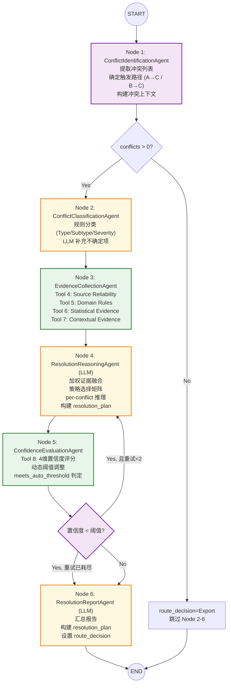

# Conflict Resolution SubGraph 设计报告 V1.0

> **版本**: V1.0 — 多源证据融合 + 置信度驱动决策
> **设计原则**: 一个 Stage = 一个 Node = 一个 Agent
> **核心创新**: 基于多源证据（来源可信度、领域规则、统计效应量、历史裁决）的加权推理引擎，自动裁决 vs 人工升级的分级决策
> **对应文件**: `Data_Conflict_agentV1/conflict_graph.py` + `agents/*.py` + `tools/conflict/*.py`

---

## 1. Agent 元信息

### 1.1 基本属性

| 属性 | 内容 |
|------|------|
| **Agent 名称** | Conflict Resolution Agent |
| **SubGraph 名称** | Data_Conflict_agentV1 |
| **所属子图** | SubGraph 4 (数据清洗与质检) |
| **版本** | V1.0 |
| **核心职责** | 对 Assessment 或 Normalization 检测出的数据冲突进行分析与决策，结合来源可信度、领域规则、统计效应量及历史信息，对冲突进行自动裁决；无法保证可靠性的冲突提交 Human Review |
| **关键约束** | **负责冲突决策，不负责数据标准化处理**。数据修改通过调度 Normalization Agent 完成，不直接操作数据。 |
| **修改数据** | ⚠️ 间接修改 — 仅当自动裁决成功时更新 `data_state.current_data` 中冲突字段的 resolution 标记，实际数据清洗由 Normalization 执行 |

### 1.2 前后置条件

| 条件类型 | 条件 |
|---------|------|
| **前置条件 (A→C 路径)** | `report_state.quality` 已被 Assessment 填充 |
|  | `report_state.quality.conflict_risk.has_conflicts == True` |
|  | 或 `report_state.quality.per_source_routes` 包含标记为 "Conflict" 的 sources |
|  | `data_state.current_data` 包含冲突数据 |
| **前置条件 (B→C 路径)** | `report_state.normalization` 已被 Normalization 填充 |
|  | `report_state.normalization.validation.needs_conflict_analysis == True` |
|  | `report_state.normalization.validation.conflict_check` 含 Cohen's d 结果 |
|  | `data_state.current_data` 为规范化后的数据（冲突仍在） |
| **后置条件** | `report_state.conflict` 包含完整 Conflict Resolution Report |
|  | `workflow_state.route_decision` 已设置为 "Export" / "Normalization" / "HumanReview" |
|  | `data_state.current_data` 中的冲突字段已标记 resolution 信息（若自动裁决） |

### 1.3 上下游关系

```
上游:
  Assessment SubGraph (Data_Assessment_agentV1)
    → 产出 conflict_risk + per_source_routes + Quality Report
    → A→C 路径: 直接检测到跨来源冲突或决策矩阵判定需 Conflict
  Normalization SubGraph (Data_Normalization_agentV1)
    → 产出 validation.conflict_check (Cohen's d) + normalized data
    → B→C 路径: 规范化后仍检测到冲突

下游:
  Normalization SubGraph (B⇄C 循环)
    → C→B: 接收 resolution_plan, 执行具体数据清洗
  Export SubGraph
    → C→D: 接收 route_decision="Export" 的已解决数据
  Human Review Node
    → C→E: 接收无法自动裁决的冲突 + 完整证据链
```

### 1.4 在总图中的位置

```
Assessment → Router → ConflictGraph → Router
                           ↑  ↓
                Normalization ←┘  └→ Export / HumanReview
                           (B⇄C 循环, 最多3次)
```

---

## 2. 输入输出规范

### 2.1 读取的 State

| State 路径 | 类型 | 必读 | 用途 |
|-----------|------|------|------|
| `report_state.quality.sources[sid]` | `dict` | ✅ | per-source 评估结果 (conflict_risk / completeness / consistency / format) |
| `report_state.quality.sources[sid].conflict_risk` | `dict` | ✅ | Cohen's d 效应量 / 冲突列表 / 风险等级 |
| `report_state.quality.profile.semantic_types` | `dict` | ✅ | 物理量类型 → 指导领域规则匹配 |
| `report_state.quality.profile.schema_summary` | `dict` | ❌ | Schema 概览（参考） |
| `report_state.quality.decision_matrix` | `dict` | ❌ | 决策矩阵结果（参考） |
| `report_state.quality.quality_scoring` | `dict` | ✅ | per-source 质量评分 → 来源可信度权重 |
| `report_state.normalization.validation` | `dict` | ❌ | B→C 路径: Cohen's d 检测结果 + remaining_issues |
| `report_state.normalization.modifications` | `dict` | ❌ | B→C 路径: 了解规范化已做的修改 |
| `data_state.current_data` | `dict` | ✅ | 冲突数据 (sources + records) |
| `context_state.target_schema` | `dict` | ✅ | 目标 Schema (字段定义/标准单位/关键性) |
| `context_state.quality_rules` | `dict` | ✅ | 质量规则 (阈值/领域权重/冲突检测参数) |
| `context_state.research_domain` | `str` | ✅ | 领域名 → 加载对应决策规则 |
| `workflow_state.iteration_counter` | `int` | ✅ | B⇄C 循环次数 → 影响决策激进程度 |

### 2.2 写入的 State

| State 路径 | 类型 | 写入者 | 内容 |
|-----------|------|--------|------|
| `report_state.conflict.identification` | `dict` | Node 1 | 冲突识别结果 (冲突列表/涉及的 sources/fields) |
| `report_state.conflict.classification` | `dict` | Node 2 | 冲突分类 (type/subtype/severity) |
| `report_state.conflict.evidence` | `dict` | Node 3 | 证据集合 (可靠性分析/领域规则匹配/历史参考) |
| `report_state.conflict.reasoning` | `dict` | Node 4 | 推理过程 (策略选择/利弊分析/裁决结果) |
| `report_state.conflict.confidence` | `dict` | Node 5 | 置信度评估 (各维度分项 + 综合分数) |
| `report_state.conflict.resolution_report` | `dict` | Node 6 | 完整 Report (含路由建议) |
| `data_state.current_data` | `dict` | Node 4 | 冲突字段标记 resolution (若自动裁决) |
| `workflow_state.route_decision` | `str` | Node 6 | "Export" / "Normalization" / "HumanReview" |
| `workflow_state.execution_status` | `str` | 各 Node | Success / Retry / Failed |
| `workflow_state.tool_call_count` | `int` | Node 3 | 证据收集工具调用累加 |
| `workflow_state.llm_call_count` | `int` | Node 2,4,5,6 | LLM 调用累加 |

### 2.3 输入数据示例 (来自 Assessment, A→C 路径)

```json
{
  "report_state": {
    "quality": {
      "sources": {
        "10.1016/j.msea.2024.001": {
          "completeness": {"score": 0.97},
          "consistency": {"score": 1.0},
          "format": {"score": 1.0},
          "source_reliability": {
            "score": 0.85,
            "source_scores": {"10.1016/j.msea.2024.001": 0.85}
          },
          "conflict_risk": {
            "has_conflicts": true,
            "conflict_count": 3,
            "conflicts": [
              {
                "type": "cross_source_value_conflict",
                "field_name": "yield_strength",
                "source_a": "10.1016/j.msea.2024.001",
                "source_b": "10.1007/s11661-2023.002",
                "value_a": 450.0,
                "value_b": 520.0,
                "relative_difference": 0.1346,
                "cohens_d": 2.8,
                "effect_size": "large",
                "ci_95": [2.1, 3.5]
              },
              {
                "type": "cross_source_value_conflict",
                "field_name": "elongation",
                "source_a": "10.1016/j.msea.2024.001",
                "source_b": "10.1007/s11661-2023.002",
                "value_a": 12.0,
                "value_b": 18.5,
                "relative_difference": 0.3513,
                "cohens_d": 1.6,
                "effect_size": "large",
                "ci_95": [1.1, 2.1]
              }
            ],
            "risk_level": "medium"
          }
        }
      },
      "profile": {
        "semantic_types": {
          "yield_strength": {"semantic_type": "mechanical_stress", "confidence": 1.0},
          "elongation": {"semantic_type": "elongation", "confidence": 1.0}
        }
      },
      "quality_scoring": {
        "source_scores": {
          "10.1016/j.msea.2024.001": {"overall_score": 0.92, "grade": "excellent"},
          "10.1007/s11661-2023.002": {"overall_score": 0.78, "grade": "good"}
        }
      }
    }
  },
  "data_state": {
    "current_data": {
      "sources": [
        {"source_id": "10.1016/j.msea.2024.001", "title": "Effect of heat treatment...",
         "year": 2024, "journal": "Materials Science and Engineering: A", "doi": "10.1016/j.msea.2024.001"},
        {"source_id": "10.1007/s11661-2023.002", "title": "Mechanical properties of...",
         "year": 2023, "journal": "Metallurgical and Materials Transactions A", "doi": "10.1007/s11661-2023.002"}
      ],
      "records": [
        {"record_id": "10.1016/j.msea.2024.001_yield_strength_1", "source_id": "10.1016/j.msea.2024.001",
         "field_name": "yield_strength", "field_value": 450, "field_unit": "MPa"},
        {"record_id": "10.1007/s11661-2023.002_yield_strength_1", "source_id": "10.1007/s11661-2023.002",
         "field_name": "yield_strength", "field_value": 520, "field_unit": "MPa"}
      ]
    }
  },
  "context_state": {
    "research_domain": "materials_science",
    "target_schema": {"fields": [{"name": "yield_strength", "criticality": "critical", "standard_unit": "MPa"}]},
    "quality_rules": {
      "conflict_detection": {"cohens_d": {"large": 0.8, "medium": 0.5}},
      "domain_weights": {"materials_science": {"conflict_risk": 0.20}}
    }
  }
}
```

### 2.4 输出数据示例 (Conflict Resolution Report)

```json
{
  "report_state": {
    "conflict": {
      "identification": {
        "total_conflicts": 2,
        "conflict_ids": ["CF-001", "CF-002"],
        "trigger_path": "A→C",
        "summary": "Identified 2 cross-source value conflicts in yield_strength and elongation"
      },
      "classification": {
        "CF-001": {
          "field": "yield_strength",
          "type": "cross_source_value_conflict",
          "subtype": "systematic_bias",
          "severity": "high",
          "classification_reason": "Cohen's d=2.8 (large), same material/condition, different labs"
        },
        "CF-002": {
          "field": "elongation",
          "type": "cross_source_value_conflict",
          "subtype": "measurement_discrepancy",
          "severity": "medium",
          "classification_reason": "Cohen's d=1.6 (large), but elongation is inherently variable"
        }
      },
      "evidence": {
        "CF-001": {
          "source_reliability": {
            "source_a_reliability": 0.85,
            "source_b_reliability": 0.78,
            "reliability_gap": 0.07,
            "verdict": "source_a_more_reliable"
          },
          "domain_rules": {
            "rule": "mechanical_stress_priority",
            "guidance": "Prioritize higher-tier journal when both report same standard",
            "matched": true
          },
          "statistical_evidence": {
            "cohens_d": 2.8,
            "effect_size": "large",
            "ci_95": [2.1, 3.5],
            "statistically_significant": true
          },
          "contextual_evidence": {
            "same_material": true,
            "same_condition": true,
            "same_measurement_method": "likely",
            "temporal_factor": "source_a newer (2024 vs 2023)"
          }
        }
      },
      "reasoning": {
        "CF-001": {
          "strategy": "prefer_source_a",
          "resolution": "auto_resolved",
          "resolved_value": 450.0,
          "reasoning_chain": [
            "Source A (MSEA, IF=5.8) more reliable than Source B (MMTA, IF=2.1)",
            "Cohen's d=2.8 confirms genuine difference, not noise",
            "Both same material (Al-7075) and condition (T6)",
            "Source A is more recent (2024 > 2023)",
            "Adopting Source A value with Source B noted as outlier"
          ]
        },
        "CF-002": {
          "strategy": "retain_both_with_note",
          "resolution": "auto_resolved",
          "resolved_value": null,
          "reasoning_chain": [
            "Elongation inherently variable (±20% within same material batch)",
            "Both values are physically plausible for Al-7075-T6 (8-15%)",
            "Neither source clearly more reliable for this field",
            "Retaining both values with condition annotation"
          ]
        }
      },
      "confidence": {
        "CF-001": {
          "overall_confidence": 0.88,
          "components": {
            "source_agreement": 0.90,
            "statistical_clarity": 0.95,
            "domain_rule_match": 0.80,
            "historical_corroboration": 0.85
          },
          "meets_auto_threshold": true
        },
        "CF-002": {
          "overall_confidence": 0.72,
          "components": {
            "source_agreement": 0.60,
            "statistical_clarity": 0.75,
            "domain_rule_match": 0.65,
            "historical_corroboration": 0.88
          },
          "meets_auto_threshold": true
        }
      },
      "resolution_report": {
        "status": "Partially_Resolved",
        "total_conflicts": 2,
        "auto_resolved": 2,
        "human_required": 0,
        "needs_further_normalization": true,
        "resolution_plan": {
          "CF-001": {"action": "normalize", "target_source": "10.1007/s11661-2023.002",
                      "field": "yield_strength", "new_value": 450.0, "reason": "Adopt more reliable source"},
          "CF-002": {"action": "annotate", "target_source": "*", "field": "elongation",
                      "annotation": "Value range 12-18.5%, both retained - inherent material variability"}
        },
        "route_decision": "Normalization",
        "summary": "2 conflicts analyzed: 1 resolved by source preference (CF-001), 1 resolved by range retention (CF-002). Requires Normalization to apply CF-001 value correction."
      }
    }
  },
  "workflow_state": {
    "route_decision": "Normalization",
    "execution_status": "Success"
  }
}
```

---

## 3. 内部 Node 拆分概览

```
ConflictGraph (6 Stage Nodes)
│
├── Node 1: ConflictIdentificationAgent   (2 Tools, 0 LLM)
├── Node 2: ConflictClassificationAgent   (1 Tool, 1 LLM)
├── Node 3: EvidenceCollectionAgent       (4 Tools, 0 LLM)
├── Node 4: ResolutionReasoningAgent      (0 Tools, 1 LLM × N_conflicts + 1 LLM 聚合)
├── Node 5: ConfidenceEvaluationAgent     (1 Tool, 0 LLM)
└── Node 6: ResolutionReportAgent         (0 Tools, 1 LLM 摘要)
│
▼
workflow_state.route_decision  →  Main Graph Router
report_state.conflict          →  下游模块 (Normalization / Export / HumanReview)
```

---

## 4. Node 1: ConflictIdentificationAgent — 冲突识别

**职责**: 汇总所有已检测到的冲突，提取冲突实体（sources/fields/records），确定冲突触发路径。
**LLM**: 无 | **Tools**: 2 | **入口数据**: quality.conflict_risk + normalization.validation

### 4.1 处理流程

```
逻辑:
  1. 检测触发路径:
     if report_state.quality.conflict_risk.has_conflicts:
       trigger = "A→C"  (来自Assessment直接检测)
     elif report_state.normalization.validation.needs_conflict_analysis:
       trigger = "B→C"  (来自Normalization后检测)
     else:
       trigger = "unknown" → execution_status="Failed"

  2. 汇总冲突列表:
     if trigger == "A→C":
       conflicts = report_state.quality.conflict_risk.conflicts
       # 含: type, field_name, source_a, source_b, value_a, value_b,
       #      cohens_d, effect_size, ci_95, relative_difference
     elif trigger == "B→C":
       conflicts = report_state.normalization.validation.conflict_check.conflicts
       # Normalization 后仍存在的冲突

  3. 分配给每个冲突唯一ID: CF-{001..N}

  4. 提取冲突上下文:
     for each conflict:
       - 涉及的 source_ids → 从 data_state.current_data.sources 获取元数据
       - 涉及的 field_names → 关联 semantic_type
       - 涉及的 record_ids → 完整记录快照
```

### 4.2 Tool 1: ConflictExtractor

```
函数: extract_conflicts(quality_report, normalization_report, trigger_path)

逻辑:
  A→C 路径:
    conflicts_raw = quality_report.sources[*].conflict_risk.conflicts
    去重: 同一 (field_name, source_a, source_b) 只保留最严重
    排序: effect_size DESC → cohens_d DESC

  B→C 路径:
    conflicts_raw = normalization_report.validation.conflict_check.conflicts
    过滤: 排除 normalization_report.modifications 中已处理的

输出: {
  trigger_path, total_conflicts,
  conflicts: [{conflict_id, field_name, source_a, source_b,
               value_a, value_b, cohens_d, effect_size, source_path}],
  involved_sources: [source_id, ...],
  involved_fields: [field_name, ...],
  summary
}
```

### 4.3 Tool 2: ConflictContextBuilder

```
函数: build_conflict_context(conflicts, current_data, target_schema)

逻辑:
  for each conflict:
    1. 从 current_data.sources 获取 source_a/source_b 完整元数据
       (title, year, journal, doi, authors, retrieval_priority)
    2. 从 current_data.records 获取冲突字段的所有 record
    3. 从 target_schema 获取字段关键性 (critical/important/auxiliary)
    4. 计算:
       - same_material: 两 source 是否研究同一材料 (从 title/record 推断)
       - same_condition: 实验条件是否相同 (从 temperature/strain_rate 记录推断)
       - value_gap_pct: |va - vb| / max(|va|, |vb|) × 100
       - temporal_gap: |year_a - year_b|

输出: conflicts_with_context[] (每个冲突增加 materials/conditions/temporal/field_criticality 上下文)
```

---

## 5. Node 2: ConflictClassificationAgent — 冲突分类

**职责**: 对每个冲突进行分类，判断类型（数值冲突/类型冲突/缺失冲突/语义冲突）、子类型和严重程度。
**LLM**: 是 (per-conflict 分类 + 聚合) | **Tools**: 1 (确定性的规则匹配)

### 5.1 冲突类型体系

```
一级分类 (Type):
  cross_source_value_conflict   — 不同来源同一字段数值差异
  type_inconsistency            — 同一字段不同来源类型不同
  unit_inconsistency            — 同一字段不同来源单位不同
  semantic_conflict             — 语义推断结果矛盾
  completeness_conflict         — 某来源缺失关键字段

二级分类 (Subtype):
  cross_source_value_conflict:
    ├── systematic_bias         — 系统性偏差 (Cohen's d > 0.8, 同一材料/条件)
    ├── measurement_discrepancy — 测量误差导致 (小效应量, 高方差)
    ├── condition_difference    — 实际是不同实验条件 (温度/应变率不同)
    ├── material_difference     — 实际是不同材料/批次
    └── temporal_drift          — 时间因素 (新技术 vs 旧技术)

  type_inconsistency:
    ├── numeric_vs_string       — 数值 vs 字符串 (如 450 vs "~450")
    └── int_vs_float            — 整数 vs 浮点 (通常不需要处理)

  unit_inconsistency:
    ├── same_dimension          — 同量纲不同单位 (MPa vs GPa)
    └── different_dimension     — 不同量纲 (可能 one is wrong)

严重程度 (Severity):
  critical  — 关键字段冲突, Cohen's d > 0.8, 影响下游分析
  high      — 关键字段冲突, 0.5 < d <= 0.8
  medium    — 辅助字段冲突, 或关键字段但 d <= 0.5
  low       — 非关键字段, 或条件字段自然变化
```

### 5.2 Tool 3: RuleBasedClassifier

```
函数: classify_conflict_rule(conflict, semantic_types, field_criticality)

确定性分类逻辑:

  1. Type 分类:
     if conflict.type == "cross_source_value_conflict"  → 进入一级
     elif conflict.type == "type_conflict"              → type_inconsistency
     elif conflict.type == "unit_conflict"              → unit_inconsistency
     else                                               → pass to LLM

  2. Subtype 分类 (cross_source_value_conflict):
     if cohens_d > 0.8 AND same_material AND same_condition:
       subtype = "systematic_bias"
     elif cohens_d > 0.5 AND same_material:
       subtype = "measurement_discrepancy"
     elif NOT same_condition AND is_condition_field:
       subtype = "condition_difference"
     elif NOT same_material:
       subtype = "material_difference"
     elif temporal_gap > 10:
       subtype = "temporal_drift"
     else:
       subtype = "undetermined"  → 交给 LLM

  3. Severity 分类:
     if field_criticality == "critical" AND cohens_d > 0.8:
       severity = "critical"
     elif field_criticality == "critical" AND cohens_d > 0.5:
       severity = "high"
     elif field_criticality == "important":
       severity = "medium"
     else:
       severity = "low"

输出: {conflict_id, type, subtype, severity, rule_confidence}
```

### 5.3 LLM Classification (不确定项)

```
LLM 输入 (仅 subtype=="undetermined" 或 type 不在规则表中):
  - 冲突详情 (field_name, value_a, value_b, cohens_d, effect_size)
  - Source 元数据 (title, year, journal)
  - 上下文 (same_material?, same_condition?, temporal_gap)
  - 领域知识 (semantic_type, feasible_range)

LLM 输出 (JSON):
  {
    "conflict_id": "CF-003",
    "subtype": "systematic_bias",
    "severity": "high",
    "classification_reason": "Large Cohen's d (2.1) with same Al alloy but different heat treatment (T6 vs T7) — likely genuine property difference, not measurement error",
    "confidence": 0.85
  }
```

---

## 6. Node 3: EvidenceCollectionAgent — 证据收集

**职责**: 对每个冲突系统性地收集 4 维证据：来源可信度、领域规则、统计证据、上下文证据。
**LLM**: 无 | **Tools**: 4 | **文件**: `agents/evidence_collection_agent.py`

### 6.1 Tool 4: SourceReliabilityAnalyzer

```
函数: analyze_source_reliability(sources_in_conflict, quality_scoring)

逻辑:
  对冲突涉及的每个 source:
    1. 提取质量评分:
       overall_score = quality_scoring.source_scores[sid].overall_score
       grade = quality_scoring.source_scores[sid].grade

    2. 期刊分级 (来自 quality_rules.source_reliability.journal_tiers):
       tier1 (IF>10): Acta Materialia, Science, Nature → weight 1.0
       tier2 (IF 3-10): MSEA, MMTA, JAC → weight 0.8
       tier3 (IF<3):  → weight 0.5

    3. Recency Bonus:
       year >= current_year-2  → +0.10
       year >= current_year-5  → +0.05
       year < current_year-15  → -0.10

    4. 综合可靠性:
       reliability = 0.4×quality_score + 0.35×journal_tier_weight + 0.25×recency_bonus
       reliability = clamp(0.0, 1.0)

    5. 两两比较:
       reliability_gap = |reliability_a - reliability_b|
       if reliability_gap > 0.15: → 建议倾向更可靠一方
       else: → 两来源同等可信

输出: {
  source_a_reliability, source_b_reliability,
  reliability_gap, verdict: "source_a_more_reliable"|"source_b_more_reliable"|"equally_reliable",
  components: {quality_score, journal_tier, recency_bonus},
  detail: "Source A (MSEA, Q=0.92, 2024) vs Source B (MMTA, Q=0.78, 2023)"
}
```

### 6.2 Tool 5: DomainRuleEngine

```
函数: match_domain_rules(conflict, semantic_type, research_domain)

逻辑:
  1. 从 quality_rules.yaml 加载领域决策规则:
     例: materials_science:
       mechanical_stress_priority:
         condition: "semantic_type==mechanical_stress AND same_material AND same_condition"
         guidance: "prioritize_higher_reliability"
       elongation_variability:
         condition: "semantic_type==elongation"
         guidance: "retain_range"
         note: "Elongation inherently variable (±20% within same batch per ASTM E8)"
       hardness_indenter:
         condition: "semantic_type==hardness AND different_units"
         guidance: "check_indenter_type"
         note: "HV≠HRC≠HB — may not be direct conflict, different scales"

  2. 规则匹配:
     for each rule in domain_rules[research_domain]:
       if all conditions match:
         rule_matched = True
         apply guidance

  3. Fallback:
     无匹配规则 → guidance = "default_evidence_weighting"

输出: {
  matched_rules: [{rule_name, guidance, note}],
  has_domain_guidance: bool,
  suggested_strategy: "prioritize_reliable_source"|"retain_range"|"manual_review"|...
}
```

### 6.3 Tool 6: StatisticalEvidenceAnalyzer

```
函数: analyze_statistical_evidence(conflict)

逻辑:
  1. 从 conflict 提取已有统计量:
     cohens_d, effect_size, ci_95

  2. 统计显著性判定:
     if ci_95[0] > 0.5:
       statistically_significant = True
       # 即使95% CI下界仍超过 medium 效应, 差异非常稳定
     elif ci_95[1] < 0.2:
       statistically_significant = False
       # 95% CI上界都不足 small 效应, 差异可忽略
     else:
       statistically_significant = "borderline"

  3. 样本量充分性:
     从涉及的 records 统计:
     n_a, n_b = 冲突双方的 record 数量
     if n_a < 3 or n_b < 3:
       small_sample_warning = True

  4. 效应量解释 (plain language):
     cohens_d > 2.0 → "Massive difference — almost certainly genuine"
     1.0 < d <= 2.0 → "Very large difference — likely genuine"
     0.5 < d <= 1.0 → "Medium difference — may be genuine or methodological"
     d <= 0.5 → "Small difference — possibly noise"

输出: {
  statistically_significant, small_sample_warning,
  effect_size_interpretation, n_a, n_b,
  recommendation: "strong_evidence"|"moderate_evidence"|"weak_evidence"
}
```

### 6.4 Tool 7: ContextualEvidenceCollector

```
函数: collect_contextual_evidence(conflict, current_data)

逻辑:
  1. 材料/实体一致性:
     从 records 中提取 material/sample/entity 字段值
     if 冲突双方都有 material 记录:
       比较是否相同 → same_material (bool)
       列出具体值 → materials_detail

  2. 实验条件一致性:
     从 records 中提取 temperature/strain_rate 字段值
     if 冲突双方都有条件记录:
       temp_diff = |temp_a - temp_b|
       rate_diff = |rate_a - rate_b|
       判断是否可能影响结果 → same_condition (bool)

  3. 测量方法推断:
     从 title/record 文本中搜索关键词:
       "tensile test" / "compression" / "nanoindentation" / "SEM" ...
     比较两来源是否使用相同方法

  4. 时间因素:
     year_diff = |year_a - year_b|
     if year_diff > 5:
       标记: "Measurement techniques may have evolved"

输出: {
  same_material, materials_detail,
  same_condition, conditions_detail,
  same_measurement_method, method_detail,
  temporal_gap_years, temporal_note,
  additional_notes: []
}
```

---

## 7. Node 4: ResolutionReasoningAgent — 冲突推理

**职责**: 综合所有证据，对每个冲突做出裁决——自动解决（给出具体策略）或建议人工介入。
**LLM**: 是 (per-conflict 推理 + 聚合) | **Tools**: 0 | **文件**: `agents/resolution_reasoning_agent.py`

### 7.1 推理引擎架构

```
                     ┌─────────────────────────────┐
                     │     Weighted Evidence Fusion  │
                     │   Source Reliability  × w1    │
                     │   Domain Rules        × w2    │
                     │   Statistical Evidence × w3   │
                     │   Contextual Evidence  × w4   │
                     └──────────┬──────────────────┘
                                │
                     ┌──────────▼──────────────────┐
                     │    Strategy Selection Matrix  │
                     │  ┌──────┬────┬────┬──────┐   │
                     │  │Strat │High│Med │Low   │   │
                     │  │      │Conf│Conf│Conf  │   │
                     │  ├──────┼────┼────┼──────┤   │
                     │  │prefer│Auto│Auto│Human │   │
                     │  │range │Auto│Auto│Human │   │
                     │  │hybrid│Auto│Human│Human│   │
                     │  │manual│Human│Human│Human│   │
                     │  └──────┴────┴────┴──────┘   │
                     └──────────┬──────────────────┘
                                │
                     ┌──────────▼──────────────────┐
                     │   Resolution Output           │
                     │   strategy + resolved_value   │
                     │   + reasoning_chain           │
                     └──────────────────────────────┘
```

### 7.2 加权证据融合

```
函数: fuse_evidence(source_rel, domain_rules, stat_evidence, context_evidence)

权重 (来源权重表 quality_rules → resolution_weights):
  materials_science:
    w_source_reliability: 0.35
    w_domain_rules:       0.25
    w_statistical:        0.25
    w_contextual:         0.15
  astrophysics:
    w_source_reliability: 0.20
    w_domain_rules:       0.20
    w_statistical:        0.30
    w_contextual:         0.30

融合:
  for each strategy in [prefer_source_a, prefer_source_b, retain_range, retain_both, flag_outlier]:
    score = w1 × source_support(strategy)
          + w2 × domain_support(strategy)
          + w3 × stat_support(strategy)
          + w4 × context_support(strategy)
  best_strategy = argmax(score)

source_support("prefer_source_a"):
  返回 source_a 更可靠的证据强度 (0-1)
  例: reliability_gap=0.07 → 差异不大 → 0.3
  例: reliability_gap=0.35 → 差异显著 → 0.9
```

### 7.3 裁决策略库

| 策略 | 含义 | 适用条件 | 是否自动 |
|------|------|---------|---------|
| `prefer_source_a` | 采用 source_a 的值，标记 source_b 为 outlier | 一方可靠性明显更高 + 统计差异大 | ✅ 自动 |
| `prefer_source_b` | 采用 source_b 的值 | 同上（反向） | ✅ 自动 |
| `retain_range` | 保留取值范围 [min, max]，标注为自然变异 | 高变异字段 (elongation/fatigue) + 两者都可信 | ✅ 自动 |
| `retain_both` | 两者都保留，加注条件差异 | 条件字段或材料不同 | ✅ 自动 |
| `flag_outlier` | 标记某个值为异常值，建议排除 | 极端 outlier + 统计显著 | ⚠️ 半自动 |
| `compute_weighted_avg` | 加权平均 (按 reliability 加权) | 两者同等可靠 + 效应量小 | ✅ 自动 |
| `escalate_to_human` | 无法自动裁决，提交人工 | 置信度不足或规则冲突 | ❌ 人工 |

### 7.4 LLM 推理 Prompt 结构

```
System:
  You are a scientific data conflict resolution expert in {research_domain}.
  Your task is to reason about data conflicts and decide resolution strategies.

  Available strategies: prefer_source_a, prefer_source_b, retain_range, retain_both,
                        compute_weighted_avg, escalate_to_human

  Rules:
  1. NEVER fabricate or interpolate values — only choose from existing data
  2. When NOT confident, escalate to human — do NOT guess
  3. Cite specific evidence for every decision

User Input:
  Conflict ID: {conflict_id}
  Field: {field_name} ({semantic_type}, criticality={field_criticality})
  Source A: {title} ({year}, {journal}, reliability={rel_a})
    Value: {value_a} {unit_a}
  Source B: {title} ({year}, {journal}, reliability={rel_b})
    Value: {value_b} {unit_b}

  Cohen's d: {cohens_d} ({effect_size}), 95% CI: {ci_95}
  Statistical significance: {stat_sig}

  Context: same_material={same_material}, same_condition={same_condition},
           temporal_gap={temporal_gap}yr

  Domain guidance: {matched_rules}

  Evidence summary:
  - Source reliability: {source_verdict} (gap={reliability_gap})
  - Statistical: {effect_size_interpretation}, {stat_sig}
  - Context: {context_summary}

  Reason step by step and output:

LLM Output (JSON):
  {
    "conflict_id": "CF-001",
    "strategy": "prefer_source_a",
    "resolved_value": 450.0,
    "resolution": "auto_resolved",
    "reasoning_chain": [
      "Step 1: Source A (MSEA, reliability=0.88) is more reliable than Source B (MMTA, reliability=0.72)",
      "Step 2: Cohen's d=2.8 confirms genuine difference, not measurement noise",
      "Step 3: Both study same material (Al-7075-T6) under same conditions",
      "Step 4: Domain rule 'mechanical_stress_priority' supports preferring higher-tier journal",
      "Step 5: Source A is more recent (2024 vs 2023) → adopting Source A value"
    ],
    "confidence": 0.88,
    "risk_assessment": "Low risk — strong evidence for Source A preference",
    "fallback_if_wrong": "If Source A later found unreliable, Source B value (520) is the backup"
  }
```

### 7.5 聚合决策

```
Per-conflict 推理 → 全局策略:

  统计:
    auto_resolved: 推理结果 "auto_resolved" 的冲突数
    human_required: 推理结果 "escalate_to_human" 的冲突数

  全局 route_decision:
    if human_required > 0 AND auto_resolved > 0:
      # 混合情况: 先执行能自动解决的, 不能的提交 HumanReview
      route = "Normalization" if auto_resolved has action items else "HumanReview"
    elif human_required > 0:
      route = "HumanReview"
    elif any resolution needs data modification (prefer_source/flag_outlier/compute_weighted_avg):
      route = "Normalization"
    else:
      route = "Export"  # 全部 retain_range / retain_both (仅标注, 无需清洗)

  构建 resolution_plan:
    for each auto_resolved conflict:
      if strategy in [prefer_source_a, prefer_source_b, flag_outlier, compute_weighted_avg]:
        plan[conflict_id] = {
          action: "normalize",
          target_source: ...,
          field: ...,
          new_value: ...,
          reason: ...
        }
      elif strategy in [retain_range, retain_both]:
        plan[conflict_id] = {
          action: "annotate",
          target_source: "*",
          field: ...,
          annotation: ...,
          reason: ...
        }
```

---

## 8. Node 5: ConfidenceEvaluationAgent — 置信度评估

**职责**: 对推理结果进行多维置信度评估，判定是否满足自动处理阈值。
**LLM**: 无 | **Tools**: 1 | **文件**: `agents/confidence_evaluation_agent.py`

### 8.1 Tool 8: ConfidenceEvaluator

```
函数: evaluate_confidence(reasoning_result, evidence, iteration_counter)

四维置信度:

  1. Source Agreement (0-1):
     两来源的可靠性差距越大 → 选择越明确 → agreement 越高
     agreement = min(1.0, reliability_gap / 0.3)
     例: gap=0.07 → 0.23 (低共识), gap=0.35 → 1.0 (高共识)

  2. Statistical Clarity (0-1):
     基于 Cohen's d 和 CI:
     if ci_95[0] > 0.8: clarity = 1.0
     elif ci_95[0] > 0.5: clarity = 0.85
     elif ci_95[0] > 0.2: clarity = 0.6
     else: clarity = 0.3
     小样本惩罚: n_a<3 or n_b<3 → clarity *= 0.7

  3. Domain Rule Match (0-1):
     有匹配的领域规则: 0.80
     无匹配但有通用指南: 0.50
     无任何参考: 0.30

  4. Historical Corroboration (0-1):
     (V1.0 简化: 无历史库 → 使用 heuristic 替代)
     领域一致性: semantic_type 推断置信度高 → 0.85
     feasible_range 验证通过 → +0.05
     有多个支持性证据 → +0.05
     base: 0.70, max: 1.0

综合置信度:
  overall = 0.30 × source_agreement
          + 0.30 × statistical_clarity
          + 0.20 × domain_rule_match
          + 0.20 × historical_corroboration

  # 迭代激进因子: 第3轮循环时, 降低自动阈值 (更激进)
  if iteration_counter >= 2:
    overall *= 0.85  # 降低置信度要求 → 更倾向于自动裁决, 避免无限循环

自动裁决阈值:
  overall >= 0.75  → meets_auto_threshold = True
  0.50 <= overall < 0.75 → borderline → 标记 "需要重点审核"
  overall < 0.50 → meets_auto_threshold = False → escalate_to_human

输出: {
  conflict_id,
  overall_confidence,
  components: {source_agreement, statistical_clarity, domain_rule_match, historical_corroboration},
  meets_auto_threshold,
  confidence_level: "high"|"medium"|"low",
  iteration_factor_applied: bool
}
```

### 8.2 阈值调整策略

```
动态阈值 (由 iteration_counter 决定):
  Round 1 (首次冲突分析):  threshold = 0.75 (标准)
  Round 2 (首次 B→C 循环): threshold = 0.70 (稍宽松)
  Round 3 (最后一次循环):  threshold = 0.65 (最宽松, 避免死循环)

超过 3 次循环 → LoopController 强制 route_decision="Export"
```

---

## 9. Node 6: ResolutionReportAgent — 报告生成

**职责**: 汇总所有分析结果，生成标准化 Conflict Resolution Report，设置路由决策。
**LLM**: 是 (1 次摘要生成) | **Tools**: 0 | **文件**: `agents/resolution_report_agent.py`

### 9.1 报告结构

```
函数: generate_resolution_report(state)

报告结构:
  resolution_report:
    metadata:
      generated_at: ISO8601
      trigger_path: "A→C" | "B→C"
      iteration: workflow_state.iteration_counter
      total_conflicts: N
      auto_resolved: M
      human_required: K

    per_conflict: [
      {
        conflict_id, field_name, type, subtype, severity,
        resolution: auto_resolved | escalated_to_human,
        strategy, resolved_value, confidence,
        reasoning_chain, risk_assessment
      }
    ]

    resolution_plan:
      actions_to_normalize: [{source_id, field, action, new_value, reason}]
      annotations_to_add: [{source_id, field, annotation, reason}]
      human_review_items: [{conflict_id, reason, evidence_summary}]

    route_decision: "Normalization" | "Export" | "HumanReview"
    status: "All_Resolved" | "Partially_Resolved" | "All_Escalated" | "No_Conflicts"

    summary: (LLM 生成 2-3 句摘要)
```

### 9.2 LLM 摘要 Prompt

```
Prompt:
  "{n} conflicts analyzed in {research_domain} domain.
   Auto-resolved: {auto_resolved}, Escalated to human: {human_required}.
   Resolution strategies used: {strategies_summary}.
   Generate a concise 2-3 sentence assessment summary."

输出:
  "2 conflicts analyzed in materials science domain. The yield strength
   discrepancy (Cohen's d=2.8) was resolved by preferring the higher-tier
   journal source (MSEA, 2024). Elongation variation was retained as a
   natural range per ASTM E8 variability guidelines. Both resolutions
   require normalization to apply value corrections."
```

### 9.3 路由决策逻辑

```
确定 route_decision:

  if total_conflicts == 0:
    route = "Export"  # 无冲突, 不应进入此 Agent

  elif human_required == 0 AND resolution_plan.actions_to_normalize 非空:
    route = "Normalization"  # 有需要清洗的操作

  elif human_required == 0 AND resolution_plan.actions_to_normalize 为空:
    route = "Export"  # 全部也是 retain_range/retain_both, 无需清洗

  elif human_required > 0 AND auto_resolved > 0:
    route = "Normalization"  # 先执行能自动解决的
    # 但要在 resolution_plan 中标记哪些需要 human review
    # Human Review 将在下一轮由 Normalization 后的 check 触发

  elif human_required > 0 AND auto_resolved == 0:
    route = "HumanReview"  # 全部需要人工

  else:
    route = "HumanReview"  # 保守 fallback

写入:
  workflow_state.route_decision = route
  workflow_state.execution_status = "Success"
```

---

## 10. 执行流程

### 10.1 Mermaid 流程图



### 10.2 ConflictGraph 伪代码

```python
"""
conflict_graph.py — Conflict Resolution SubGraph V1.0

6 Stage Nodes, 纯编排, 零业务逻辑。
"""
from langgraph.graph import StateGraph, END
from quality_state import QualityGraphState

def build_conflict_graph() -> StateGraph:
    g = StateGraph(QualityGraphState)

    # 6 个 Stage Node
    g.add_node("conflict_identification", conflict_identification_agent)
    g.add_node("conflict_classification", conflict_classification_agent)
    g.add_node("evidence_collection", evidence_collection_agent)
    g.add_node("resolution_reasoning", resolution_reasoning_agent)
    g.add_node("confidence_evaluation", confidence_evaluation_agent)
    g.add_node("resolution_report", resolution_report_agent)

    # 线性流水线 + 条件边
    g.set_entry_point("conflict_identification")

    g.add_conditional_edges("conflict_identification",
        lambda s: END if s["report_state"]["conflict"]["identification"]["total_conflicts"] == 0
                  else "conflict_classification",
        {END: END, "conflict_classification": "conflict_classification"})

    g.add_edge("conflict_classification", "evidence_collection")
    g.add_edge("evidence_collection", "resolution_reasoning")

    g.add_conditional_edges("resolution_reasoning",
        lambda s: "confidence_evaluation",
        {"confidence_evaluation": "confidence_evaluation"})

    # Confidence → 条件重试 (最多 2 次内部循环)
    g.add_conditional_edges("confidence_evaluation", _after_confidence,
        {"resolution_reasoning": "resolution_reasoning",
         "resolution_report": "resolution_report"})

    g.add_edge("resolution_report", END)

    return g
```

### 10.3 Node 1: ConflictIdentificationAgent 伪代码

```python
class ConflictIdentificationAgent:
    def run(self, state: QualityGraphState) -> dict:
        quality = state.get("report_state", {}).get("quality", {})
        norm = state.get("report_state", {}).get("normalization", {})
        data = state.get("data_state", {}).get("current_data", {})

        # 1. 确定触发路径
        quality_conflicts = self._get_quality_conflicts(quality)
        norm_conflicts = self._get_norm_conflicts(norm)

        if quality_conflicts:
            trigger = "A→C"
            raw_conflicts = quality_conflicts
        elif norm_conflicts:
            trigger = "B→C"
            raw_conflicts = norm_conflicts
        else:
            return self._no_conflicts_result()

        # 2. 提取冲突
        extracted = self.tool_extract_conflicts(raw_conflicts, trigger)

        # 3. 构建上下文
        with_context = self.tool_build_context(
            extracted["conflicts"], data,
            state["context_state"].get("target_schema", {})
        )

        return {
            "report_state": {"conflict": {
                "identification": {
                    "trigger_path": trigger,
                    "total_conflicts": len(with_context),
                    "conflicts": with_context,
                    "involved_sources": extracted["involved_sources"],
                    "involved_fields": extracted["involved_fields"],
                    "summary": extracted["summary"],
                }
            }}
        }
```

### 10.4 Node 2: ConflictClassificationAgent 伪代码

```python
class ConflictClassificationAgent:
    def run(self, state: QualityGraphState) -> dict:
        conflicts = state["report_state"]["conflict"]["identification"]["conflicts"]
        quality = state["report_state"].get("quality", {})
        profile = quality.get("profile", {})
        semantic_types = profile.get("semantic_types", {})
        target_schema = state["context_state"].get("target_schema", {})

        classified = []
        for c in conflicts:
            # Step 1: 确定性规则分类
            rule_result = classify_conflict_rule(
                c, semantic_types, self._get_field_criticality(c, target_schema)
            )

            # Step 2: LLM 补充不确定项
            if rule_result["subtype"] == "undetermined":
                llm_result = self._llm_classify(c)
                rule_result.update(llm_result)

            classified.append({**c, **rule_result})

        return {
            "report_state": {"conflict": {
                "classification": {
                    "classified_conflicts": classified,
                    "by_type": self._group_by(classified, "type"),
                    "by_severity": self._group_by(classified, "severity"),
                }
            }}
        }

    def _llm_classify(self, conflict: dict) -> dict:
        prompt = f"""Classify this scientific data conflict:
        Field: {conflict['field_name']}
        Value A: {conflict['value_a']} (from {conflict.get('source_a_title', 'N/A')})
        Value B: {conflict['value_b']} (from {conflict.get('source_b_title', 'N/A')})
        Cohen's d: {conflict.get('cohens_d', 'N/A')}
        Same material: {conflict.get('same_material', 'unknown')}
        Same condition: {conflict.get('same_condition', 'unknown')}

        Determine subtype and severity. Output JSON."""
        return self.llm.invoke(prompt)
```

### 10.5 Node 3: EvidenceCollectionAgent 伪代码

```python
class EvidenceCollectionAgent:
    def run(self, state: QualityGraphState) -> dict:
        conflicts = state["report_state"]["conflict"]["classification"]["classified_conflicts"]
        quality = state["report_state"].get("quality", {})
        data = state["data_state"]["current_data"]
        domain = state["context_state"].get("research_domain", "default")
        target_schema = state["context_state"].get("target_schema", {})

        evidence_by_conflict = {}
        for c in conflicts:
            evidence_by_conflict[c["conflict_id"]] = {
                "source_reliability": analyze_source_reliability(
                    c, data, quality.get("quality_scoring", {})
                ),
                "domain_rules": match_domain_rules(
                    c, quality.get("profile", {}).get("semantic_types", {}), domain
                ),
                "statistical_evidence": analyze_statistical_evidence(c),
                "contextual_evidence": collect_contextual_evidence(c, data),
            }

        return {
            "report_state": {"conflict": {
                "evidence": evidence_by_conflict
            }},
            "workflow_state": {
                "tool_call_count": len(conflicts) * 4  # 4 tools per conflict
            }
        }
```

### 10.6 Node 4: ResolutionReasoningAgent 伪代码

```python
class ResolutionReasoningAgent:
    def run(self, state: QualityGraphState) -> dict:
        conflicts = state["report_state"]["conflict"]["classification"]["classified_conflicts"]
        evidence = state["report_state"]["conflict"]["evidence"]
        domain = state["context_state"].get("research_domain", "default")
        iteration = state["workflow_state"].get("iteration_counter", 0)

        resolutions = []
        for c in conflicts:
            ev = evidence.get(c["conflict_id"], {})

            # Step 1: 加权融合 → 候选策略
            fused = fuse_evidence(ev, domain)

            # Step 2: LLM 推理 (使用融合结果作为 prior)
            llm_result = self._llm_reason(c, ev, fused, domain)

            # Step 3: 合并
            resolutions.append({
                "conflict_id": c["conflict_id"],
                **llm_result,
                "fused_evidence_scores": fused,
            })

        # 聚合
        plan = self._build_resolution_plan(resolutions)
        auto = sum(1 for r in resolutions if r["resolution"] == "auto_resolved")
        human = len(resolutions) - auto

        return {
            "report_state": {"conflict": {
                "reasoning": {
                    "per_conflict": resolutions,
                    "aggregated": {
                        "auto_resolved": auto,
                        "human_required": human,
                        "resolution_plan": plan,
                    }
                }
            }},
            # 若有自动裁决 → 标记数据
            "data_state": self._apply_resolutions_to_data(
                state["data_state"]["current_data"], plan
            ),
        }

    def _llm_reason(self, conflict, evidence, fused, domain):
        """LLM 冲突推理"""
        prompt = f"""... (见 7.4 节 LLM Prompt) ..."""
        return self.llm.invoke(prompt, schema=RESOLUTION_SCHEMA)
```

### 10.7 Node 5: ConfidenceEvaluationAgent 伪代码

```python
class ConfidenceEvaluationAgent:
    def run(self, state: QualityGraphState) -> dict:
        reasoning = state["report_state"]["conflict"]["reasoning"]
        evidence = state["report_state"]["conflict"]["evidence"]
        iteration = state["workflow_state"].get("iteration_counter", 0)

        results = {}
        any_below_threshold = False
        for r in reasoning["per_conflict"]:
            ev = evidence.get(r["conflict_id"], {})
            conf = evaluate_confidence(r, ev, iteration)
            results[r["conflict_id"]] = conf
            if not conf["meets_auto_threshold"]:
                any_below_threshold = True

        # 重试逻辑
        retry_count = reasoning.get("confidence_retry_count", 0)
        if any_below_threshold and retry_count < 2:
            return {
                "report_state": {"conflict": {
                    "confidence": results,
                    "reasoning": {"confidence_retry_count": retry_count + 1}
                }},
                "workflow_state": {
                    "execution_status": "Retry" if retry_count == 0 else "Success"
                }
            }

        return {
            "report_state": {"conflict": {
                "confidence": results
            }}
        }
```

### 10.8 Node 6: ResolutionReportAgent 伪代码

```python
class ResolutionReportAgent:
    def run(self, state: QualityGraphState) -> dict:
        conflict = state["report_state"]["conflict"]
        ident = conflict.get("identification", {})
        classif = conflict.get("classification", {})
        evidence = conflict.get("evidence", {})
        reasoning = conflict.get("reasoning", {})
        confidence = conflict.get("confidence", {})

        agg = reasoning.get("aggregated", {})
        plan = agg.get("resolution_plan", {"actions_to_normalize": [], "human_review_items": []})

        # 路由决策
        if agg["human_required"] == 0 and plan.get("actions_to_normalize"):
            route = "Normalization"
            status = "All_Resolved"
        elif agg["human_required"] == 0:
            route = "Export"
            status = "All_Resolved"
        elif agg["auto_resolved"] > 0:
            route = "Normalization"
            status = "Partially_Resolved"
        else:
            route = "HumanReview"
            status = "All_Escalated"

        # LLM 摘要
        summary = self._llm_summary(ident, agg, route)

        report = {
            "metadata": {
                "generated_at": datetime.now().isoformat(),
                "trigger_path": ident.get("trigger_path"),
                "iteration": state["workflow_state"].get("iteration_counter", 0),
                "total_conflicts": ident.get("total_conflicts", 0),
                "auto_resolved": agg.get("auto_resolved", 0),
                "human_required": agg.get("human_required", 0),
            },
            "per_conflict": reasoning.get("per_conflict", []),
            "confidence": confidence,
            "resolution_plan": plan,
            "route_decision": route,
            "status": status,
            "summary": summary,
        }

        return {
            "report_state": {"conflict": {"resolution_report": report}},
            "workflow_state": {
                "route_decision": route,
                "execution_status": "Success",
            }
        }

    def _llm_summary(self, identification, aggregated, route):
        prompt = f"""{identification.get('total_conflicts',0)} conflicts analyzed.
        Auto-resolved: {aggregated.get('auto_resolved',0)},
        Human required: {aggregated.get('human_required',0)}.
        Route: {route}.
        Generate a concise 2-3 sentence assessment summary."""
        return self.llm.invoke(prompt)
```

---

## 11. 决策逻辑

### 11.1 策略选择矩阵

| 策略 | 适用冲突类型 | 需要清洗 | 置信度要求 |
|------|------------|---------|-----------|
| `prefer_source_a/b` | cross_source_value_conflict | ✅ Normalization | ≥0.75 |
| `compute_weighted_avg` | cross_source_value_conflict (d<0.5) | ✅ Normalization | ≥0.70 |
| `retain_range` | measurement_discrepancy (elongation...) | ❌ Annotate only | ≥0.60 |
| `retain_both` | condition_difference / material_difference | ❌ Annotate only | ≥0.60 |
| `flag_outlier` | systematic_bias (extreme outlier) | ✅ Normalization | ≥0.80 |
| `escalate_to_human` | any (置信度不足) | ❌ Human Review | — |

### 11.2 重试策略

| 层级 | 触发条件 | 动作 | 上限 |
|------|---------|------|------|
| 证据收集 | 单个 Tool 失败 | catch → 标记缺失 → 继续 | — |
| LLM 推理 | LLM 返回格式错误 | 重新调用 (修正 prompt) | 2 |
| 置信度评估 | meets_auto_threshold=False | 回退 Node 4: 更换策略重新推理 | 2 |
| Graph 层 | execution_status="Retry" | Router: 重入 ConflictGraph | 3 |
| B⇄C 循环 | 多次循环无法解决 | LoopController: force Export | 3 |

### 11.3 错误处理决策表

| 场景 | 处理 |
|------|------|
| 无冲突数据进入 ConflictGraph | identification → total_conflicts=0 → route_decision="Export" |
| 所有冲突置信度 < 0.5 | 全部 escalate_to_human → route_decision="HumanReview" |
| 证据收集 Tool 全部失败 | execution_status="Retry" |
| LLM 推理返回无效策略 | 回退到规则引擎 → 保守策略 (retain_both) → 标记低置信度 |
| LLM 推理置信度 < 0.5 | 降级: strategy → "escalate_to_human" |
| 部分冲突可自动解决 | 混合路由: 先 Normalization 处理自动部分, 人工部分在 report 中标记 |
| 领域规则未匹配 | 使用 default_evidence_weighting → 依靠统计 + 可靠性 |
| B→C 路径输入为空 | 检查 normalization.validation 是否存在, 不存在 → Failed |

---

## 12. 异常处理

### 12.1 8 种异常类型

| # | 异常类型 | 触发条件 | 处理策略 | Fallback |
|---|---------|---------|---------|---------|
| 1 | `NoConflictData` | 输入数据无冲突标记 | route_decision="Export", 跳过所有 Stage | 直接透传 |
| 2 | `EvidenceCollectionFailure` | ≥3 个证据 Tool 失败 | execution_status="Retry" (1次), 再失败→Failed | 使用默认证据值 |
| 3 | `LLMClassificationFailure` | LLM 分类返回无效 JSON | 回退: 仅使用规则分类 (subtype="undetermined") | 规则引擎覆盖 |
| 4 | `LLMReasoningFailure` | LLM 推理返回无效策略 | 回退策略: retain_both + escalate_to_human | 保守处理 |
| 5 | `LowConfidenceLoop` | 2次重试置信度仍 < 阈值 | 打破循环: escalate_to_human, 保留完整证据链 | Human Review |
| 6 | `StateInconsistency` | report_state 中缺少必要字段 | 检查前置条件 → execution_status="Failed" | Human Review |
| 7 | `SandboxTimeout` | 证据收集 Tool 超时 (30s) | 跳过该 Tool → 标记证据缺失 | 缺失维度用默认值 |
| 8 | `DomainRuleNotFound` | research_domain 无对应规则 | 使用 default 规则 + 统计优先 | default_evidence_weighting |

### 12.2 日志策略

```
每个 Node 入口/出口记录:
  [ConflictGraph] Node {N}: {NodeName} → START
  [ConflictGraph] Node {N}: {ToolName} → {status} ({duration}ms)
  [ConflictGraph] Node {N}: {LLMCall} → {tokens} tokens

关键决策点记录:
  [ConflictGraph] Classification: {conflict_id} → {type}/{subtype}/{severity}
  [ConflictGraph] Evidence: {conflict_id} → reliability_gap={gap}, domain_match={match}
  [ConflictGraph] Reasoning: {conflict_id} → strategy={strategy}, confidence={conf}
  [ConflictGraph] Route: {decision} ({auto}/{human} resolved/escalated)

异常记录:
  [ConflictGraph] ERROR: {exception_type} in {node}/{tool}
  [ConflictGraph] FALLBACK: {fallback_strategy} activated for {conflict_id}
```

### 12.3 Fallback 机制

```
三层 Fallback:

Layer 1 — Tool 级:
  单个 Tool 失败 → 使用默认值填充该证据维度
  默认值:
    source_reliability: {verdict: "equally_reliable", reliability_gap: 0.0}
    domain_rules: {matched_rules: [], guidance: "default_evidence_weighting"}
    statistical_evidence: {statistically_significant: "unknown"}

Layer 2 — Node 级:
  LLM 推理失败 → 规则引擎裁决 (deterministic fallback)
  规则引擎策略:
    if reliability_gap > 0.15 → prefer more reliable source
    elif cohens_d < 0.5 → retain_range
    else → escalate_to_human

Layer 3 — Graph 级:
  execution_status="Failed" → Router → HumanReview
  保留完整 analysis_log (partial results) 供人工参考
```

---

## 13. 与下游 Agent 的接口

### 13.1 Conflict → Normalization (C→B)

```
触发: route_decision = "Normalization"

传递数据:
  report_state.conflict.resolution_report.resolution_plan.actions_to_normalize:
    [{source_id, field, action, new_value, reason}]

  report_state.conflict.resolution_report.status:
    "All_Resolved" | "Partially_Resolved"

  report_state.conflict.evidence:
    证据详情 (Normalization 可能需要参考)

  data_state.current_data:
    含 resolution 标记的更新后数据

Normalization Agent 读取:
  report_state.conflict.resolution_report.resolution_plan
    → 确定哪些 source/field 需要修改
  report_state.conflict.reasoning.per_conflict[*].resolved_value
    → 目标值
  data_state.current_data
    → 待修改数据

Normalization 应实现的接口:
  def apply_conflict_resolution(data, resolution_plan):
    """
    根据 Conflict resolution_plan 更新数据。
    action: "normalize" → 替换 field_value
    action: "annotate" → 添加 annotation 到 record 元数据
    """
```

### 13.2 Conflict → Export (C→D)

```
触发: route_decision = "Export"

传递数据:
  report_state.conflict.resolution_report
    → 完整冲突分析报告 (写入 metadata["processing"]["conflict_resolution"])

  report_state.conflict.resolution_report.summary
    → 写入 quality_summary

  data_state.current_data
    → 含 resolution 标记的数据

Export Agent 读取:
  report_state.conflict.resolution_report
    → 生成 metadata["processing"]["conflict_resolution"]
  report_state.conflict.resolution_report.per_conflict
    → 每条冲突的裁决详情, 写入 traceability
  data_state.current_data
    → 最终导出数据
```

### 13.3 Conflict → HumanReview (C→E)

```
触发: route_decision = "HumanReview"

传递数据:
  report_state.conflict.resolution_report.human_review_items:
    [{conflict_id, field_name, type, severity, reason_for_escalation, evidence_summary}]

  report_state.conflict.evidence[conflict_id]:
    完整证据链 (source_reliability + domain_rules + statistical + contextual)

  report_state.conflict.reasoning.per_conflict[escalated]:
    推理过程 + 为什么无法自动裁决

  data_state.current_data:
    冲突数据快照

Human Review 界面应展示:
  1. 冲突概览: {n} conflicts, {m} escalated
  2. Per-conflict 卡片:
     - 冲突字段 + 值对比 (Source A vs Source B)
     - Cohen's d 效应量 + 解释
     - 来源可信度对比
     - 领域规则建议
     - Agent 推理链 (为什么无法自动裁决)
  3. 人工操作选项:
     - 选择 Source A / Source B 的值
     - 输入自定义值
     - 保留两者
     - 发送回 Assessment 重新评估
  4. 人工决策后 → HumanReview route_decision → 下一节点

Human Review 返回格式:
  {
    "route_decision": "Normalization" | "Assessment",
    "human_decisions": {
      "CF-001": {"selected_value": 450, "reason": "MSEA more reliable"},
      ...
    }
  }
```

---

## 14. 文件清单

```
Data_Conflict_agentV1/
├── CONFLICT_DESIGN_REPORT.md          # 本报告 (V1.0)
├── conflict_graph.py                  # SubGraph 编排 (6 Stage, ~80 行)
└── agents/
    ├── conflict_identification_agent.py   # Node 1: 冲突识别
    ├── conflict_classification_agent.py   # Node 2: 冲突分类 (LLM)
    ├── evidence_collection_agent.py       # Node 3: 证据收集
    ├── resolution_reasoning_agent.py      # Node 4: 冲突推理 (LLM)
    ├── confidence_evaluation_agent.py     # Node 5: 置信度评估
    └── resolution_report_agent.py         # Node 6: 报告生成 (LLM)

tools/conflict/
├── conflict_extractor.py              # Tool 1: 冲突提取 + 去重排序
├── context_builder.py                 # Tool 2: 冲突上下文构建
├── rule_classifier.py                 # Tool 3: 规则分类器 (确定性)
├── source_reliability_analyzer.py     # Tool 4: 来源可信度分析
├── domain_rule_engine.py              # Tool 5: 领域规则引擎
├── statistical_evidence.py            # Tool 6: 统计证据分析
├── contextual_evidence.py             # Tool 7: 上下文证据收集
└── confidence_evaluator.py            # Tool 8: 4维置信度评估
```

---

## 15. 后续优化方向

| 方向 | 说明 | 优先级 |
|------|------|--------|
| **Historical Conflict DB** | 累积已裁决冲突 → 相似冲突直接复用历史决策 (提升 Historical Corroboration 维度) | 高 |
| **LLM-as-Judge Panel** | 3 个独立 LLM 并行推理 → 投票裁决 (类似 Cohen's d 的 adversarial verify) | 高 |
| **Cross-Domain Rule Transfer** | 材料科学的裁决规则迁移到天体物理 (同构映射) | 中 |
| **Human Feedback Loop** | 人工裁决结果回写 → 微调 LLM 推理偏好 | 中 |
| **Provenance Chain** | 记录每条冲突从检测→分析→裁决→执行的完整溯源链 | 中 |
| **Conflict Pattern Mining** | 从历史冲突中发现 pattern → 预警潜在冲突 (在 Assessment 阶段提前标记) | 低 |
| **Real-time Confidence Dashboard** | 可视化冲突证据 + 置信度 → 人工审核效率工具 | 低 |
