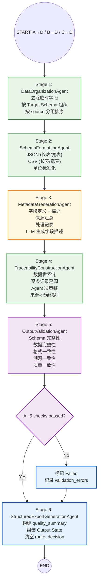

# Export SubGraph 设计报告 V1.0

> **版本**: V1.0 — 数据组织与结构化输出
> **设计原则**: 一个 Stage = 一个 Node = 一个 Agent
> **核心原则**: Export 是 Workflow 最终节点，**仅负责数据组织与输出，绝不修改数据内容。**
> **对应文件**: `Data_Export_agentV1/export_graph.py` + `agents/*.py` + `tools/export/*.py`

---

## 1. Agent 元信息

### 1.1 基本属性

| 属性 | 内容 |
|------|------|
| **Agent 名称** | Structured Export Agent |
| **SubGraph 名称** | Data_Export_agentV1 |
| **所属子图** | SubGraph 4 (数据清洗与质检) — 最终节点 |
| **版本** | V1.0 |
| **核心职责** | 对已完成规范化处理及冲突解决的数据进行统一组织与结构化输出，生成标准格式的数据文件、元数据、数据溯源信息及最终质量摘要 |
| **关键约束** | **仅负责数据组织与输出，绝不修改数据内容。** 不调用任何数据修改工具。 |
| **修改数据** | ❌ 否 — 只读数据，只写 Output State |

### 1.2 前后置条件

| 条件类型 | 条件 |
|---------|------|
| **前置条件 (A→D 路径)** | `report_state.quality` 已被 Assessment 填充且 `route_decision="Export"` |
|  | `data_state.current_data` 为通过 8 项检查的完美数据 |
| **前置条件 (B→D 路径)** | `report_state.normalization` 已被 Normalization 填充且 `route_decision="Export"` |
|  | `data_state.current_data` 为规范化且无冲突的数据 |
| **前置条件 (C→D 路径)** | `report_state.conflict` 已被 Conflict 填充且 `route_decision="Export"` |
|  | `data_state.current_data` 为冲突已解决的数据 |
|  | 或 `workflow_state.iteration_counter >= 3` (LoopController 强制 Export) |
| **后置条件** | `output_state` 包含完整的 `structured_data` / `metadata` / `traceability` / `quality_summary` |
|  | `workflow_state.route_decision` 为空 (Workflow 终点) |
|  | `workflow_state.execution_status` = "Success" (或 "Failed" → HumanReview) |

### 1.3 上下游关系

```
上游 (三路汇聚):
  Assessment SubGraph (Data_Assessment_agentV1)
    → A→D: 完美数据直接导出 (No Issue)
  Normalization SubGraph (Data_Normalization_agentV1)
    → B→D: 规范化完成且无冲突
  Conflict Resolution SubGraph (Data_Conflict_agentV1)
    → C→D: 冲突已解决, 或 LoopController 强制终止

下游:
  无 (Workflow 终点)
  → 前端展示 / 分析工具 / 数据库 / CSV/JSON 文件
```

### 1.4 在总图中的位置

```
Assessment → Router ──→ ExportGraph → END
Normalization → Router ──→ ExportGraph → END
Conflict → Router ──→ ExportGraph → END
```

---

## 2. 输入输出规范

### 2.1 读取的 State

| State 路径 | 类型 | 必读 | 用途 |
|-----------|------|------|------|
| `data_state.current_data` | `dict` | ✅ | 最终处理完成的数据 (sources + records) |
| `data_state.input_data` | `dict` | ✅ | 原始输入数据 (对比溯源) |
| `data_state.data_trace` | `list[TraceRecord]` | ✅ | 数据处理全链路轨迹 |
| `report_state.quality` | `dict` | ✅ | Quality Report (profile / scoring / per_source_routes) |
| `report_state.quality.profile` | `dict` | ✅ | 数据画像 (semantic_types / distributions / schema_summary) |
| `report_state.quality.quality_scoring` | `dict` | ✅ | 质量评分 (overall_score / quality_level / calibrated_confidence) |
| `report_state.quality.sources[sid]` | `dict` | ✅ | per-source 评估 (completeness / consistency / format / source_reliability) |
| `report_state.quality.assessment_summary` | `str` | ❌ | LLM 生成的评估摘要 |
| `report_state.normalization` | `dict` | ❌ | Normalization Report (modifications / tool_registry / validation) |
| `report_state.normalization.modifications` | `dict` | ❌ | 规范化修改记录 (total / by_layer / per_source / errors) |
| `report_state.normalization.normalization_summary` | `str` | ❌ | 规范化摘要 |
| `report_state.conflict` | `dict` | ❌ | Conflict Report (identification / classification / evidence / reasoning / confidence / resolution_report) |
| `report_state.conflict.resolution_report` | `dict` | ❌ | 冲突裁决报告 (status / resolution_plan / per_conflict / summary) |
| `context_state.target_schema` | `dict` | ✅ | 目标 Schema (字段定义 / 标准单位) |
| `context_state.research_domain` | `str` | ✅ | 领域名 |
| `workflow_state.run_id` | `str` | ✅ | Workflow 唯一 ID |
| `workflow_state.iteration_counter` | `int` | ✅ | B⇄C 循环次数 |
| `workflow_state.llm_call_count` | `int` | ✅ | LLM 调用统计 |
| `workflow_state.tool_call_count` | `int` | ✅ | Tool 调用统计 |
| `workflow_state.workflow_history` | `list` | ✅ | 全链路处理记录 |

### 2.2 写入的 State

| State 路径 | 类型 | 写入者 | 内容 |
|-----------|------|--------|------|
| `output_state.structured_data` | `dict` | Stage 2 | 最终结构化数据 (json / csv / csv_wide / row_count / column_count) |
| `output_state.metadata` | `dict` | Stage 3 | 数据说明 (字段定义 / 单位 / 来源 / 处理记录) |
| `output_state.traceability` | `dict` | Stage 4 | 完整数据溯源链 (原始→提取→清洗→导出) |
| `output_state.quality_summary` | `dict` | Stage 5 | 质量摘要 (评分 / 置信度 / 处理统计 / 风险提示) |
| `output_state.schema_version` | `str` | Stage 2 | 输出 Schema 版本 |
| `output_state.export_format` | `str` | Stage 2 | 导出格式 (json / csv) |
| `workflow_state.route_decision` | `str` | Stage 6 | "" (终点) |
| `workflow_state.execution_status` | `str` | Stage 5 | "Success" / "Failed" |

### 2.3 输入数据示例 (来自 Normalization, B→D 路径)

```json
{
  "data_state": {
    "current_data": {
      "sources": [
        {"source_id": "doi_paper1", "doi": "10.1016/j.msea.2024.001",
         "title": "High-temperature tensile of Al-7075 alloy", "year": 2024,
         "journal": "Materials Science and Engineering: A", "authors": ["Zhang, W."]},
        {"source_id": "doi_paper2", "doi": "10.1007/s11661.002",
         "title": "Aging effect on Al-Zn-Mg-Cu alloy", "year": 2023,
         "journal": "Metallurgical and Materials Transactions A", "authors": ["Wang, X."]}
      ],
      "records": [
        {"record_id": "p1_ys_1", "source_id": "doi_paper1", "field_name": "yield_strength",
         "field_value": 450.0, "field_unit": "MPa", "provenance": {"page": 3, "bbox": [120,340,280,355]}},
        {"record_id": "p1_uts_1", "source_id": "doi_paper1", "field_name": "tensile_strength",
         "field_value": 520.0, "field_unit": "MPa", "provenance": {"page": 3, "bbox": [120,356,280,371]}},
        {"record_id": "p2_ys_1", "source_id": "doi_paper2", "field_name": "yield_strength",
         "field_value": 438.0, "field_unit": "MPa", "provenance": {"page": 5, "bbox": [90,420,250,435]}}
      ]
    },
    "data_trace": [
      {"field": "yield_strength", "before": 0.438, "after": 438.0,
       "agent": "NormalizationAgent", "tool": "unit_converter",
       "reason": "Standard Unit Conversion (GPa→MPa)", "confidence": 1.0}
    ]
  },
  "report_state": {
    "quality": {
      "profile": {"semantic_types": {"yield_strength": {"semantic_type": "mechanical_stress"}}},
      "quality_scoring": {"overall_score": 0.90, "quality_level": "good", "calibrated_confidence": 0.78},
      "assessment_summary": "5 sources assessed. 3 need normalization, 1 clean, 1 conflict."
    },
    "normalization": {
      "normalization_status": "Completed",
      "modifications": {"total": 8, "by_layer": {"base": 6, "adapted": 2, "generated": 0}},
      "normalization_summary": "Normalization Completed: 8 modifications (6 base + 2 adapted), 0 remaining issues"
    }
  },
  "context_state": {
    "research_domain": "materials_science",
    "target_schema": {"fields": [
      {"name": "yield_strength", "standard_unit": "MPa", "criticality": "critical"},
      {"name": "tensile_strength", "standard_unit": "MPa", "criticality": "critical"}
    ]}
  }
}
```

### 2.4 输出数据示例 (Output State)

```json
{
  "output_state": {
    "schema_version": "grounded_data_v1",
    "export_format": "json",
    "structured_data": {
      "row_count": 21,
      "column_count": 6,
      "json": {
        "sources": [...],
        "records": [...]
      },
      "csv": "source_id,field_name,field_value,field_unit,page,bbox\n...",
      "csv_wide": {
        "source_id": ["doi_paper1", "doi_paper2", ...],
        "yield_strength": [450.0, 438.0, ...],
        "yield_strength_unit": ["MPa", "MPa", ...],
        ...
      }
    },
    "metadata": {
      "generated_at": "2026-07-13T12:00:00",
      "run_id": "uuid-xxx",
      "research_domain": "materials_science",
      "field_definitions": {
        "yield_strength": {"standard_unit": "MPa", "semantic_type": "mechanical_stress",
                           "description": "Yield strength — stress at which plastic deformation begins"},
        "tensile_strength": {"standard_unit": "MPa", "semantic_type": "tensile_strength",
                             "description": "Ultimate tensile strength — maximum stress before fracture"}
      },
      "processing_record": {
        "assessment": {"status": "Completed", "5_sources_assessed": true},
        "normalization": {"status": "Completed", "8_modifications": true, "tools_used": ["unit_converter", "schema_mapping", "field_standardizer"]},
        "conflict": null
      },
      "source_summary": {
        "total_sources": 5,
        "sources_exported": 4,
        "sources_human_review": 1
      }
    },
    "traceability": {
      "data_lineage": {
        "input": {"sources": 5, "records": 23, "grounded_data_version": "grounded_data_v1"},
        "processing": [
          {"stage": "assessment", "agent": "QualityAssessmentAgent", "duration_s": 167.0, "tool_calls": 5},
          {"stage": "normalization", "agent": "ToolExecutorAgent", "tool": "unit_converter", "field": "yield_strength", "change": "0.438 GPa → 438 MPa"},
          {"stage": "normalization", "agent": "ToolExecutorAgent", "tool": "schema_mapping", "field": "σ_y", "change": "σ_y → yield_strength"}
        ],
        "output": {"sources": 5, "records": 21, "standard_compliant": true}
      },
      "per_record_trace": {
        "p1_ys_1": {"original_value": 450, "final_value": 450, "modified": false, "stages": ["assessment"]},
        "p2_ys_1": {"original_value": 0.438, "final_value": 438.0, "modified": true,
                     "modifications": [{"stage": "normalization", "tool": "unit_converter", "from": "GPa", "to": "MPa"}]}
      }
    },
    "quality_summary": {
      "overall_score": 0.90,
      "quality_level": "good",
      "calibrated_confidence": 0.78,
      "confidence_breakdown": {"data_volume": 0.7, "agreement": 0.85, "sparsity": 0.70},
      "processing_statistics": {
        "total_llm_calls": 6,
        "total_tool_calls": 18,
        "total_elapsed_seconds": 220.0,
        "b_c_loop_iterations": 0
      },
      "issues_summary": {
        "assessment_issues": 2,
        "normalization_modifications": 8,
        "conflicts_resolved": 0,
        "remaining_issues": 0
      },
      "risk_indicators": {
        "has_human_review_items": false,
        "has_unresolved_conflicts": false,
        "has_unconverted_units": false,
        "data_completeness_warning": false
      },
      "recommendation": "Data ready for analysis. Quality level: good. No significant risks detected."
    }
  },
  "workflow_state": {
    "route_decision": "",
    "execution_status": "Success"
  }
}
```

---

## 3. 内部 Node 拆分概览

```
ExportGraph (6 Stage Nodes)
│
├── Stage 1: DataOrganizationAgent          (0 LLM, 1 Tool)
│       去除中间字段, 按 Target Schema 组织数据结构
│
├── Stage 2: SchemaFormattingAgent          (0 LLM, 2 Tools)
│       转换为 CSV / JSON / Wide-Table 等统一格式
│
├── Stage 3: MetadataGenerationAgent        (0 LLM, 1 Tool, 1 LLM摘要)
│       生成字段说明/单位/来源/处理记录等元信息
│
├── Stage 4: TraceabilityConstructionAgent  (0 LLM, 1 Tool)
│       构建完整数据溯源链 (原始→提取→清洗→导出)
│
├── Stage 5: OutputValidationAgent          (0 LLM, 1 Tool)
│       校验 Schema/字段/格式完整性
│
└── Stage 6: StructuredExportGenerationAgent (0 LLM, 0 Tools)
       组装 Output State, 完成 Workflow
│
▼
output_state.{structured_data, metadata, traceability, quality_summary}
→ END
```

---

## 4. Stage 1: DataOrganizationAgent — 数据组织

**职责**: 去除 Workflow 中间产生的临时字段，根据 Target Schema 组织最终数据结构。
**LLM**: 无 | **Tools**: 1 | **文件**: `agents/data_organization_agent.py`

### 4.1 处理流程

```
逻辑:
  1. 从 data_state.current_data 读取最终数据
  2. 过滤临时字段:
     从 records 中移除内部字段: _modified, _conflict_cache, _temp_score 等
     从 sources 中保留公开字段: source_id, doi, title, authors, year, journal
  3. 按 Target Schema 对齐字段名:
     只保留 target_schema.fields[*].name 中定义的字段
     标记 extra_fields (不在 Schema 中但存在于数据中)
  4. 按 source 分组排序:
     source 按 year DESC, title ASC 排序
     record 按 field_name, record_id 排序
  5. 构建组织后的数据结构:
     organized_data = {sources: [...], records: [...], field_index: {...}}
```

### 4.2 Tool 1: DataOrganizer

```
函数: organize_data(current_data, target_schema)

逻辑:
  Step 1 — 过滤临时字段:
    _TEMP_RECORD_FIELDS = {"_modified", "_conflict_cache", "_temp_score",
                            "_normalized", "_resolution_status"}
    for each record:
      if key not in _TEMP_RECORD_FIELDS → keep

  Step 2 — Schema 字段对齐:
    expected_fields = {f["name"] for f in target_schema.get("fields", [])}
    for each record:
      if record.field_name in expected_fields → keep as "standard"
      else → mark as "extra_field", 保留但加注

  Step 3 — Source 字段筛选:
    _PUBLIC_SOURCE_FIELDS = {"source_id", "doi", "title", "authors", "year",
                              "journal", "source_type", "access_path"}
    for each source:
      只保留 _PUBLIC_SOURCE_FIELDS 中的字段

  Step 4 — 排序:
    sources sorted by year DESC, then title ASC
    records sorted by source_id, then field_name, then record_id

  Step 5 — 构建 field_index:
    为快速检索构建 field_name → {records, sources, units} 索引
    field_index[field_name] = {
      record_count, source_count,
      values_by_source: {source_id: [values]},
      units_used: [unit, ...],
      standard_unit: ...
    }

输出: {
  organized_data: {sources, records, field_index},
  summary: {total_sources, total_records, standard_fields, extra_fields,
            records_filtered, sources_trimmed}
}
```

---

## 5. Stage 2: SchemaFormattingAgent — Schema 格式转换

**职责**: 按照目标 Schema 将数据转换为多种统一格式 (JSON table / CSV / Wide-Table)。
**LLM**: 无 | **Tools**: 2 | **文件**: `agents/schema_formatting_agent.py`

### 5.1 Tool 2: JSON/CSV Exporter

```
函数: export_formats(organized_data, format_config=None)

逻辑:
  Step 1 — JSON (标准表格式):
    {
      "records": [
        {source_id, field_name, field_value, field_unit, page, bbox, extraction_method}
      ],
      "sources": [{source_id, doi, title, authors, year, journal}]
    }
    这是与 grounded_data 格式兼容的长表格式。

  Step 2 — CSV (长表):
    列: source_id, field_name, field_value, field_unit, page, bbox
    每行一条 record
    header 行对应 target_schema 字段顺序

  Step 3 — CSV (宽表, Pivot):
    行 = source_id
    列 = field_name + _unit 后缀
    单元格 = field_value
    例:
      source_id | yield_strength | yield_strength_unit | tensile_strength | tensile_strength_unit
      doi_A     | 450            | MPa                 | 520              | MPa
      doi_B     | 438            | MPa                 | 505              | MPa

  Step 4 — JSON (Wide):
    同 CSV 宽表, 但以 JSON 格式输出:
    {
      "source_id": ["doi_A", "doi_B"],
      "yield_strength": [450, 438],
      "yield_strength_unit": ["MPa", "MPa"],
      ...
    }

  Step 5 — 统计:
    row_count = len(records)
    column_count = len(field_index) + 1  (source_id + fields)

输出: {
  json: dict,
  csv: str,
  csv_wide: str,
  json_wide: dict,
  row_count: int,
  column_count: int,
}
```

### 5.2 Tool 3: SchemaFormatter

```
函数: format_to_schema(exported, target_schema)

逻辑:
  Step 1 — 列重排序:
    按 target_schema.fields[*].name 的顺序排列列

  Step 2 — 单位标准化:
    确保所有数值都有 field_unit
    与 standard_unit 一致的 → 保留
    不一致的 → 标记 "unit_mismatch" (应已被 Normalization 处理)

  Step 3 — 值格式化:
    数值: 保留原始精度, 最多 6 位小数
    字符串: trim 空白
    空值: 统一为 null (JSON) / "" (CSV)

  Step 4 — Schema 版本标记:
    写入 output_state.schema_version = "grounded_data_v1"
    写入 output_state.export_format = "json" (default)

输出: {
  structured_data: {json, csv, csv_wide, json_wide, row_count, column_count},
  format_issues: [...]  任何格式不一致
}
```

---

## 6. Stage 3: MetadataGenerationAgent — 元数据生成

**职责**: 生成数据元信息，包括字段说明、单位信息、数据来源、处理记录。
**LLM**: 是 (1 次摘要生成) | **Tools**: 1 | **文件**: `agents/metadata_generation_agent.py`

### 6.1 Tool 4: MetadataGenerator

```
函数: generate_metadata(current_data, target_schema, report_state, context_state, run_id)

逻辑:
  1. Field Definitions (字段定义):
     从 target_schema + semantic_types 构建:
     {
       "yield_strength": {
         "standard_unit": "MPa",
         "semantic_type": "mechanical_stress",
         "criticality": "critical",
         "description": "Yield strength — stress at which 0.2% plastic deformation occurs"
       },
       ...
     }
     LLM 为每个字段生成 1 句自然语言描述 (基于 semantic_type)

  2. Source Summary (来源汇总):
     total_sources: 总来源数
     sources_exported: 成功导出的来源数
     sources_human_review: 需人工审核的来源数
     per_source: [{source_id, title, year, journal, record_count, quality_grade}]

  3. Processing Record (处理记录):
     记录每个模块的处理状态和关键指标:
     {
       "assessment": {
         "status": "Completed",
         "sources_assessed": 5,
         "overall_quality": "good",
         "tools_used": ["Profiling(8)", "QualityAssessment(5)", "QualityScoring", "DecisionReasoning"]
       },
       "normalization": {
         "status": "Completed",
         "modifications": 8,
         "by_layer": {"base": 6, "adapted": 2, "generated": 0},
         "tools_used": ["unit_converter", "schema_mapping", "field_standardizer", "duplicate_handler"]
       },
       "conflict": {
         "status": "Skipped",  // 或 Completed / Partially_Resolved
         "conflicts_analyzed": 0,
         "strategies_used": []
       }
     }

  4. 时间戳和运行信息:
     generated_at: ISO 8601
     run_id: UUID
     graph_version: "V2.1"
     total_elapsed_seconds: computed from workflow_history[-1].timestamp - workflow_history[0].timestamp

输出: {
  metadata: {field_definitions, source_summary, processing_record, run_info},
  field_descriptions_llm_generated: bool
}
```

### 6.2 LLM 字段描述生成

```
LLM 输入:
  Fields: [{name, semantic_type, standard_unit, criticality}]
  Domain: {research_domain}

Prompt:
  "For each scientific data field, generate a 1-sentence description
   suitable for a data catalog or metadata document.
   Include the standard unit and what the field measures.
   Domain: {research_domain}"

LLM 输出:
  {field_descriptions: {field_name: description_string, ...}}

Fallback:
  LLM 不可用 → 使用模板: "{field_name} ({semantic_type}), measured in {standard_unit}"
```

---

## 7. Stage 4: TraceabilityConstructionAgent — 溯源信息构建

**职责**: 构建完整数据溯源链，建立原始数据 → 提取 → 清洗 → 导出的全程追溯。
**LLM**: 无 | **Tools**: 1 | **文件**: `agents/traceability_construction_agent.py`

### 7.1 Tool 5: TraceabilityBuilder

```
函数: build_traceability(input_data, current_data, data_trace, report_state)

逻辑:
  1. Data Lineage (数据世系):
     input → processing stages → output 的完整链:
     {
       "input": {
         "sources": N, "records": M,
         "grounded_data_version": "grounded_data_v1",
         "received_at": workflow_state.created_at
       },
       "processing": [
         从 workflow_history 提取每个 Agent 的执行记录:
         {stage, agent, status, duration_s, reason, tool_calls?, llm_calls?}
       ],
       "output": {
         "sources": N', "records": M',
         "standard_compliant": bool,
         "generated_at": ISO8601
       }
     }

  2. Per-Record Trace (逐条记录溯源):
     基于 data_trace 构建每条记录的变更历史:
     {
       "p2_ys_1": {
         "original_value": 0.438,
         "original_unit": "GPa",
         "final_value": 438.0,
         "final_unit": "MPa",
         "modified": true,
         "modifications": [
           {stage, tool, before, after, reason, confidence, timestamp}
         ]
       },
       "p1_ys_1": {
         "original_value": 450,
         "final_value": 450,
         "modified": false,
         "modifications": []
       }
     }

     对于未经修改的记录, 标记 modified=false

  3. Agent Decision Trail (Agent 决策链):
     从 workflow_history 和 report_state 提取关键决策点:
     [
       {node: "Assessment.Decision", decision: "Normalization",
        reason: "alias_fields: ['YS','UTS']", timestamp: ...},
       {node: "Normalization.Validation", decision: "Export",
        reason: "All validations passed", timestamp: ...},
       {node: "Conflict.Identification", decision: "Skipped",
        reason: "No conflicts detected after normalization", timestamp: ...}
     ]

  4. Source-Record Mapping (来源-记录映射):
     source_id → record_ids 的交叉索引, 用于快速定位某来源的所有数据

输出: {
  traceability: {data_lineage, per_record_trace, agent_decision_trail, source_record_map},
  trace_completeness: {records_with_trace, records_without_trace, modified_count, unmodified_count}
}
```

---

## 8. Stage 5: OutputValidationAgent — 输出一致性校验

**职责**: 校验输出结果是否满足 Target Schema、字段完整性及格式规范要求。
**LLM**: 无 | **Tools**: 1 | **文件**: `agents/output_validation_agent.py`

### 8.1 Tool 6: OutputValidator

```
函数: validate_output(organized_data, metadata, traceability, target_schema)

校验项 (5 维):

  1. Schema 完整性:
     ✓ 所有 target_schema.fields[*].name 都出现在 organized_data 中
     ✓ 无缺失关键字段
     ✓ 所有 record.field_name 都在 target_schema 中 (或标记为 extra)

  2. 数据完整性:
     ✓ 所有 record 都有 source_id (外键有效)
     ✓ 所有数值 record 都有 field_unit
     ✓ 所有 record 都有 provenance (page + bbox) 或标记 missing
     ✓ record_count == len(records)

  3. 格式一致性:
     ✓ 数值值为 int/float (无残留 "~value" 字符串)
     ✓ field_unit 与 standard_unit 一致 (无未转换单位)
     ✓ 无残留别名 (所有 field_name 都是标准名)
     ✓ record_id 符合格式: {source_id}_{field_name}_{n}

  4. Traceability 一致性:
     ✓ metadata.source_summary.total_sources == len(current_data.sources)
     ✓ traceability.data_lineage.output.records == len(organized_data.records)
     ✓ per_record_trace 覆盖所有 modified=true 的记录
     ✓ data_trace 的记录数与 modifications.total 一致

  5. Quality Summary 一致性:
     ✓ quality_summary.overall_score 与 quality.quality_scoring.overall_score 一致
     ✓ processing_statistics 与 workflow_state 中的统计一致

判决:
  5 维全部通过 → is_valid = True, execution_status = "Success"
  任意维度不通过 → is_valid = False, execution_status = "Failed"
    → 记录 validation_errors 列表, 详细描述每个不通过的检查项

输出: {
  is_valid: bool,
  checks: {schema, data_integrity, format_consistency, traceability_consistency, quality_consistency},
  validation_errors: [{dimension, field, expected, actual, severity}],
  summary: "All 5 checks passed" | "3/5 checks failed: [...]"
}
```

---

## 9. Stage 6: StructuredExportGenerationAgent — 最终输出生成

**职责**: 组装 Output State，完成 Workflow。
**LLM**: 否 (纯组装) | **Tools**: 0 | **文件**: `agents/export_generation_agent.py`

### 9.1 Quality Summary 构建

```
函数: build_quality_summary(report_state, workflow_state)

从各模块报告整合质量摘要:

  1. Overall Metrics:
     overall_score: quality.quality_scoring.overall_score
     quality_level: quality.quality_scoring.quality_level
     calibrated_confidence: quality.quality_scoring.calibrated_confidence
     confidence_breakdown: quality.quality_scoring.confidence_factors

  2. Processing Statistics:
     从 workflow_state 提取:
     total_llm_calls: workflow_state.llm_call_count
     total_tool_calls: workflow_state.tool_call_count
     total_elapsed_seconds: 从 workflow_history 计算
     b_c_loop_iterations: workflow_state.iteration_counter

  3. Issues Summary:
     assessment_issues: quality.total_issues
     normalization_modifications: normalization.modifications.total (or 0)
     conflicts_resolved: conflict.resolution_report.auto_resolved (or 0)
     remaining_issues: normalization.validation.remaining_issues 的数量 (or 0)

  4. Risk Indicators:
     has_human_review_items: conflict.resolution_report.human_required > 0
     has_unresolved_conflicts: 同上
     has_unconverted_units: normalization.modifications.errors 中有 unit 相关错误
     data_completeness_warning: 任何 source 的 completeness < 0.8

  5. Recommendation:
     基于风险指标生成建议:
     无风险 → "Data ready for analysis. Quality level: {level}."
     有风险 → "Data exported with {n} warnings. Review recommended for: {items}."
```

### 9.2 最终组装

```
函数: assemble_output_state(structured_data, metadata, traceability, quality_summary, state)

逻辑:
  output_state = {
    "structured_data": structured_data,
    "metadata": metadata,
    "traceability": traceability,
    "quality_summary": quality_summary,
    "schema_version": "grounded_data_v1",
    "export_format": structured_data.get("format", "json"),
  }

  # 清空路由 (Workflow 终点)
  workflow_state = {
    "route_decision": "",
    "execution_status": "Success" if validation_passed else "Failed",
    "current_node": "structured_export",
    "workflow_history": [new entry],
  }

返回: {output_state, workflow_state}
```

---

## 10. 执行流程

### 10.1 Mermaid 流程图



### 10.2 ExportGraph 伪代码

```python
"""
export_graph.py — Export SubGraph V1.0

架构: 一个 Stage = 一个 Agent
  START → DataOrganizationAgent → SchemaFormattingAgent
        → MetadataGenerationAgent → TraceabilityConstructionAgent
        → OutputValidationAgent → StructuredExportGenerationAgent → END

Graph 职责: 仅编排, 不调用 Tool/Prompt/LLM/Rule。
"""
from langgraph.graph import StateGraph, END
from quality_state import QualityGraphState

def build_export_graph() -> StateGraph:
    g = StateGraph(QualityGraphState)

    g.add_node("data_organization", data_organization_node)
    g.add_node("schema_formatting", schema_formatting_node)
    g.add_node("metadata_generation", metadata_generation_node)
    g.add_node("traceability_construction", traceability_construction_node)
    g.add_node("output_validation", output_validation_node)
    g.add_node("export_generation", export_generation_node)

    g.set_entry_point("data_organization")
    g.add_edge("data_organization", "schema_formatting")
    g.add_edge("schema_formatting", "metadata_generation")
    g.add_edge("metadata_generation", "traceability_construction")
    g.add_edge("traceability_construction", "output_validation")
    g.add_edge("output_validation", "export_generation")
    g.add_edge("export_generation", END)

    return g
```

### 10.3 Stage 1: DataOrganizationAgent 伪代码

```python
class DataOrganizationAgent:
    """Stage 1: 数据组织 — 过滤临时字段 + Schema 对齐 + 排序"""

    def run(self, state: QualityGraphState) -> dict:
        t0 = time.time()
        data = state["data_state"]["current_data"]
        target_schema = state["context_state"].get("target_schema", {})

        organized, summary = organize_data(data, target_schema)

        logger.info("[DataOrganization] %d records, %d sources → %d standard / %d extra fields",
                    summary["total_records"], summary["total_sources"],
                    len(summary["standard_fields"]), len(summary["extra_fields"]))

        return {
            "report_state": {"export": {"organized_data": organized,
                                         "organization_summary": summary}},
            "workflow_state": {"current_node": "data_organization",
                               "workflow_history": [_make_history("DataOrganizationAgent", "DataOrganization", "Success",
                                                                  f"Organized {summary['total_records']} records")]}
        }
```

### 10.4 Stage 3: MetadataGenerationAgent 伪代码

```python
class MetadataGenerationAgent:
    """Stage 3: 元数据生成 — 字段定义 + LLM 描述"""

    def run(self, state: QualityGraphState) -> dict:
        t0 = time.time()
        target_schema = state["context_state"].get("target_schema", {})
        research_domain = state["context_state"].get("research_domain", "default")
        report_state = state.get("report_state", {})
        wf = state.get("workflow_state", {})

        # 1. 确定性元数据 (Tool 4)
        metadata = generate_metadata(
            state["data_state"]["current_data"],
            target_schema, report_state,
            state["context_state"], wf.get("run_id", "")
        )

        # 2. LLM 字段描述
        llm_count = wf.get("llm_call_count", 0)
        try:
            fields_info = [
                {"name": f.get("name"), "semantic_type": f.get("semantic_type", ""),
                 "unit": f.get("standard_unit", ""), "criticality": f.get("criticality", "")}
                for f in target_schema.get("fields", [])
            ]
            llm = get_llm(temperature=0.0)
            resp = llm.invoke([{
                "role": "system",
                "content": f"You are a {research_domain} data cataloger..."
            }, {
                "role": "user",
                "content": f"Generate 1-sentence descriptions for these fields: {json.dumps(fields_info)}"
            }])
            # parse descriptions
            metadata["field_descriptions_llm"] = True
            llm_count += 1
        except Exception:
            metadata["field_descriptions_llm"] = False

        return {
            "report_state": {"export": {"metadata": metadata}},
            "workflow_state": {"current_node": "metadata_generation",
                               "llm_call_count": llm_count,
                               "workflow_history": [...]}
        }
```

### 10.5 Stage 6: StructuredExportGenerationAgent 伪代码

```python
class StructuredExportGenerationAgent:
    """Stage 6: 最终输出 — 组装 Output State + Quality Summary"""

    def run(self, state: QualityGraphState) -> dict:
        export = state.get("report_state", {}).get("export", {})
        structured_data = export.get("formatted_data", {})
        metadata = export.get("metadata", {})
        traceability = export.get("traceability", {})
        validation = export.get("validation", {})

        # 构建 Quality Summary
        quality_summary = build_quality_summary(
            state.get("report_state", {}),
            state.get("workflow_state", {})
        )

        is_valid = validation.get("is_valid", True)
        status = "Success" if is_valid else "Failed"

        return {
            "output_state": {
                "structured_data": structured_data,
                "metadata": metadata,
                "traceability": traceability,
                "quality_summary": quality_summary,
                "schema_version": "grounded_data_v1",
                "export_format": "json",
            },
            "workflow_state": {
                "route_decision": "",
                "execution_status": status,
                "current_node": "structured_export",
                "workflow_history": [_make_history("StructuredExportGenerationAgent", "ExportGeneration",
                                                    status, f"Export {'completed' if is_valid else 'failed'}")]
            }
        }
```

---

## 11. 决策逻辑

### 11.1 入口路径识别

```
根据哪个上游模块触发了 Export 来判断数据来源路径:

  if report_state.quality.route_decision == "Export" and not normalization and not conflict:
    → A→D: 完美数据, 来自 Assessment
  elif report_state.normalization exists:
    → B→D: 来自 Normalization
  elif report_state.conflict exists:
    → C→D: 来自 Conflict
  else:
    → 未知路径, 继续处理但标记警告
```

### 11.2 校验失败处理

```
OutputValidation 校验失败:

  is_valid = False:
    execution_status = "Failed"
    报告 validation_errors 详细列表

  Router 处理:
    "Failed" → graph.py Router: route_after_export → HumanReview
    人工审核 validation_errors 后决定:
      - Retry: 重新进入 ExportGraph (修复数据后)
      - Force Export: 忽略非关键警告, 强制输出
      - HumanReview: 保留当前状态, 等待手动修复
```

### 11.3 Quality Summary Risk Level

```
基于 risk_indicators 判定:

  ALL indicators false → risk = "none"
    建议: "Data ready for analysis."

  1-2 non-critical indicators → risk = "low"
    建议: "Data exported with minor warnings. Suitable for analysis."

  has_human_review_items or has_unresolved_conflicts → risk = "medium"
    建议: "Data exported with {n} unresolved items. Review before use."

  data_completeness_warning + has_unconverted_units → risk = "high"
    建议: "Data completeness compromised. Significant manual review required."
```

---

## 12. 异常处理

### 12.1 异常类型

| # | 异常类型 | 触发条件 | 处理策略 | Fallback |
|---|---------|---------|---------|---------|
| 1 | `EmptyData` | current_data.records 为空 | execution_status="Failed", 记录原因 | HumanReview |
| 2 | `SchemaMissing` | target_schema 为空或缺失 | 使用默认 schema (current_data 中的字段) | 警告输出 |
| 3 | `MetadataFailure` | LLM 字段描述生成失败 | 使用模板描述, 标记 llm_generated=false | 模板生成 |
| 4 | `TraceIncomplete` | data_trace 缺失或不完整 | 从 workflow_history 重建 trace | 部分溯源 |
| 5 | `ValidationError` | 校验 1-2 维不通过 | 标记 Failed + 错误详情 | HumanReview |
| 6 | `ValidationCritical` | 校验 3+ 维不通过 | execution_status="Failed" | HumanReview |
| 7 | `ExportFormatFailure` | CSV 或 JSON 序列化失败 | 尝试备选格式, 记录错误 | 仅输出 JSON |
| 8 | `OutputStateOverflow` | 输出数据过大 (>100MB) | 分片输出 + 警告 | 限制行数 |

### 12.2 Fallback 机制

```
Tool 级:
  - organize_data 失败 → 直接使用 current_data (跳过组织)
  - export_formats CSV 失败 → 仅输出 JSON
  - generate_metadata LLM 失败 → 模板描述
  - build_traceability 失败 → 从 workflow_history 重建

Graph 级:
  - execution_status="Failed" → Router → HumanReview
  - 保留完整的 partial_output (部分成功的结果)
```

---

## 13. 与总图的接口

### 13.1 Export 在总图中的位置

```python
# graph.py 中 Export 的接入方式:
from Data_Export_agentV1.export_graph import build_export_graph

# 添加节点
graph.add_node(NODE_EXPORT, build_export_graph().compile())

# 导出为最终节点
graph.add_edge(NODE_EXPORT, END)

# 路由: Assessment/Normalization/Conflict → Export
CONFLICT_ROUTE_MAP["Export"] = NODE_EXPORT
NORMALIZATION_ROUTE_MAP["Export"] = NODE_EXPORT
ASSESSMENT_ROUTE_MAP["Export"] = NODE_EXPORT
```

### 13.2 与其他模块的数据契约

```
Export 不修改 data_state.current_data — 这是核心契约。
Export 只读取并转换为 output_state。

下游消费者 (前端/分析工具) 应从 output_state 读取数据, 而不是 data_state。
```

---

## 14. 文件清单

```
Data_Export_agentV1/
├── EXPORT_DESIGN_REPORT.md          # 本报告 (V1.0)
├── __init__.py
├── export_graph.py                  # SubGraph 编排 (6 Stage, ~70 行)
└── agents/
    ├── __init__.py
    ├── data_organization_agent.py        # Stage 1: 数据组织
    ├── schema_formatting_agent.py        # Stage 2: Schema 格式转换
    ├── metadata_generation_agent.py      # Stage 3: 元数据生成 (1 LLM)
    ├── traceability_construction_agent.py # Stage 4: 溯源信息构建
    ├── output_validation_agent.py        # Stage 5: 输出校验
    └── export_generation_agent.py        # Stage 6: 最终输出组装

tools/export/
├── __init__.py
├── data_organizer.py                # Tool 1: 数据组织 + 临时字段过滤
├── format_exporter.py               # Tool 2: JSON/CSV/Wide 多格式导出
├── schema_formatter.py              # Tool 3: Schema 对齐 + 值格式化
├── metadata_generator.py            # Tool 4: 元数据生成
├── traceability_builder.py          # Tool 5: 溯源链构建
└── output_validator.py              # Tool 6: 5 维输出校验
```

---

## 15. 后续优化方向

| 方向 | 说明 | 优先级 |
|------|------|--------|
| **Excel/XLSX Export** | 支持带格式的 Excel 输出 (多 Sheet: Data + Metadata + Traceability) | 高 |
| **Streaming Export** | 大型数据集 (>100k records) 的流式导出, 避免内存溢出 | 中 |
| **Export Config UI** | 前端可选择导出格式、字段筛选、排序方式 | 中 |
| **DOI Registration** | 自动注册输出的数据集 DOI (与 DataCite 集成) | 低 |
| **Schema Evolution** | 当 target_schema 升级时, 自动迁移已有数据的字段定义 | 低 |
| **Incremental Export** | 增量导出: 仅输出自上次导出后变更的数据 | 低 |
| **Multi-Language Metadata** | 支持中/英文双语元数据生成 | 低 |
