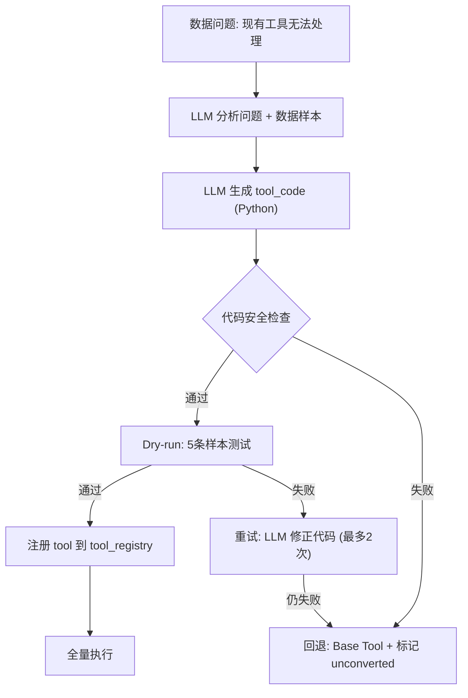
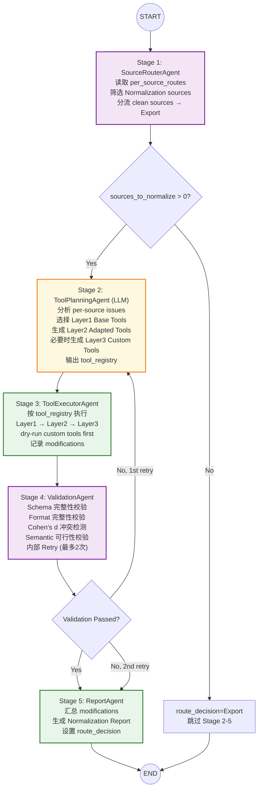

# Normalization SubGraph 设计报告 V2.0

> **版本**: V2.0 — LLM 动态 Tool 生成 + 自适应规范化  
> **设计原则**: 一个 Stage = 一个 Node = 一个 Agent  
> **核心创新**: LLM 根据数据问题自动编写/适配规范化工具函数，不再依赖固定 Tool 集  
> **对应文件**: `Data_Normalization_agentV1/normalization_graph.py` + `agents/*.py`

---

## 1. Agent 元信息

### 1.1 基本属性

| 属性 | 内容 |
|------|------|
| **Agent 名称** | Data Normalization Agent |
| **SubGraph 名称** | Data_Normalization_agentV1 |
| **所属子图** | SubGraph 4 (数据清洗与质检) |
| **版本** | V2.0 |
| **核心职责** | 根据 Quality Report 或 Conflict Report，对科学数据执行规范化处理，使数据符合目标 Schema |
| **关键约束** | **负责修改数据**，不负责判断数据质量或解决复杂冲突 |
| **修改数据** | ✅ 是 (唯一有权修改数据的 Agent) |

### 1.2 前后置条件

| 条件类型 | 条件 |
|---------|------|
| **前置条件** | `report_state.quality` 已被 Assessment 填充 |
|  | `report_state.quality.per_source_routes` 包含标记为 "Normalization" 的 sources |
|  | `data_state.current_data` 包含待处理数据 |
|  | 或 `report_state.conflict` 已被 Conflict Resolution 填充 (双源路径) |
| **后置条件** | `data_state.current_data` 已更新为规范化后的数据 |
|  | `report_state.normalization` 包含完整 Normalization Report |
|  | `workflow_state.route_decision` 已设置为 "Conflict" 或 "Export" |

### 1.3 上下游关系

```
上游:
  Assessment SubGraph (Data_Assessment_agentV1)
    → 产出 per_source_routes + Quality Report + conditional_routes
  Conflict Resolution SubGraph (待实现)
    → 产出 Conflict Resolution Report (全量规范化触发)

下游:
  Conflict Resolution SubGraph (B⇄C 循环)
    → 接收 needs_conflict_analysis=True 的数据
  Export SubGraph
    → 接收 route_decision="Export" 的数据
```

### 1.4 在总图中的位置

```
AssessmentGraph → Router → NormalizationGraph → LoopController → Router
                              ↑                        ↓
                              └── ConflictGraph ←───────┘ (B⇄C 循环, 最多3次)
```

---

## 2. 输入输出规范

### 2.1 读取的 State

| State 路径 | 类型 | 必读 | 用途 |
|-----------|------|------|------|
| `report_state.quality.sources[sid]` | `dict` | ✅ | per-source 评估结果 (completeness/consistency/format/conflict_risk) |
| `report_state.quality.per_source_routes` | `dict[str,str]` | ✅ | 筛选标记为 "Normalization" 的 sources |
| `report_state.quality.conditional_routes` | `list[dict]` | ✅ | per-source 条件修复指令 `[{condition, route, reason}]` |
| `report_state.quality.profile` | `dict` | ✅ | semantic_types (指导 unit_conversion), schema_summary (指导 schema_mapping) |
| `report_state.quality.quality_scoring` | `dict` | ❌ | 聚合评分 (参考) |
| `report_state.conflict` | `dict` | ❌ | Conflict Report (触发全量规范化) |
| `data_state.current_data` | `dict` | ✅ | 待规范化数据 (sources + records) |
| `context_state.target_schema` | `dict` | ✅ | 目标 Schema (字段定义/标准单位) |
| `context_state.quality_rules` | `dict` | ✅ | 质量规则 (阈值/策略) |
| `context_state.research_domain` | `str` | ❌ | 领域名 (材料科学/天体物理...) |

### 2.2 写入的 State

| State 路径 | 类型 | 写入者 | 内容 |
|-----------|------|--------|------|
| `data_state.current_data` | `dict` | Stage 3: ToolExecutorAgent | 规范化后的数据 |
| `report_state.normalization.source_plan` | `dict` | Stage 1 | 来源分流结果 |
| `report_state.normalization.tool_registry` | `dict` | Stage 2 | LLM 生成/选择的工具注册表 |
| `report_state.normalization.modifications` | `dict` | Stage 3 | 修改日志 (per-source + by_type) |
| `report_state.normalization.validation` | `dict` | Stage 4 | 校验结果 |
| `report_state.normalization.*` | `dict` | Stage 5 | 完整 Normalization Report |
| `workflow_state.route_decision` | `str` | Stage 4 | "Conflict" 或 "Export" |
| `workflow_state.execution_status` | `str` | 各 Stage | Success / Retry / Failed |
| `workflow_state.tool_call_count` | `int` | Stage 3 | 工具调用累加 |
| `workflow_state.llm_call_count` | `int` | Stage 1,2,4 | LLM 调用累加 |

### 2.3 输入数据示例 (来自 Assessment)

```json
{
  "report_state": {
    "quality": {
      "per_source_routes": {
        "10.1016/j.msea.2024.001": "Normalization",
        "10.1007/s11661-2023.002": "Normalization",
        "10.1007/s11661-2024.005": "Export"
      },
      "conditional_routes": [
        {
          "source_id": "10.1016/j.msea.2024.001",
          "primary_route": "Normalization",
          "conditions": [
            {"condition": "alias_fields", "route": "Normalization",
             "reason": "YS/UTS/EL need mapping to standard names"},
            {"condition": "format_issues", "route": "Normalization",
             "reason": "~520 needs numeric cleaning"}
          ]
        }
      ],
      "sources": {
        "10.1016/j.msea.2024.001": {
          "completeness": {"score": 0.97, "records_missing_unit": 0},
          "consistency": {"unit_consistency": {}},
          "format": {"total_issues": 1},
          "conflict_risk": {"has_conflicts": false, "conflict_count": 0}
        }
      }
    }
  }
}
```

### 2.4 输出数据示例 (Normalization Report)

```json
{
  "report_state": {
    "normalization": {
      "normalization_status": "Completed_With_Issues",
      "route_decision": "Export",
      "tool_registry": {
        "generated_tools": ["custom_unit_fixer_paper2", "custom_alias_mapper_paper1"],
        "adapted_tools": ["schema_mapping", "field_standardizer"],
        "base_tools": ["missing_value_handler", "duplicate_handler"]
      },
      "modifications": {
        "total": 12,
        "by_type": {"schema_mappings": 4, "field_std": 3, "unit_conv": 2, "custom": 3},
        "per_source": {"paper1": {"total": 7, "tools": ["custom_alias_mapper_paper1", "field_standardizer"]}}
      },
      "validation": {"is_valid": false, "remaining_issues": ["material field still missing"]}
    }
  }
}
```

---

## 3. 工具清单 — LLM 动态 Tool 体系 (V2.0 核心创新)

### 3.1 工具分层架构

```
┌─────────────────────────────────────────────────────┐
│  Layer 3: LLM-Generated Tools (V2.0 新增)           │
│  LLM 根据数据问题动态编写 Python 函数                │
│  例: custom_unit_fixer_paper2.py                    │
│       custom_outlier_remover_paper3.py               │
│       custom_field_merger_paper4.py                  │
├─────────────────────────────────────────────────────┤
│  Layer 2: LLM-Adapted Tools (V2.0 新增)             │
│  LLM 修改现有 Tool 的参数/阈值/逻辑                  │
│  例: schema_mapping + 额外别名规则                   │
│       unit_converter + 自动推断目标单位               │
│       field_standardizer + per-field 清洗规则         │
├─────────────────────────────────────────────────────┤
│  Layer 1: Base Tools (V1.1, 固定)                   │
│  确定性工具, 处理最通用的情况                         │
│  schema_mapping / field_standardizer / unit_converter│
│  missing_value_handler / duplicate_handler           │
│  format_standardizer                                 │
└─────────────────────────────────────────────────────┘
```

### 3.2 Layer 1: Base Tools (6 个固定工具)

#### T1: schema_mapping
```
函数: map_to_target_schema(records, field_mappings, target_schema)
输入: records, field_mappings (from LLM Planning), target_schema
处理:
  1. 加载 target_schema.fields[*].aliases → 别名映射表
  2. for rec in records:
       if rec.field_name in aliases:
         rec.field_name = aliases[rec.field_name]
  3. 记录映射: {record_id, original, mapped}
输出: 更新后的 records + mapping_log
```

#### T2: field_standardizer
```
函数: standardize_field_values(records, custom_rules=None)
输入: records, 可选的 per-field 自定义规则
处理:
  1. 数值前缀清理: re.sub(r'^[~≈<>≤≥]+\s*', '', str_value)
  2. 数值后缀清理: re.sub(r'\s*\((typical|approx|max|min)\)\s*$', '', str_value)
  3. 字符串值: trim + lowercase + 下划线替换
  4. 类型转换: str→float/int (如果可以)
  custom_rules 可覆盖默认逻辑 (Layer 2 注入)
输出: 更新后的 records + modification_log
```

#### T3: unit_converter
```
函数: convert_units(records, unit_conversions, semantic_types)
输入: records, unit_conversions (from config + LLM), semantic_types
处理:
  1. 从 configs/schema_mapping.yaml 加载 unit_conversions
  2. 从 semantic_types 推断目标单位
  3. for rec in records:
       factor = conversion_map[current_unit]
       if offset conversion:  value = apply_offset(value, factor)
       else:                  value = value * factor
  4. 无法转换 → unconverted (标记, 不报错)
输出: 更新后的 records + conversion_log + unconverted
```

#### T4: missing_value_handler
```
函数: handle_missing_values(records, strategy="mark", fill_value=None)
策略: mark (仅标记) / drop (删除) / fill_default (填充)
输出: 更新后的 records + handled_count
```

#### T5: duplicate_handler
```
函数: handle_duplicates(records)
处理:
  1. 精确去重 (record_id)
  2. 语义去重 (source_id + field_name + field_value)
  3. 过滤 resolution_status=="rejected" 的记录
输出: 更新后的 records + removed_count
```

#### T6: format_standardizer
```
函数: standardize_format(records)
处理: 数值去尾随零、字符串 trim、日期 ISO 化
输出: 更新后的 records + format_log
```

### 3.3 Layer 2: LLM-Adapted Tools (V2.0 新增)

**核心机制**: LLM 不是从头生成代码，而是**给 Base Tool 注入自定义参数/规则**。

```
LLM 输入:
  - Assessment Report (specific issues per source)
  - Base Tool 的 source code (供参考)
  - Schema mapping config (现有别名规则)
  - Semantic types (物理量类型 + feasible ranges)

LLM 输出 (JSON):
  {
    "tool_name": "schema_mapping",
    "adaptation": "add_custom_aliases",
    "custom_params": {
      "extra_aliases": {"TS": "tensile_strength", "YS": "yield_strength",
                         "σ_y": "yield_strength", "σ_uts": "tensile_strength",
                         "EL": "elongation", "test_temperature": "temperature"}
    },
    "reasoning": "These aliases are not in the static config but appear in the current dataset"
  }
```

**适应类型**:

| 适应类型 | 目标 Tool | 示例 |
|---------|----------|------|
| `add_custom_aliases` | schema_mapping | 数据集特有的别名不在 config 中 |
| `add_custom_units` | unit_converter | 数据中的单位不在规则库中 |
| `override_strategy` | missing_value_handler | mark → drop (当完整度太差) |
| `add_field_rules` | field_standardizer | per-field 特殊清洗规则 |
| `skip_tool` | 任意 | 某 source 无需此操作 |

### 3.4 Layer 3: LLM-Generated Tools (V2.0 核心创新)

**核心机制**: 当 Base + Adapted Tools 仍无法处理特定问题时，LLM **动态生成新的 Python 函数**。

```
LLM 输入:
  1. 数据问题的自然语言描述
     例: "Paper 2 的 tensile_strength 是 0.505 GPa, 需要转为 MPa(×1000),
          但 hardness 也是 185 GPa—而硬度 GPa 需要查表转换, 不能简单 ×1000"
  2. 相关 records 的前 5 条 (作为 sample)
  3. 可用的 Base Tools 列表 (供 LLM 调用, 不重复造轮子)
  4. 约束: 生成的函数签名必须是 def tool(records: list[dict]) -> dict

LLM 输出 (JSON):
  {
    "tool_name": "custom_hardness_gpa_to_hv",
    "tool_code": "def custom_hardness_gpa_to_hv(records):\n    ...",
    "test_input": [...],
    "expected_output": [...],
    "confidence": 0.85,
    "reasoning": "GPa hardness → HV requires ~×100 factor (approximate), not ×1000 like strength"
  }
```

**安全约束**:
1. 生成的代码在 **sandbox 环境**中执行 (restricted globals, no os/sys/network)
2. 先对 5 条 sample 数据 **dry-run 测试** → 通过后才全量执行
3. 生成的 tool 有 **TTL** (本次 Workflow 结束后销毁)
4. 每个 tool 有 **confidence score** → <0.7 时标记为 "需人工审核"
5. 生成失败 → 回退到 Base Tool 或标记 unconverted

**生成流程**:



---

## 4. 执行流程

### 4.1 Mermaid 流程图



### 4.2 Stage 1: SourceRouterAgent — 伪代码

```python
class SourceRouterAgent:
    def run(self, state):
        # 1. 读取上游数据
        quality = state["report_state"]["quality"]
        per_source_routes = quality["per_source_routes"]
        conditional_routes = quality.get("conditional_routes", [])
        conflict = state["report_state"].get("conflict")

        # 2. 确定触发源
        trigger = "conflict_report" if conflict else "quality_report"

        # 3. 筛选 Normalization sources
        sources_to_process = {}
        for sid, route in per_source_routes.items():
            if route == "Normalization":
                # 提取 per-source conditions
                conditions = [
                    cr["conditions"] for cr in conditional_routes
                    if cr["source_id"] == sid
                ]
                sources_to_process[sid] = {
                    "record_count": get_record_count(sid),
                    "conditions": conditions,
                    "needs_full_normalization": (trigger == "conflict_report"),
                }

        # 4. 无条件 → 直接 Export
        if not sources_to_process:
            return {"workflow_state": {"route_decision": "Export", ...}}

        # 5. 写入 source_plan
        return {"report_state": {"normalization": {"source_plan": {
            "trigger_source": trigger,
            "sources_to_normalize": sources_to_process,
            "total_to_normalize": len(sources_to_process),
        }}}}
```

### 4.3 Stage 2: ToolPlanningAgent — 伪代码 (V2.0 LLM 动态生成)

```python
class ToolPlanningAgent:
    def run(self, state):
        source_plan = state["report_state"]["normalization"]["source_plan"]
        quality = state["report_state"]["quality"]
        profile = quality.get("profile", {})

        tool_registry = {"base_tools": [], "adapted_tools": [], "generated_tools": []}

        for sid, src_info in source_plan["sources_to_normalize"].items():
            # ── Step 1: 选择 Layer 1 Base Tools ──
            base_tasks = self._select_base_tools(src_info["conditions"])
            tool_registry["base_tools"].extend(base_tasks)

            # ── Step 2: LLM 生成 Layer 2 Adaptations ──
            src_quality = quality["sources"].get(sid, {})
            adaptations = self._llm_plan_adaptations(
                sid, src_quality, profile, base_tasks
            )
            tool_registry["adapted_tools"].extend(adaptations)

            # ── Step 3: LLM 生成 Layer 3 Custom Tools (如需要) ──
            unresolved = self._find_unresolved_issues(sid, src_quality, base_tasks, adaptations)
            if unresolved:
                custom_tools = self._llm_generate_custom_tools(
                    sid, unresolved, state["data_state"]["current_data"]
                )
                tool_registry["generated_tools"].extend(custom_tools)

        return {"report_state": {"normalization": {"tool_registry": tool_registry}}}

    def _llm_generate_custom_tools(self, sid, unresolved, data):
        """LLM 生成自定义 Python 工具函数"""
        # 1. 构建 Prompt: 问题描述 + 数据样本 + Base Tool 参考
        prompt = f"""
        Data issue: {unresolved}
        Sample records (first 5): {get_sample_records(sid, data)[:5]}
        Available tools: {list_available_tools()}

        Generate a Python function to fix this specific issue.
        Function signature: def custom_tool(records: list[dict]) -> dict
        The function must:
        - Return {{"data": updated_records, "log": [...]}}
        - Handle edge cases (empty input, unexpected values)
        - Not import os/sys/subprocess/network modules
        - Fit in <100 lines
        """

        # 2. LLM → structured output
        llm_response = llm.invoke(prompt)

        # 3. Parse & validate
        tool_code = llm_response["tool_code"]
        tool_name = llm_response["tool_name"]

        # 4. Safety check
        if not is_safe_code(tool_code):
            return None  # fallback to base tools

        # 5. Dry-run on 5 samples
        test_records = get_sample_records(sid, data)[:5]
        try:
            exec(tool_code, sandbox_globals)
            result = sandbox_globals[tool_name](test_records)
            if not validate_result(result):
                return None  # retry or fallback
        except Exception:
            return None

        # 6. Register
        return [{"tool_name": tool_name, "tool_code": tool_code,
                 "confidence": llm_response["confidence"],
                 "source_id": sid, "layer": "generated"}]
```

### 4.4 Stage 3: ToolExecutorAgent — 伪代码

```python
class ToolExecutorAgent:
    def run(self, state):
        data = state["data_state"]["current_data"]
        registry = state["report_state"]["normalization"]["tool_registry"]
        modifications = {"base": [], "adapted": [], "generated": [], "errors": []}

        for sid in registry["sources"]:
            records = get_source_records(data, sid)

            # 1. Execute Layer 1: Base Tools
            for tool_name in registry["base_tools"]:
                try:
                    result = BASE_TOOLS[tool_name](records)
                    modifications["base"].extend(result.get("mapping_log", result.get("log", [])))
                except Exception as e:
                    modifications["errors"].append({sid, tool_name, str(e)})

            # 2. Execute Layer 2: Adapted Tools (with custom params)
            for adaptation in registry["adapted_tools"]:
                try:
                    base_fn = BASE_TOOLS[adaptation["base_tool"]]
                    result = base_fn(records, **adaptation["custom_params"])
                    modifications["adapted"].extend(result.get("log", []))
                except Exception as e:
                    modifications["errors"].append({sid, adaptation["tool_name"], str(e)})

            # 3. Execute Layer 3: Generated Tools (sandboxed)
            for gen_tool in registry["generated_tools"]:
                if gen_tool["source_id"] != sid:
                    continue
                try:
                    exec(gen_tool["tool_code"], sandbox_globals)
                    result = sandbox_globals[gen_tool["tool_name"]](records)
                    modifications["generated"].extend(result.get("log", []))
                except Exception as e:
                    modifications["errors"].append({sid, gen_tool["tool_name"], str(e)})

        # 4. Return
        total = sum(len(v) for v in [modifications["base"], modifications["adapted"], modifications["generated"]])
        return {
            "data_state": {"current_data": data},
            "report_state": {"normalization": {"modifications": {
                "total": total, "by_layer": {"base": len(modifications["base"]),
                    "adapted": len(modifications["adapted"]), "generated": len(modifications["generated"])},
                "details": modifications, "errors": modifications["errors"]
            }}}
        }
```

### 4.5 Stage 4: ValidationAgent — 伪代码

```python
class ValidationAgent:
    def run(self, state):
        data = state["data_state"]["current_data"]
        records = data.get("records", [])
        norm = state["report_state"]["normalization"]

        # 校验项
        checks = {
            "schema": self._check_schema(records, target_schema),
            "format": self._check_format(records),
            "conflict": self._detect_conflicts(data),      # Cohen's d
            "semantic": self._check_semantic(records),     # feasible ranges
        }

        remaining = [f"{k}: {v['detail']}" for k, v in checks.items() if not v["passed"]]
        needs_conflict = checks["conflict"]["conflict_count"] > 0

        # Retry 逻辑
        retry_count = norm.get("validation", {}).get("retry_count", 0)
        if remaining and retry_count < 2:
            # 修改策略: mark → fill_default
            return {"retry": True, "new_strategy": "fill_default",
                    "workflow_state": {"retry_counter": retry_count + 1}}

        # 路由
        route = "Conflict" if needs_conflict else "Export"
        return {
            "report_state": {"normalization": {"validation": {
                "is_valid": len(remaining) == 0,
                "remaining_issues": remaining,
                "needs_conflict_analysis": needs_conflict,
                "retry_count": retry_count,
            }}},
            "workflow_state": {"route_decision": route}
        }
```

### 4.6 Stage 5: ReportAgent — 伪代码

```python
class ReportAgent:
    def run(self, state):
        norm = state["report_state"]["normalization"]
        mods = norm.get("modifications", {})
        val = norm.get("validation", {})
        sp = norm.get("source_plan", {})

        # 状态判定
        if not sp.get("sources_to_normalize"):
            status = "Skipped_No_Sources"
        elif val.get("remaining_issues"):
            status = "Completed_With_Issues"
        else:
            status = "Completed"

        # 路由决策 (V2.1: 同时写入 workflow_state)
        route = "Conflict" if val.get("needs_conflict_analysis") else "Export"

        # 汇总
        report = {
            "normalization_status": status,
            "source_plan": sp,
            "tool_registry": norm.get("tool_registry", {}),
            "modifications": mods,
            "validation": val,
            "normalization_summary": (
                f"Normalization {status}: {mods.get('total',0)} modifications "
                f"({mods.get('by_layer',{}).get('base',0)} base + "
                f"{mods.get('by_layer',{}).get('adapted',0)} adapted + "
                f"{mods.get('by_layer',{}).get('generated',0)} generated), "
                f"{len(val.get('remaining_issues',[]))} remaining issues"
            ),
            "route_decision": val.get("needs_conflict_analysis") and "Conflict" or "Export",
        }
        return {"report_state": {"normalization": report}}
```

---

## 5. 决策逻辑

### 5.1 Tool 选择决策表

| 数据问题 | Assessment Condition | Base Tool | Adapted? | Custom? |
|---------|---------------------|-----------|----------|---------|
| 字段名是别名 (YS, UTS, EL...) | `alias_fields` | schema_mapping | ✅ 注入额外别名 | ❌ |
| 数值有 ~≈ 前缀 | `format_issues` | field_standardizer | ✅ per-field 规则 | ❌ |
| 字段缺失单位 | `missing_units` | missing_value_handler | ✅ 策略覆盖 | ❌ |
| 溯源不完整 | `missing_provenance` | missing_value_handler | ❌ | ❌ (标记, 无法自动修复) |
| 单位与标准不符 (GPa→MPa) | `unit_mismatch` | unit_converter | ✅ 自动推断目标单位 | ❌ |
| 同一字段多单位混用 | `unit_inconsistency` | unit_converter | ✅ 统一转换 | ❌ |
| 单位在规则库外 | `unit_mismatch` | unit_converter | ✅ LLM 查物理公式 | ✅ 生成自定义转换 |
| 完整性低 | `completeness_low` | missing_value_handler | ✅ 策略 mark→fill | ❌ |
| 重复记录 | `duplicate_records` | duplicate_handler | ❌ | ❌ |
| 复合问题 (如 GPa 硬度) | 多个 conditions | 多个 base tools | ✅ LLM 分析上下文 | ✅ 生成专用函数 |
| 数据需要跨字段计算 | N/A | N/A | ❌ | ✅ LLM 生成 |

**条件→工具映射表 (V2.1 expanded)**:

```python
_CONDITION_TOOL_MAP = {
    "alias_fields":       "schema_mapping",
    "extra_fields":       "schema_mapping",
    "format_issues":      "field_standardizer",
    "unit_inconsistency": "unit_converter",
    "unit_mismatch":      "unit_converter",       # V2.1 新增
    "missing_units":      "missing_value_handler", # V2.1 新增
    "missing_provenance": "missing_value_handler", # V2.1 新增
    "completeness_low":   "missing_value_handler",
    "duplicate_records":  "duplicate_handler",
    "general":            "format_standardizer",
}
```

### 5.2 重试策略

| 层级 | 触发条件 | 动作 | 最大次数 |
|------|---------|------|---------|
| Tool 执行 | 单个 Tool 失败 | catch → 记录 error → 继续下一个 Tool | — |
| Tool 生成 | LLM 生成代码失败 | 修正 Prompt → 重新生成 | 2 |
| Tool 生成 | Dry-run 测试失败 | LLM 修正代码 → 重新测试 | 2 |
| Validation | 校验不通过 | 调整策略 (mark→fill_default) → 重新进入 Stage 3 | 2 |
| Graph 层 | execution_status="Retry" | Router: 重入 NormalizationGraph | 3 |

### 5.3 错误处理决策

| 场景 | 处理 |
|------|------|
| LLM 生成的代码有安全风险 | 拒绝执行 → fallback to Base Tool + 标记 unconverted |
| LLM 生成的代码 dry-run 全部失败 | 回退: BT + AT 处理, 标记剩余问题为 remaining_issues |
| 某个 Tool 执行失败 | 该 source 的该 Tool 跳过, 不影响其他 sources 或其他 Tools |
| 3 个以上 Base Tools 失败 | execution_status = "Retry" |
| Validation 2 次 retry 后仍不通过 | 标记 remaining_issues → route_decision="Export" (不阻塞) |
| 所有 sources 都无 issues (clean) | SourceRouter → route_decision="Export" (跳过 Stage 2-5) |

---

## 6. 与下游 Agent 的接口

### 6.1 Normalization → Conflict (B→C)

```
触发: ValidationAgent 检测到 conflicts > 0

传递数据:
  report_state.normalization.validation.needs_conflict_analysis = True
  report_state.normalization.validation.conflict_check.conflict_count = N
  report_state.normalization.validation.conflict_check.method = "cohens_d"
  data_state.current_data  ← 规范化后的数据 (冲突仍在)

Conflict Resolution Agent 读取:
  report_state.normalization → 了解规范化做了哪些修改
  report_state.normalization.modifications.per_source → 哪些 source 已被修改
  data_state.current_data → 冲突数据
```

### 6.2 Normalization → Export (B→D)

```
触发: route_decision = "Export"

传递数据:
  report_state.normalization.normalization_status = "Completed" | "Completed_With_Issues"
  report_state.normalization.modifications → 修改详情 (写入 metadata)
  report_state.normalization.normalization_summary → 写入 quality_summary
  report_state.normalization.tool_registry → 记录了哪些工具被使用
  data_state.current_data → 规范化后的数据 (直接导出)

Export Agent 读取:
  report_state.normalization → 生成 metadata["processing"]["normalization"]
  data_state.current_data → 生成最终 CSV/JSON
```

### 6.3 Normalization 产出供 HumanReview 使用

```
report_state.normalization.modifications.errors → 哪些 Tool 执行失败
report_state.normalization.validation.remaining_issues → 无法自动修复的问题
report_state.normalization.tool_registry.generated_tools → LLM 生成的工具 (需审核)
  └── confidence < 0.7 → 标记为 "需人工审核"
```

---

## 7. 后续优化方向

| 方向 | 说明 | 优先级 |
|------|------|--------|
| **Tool Cache** | 将 LLM 生成的工具缓存到磁盘, 跨 Workflow 复用 (相同问题的不同数据集) | 高 |
| **Tool Versioning** | 对每个生成的 tool 分配版本号, 记录效果评分, 好的升级为 Base Tool | 高 |
| **Multi-Source Batch** | 同一 tool 应用于多个 source 时并行执行 | 中 |
| **LLM Self-Correction Loop** | Tool 执行失败后 LLM 自动分析原因 → 修正代码 → 重新执行 | 中 |
| **Tool Effect Preview** | 执行前 LLM 生成 "此操作将修改 N 条记录" 的预览, 供人工确认 | 中 |
| **Cross-Domain Tool Transfer** | 材料科学领域生成的 tool 迁移到天体物理领域 (仅改参数) | 低 |
| **Tool Safety Sandbox** | 增强沙箱: 限制执行时间/内存/API 调用 | 低 |

---

## 8. 文件清单

```
Data_Normalization_agentV1/
├── NORMALIZATION_DESIGN_REPORT.md    # 本报告 (V2.0)
├── normalization_graph.py            # SubGraph (5 Stage)
└── agents/
    ├── source_router_agent.py        # Stage 1: SourceRouter
    ├── tool_planning_agent.py        # Stage 2: LLM Tool Planning (V2.0 核心)
    ├── tool_executor_agent.py        # Stage 3: Tool Executor (V2.0 沙箱)
    ├── validation_agent.py           # Stage 4: Validation + Retry
    └── report_agent.py               # Stage 5: Report

tools/normalization/
├── schema_mapping.py                 # T1: Base Tool
├── field_standardizer.py             # T2: Base Tool
├── unit_converter.py                 # T3: Base Tool
├── missing_value_handler.py          # T4: Base Tool
├── duplicate_handler.py              # T5: Base Tool
└── format_standardizer.py            # T6: Base Tool
```
