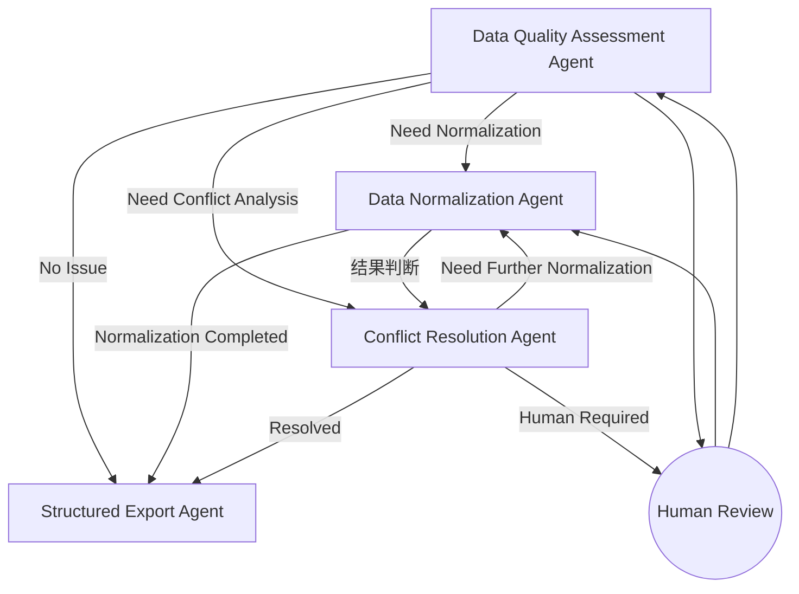

### ==各各agent模块设计及交互流程设计及功能职责设计==
**Data Quality Assessment Agent**：负责对输入数据进行质量评估，生成 Data Quality Report，包括数据是否需要规范化处理、是否存在冲突以及数据质量等级，为 LangGraph 的条件路由提供依据。

**Data Normalization Agent**：根据 Data Quality Report 或 Conflict Resolution Report，对数据执行标准化处理，包括字段统一、Schema Mapping、单位转换、缺失值处理、重复值处理以及格式规范化。在处理过程中，若检测到超出标准化能力范围的数据冲突，则提交至 Conflict Resolution Agent 进行进一步分析。

**Conflict Resolution Agent**：对存在冲突的数据进行分析，结合来源可信度、上下文信息及规则判断冲突是否能够自动解决；若无法保证结果可靠，则请求人工介入，并生成最终的 Conflict Resolution Report。结束该步骤后调用normalization模块。

**Structured Export Agent**：对经过规范化及冲突处理后的数据进行统一组织，生成标准化 CSV、Metadata、Traceability 信息以及最终的数据质量报告，供后续分析和前端展示。


### ==该图设计下的需要进行的workflow判断==：
**加入条件优先级判断:如果既需要conflict也需要normalization**
解决办法：如果conflict为true，那么normlization模块为false，之后再由conflict处理后调整为true再投入normlization模块

**异常处理与错误回退路径缺失：流程图未展示任何异常处理分支（如 Agent 内部执行失败、外部服务超时）。在生产环境中，任何一步报错都需要明确的降级或重试策略。添加异常处理节点，允许将错误数据导出为异常记录，并通知人工介入或终止流程。**
解决办法：每个 Agent 执行结束后均返回执行状态（Execution Status），包括 Success、Retry 和 Failed 三种状态。LangGraph 根据状态决定是否重试、进入人工介入流程或提前终止工作流。当 Agent 连续多次执行失败或输出结果置信度低于设定阈值时，将自动进入 Human error Review 节点，并保留当前执行状态与日志，保证工作流具有容错能力。

**缺少循环终止与收敛条件：B⇄C 的循环若无循环计数器或状态收敛判断，可能在极端数据上陷入无限循环。例如数据冲突无法自动解决且人工未介入，或每次规范化都产生新的冲突。**
解决办法：为避免 Data Normalization Agent 与 Conflict Resolution Agent 之间出现无限循环，系统在 Workflow 中维护当前处理状态（Workflow State）及循环计数器（Iteration Counter）。每完成一次规范化—冲突处理循环，系统重新评估数据质量。当满足以下任一条件时结束循环：（举例具体细则需要进行重判断）
数据质量满足预设标准；
不再检测到新的冲突；
达到最大迭代次数（如 3 次）；
Agent 判断当前问题无法继续自动优化。
若超过最大迭代次数仍未收敛，则自动进入 Human Review 节点，由人工完成最终决策。

### ==state设计==
**建议采用分层state设计，有层级管控的感觉**
下面是清洗数据部分之后的state设计：
```text
Global Workflow State(全局状态)
│
├── Context State （由意图识别的agent给出）
Context（研究领域、目标 Schema、单位规范、质量规则等）不仅质量模块需要，前面的检索、解析模块同样需要。为后续模块提供参考值
├── Research Data State      （前半部分）
└── Quality Module State     （后半部分）

Quality Module State
│
├── Data State (数据状态)
├── Report State (agent生成的report)
├── Workflow State(langgraph进行流程的控制)
└── Output State(最终输出状态)

Data State
│
├── Input Data(提取的数据源)
├── Current Data(Normalization,Conflict,Human等模块进行修改的部分，当前workflow处理的数据)
├── Human Modified Data(人工修改的部分方便进行回溯)
└── Data Trace(记录处理轨迹)

Report State
(用于记录agent生成的类似日志文件的东西)
│
├── Quality Report(用于是否进行比如normlizationagent或者是别的模块)
├── Conflict Report(是否需要人，或者是置信度计算，是否能够调用normlization等等)
└── Normalization Report(用于状态的记录，记录某数据进行了什么处理方法)

Workflow State
│
├── Current Node   （当前正在执行的 Agent）
├── Execution Status
│      当前 Agent 的执行状态（Success、Retry、Failed、Human Review记录是否成功，重复次数，人工的复检相关信息）
├── Iteration Counter （Workflow 已完成的循环次数，用于防止Normalization 与 Conflict 无限循环）
├── Route Decision （用于记录下一节点路径，可进行一个动态的调整）
└── Workflow History
       记录整个 Workflow 的执行轨迹（Agent 调用顺序、关键决策、状态变化）

Output State
│
├── Structured Data （最终处理的结构化数据）
├── Metadata （数据说明）
├── Traceability （数据来源可回溯，以及经过哪些处理）
└── Quality Summary （告诉查询者数据的质量）
```

**state与agent对应的流程**
| 流程节点                              | 主要读写的 State                                                                                                              |
| --------------------------------- | ------------------------------------------------------------------------------------------------------------------------ |
| **Data Quality Assessment Agent** | 读取 `Data State`、写入 `Quality Report`、更新 `Workflow State`                                                                  |
| **Data Normalization Agent**      | 读取 `Current Working Data` 和 `Quality/Conflict Report`、更新 `Current Working Data`、写入 `Processing Report`                   |
| **Conflict Resolution Agent**     | 读取 `Current Working Data` 和 `Processing Report`、写入 `Conflict Report`、必要时更新 `Workflow State`（Human Review、Route Decision） |
| **Structured Export Agent**       | 读取 `Current Working Data`、`Report State` 和 `Data Trace`，生成 `Output State`                                                |


### ==子agent具体设计==
==**每一个子agent就是一个subgraph，其内部分为几个stage具体映射到为；langgraph的一个node，每个stage需要具体调用哪些工具仍然需要具体的确认（准备一边写代码一边确认）**==

==**采取的设计方法及结构**==
| 模块               | 内容                            |
| ---------------- | ----------------------------- |
| Agent Name       | Data Quality Assessment Agent |
| Goal             | 唯一职责                          |
| Input            | 读取哪些 State                    |
| Output           | 输出哪些 Report                   |
| Read State       | Data State / Context State    |
| Write State      | Report State / Workflow State |
| Assessment Logic | 内部完成哪些质量评估                    |
| Decision         | Workflow 路由依据                 |
| Tool Capability  | 需要哪些工具能力                      |
| Failure Strategy | Retry / Human Review / Failed |

#### 1. Data Quality Assessment Agent具体设计(判断)
| 模块                   | 内容  |
| -------------------- | -------------------------------------------------------------------------------------------------------------------------------------------------------------------------------------------------------------------------- |
| **Agent Name**       | **Data Quality Assessment Agent**|
| **Goal**             | 对输入科学数据进行整体质量评估，识别数据质量问题，生成标准化的 **Data Quality Report**，并为 Workflow 提供后续处理路径的决策依据。该 Agent **仅负责评估，不直接修改数据**|
| **Input**            | **Context State**（Research Domain、Target Schema、Standard Unit、Quality Rules 等）<br>**Data State.Input Data**（解析后的原始数据）|
| **Output**           | **Quality Report**，包括数据质量评分、质量问题列表、规范化需求、冲突检测结果及后续处理建议。|
| **Read State**       | Context State<br>Data State.Input Data <br>report state.Quality report(retry再读) |
| **Write State**      | Report State → Quality Report<br>Workflow State → Route Decision、Execution Status |
| **Assessment Logic** | ① 数据完整性评估（Completeness Assessment）<br>② 数据一致性评估（Consistency Assessment）<br>③ 数据格式规范性评估（Format Assessment）<br>④ 数据来源可信度评估（Source Reliability Assessment）<br>⑤ 冲突风险评估（Conflict Risk Assessment）<br>⑥ 综合质量评分（Quality Scoring） |
| **Decision**| 根据 Quality Report 生成 Workflow 路由信息：<br>• Need Normalization<br>• Need Conflict Analysis<br>• No Issue（Direct Export）<br>固定 Route Priority（Conflict > Normalization）。<br>加上human review (第一版可以先不实现) |
| **Tool Capability** | • Missing Value Detection（缺值检测）<br>• Schema Validation（数据结构判断）<br>• Field Consistency Checker（字段一致性检查）<br>• Unit Consistency Checker单位一致性检查<br>• Duplicate Detection重复数据检测<br>• Source Validation（来源可信度检查）<br>• Quality Scoring Module（质量评分）|
| **Failure Strategy** | Agent 执行失败时返回 Execution Status。Workflow 根据状态进行 Retry；若连续超过最大重试次数或输出质量低于阈值，则进入 Human Review，并保留完整日志用于回溯。|


assessment具体细化过程：
```text
Assessment Logic（Agent内部推理）
│
├── Stage 1：Data Profiling
│      ↓
├── Stage 2：Quality Assessment
│      ├── Completeness Assessment
检查数据完整性，包括缺失字段、缺失值及元数据完整性。
│      ├── Consistency Assessment
检查数据一致性，包括Schema一致性、字段一致性、数据类型一致性及单位一致性。
│      ├── Format Assessment
检查数据格式规范性，包括日期格式、数值格式、编码格式及文件格式。
│      ├── Source Reliability Assessment
评估数据来源的完整性、可信度及可追溯性。
│      └── Conflict Risk Assessment
识别潜在的数据冲突风险，判断是否需要进入.Conflict Resolution Agent进行进一步分析。
│
├── Stage 3：Quality Evaluation
│      └── Quality Scoring
│
└── Stage 4：Decision Reasoning
       ↓
       输出 Quality Report
       综合前述评估结果，生成 Overall Quality Score、Issue List、Confidence，形成标准化 Quality Report。


Quality Report
│
├── Quality Score
├── Quality Level
├── Issue List(与assessmant的报告相接轨)
├── Need Normalization
├── Need Conflict Analysis
├── Confidence
└── Assessment Summary
```


#### 2.Data Normalization Agent具体设计（执行）

| 模块 | 内容 |
| ----------------------- | ---------------------------------------------------------------------------------------------------------------------------------------------------------------------------------------------------- |
| **Agent Name**| **Data Normalization Agent**  |
| **Goal**  | 根据 **Quality Report** 或 **Conflict Report**，对科学数据执行规范化处理，使数据符合目标 Schema 和统一的数据标准。并且quality和conflict的两种处理方式不同，该 Agent **负责修改数据，但不负责判断数据质量或解决复杂冲突**。  |
| **Input**  | **Context State**（Target Schema、Standard Unit、Quality Rules 等）<br>**Data State.Current Data**（当前待处理数据）<br>**Quality Report / Conflict Report**  |
| **Output**   | **Normalization Report**，包括执行的规范化操作、修改字段、未完成项及规范化结果。|
| **Read State** | Context State<br>Data State.Current Data<br>Report State.Quality Report / Conflict Report |
| **Write State** | Data State.Current Data（更新后的数据）<br>Report State → Normalization Report<br>Workflow State → Execution Status |
| **Normalization Logic** | ① Schema Mapping（字段映射）<br>② Field Standardization（字段标准化）<br>③ Unit Conversion（单位转换）<br>④ Missing Value Processing（缺失值处理）<br>⑤ Duplicate Record Processing（重复数据处理）<br>⑥ Format Standardization（格式规范化） |
| **Decision**  | 根据 Normalization Report 判断：<br>• Normalization Completed（进入 Structured Export）<br>• Need Conflict Analysis（进入 Conflict Resolution） |
| **Tool Capability**     | • Schema Mapping Engine<br>• Unit Converter<br>• Missing Value Handler<br>• Duplicate Detection & Merge<br>• Format Standardizer<br>• Data Validation Checker  |
| **Failure Strategy**    | 若规范化过程中工具执行失败，则返回 Retry；若检测到无法自动修复的数据冲突，则进入 Conflict Resolution Agent；连续失败则进入 Human Review，并保留完整 Normalization Log。|
```text
Normalization Logic
│
├── Stage 1：Normalization Planning
│      根据 Quality Report / Conflict Report
│      制定需要执行的规范化任务列表。制定需求的任务。
│
├── Stage 2：Data Normalization
│      ├── Schema Mapping
│      ├── Field Standardization
│      ├── Unit Conversion
│      ├── Missing Value Processing
│      ├── Duplicate Record Processing
│      └── Format Standardization
│
├── Stage 3：Validation
│      检查规范化后的数据是否满足目标 Schema，
│      是否仍存在明显异常或冲突。
│
└── Stage 4：Normalization Report Generation
       ↓
       输出 Normalization Report

Normalization Report
│
├── Normalization Status
├── Normalized Fields
├── Modified Records
├── Remaining Issues
├── Need Conflict Analysis
├── Confidence
└── Normalization Summary
```

### Conflict Resolution Agent具体设计（决策）
| 模块  | 内容 |
| -------------------- | ----------------------------------------------------------------------------------------------------------------------------------------------------------------------------------------------------------- |
| **Agent Name** | **Conflict Resolution Agent**  |
| **Goal** | 对 Data Quality Assessment Agent 或 Data Normalization Agent 检测出的数据冲突进行分析与决策，结合上下文、数据来源可信度、领域规则及历史信息，对冲突进行自动解决；对于无法保证可靠性的冲突，提交 Human Review。该 Agent **负责冲突决策，不负责数据标准化处理**。|
| **Input**   | **Context State**（Research Domain、Target Schema、Quality Rules 等）<br>**Data State.Current Data**（当前存在冲突的数据）<br>**Quality Report / Normalization Report**|
| **Output**  | **Conflict Resolution Report**，包括冲突类型、冲突原因、解决策略、置信度、是否需要人工介入及后续建议。|
| **Read State**   | Context State<br>Data State.Current Data<br>Report State.Quality Report / Normalization Report |
| **Write State**  | Report State → Conflict Resolution Report<br>Workflow State → Route Decision、Execution Status<br>Data State.Current Data（若自动解决，则更新数据） |
| **Resolution Logic** | ① Conflict Identification（冲突解析）<br>② Conflict Classification（冲突分类）<br>③ Evidence Collection（证据收集）<br>④ Resolution Reasoning（冲突决策）<br>⑤ Confidence Evaluation（置信度评估）<br>⑥ Resolution Report Generation（生成报告） |
| **Decision**   | 根据 Conflict Resolution Report 判断：<br>• Auto Resolved（调用 Data Normalization Agent 完成规范化）<br>• Human Review Required（进入 Human Review）<br>• Retry（重新分析）|
| **Tool Capability**  | • Source Reliability Analyzer<br>• Rule-based Conflict Checker<br>• Multi-source Comparison Engine<br>• Confidence Evaluation Module<br>• Conflict Reasoning Module    |
| **Failure Strategy** | Agent 执行失败时返回 Execution Status。Workflow 根据状态进行 Retry；若连续失败或冲突无法可靠解决，则进入 Human Review，并保留完整 Conflict Resolution Log。|


```text
Resolution Logic（Agent内部推理）
│
├── Stage 1：Conflict Identification
│      识别当前数据是否存在冲突，
│      提取所有冲突字段及冲突对象。
│
├── Stage 2：Conflict Classification
│      对冲突进行分类，
│      判断属于哪一种冲突类型，
│      为后续决策选择不同处理策略。
│
├── Stage 3：Evidence Collection
│      收集解决冲突所需的证据，
│      包括来源可信度、上下文信息、
│      数据质量报告、领域规则及历史记录。
│
├── Stage 4：Resolution Reasoning
│      综合所有证据进行推理，
│      判断是否能够自动解决冲突，
│      若可以，则生成解决策略；
│      若不能，则建议人工介入。
│
├── Stage 5：Confidence Evaluation
│      对当前决策结果进行可信度评估，
│      判断是否满足自动处理阈值，
│      并给出最终决策置信度。
│
└── Stage 6：Resolution Report Generation
       生成标准化 Conflict Resolution Report，
       输出冲突分析结果、解决方案、
       后续 Workflow 路由建议及处理摘要。

Conflict Resolution Report
│
├── Conflict Type
├── Conflict Cause
├── Resolution Strategy
├── Resolution Result
├── Need Human Review
├── Confidence
└── Resolution Summary
```


### Structured Export Agent 具体设计
| 模块 | 内容 |
| -------------------- | --------------------------------------------------------------------------------------------------------------------------------------------------------------------------------------------------------------- |
| **Agent Name**  | **Structured Export Agent** |
| **Goal**   | 对已经完成规范化处理及冲突解决的数据进行统一组织与结构化输出，生成标准格式的数据文件、元数据、数据溯源信息及最终质量摘要，为后续科研分析及前端展示提供统一的数据接口。该 Agent **仅负责数据组织与输出，不再修改数据内容。** |
| **Input**  | **Context State**（Target Schema、Output Format、Metadata Rules 等）<br>**Data State.Current Data**（最终处理完成的数据）<br>**Report State**（Quality Report、Normalization Report、Conflict Resolution Report）<br>**Data Trace** |
| **Output** | **Output State**，包括 Structured Data、Metadata、Traceability、Quality Summary。|
| **Read State**   | Context State<br>Data State.Current Data<br>Report State<br>Data State.Data Trace   |
| **Write State**  | Output State → Structured Data、Metadata、Traceability、Quality Summary<br>Workflow State → Execution Status   |
| **Export Logic**| ① Data Organization（数据组织）<br>② Schema Formatting（结构化格式转换）<br>③ Metadata Generation（元数据生成）<br>④ Traceability Construction（溯源信息构建）<br>⑤ Output Validation（输出一致性校验）<br>⑥ Structured Export Generation（生成最终输出） |
| **Decision**  | Workflow 最终节点。若输出校验通过，则结束 Workflow；若输出校验失败，则返回 Failed，由 Workflow 进行 Retry 或 Human Review。|
| **Tool Capability**  | • Schema Formatter（Schema格式转换）<br>• CSV / JSON Exporter（结构化导出）<br>• Metadata Generator（元数据生成）<br>• Traceability Builder（溯源信息构建）<br>• Output Validator（输出校验）|
| **Failure Strategy** | Agent 执行失败时返回 Execution Status。Workflow 根据状态进行 Retry；若连续失败或导出结果无法保证完整性，则进入 Human Review，并保留完整 Export Log。|

```txt
Export Logic（Agent内部处理）
│
├── Stage 1：Data Organization这一阶段主要负责把 Workflow 中间产生的临时字段（如置信度计算中间值、冲突分析缓存等）去除，只保留最终需要输出的数据。
│      对最终数据进行统一整理，
│      根据 Target Schema 组织数据结构。
│
├── Stage 2：Schema Formatting
│      按照目标 Schema
│      转换为统一的数据格式，
│      如 CSV、JSON 或 DataFrame。
│
├── Stage 3：Metadata Generation
│      生成数据元信息，
│      包括字段说明、单位信息、
│      数据来源、更新时间及处理记录。
│
├── Stage 4：Traceability Construction
│      构建完整的数据溯源信息，
│      建立数据与原始来源、
│      Workflow 处理过程及 Agent 决策记录之间的关联。
│
├── Stage 5：Output Validation
│      检查输出结果是否满足
│      Target Schema、
│      字段完整性及格式规范要求。
│
└── Stage 6：Structured Export Generation
       生成最终结构化输出，
       更新 Output State，
       完成 Workflow。
       Output State

       ├── Structured Data
       ├── Metadata
       ├── Traceability
       └── Quality Summary(可对之前的报告进行整合，整合步骤生成摘要，记录之前的置信度之类的，为客户提供相关参考信息)
```
