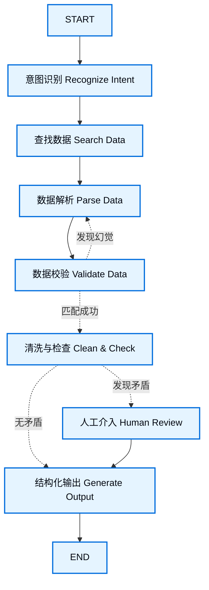
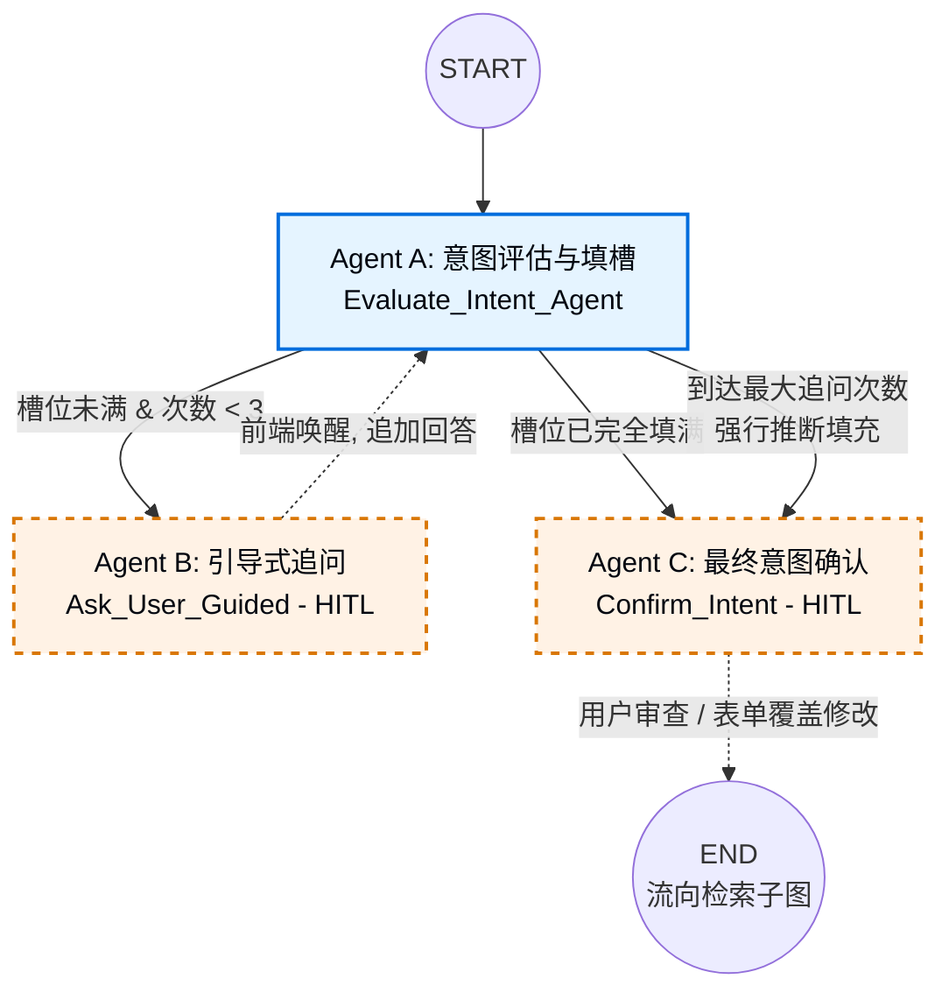
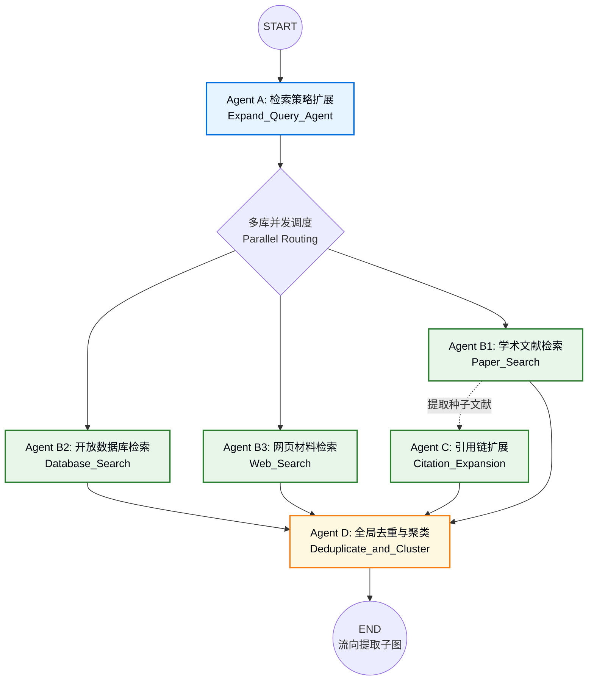
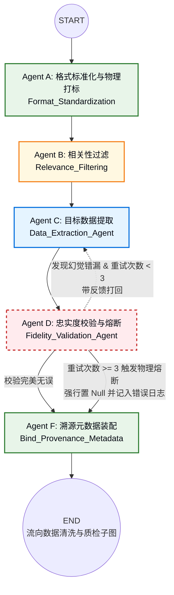
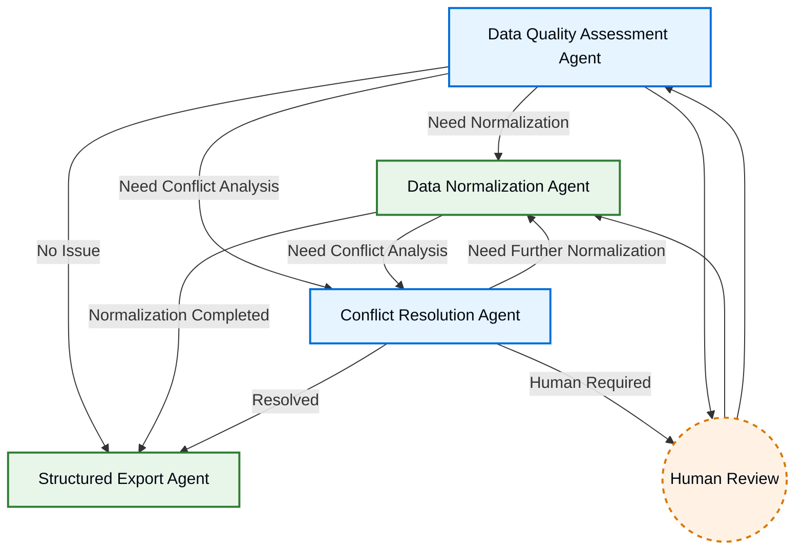

# LangGraph 多智能体科学数据处理管道 — 子图设计文档（统一版）

---

## 0. 总体流程概览

本管道是一个基于 LangGraph 的多智能体科学数据处理系统，用于对科研用户的自然语言查询进行从意图解析到结构化输出的全流程自动化处理。



### 工作流各步骤职责

| 步骤 | 职责 |
|------|------|
| **意图识别 (Recognize Intent)** | 基于已固定的研究领域，对用户的具体需求进行意图解析与参数提取。 |
| **查找数据 (Search Data)** | 调用子 Agent，通过上网查找和数据库检索，获取相关的多元科学文献与数据源。 |
| **数据解析 (Parse Data)** | 执行常规的文档解析过程，粗略剥离出所需的数据内容及其在原文档中的物理坐标 (bbox)。 |
| **数据校验 (Validate Data)** | 利用一个独立的审核 Agent，将提取出的数据与原文档进行严格匹配验证。一旦发现"幻觉"（匹配不上），则打回要求重新提取。 |
| **清洗与检查 (Clean & Check)** | 执行字段对齐、缺失值/重复值处理等整合工作。同时检测全局数据是否存在单位不一致或数据矛盾。 |
| **人工介入 (Human Review)** | 当遇到系统无法自行化解的矛盾或图例错误时，强制挂起程序，向前端发送请求，交由人工完成修正。 |
| **结构化输出 (Generate Output)** | 在一切验证和人工修正完毕后，进行最终数据的结构化组装，供前端实现溯源高亮展示。 |

> 💡 **路由说明：** 部分节点会根据情况做出分支决策（例如 `数据校验` 和 `清洗与检查`），而另一些节点则总是固定流向下一步（例如 `查找数据` 必然走向 `数据解析`，`人工介入` 解决后必然走向 `结构化输出`）。

### 管道分解为四个子图

以上 7 个步骤被分解为四个独立的子图（Sub-Graph），每个子图内部包含若干 Agent：

| 子图 | 对应顶层步骤 | 说明 |
|------|-------------|------|
| **子图 1：意图澄清子图** | 步骤 1 | 意图解析、参数提取、HITL 确认 |
| **子图 2：检索子图** | 步骤 2 | 多源并发检索、引用链扩展、去重聚类 |
| **子图 3：提取子图** | 步骤 3 + 4 | 格式标准化、目标提取、忠实度校验与熔断 |
| **子图 4：数据清洗与质检子图** | 步骤 5 + 6 + 7 | 质量评估、规范化、冲突解决、结构化导出 |

---

## 1. 意图澄清子图 (Intent Clarification Sub-Graph)

### 1.1 子图概览

意图澄清子图是整个 LangGraph 工作流的入口阶段。它负责对用户的自然语言科学查询进行意图解析与参数提取，通过动态生成槽位检查清单、引导式追问和最终人工确认，将模糊的自然语言转化为结构化的检索参数集合（`extracted_parameters`），为下游检索子图提供精确的检索目标。本子图内部包含 3 个 Agent，其中 Agent B 和 Agent C 为 HITL（Human-in-the-Loop）交互 Agent。



### 1.2 状态设计

#### 1.2a 平面状态参数表

| State 参数名 | 类型 (Type) | 初始值 | 读/写属性 | 说明与用途 |
|:---|:---|:---|:---|:---|
| `original_query` | String | 用户初次输入 | 只读 | 用户的原始问题（如："帮我找找某种合金的高温数据"） |
| `query_context` | Dict | 继承自全局 | 只读 | 包含用户的初始配置（如：泛读模式/精准提取模式）。决定了 Agent A 对模糊度的容忍底线。 |
| `chat_history` | List[Message] | `[]` | 读/写 | 存储 AI 的追问选项和用户的补充回答，供 Agent A 上下文参考 |
| `dynamic_task_schema` | Dict | `None` | 读/写 | AI 在第一回合基于领域知识"现场生成"的槽位检查清单（必填项/选填项） |
| `extracted_parameters` | Dict | `{}` | 读/写 | 实时更新的已提取/已推断出的科学参数。**（本子图的核心输出产物）** |
| `clarification_turns` | Integer | `0` | 读/写 | 追问计数器。用于触发兜底机制，防止死循环。最大 3 次。 |
| `is_clear` | Boolean | `False` | 读/写 | 路由开关。为 True 时跳出追问循环，前往 Agent C。 |
| `compromise_flag` | Boolean | `False` | 写 | 兜底标记。若为 True，警告下游该数据包含了 AI 的强制猜测（置信度降级）。 |

### 1.3 Agent 详细设计

---

#### 1.3.1 Agent A: Evaluate_Intent_Agent（意图评估与填槽）

**定位：** 具备领域常识的动态规划师，负责解构任务和核对账单。

| 属性 | 内容 |
|:---|:---|
| **Agent Name** | **Evaluate_Intent_Agent** |
| **Goal** | 基于问题动态生成需提取的参数清单（槽位 Schema），核对当前信息，决定是追问、强行猜测还是放行。 |
| **Input** | `original_query`；`query_context`；`chat_history`；`clarification_turns` |
| **Output** | `dynamic_task_schema`；`extracted_parameters`（更新）；`is_clear`；`compromise_flag` |
| **Read State** | `original_query`；`query_context`；`chat_history`；`clarification_turns` |
| **Write State** | `dynamic_task_schema`；`extracted_parameters`；`is_clear`；`compromise_flag` |
| **Logic** | 见下方 Node 拆分。 |
| **Decision** | • **条件 1（全部填满）：** 调用工具 `submit_final_intent` → 设置 `is_clear=True`，流向 Agent C。<br>• **条件 2（未填满且 `turns < 3`）：** 调用工具生成带选项的追问 → 流向 Agent B。<br>• **条件 3（未填满且 `turns >= 3`）：** 调用工具 `force_submit_best_guess` 强行补齐参数 → 设置 `compromise_flag=True` 及 `is_clear=True`，流向 Agent C。 |
| **Tool Capability** | • Dynamic Schema Generator（基于领域知识现场生成槽位检查清单）• Intent Parser（从自然语言中提取结构化参数）• Slot Filler（将 chat_history 中的信息映射到槽位清单）• Force Submit Tool（强行推断最佳猜测，补齐缺失槽位） |
| **Failure Strategy** | 大模型生成 Schema 失败或参数提取异常时，返回 Retry；连续失败后，设置 `compromise_flag=True`，使用用户原始输入作为降级参数强制放行至 Agent C。 |

**内部 Node 拆分：**

```text
Intent Evaluation Logic
│
├── Node 1：Schema Planning
│      若 dynamic_task_schema 为空（首回合），
│      根据 original_query 和 query_context，
│      基于领域知识现场生成专属的槽位检查清单
│     （区分必填项/选填项）。
│
├── Node 2：Parameter Extraction
│      将 chat_history 中的用户回答信息
│      映射填充到槽位清单中，
│      更新 extracted_parameters。
│
├── Node 3：Slot Completeness Verification
│      检查所有必填项是否已赋值。
│      ├── 全部填满 → is_clear = True。
│      └── 存在空缺 → 根据 turns 判断路径。
│
└── Node 4：Decision Routing
       ├── 全部填满 → 调用 submit_final_intent → 流向 Agent C。
       ├── 未填满 + turns < 3 → 生成引导式追问选项 → 流向 Agent B。
       └── 未填满 + turns >= 3 → 调用 force_submit_best_guess →
           compromise_flag = True + is_clear = True → 流向 Agent C。
```

**extracted_parameters 结构：**

```text
extracted_parameters
│
├── entities（目标实体列表：材料名称、天体名称、化合物等）
├── properties（目标属性：温度、强度、密度、红移等）
├── conditions（约束条件：时间范围、实验类型、精度要求等）
├── output_format（输出偏好：表格/图表/原始数据等）
└── confidence（各槽位的置信度评分及 compromise_flag 标记）
```

---

#### 1.3.2 Agent B: Ask_User_Guided（引导式追问 — HITL）

**定位：** LangGraph 的原生挂起点，负责与前端交互，收集缺失线索。**（本 Agent 为简单 HITL 交互 Agent，不进行内部 Node 拆分。）**

| 属性 | 内容 |
|:---|:---|
| **Agent Name** | **Ask_User_Guided** |
| **Goal** | 暂停程序运行，将大模型生成的追问文本及单选/多选 Options 发送给前端，等待用户确认缺失槽位。 |
| **Input** | `extracted_parameters`（用于前端展示当前已解析出的部分数据） |
| **Output** | `chat_history`（追加用户补充回答）；`clarification_turns`（递增） |
| **Read State** | `extracted_parameters`（用于前端展示当前已解析出的部分数据） |
| **Write State** | `chat_history`；`clarification_turns` |
| **Logic** | **步骤 1：** 触发 `interrupt()` 挂起，向前端发送追问文本及 Options。<br>**步骤 2：** 接收到前端传回的用户补充信息（如："我选 (A) B波段"）。<br>**步骤 3：** 将回答追加至 `chat_history`，并将 `clarification_turns + 1`。 |
| **Decision** | 唤醒后，**无条件路由回 Agent A** 进行下一轮槽位检查。 |
| **Tool Capability** | • `interrupt()` 挂起机制（LangGraph 原生 HITL）• Frontend Form Renderer（向前端渲染追问选项）• Response Parser（解析前端传回的用户补充信息） |
| **Failure Strategy** | 若用户长时间未响应（超时），自动触发 `force_submit_best_guess`，设置 `compromise_flag=True`，直接跳转至 Agent C。 |

---

#### 1.3.3 Agent C: Confirm_Intent（最终意图确认 — HITL）

**定位：** 状态覆盖（State Overwrite）的核心 Agent，人类防线的最后一关。**（本 Agent 为简单 HITL 交互 Agent，不进行内部 Node 拆分。）**

| 属性 | 内容 |
|:---|:---|
| **Agent Name** | **Confirm_Intent** |
| **Goal** | 在进入高消耗的"检索子图"前，将拟定的终极检索参数清单展示给人类，允许人类进行最后一键放行或暴力修改。 |
| **Input** | `extracted_parameters`；`compromise_flag`（若为 True，前端需高亮警告："部分参数为 AI 推测"） |
| **Output** | `extracted_parameters`（经 State Patching 覆盖后的最终版本） |
| **Read State** | `extracted_parameters`；`compromise_flag` |
| **Write State** | `extracted_parameters`（通过 State Patching 机制覆盖） |
| **Logic** | **步骤 1：** 触发 `interrupt()` 挂起，向前端渲染可编辑表单（Editable Form），若 `compromise_flag=True` 则高亮警告。<br>**步骤 2：** 接收前端返回的最终 JSON。<br>**步骤 3：** 无论用户是直接点确认，还是修改了参数，直接用前端返回的 JSON 强行覆盖当前的 `extracted_parameters`。 |
| **Decision** | 唤醒后，**流出本子图，向图结构下游的检索子图放行**。 |
| **Tool Capability** | • `interrupt()` 挂起机制（LangGraph 原生 HITL）• Editable Form Renderer（前端可编辑表单，支持逐字段修改）• State Patching Engine（用前端返回的 JSON 直接覆盖 State） |
| **Failure Strategy** | 用户超时未响应 → 自动接受当前 `extracted_parameters`（保持 `compromise_flag` 原值不变），直接放行。 |

### 1.4 Agent-to-State 映射表

| Agent | 读取的 State | 写入的 State |
|:---|:---|:---|
| **Agent A: Evaluate_Intent_Agent** | `original_query`；`query_context`；`chat_history`；`clarification_turns` | `dynamic_task_schema`；`extracted_parameters`；`is_clear`；`compromise_flag` |
| **Agent B: Ask_User_Guided** | `extracted_parameters` | `chat_history`；`clarification_turns` |
| **Agent C: Confirm_Intent** | `extracted_parameters`；`compromise_flag` | `extracted_parameters`（覆盖） |

### 1.5 工作流控制逻辑

#### 追问循环控制（A ⇄ B 循环）

Agent A 与 Agent B 之间形成**带计数器的追问闭环**：

1. Agent A 评估槽位完整性；
2. 槽位未满且 `clarification_turns < 3` → Agent B 发起追问；
3. 用户回答 → Agent B 追加 `chat_history`，`clarification_turns + 1` → 无条件路由回 Agent A；
4. Agent A 重新评估 → 循环直至槽位填满或达到最大追问次数。

#### 兜底机制

- **最大追问次数：3 次**（`clarification_turns` 上限）。
- 当 `clarification_turns >= 3` 且槽位仍未完全填满时：
  - 调用 `force_submit_best_guess` 对缺失槽位进行 AI 最佳猜测填充；
  - 设置 `compromise_flag = True`，标记部分参数为 AI 推测；
  - 前端在 Agent C 的确认表单中高亮警告"部分参数为 AI 推测"；
  - 下游使用该数据时自动降级置信度。

#### 异常处理

- **Agent A 大模型生成 Schema / 提取参数失败**：Retry；连续失败后设置 `compromise_flag=True`，使用原始查询作为降级参数强制放行。
- **Agent B 用户超时未响应**：自动触发兜底，设置 `compromise_flag=True`，直接跳转 Agent C。
- **Agent C 用户超时未响应**：自动接受当前 `extracted_parameters`，保持原 `compromise_flag` 值，直接放行至检索子图。
- **所有异常路径均保留完整日志**，供后续回溯。

---


## 2. 检索子图 (Retrieval Sub-Graph)

### 2.1 子图概览

检索子图负责将意图澄清子图输出的结构化意图参数（`extracted_parameters`）翻译为机器友好的多源检索指令，并发调用学术文献库、开放数据库和网页搜索引擎进行资料抓取，再利用引用链扩展突破关键词检索的局限，最终经过全局去重与优先级合并，输出一份干净、无重复的资产清单（`deduplicated_assets`），供下游提取子图使用。本子图内部包含 6 个 Agent，其中 Agent B1/B2/B3 为并行执行。



### 2.2 状态设计

#### 2.2a 平面状态参数表

| State 参数名 | 类型 (Type) | 初始值 | 读/写属性 | 说明与用途 |
|:---|:---|:---|:---|:---|
| `intent_params` | Dict | 继承自上游 | 只读 | 意图澄清子图输出的最终参数集合（即 `extracted_parameters`）。包含目标实体、必填条件等。 |
| `expanded_queries` | Dict | `{}` | 读/写 | Agent A 生成的面向不同数据源的具体 API 检索策略（如同义词、布尔逻辑表达式、API 过滤参数） |
| `raw_papers` | List[Dict] | `[]` | 读/写/追加 | Agent B1 检索到的学术论文原始元数据（包含 DOI、摘要、PDF 链接） |
| `raw_databases` | List[Dict] | `[]` | 读/写/追加 | Agent B2 检索到的结构化开放数据（如 JSON/CSV 的概要信息） |
| `raw_web_supplements` | List[Dict] | `[]` | 读/写/追加 | Agent B3 检索到的 `.edu/.gov` 等权威网页及附件材料路径 |
| `citation_papers` | List[Dict] | `[]` | 读/写/追加 | Agent C 基于种子文献通过图谱 API 挖掘出的"引文/被引"扩展文献集 |
| `deduplicated_assets` | List[Dict] | `[]` | 写 | **【本子图最终输出产物】** 经 Agent D 全局合并、去重、排优先级后的干净资产清单，供下游提取子图使用 |

### 2.3 Agent 详细设计

---

#### 2.3.1 Agent A: Expand_Query_Agent（检索策略扩展）

**定位：** 将人类意图翻译为机器友好的多源检索指令。

| 属性 | 内容 |
|:---|:---|
| **Agent Name** | **Expand_Query_Agent** |
| **Goal** | 大模型读取意图参数，发散思维，生成同义词、上下位词，并针对文献库、数据库、网页分别构建最佳的布尔检索式及 API 参数载荷。 |
| **Input** | `intent_params`（意图澄清子图输出的结构化参数） |
| **Output** | `expanded_queries`（分源的检索策略载荷） |
| **Read State** | `intent_params` |
| **Write State** | `expanded_queries` |
| **Logic** | 见下方 Node 拆分。 |
| **Decision** | 固定流向并行路由（Parallel Routing），将各源查询策略分发至 B1/B2/B3。 |
| **Tool Capability** | • Entity Extractor（从意图参数中提取核心实体）• Synonym Generator（基于科学常识生成同义词扩展：别名、不同命名规范）• Boolean Query Builder（构建布尔检索表达式）• API Parameter Packager（针对 OpenAlex、科学 API、Google Search 分别打包查询载荷） |
| **Failure Strategy** | 若策略扩展失败（如大模型返回格式异常），返回 Retry；连续失败则使用意图原词作为降级查询，不阻塞检索流程。 |

**内部 Node 拆分：**

```text
Query Expansion Logic
│
├── Node 1：Core Entity Extraction
│      读取 intent_params 中的核心实体
│     （如：特定超新星名称、材料牌号、实验条件等）。
│
├── Node 2：Synonym & Hyponym Expansion
│      结合科学常识生成同义词和上下位词扩展
│     （如别名、不同命名规范、相关术语变体）。
│
└── Node 3：Source-Specific Query Construction
       ├── 学术文献策略：生成 OpenAlex / Semantic Scholar 的 API 查询载荷。
       ├── 开放数据库策略：生成针对特定科学数据库的结构化查询参数。
       └── 网页检索策略：生成 Google Search 的限定域名（.edu/.gov）查询。
       分别打包写入 expanded_queries。
```

**Expanded Queries 结构：**

```text
expanded_queries
│
├── paper_query（学术文献检索式与 API 参数）
├── database_query（开放数据库检索式与过滤条件）
└── web_query（网页检索引擎查询词与域名白名单）
```

---

#### 2.3.2 Agent B1: Paper_Search（学术文献检索）

**定位：** 系统并发执行，互不阻塞，最大化召回率。调用论文库 API 抓取原始元数据。

| 属性 | 内容 |
|:---|:---|
| **Agent Name** | **Paper_Search** |
| **Goal** | 根据 Expanded Queries 中的学术文献检索策略，调用论文库 API（如 OpenAlex、Semantic Scholar），抓取高相关度文献元数据。 |
| **Input** | `expanded_queries.paper_query` |
| **Output** | `raw_papers`（文献元数据列表） |
| **Read State** | `expanded_queries` |
| **Write State** | `raw_papers` |
| **Logic** | 见下方 Node 拆分。 |
| **Decision** | 固定流向 Agent C（Citation_Expansion，提供种子文献）和 Agent D（Deduplicate_and_Cluster，直接汇入去重池）。 |
| **Tool Capability** | • OpenAlex API Connector（论文检索与元数据提取）• Semantic Scholar API Connector（引文网络与高被引数据）• Rate Limiter（API 速率控制）• Result Normalizer（将异构 API 返回统一为标准元数据格式） |
| **Failure Strategy** | 单个 API 超时或返回异常时，使用备用 API 重试；全部 API 不可用则返回空列表，记录告警日志，不阻塞其他并行分支。 |

**内部 Node 拆分：**

```text
Paper Search Logic
│
├── Node 1：API Query Construction
│      将 paper_query 参数转换为特定 API 的请求格式
│     （OpenAlex / Semantic Scholar 各自适配）。
│
├── Node 2：Rate-Limited Fetch
│      受控并发调用 API，抓取文献元数据
│     （标题、作者、DOI、摘要、出版年份、被引量、PDF 链接等）。
│
└── Node 3：Result Normalization
       将不同 API 返回的异构结果统一为标准元数据格式，
       写入 raw_papers。
```

---

#### 2.3.3 Agent B2: Database_Search（开放数据库检索）

**定位：** 针对特定科学数据库接口提取结构化数据索引。

| 属性 | 内容 |
|:---|:---|
| **Agent Name** | **Database_Search** |
| **Goal** | 根据 Expanded Queries 中的数据库检索策略，调用特定科学数据库接口，提取结构化数据索引及概要信息。 |
| **Input** | `expanded_queries.database_query` |
| **Output** | `raw_databases`（数据库条目列表） |
| **Read State** | `expanded_queries` |
| **Write State** | `raw_databases` |
| **Logic** | 见下方 Node 拆分。 |
| **Decision** | 固定流向 Agent D（Deduplicate_and_Cluster）。 |
| **Tool Capability** | • Domain-Specific DB Connectors（各领域科学数据库的连接器）• Schema Mapper（将数据库 Schema 映射为统一表示）• Query Executor（结构化查询执行） |
| **Failure Strategy** | 数据库连接失败或查询超时时，返回空列表并记录告警日志，不阻塞整体流程。 |

**内部 Node 拆分：**

```text
Database Search Logic
│
├── Node 1：Schema Mapping
│      根据目标数据库的 Schema，将 database_query 参数
│      映射为对应的查询语句或 API 调用。
│
├── Node 2：Query Execution
│      执行查询，获取结构化数据索引
│     （含数据概要、字段描述、下载链接等）。
│
└── Node 3：Result Extraction
       提取关键元信息，生成统一格式的数据条目，
       写入 raw_databases。
```

---

#### 2.3.4 Agent B3: Web_Search（网页材料检索）

**定位：** 限定权威域名，抓取特定实验组主页的补充 PDF/CSV。

| 属性 | 内容 |
|:---|:---|
| **Agent Name** | **Web_Search** |
| **Goal** | 根据 Expanded Queries 中的网页检索策略，限定权威域名（.edu / .gov 等），抓取特定实验组主页的补充材料路径及元信息。 |
| **Input** | `expanded_queries.web_query` |
| **Output** | `raw_web_supplements`（权威网页及附件材料路径列表） |
| **Read State** | `expanded_queries` |
| **Write State** | `raw_web_supplements` |
| **Logic** | 见下方 Node 拆分。 |
| **Decision** | 固定流向 Agent D（Deduplicate_and_Cluster）。 |
| **Tool Capability** | • Search API（Google Search / Bing API）• Domain Filter（限定 .edu / .gov 等权威域名）• Content Extractor（提取页面关键元信息、附件链接） |
| **Failure Strategy** | 搜索引擎 API 不可用时，返回空列表并记录告警日志，不阻塞整体流程。 |

**内部 Node 拆分：**

```text
Web Search Logic
│
├── Node 1：Search Query Execution
│      将 web_query 提交至搜索引擎 API，
│      限定权威域名白名单（.edu / .gov）。
│
├── Node 2：Domain-Filtered Fetch
│      抓取搜索结果中匹配域名的页面摘要及附件链接
│     （PDF / CSV / Excel 等）。
│
└── Node 3：Content Extraction & Normalization
       提取关键元信息（页面标题、描述、附件 URL），
       去除噪声，写入 raw_web_supplements。
```

---

#### 2.3.5 Agent C: Citation_Expansion（引用链扩展）

**定位：** 突破关键词检索的局限，挖掘隐藏的高优文献。

| 属性 | 内容 |
|:---|:---|
| **Agent Name** | **Citation_Expansion** |
| **Goal** | 从 B1 抓取的文献中筛选出高被引/权威的"种子论文"，通过图谱 API 顺藤摸瓜提取其参考文献（后向引用）及引用文献（前向引用），挖掘关键词检索无法直接命中的隐藏高优文献。 |
| **Input** | `raw_papers`（B1 产出的文献元数据列表） |
| **Output** | `citation_papers`（引文扩展文献集） |
| **Read State** | `raw_papers` |
| **Write State** | `citation_papers` |
| **Logic** | 见下方 Node 拆分。 |
| **Decision** | 固定流向 Agent D（Deduplicate_and_Cluster）。 |
| **Tool Capability** | • Seed Selection Ranker（按相关度/被引量排序，提取 Top N 种子文献）• Citation Graph API（Semantic Scholar / OpenAlex 的图 API）• Depth Controller（控制引文遍历深度，防止图谱爆炸）• Dedup Filter（在扩展过程中进行初步去重） |
| **Failure Strategy** | 图谱 API 不可用时，跳过引文扩展，直接使用 raw_papers 作为唯一论文池，不阻塞后续流程。 |

**内部 Node 拆分：**

```text
Citation Expansion Logic
│
├── Node 1：Seed Selection
│      对 raw_papers 按相关度或被引量排序，
│      提取 Top N 篇作为种子文献。
│
├── Node 2：Backward Citation Mining
│      调用 Semantic Scholar / OpenAlex 的 Graph API，
│      提取种子文献的参考文献列表（追溯数据源头）。
│
├── Node 3：Forward Citation Mining
│      提取引用了种子文献的后续研究
│     （发现基于该数据的新成果）。
│
└── Node 4：Expansion Deduplication
       在扩展过程中进行初步去重（与 raw_papers 及 citation_papers 内部比对），
       剔除已存在的文献，将新发现的文献写入 citation_papers。
```

**Citation Expansion Report 结构：**

```text
citation_papers（条目结构）
│
├── paper_id（唯一标识：DOI / Semantic Scholar ID）
├── title（标题）
├── relation_type（"reference" 或 "citation"）
├── seed_paper_id（关联的种子文献 ID）
├── depth（遍历深度层级）
└── metadata（摘要、作者、年份、被引量等）
```

---

#### 2.3.6 Agent D: Deduplicate_and_Cluster（全局去重与聚类）

**定位：** 清理整合。将四个来源的数据池进行全局盘点、去重、融合。

| 属性 | 内容 |
|:---|:---|
| **Agent Name** | **Deduplicate_and_Cluster** |
| **Goal** | 对前置四个原始数据池（论文 + 数据库 + 网页 + 引文）进行全局盘点、去重、融合，输出一份最干净、无重复的待解析清单（`deduplicated_assets`）。 |
| **Input** | `raw_papers`；`raw_databases`；`raw_web_supplements`；`citation_papers` |
| **Output** | `deduplicated_assets`（本子图最终产物） |
| **Read State** | `raw_papers`；`raw_databases`；`raw_web_supplements`；`citation_papers` |
| **Write State** | `deduplicated_assets` |
| **Logic** | 见下方 Node 拆分。 |
| **Decision** | 固定流向 END，数据进入提取子图。 |
| **Tool Capability** | • Exact Identifier Matcher（基于 DOI / PMID / URL 的强标识符精确去重）• Semantic Title Matcher（语义标题去重，应对同一论文的不同预印本或转正版本）• Priority Merge Engine（优先级合并：若同一数据在多个来源中出现，优先保留直达链接，丢弃高解析成本路径） |
| **Failure Strategy** | 若去重算法异常，输出全部未去重数据并标记告警，不阻塞下游；若四个输入池全为空，返回 Failed，通知上游。 |

**内部 Node 拆分：**

```text
Deduplication & Clustering Logic
│
├── Node 1：Exact Identifier Dedup
│      基于 DOI、PMID、URL 等强标识符，
│      剔除完全重复的数据条目。
│
├── Node 2：Semantic Title Dedup
│      基于标题语义相似度，
│      识别并合并同一篇论文的不同预印本版本
│     （如 arXiv v1 vs 正式发表版本）。
│
├── Node 3：Priority-Based Merge
│      对同一数据在多个来源中出现的情况进行优先级合并。
│      优先级规则示例：开放数据库直达链接 > 论文 PDF 附件 >
│      网页摘要提及。丢弃高解析成本的冗余路径。
│
└── Node 4：Final Asset List Generation
       生成统一标准的 deduplicated_assets 列表，
       每条资产包含：来源类型、标识符、优先级、元信息摘要。
```

**deduplicated_assets 条目结构：**

```text
deduplicated_assets（条目结构）
│
├── asset_id（全局唯一标识）
├── source_type（"paper" / "database" / "web" / "citation"）
├── priority（优先级评分）
├── metadata（统一元信息摘要）
├── access_path（最优获取路径：URL / API Endpoint / File Path）
└── duplicate_of（若由合并生成，指向被合并的主条目 ID）
```

### 2.4 Agent-to-State 映射表

| Agent | 读取的 State | 写入的 State |
|:---|:---|:---|
| **Agent A: Expand_Query_Agent** | `intent_params` | `expanded_queries` |
| **Agent B1: Paper_Search** | `expanded_queries` | `raw_papers` |
| **Agent B2: Database_Search** | `expanded_queries` | `raw_databases` |
| **Agent B3: Web_Search** | `expanded_queries` | `raw_web_supplements` |
| **Agent C: Citation_Expansion** | `raw_papers` | `citation_papers` |
| **Agent D: Deduplicate_and_Cluster** | `raw_papers`；`raw_databases`；`raw_web_supplements`；`citation_papers` | `deduplicated_assets` |

### 2.5 工作流控制逻辑

#### 并行路由机制

Agent A 完成检索策略扩展后，LangGraph 的 Parallel Routing 将 `expanded_queries` 同时分发至 B1、B2、B3 三个检索节点。三者**并发执行、互不阻塞**，最大化召回率。

- Agent B1 额外将结果异步发送至 Agent C（Citation_Expansion）；
- B1、B2、B3、C 的结果最终全部汇入 Agent D（Deduplicate_and_Cluster）；
- Agent D 等待全部四个输入就绪后执行（**all-join 屏障**）。

#### 部分失败容忍

- B1 / B2 / B3 中任意一个或多个节点返回空结果或执行失败，**不影响其他并行分支**；
- 对应的数据池为空列表，Agent D 正常处理剩余数据；
- 仅当四个输入池**全部为空**时，Agent D 返回 Failed，通知上游。

#### 引用链扩展的依赖关系

- Agent C 依赖 Agent B1 的产出（`raw_papers`）作为种子文献来源；
- B1 完成即可唤醒 C，**不等待 B2/B3**；
- 若 B1 返回空，C 跳过执行，直接传递空 `citation_papers` 至 D。

#### 异常处理与超时

- 各检索节点的 API 调用均设超时限制，超时后记录告警并返回已有结果（而非全部丢弃）；
- Agent A 大模型生成失败时，使用意图原词作为降级查询，不阻塞检索；
- 所有异常在最终 `deduplicated_assets` 中附注数据完整性警告标记。

---

## 3. 提取子图 (Extraction Sub-Graph)

### 3.1 子图概览

提取子图肩负着连接"脏数据源"和下游"完美结构化数据"的重任。它负责将检索子图输出的去重资产列表（`deduplicated_assets`）进行格式标准化、相关性过滤，然后通过大模型进行目标数据提取，再经过独立的忠实度校验环节进行"事不过三"的熔断式纠错，最终装配溯源元数据，输出严格符合"多态溯源协议"的结构化数据（`grounded_data`），供下游数据清洗与质检子图使用。本子图内部包含 5 个 Agent，其中 Agent C（提取）与 Agent D（校验）之间形成带熔断的重试闭环。



### 3.2 状态设计

#### 3.2a 平面状态参数表

| State 参数名 | 类型 (Type) | 初始值 | 读/写属性 | 说明与用途 |
|:---|:---|:---|:---|:---|
| `raw_assets` | List[Dict] | 继承自上游 | 只读 | 检索子图传来的干净资产列表（如 PDF 路径、网页 URL、API 响应） |
| `hard_mapping_dict` | Dict | `{}` | 读/写 | **【核心防幻觉字典】** 记录 `trace_id` 对应的绝对物理定位。如 `{"doc1_tb1_r2": {"box": [10,20,100,30], "page": 2}}`。大模型不可见。 |
| `filtered_blocks` | List[str] | `[]` | 读/写 | 注入了 `[ID: xxx]` 标记的 Markdown 文本块/图表，喂给提取大模型的真正原料 |
| `extracted_draft` | Dict | `{}` | 读/写 | Agent C 提取出的草稿数据，仅包含 `value` 和引用的 `trace_id` |
| `validation_feedback` | String | `""` | 读/写 | Agent D 发现错误时生成的纠错指南，传回给 Agent C |
| `extraction_attempts` | Integer | `0` | 读/写 | 循环计数器，用于触发早停熔断机制（最大设定为 3） |
| `grounded_data` | Dict | `{}` | 写 | **【本子图最终输出产物】** 严格符合"多态溯源协议"的结构化字典，完全适配数据清洗与质检子图 |

### 3.3 Agent 详细设计

---

#### 3.3.1 Agent A: Format_Standardization（格式标准化与物理打标）

**定位：** 负责切分与 ID 分配。剥离异构数据的解析难度，将所有数据统一转化为带有 `[ID:xxx]` 标签的通用序列，并建立物理坐标硬映射账本。

| 属性 | 内容 |
|:---|:---|
| **Agent Name** | **Format_Standardization** |
| **Goal** | 将所有异构数据源（PDF、网页、开放数据）统一转化为带有 `[ID:xxx]` 标签的通用序列，并建立 `trace_id` 到真实物理坐标的硬映射账本（`hard_mapping_dict`），为后续的大模型提取提供可校验的溯源基础。 |
| **Input** | `raw_assets`（检索子图输出的资产列表） |
| **Output** | `filtered_blocks`（初始态，未经相关性过滤）；`hard_mapping_dict` |
| **Read State** | `raw_assets` |
| **Write State** | `filtered_blocks`（初始态）；`hard_mapping_dict` |
| **Logic** | 见下方 Node 拆分。 |
| **Decision** | 固定流向 Agent B（Relevance_Filtering）。 |
| **Tool Capability** | • PDF Parser（文档解析引擎：提取文字段落、裁剪图片、拆解表格行）• DOM Stripper（网页数据：剥离冗余 DOM，提取核心 Agent）• ID Tagger（为每个碎片分配唯一 `trace_id`）• BBox Extractor（提取 `[x0, y0, x1, y1]` 及页码）• XPath/JSONPath Extractor（网页/数据库的物理定位提取） |
| **Failure Strategy** | 单个资产解析失败时，跳过该资产并记录错误日志（不阻塞整体流程）；若全部资产解析失败，返回 Failed，进入 Human Review。 |

**内部 Node 拆分：**

```text
Format Standardization Logic
│
├── Node 1：Source Type Detection
│      识别每个资产的类型（PDF / 网页 / 开放数据 / 其他），
│      选择对应的解析策略。
│
├── Node 2：Content Decomposition & ID Assignment
│      ├── PDF 文件：调用文档解析引擎，提取文字段落、裁剪图片、
│      │         拆解表格行，为每个碎片分配唯一 trace_id。
│      ├── 网页数据：剥离冗余 DOM，提取核心 Agent，打上 trace_id。
│      └── 开放数据：为数据库行赋予 trace_id。
│
├── Node 3：Physical Mapping Construction
│      ├── PDF：将 [x0, y0, x1, y1] 及页码存入 hard_mapping_dict。
│      ├── 网页：将 XPath 存入字典。
│      └── 开放数据：将 Primary Key / JSONPath 存入字典。
│
└── Node 4：Markdown Assembly
       将所有碎片拼装成统一格式的文本流：
       "[ID: doc1_p2_tb1_r1] Yield: 450MPa"
       写入 filtered_blocks（初始态）。
```

---

#### 3.3.2 Agent B: Relevance_Filtering（相关性过滤）

**定位：** 初筛。利用廉价算法剔除无关段落，只保留高潜候选块。

| 属性 | 内容 |
|:---|:---|
| **Agent Name** | **Relevance_Filtering** |
| **Goal** | 利用廉价的轻量级算法剔除与核心意图无关的段落，只保留可能包含目标数据的候选块，减少后续大模型处理的上下文长度与成本。 |
| **Input** | 全局意图参数（如目标实体关键字）；含 ID 标记的完整文本块（初始 `filtered_blocks`） |
| **Output** | `filtered_blocks`（最终态，仅含高相关度文本块） |
| **Read State** | 全局意图参数；`filtered_blocks`（初始态） |
| **Write State** | `filtered_blocks`（最终态，覆盖写入） |
| **Logic** | 见下方 Node 拆分。 |
| **Decision** | 固定流向 Agent C（Data_Extraction_Agent）。 |
| **Tool Capability** | • BM25 Scorer（词频统计算法）• Lightweight Embedding Model（轻量级向量检索模型）• Top-K Ranker（高潜段落排序与截断） |
| **Failure Strategy** | 若过滤后 `filtered_blocks` 为空（全被剔除），发出警告并保留原始 Top N 块兜底；若算法本身失败，跳过过滤，原样传递全部块至 Agent C。 |

**内部 Node 拆分：**

```text
Relevance Filtering Logic
│
├── Node 1：Intent Keyword Extraction
│      从全局意图参数中提取核心实体/属性关键字，
│      构建过滤匹配词表。
│
├── Node 2：Scoring & Ranking
│      利用 BM25 词频统计或轻量级 Embedding 模型（向量检索），
│      计算每个文本块与意图的相关度得分。
│
└── Node 3：Top-K Selection
       按得分排序，保留 Top K 个高潜段落和图表数据块，
       更新 filtered_blocks（最终态），抛给 LLM 进行提取。
```

---

#### 3.3.3 Agent C: Data_Extraction_Agent（目标数据提取）

**定位：** 核心提取。根据目标 Schema，强制输出带 `trace_id` 的结构化数据，绝对禁止捏造。

| 属性 | 内容 |
|:---|:---|
| **Agent Name** | **Data_Extraction_Agent** |
| **Goal** | 根据目标 Schema，从过滤后的文本块中提取数值，并强制要求一字不差地"抄写"对应的 `trace_id`。绝对禁止捏造数字，绝对禁止输出坐标空间。 |
| **Input** | `filtered_blocks`（最终态）；`validation_feedback`（若为重试，则附带 Agent D 的纠错指导建议） |
| **Output** | `extracted_draft`（草稿数据，含 value 和 trace_id） |
| **Read State** | `filtered_blocks`；`validation_feedback`（重试时） |
| **Write State** | `extracted_draft` |
| **Logic** | 见下方 Node 拆分。 |
| **Decision** | 固定流向 Agent D（Fidelity_Validation_Agent）。 |
| **Tool Capability** | • LLM with Structured Output（大模型提取，约束输出 Schema）• VLM for Image Extraction（遇到图片时触发视觉模型提取，并返回图片对应的 ID）• Trace ID Validator（确保只引用存在的 trace_id） |
| **Failure Strategy** | 提取失败时将 `extraction_attempts` 递增；若 `attempts < 3`，随 `validation_feedback` 打回重试；若 `attempts >= 3`，触发熔断（由 Agent D 处理）。 |

**内部 Node 拆分：**

```text
Data Extraction Logic
│
├── Node 1：Context Assembly
│      将 filtered_blocks 按顺序组装为 Prompt Context，
│      注入目标 Schema 定义及输出格式约束。
│      （若为 Agent D 打回的重试，则附带 validation_feedback。）
│
├── Node 2：Value Extraction
│      大模型从 [ID:xx] 标记的文本中提取目标数值，
│      输入提示词限制：绝对禁止捏造数字，绝对禁止输出坐标空间。
│      若遇到图片，触发 VLM 视觉模型提取图片中的值。
│
├── Node 3：Trace ID Binding
│      对每条提取值，强制绑定其来源文本块的 trace_id。
│      输出格式示例：
│      {"field": "yield_strength", "extracted_value": "450 MPa",
│       "trace_id": "doc1_p2_tb1_r1"}
│
└── Node 4：Draft Generation
       汇总所有提取条目，生成 extracted_draft，
       写入 State 供 Agent D 校验。
```

---

#### 3.3.4 Agent D: Fidelity_Validation_Agent（忠实度校验与熔断）

**定位：** 独立核对，减少幻觉。执行"事不过三"的熔断降级策略。

| 属性 | 内容 |
|:---|:---|
| **Agent Name** | **Fidelity_Validation_Agent** |
| **Goal** | 纯逻辑比对提取的数值是否真实存在于引用的 ID 文本中。执行"事不过三"的熔断降级：若连续 3 次提取均无法通过验证，则强行置 Null 放行，防止死循环。 |
| **Input** | `extracted_draft`；`filtered_blocks`（原始对照文本）；`extraction_attempts` |
| **Output** | `validation_feedback`（纠错指南）；或 Clearance Signal（放行信号） |
| **Read State** | `extracted_draft`；`filtered_blocks`（原始对照文本）；`extraction_attempts` |
| **Write State** | `validation_feedback`；`extraction_attempts`（递增） |
| **Logic** | 见下方 Node 拆分。 |
| **Decision** | • 完全匹配 → 清除 feedback，放行流向 Agent F。• 不匹配且 `attempts < 3` → 生成纠错 feedback，`attempts + 1`，打回 Agent C。• 不匹配且 `attempts >= 3` → 触发物理熔断：强行将该字段的 `extracted_value` 设为 `Null`，附加 `is_compromised: True` 错误日志，放行流向 Agent F。 |
| **Tool Capability** | • Trace ID Legality Verifier（验证 trace_id 是否在 `hard_mapping_dict` 中合法存在）• Substring Matcher（验证 extracted_value 是否为对应文本块的精确子串）• Numeric Equivalence Checker（数值等价性校验，处理单位/精度差异）• Feedback Generator（生成具体纠错指引，如"未在 ID:[x] 中找到 450MPa"） |
| **Failure Strategy** | 已内嵌于 Decision 中的熔断机制：`attempts < 3` → 打回重试；`attempts >= 3` → 置 Null + 标记 `is_compromised: True` + 放行。校验工具本身若无法执行（如文本块已丢失），直接按熔断处理。 |

**内部 Node 拆分：**

```text
Fidelity Validation Logic
│
├── Node 1：Trace ID Legality Check
│      验证 extracted_draft 中的每一个 trace_id
│      是否在 hard_mapping_dict 或 filtered_blocks 中合法存在。
│      若 ID 不存在，直接标记为非法。
│
├── Node 2：Value Fidelity Check
│      对每个提取值，验证其是否为对应文本块的精确子串
│     （或数值等价——允许合理的单位转换和精度差异）。
│      比对对象：extracted_value vs 原文本中 trace_id 对应的片段。
│
├── Node 3：Match / Mismatch Classification
│      将每条提取记录分为：✓ 完全匹配 / ✗ 不匹配 / ? 存疑。
│
└── Node 4：Decision & Feedback Routing
       ├── 全部匹配 → 清除 validation_feedback，生成 Clearance Signal。
       ├── 存在不匹配且 attempts < 3 →
       │       生成纠错 feedback（如"未在 ID:[x] 中找到 450MPa"），
       │       extraction_attempts + 1，路由回 Agent C。
       └── 存在不匹配且 attempts >= 3 →
               触发物理熔断：强行将不匹配字段的 extracted_value 设为 Null，
               附加 is_compromised: True 及错误日志，放行流向 Agent F。
```

---

#### 3.3.5 Agent F: Bind_Provenance_Metadata（溯源元数据装配）

**定位：** 整合打包。使用 `trace_id` 查阅硬字典账本，封装生成统一协议数据。

| 属性 | 内容 |
|:---|:---|
| **Agent Name** | **Bind_Provenance_Metadata** |
| **Goal** | 使用 `trace_id` 查阅"硬字典账本"（`hard_mapping_dict`），将大模型提取的值与真实的物理坐标/路径封装绑定，生成统一多态溯源协议数据，向全图放行。 |
| **Input** | `extracted_draft`（经校验的数据）；`hard_mapping_dict` |
| **Output** | `grounded_data`（本子图最终产物） |
| **Read State** | `extracted_draft`；`hard_mapping_dict` |
| **Write State** | `grounded_data` |
| **Logic** | 见下方 Node 拆分。 |
| **Decision** | 固定流向 END，数据进入数据清洗与质检子图。 |
| **Tool Capability** | • Hard Mapping Resolver（按 trace_id 查询物理坐标）• Multi-Polymorphism Protocol Builder（组装统一溯源格式）• JSON Assembler（生成标准 JSON 输出） |
| **Failure Strategy** | 若某个 trace_id 在 hard_mapping_dict 中查不到对应记录，将该字段标记为 `provenance: "unresolved"` 并记录告警日志，不阻塞整体输出。若 hard_mapping_dict 整体不可用，返回 Failed，进入 Human Review。 |

**内部 Node 拆分：**

```text
Provenance Binding Logic
│
├── Node 1：Trace ID Resolution
│      遍历 extracted_draft 中的每一条记录，
│      提取 trace_id 字段。
│
├── Node 2：Physical Coordinate Lookup
│      使用 trace_id 到 hard_mapping_dict 中查询：
│      返回对应的 box（坐标）、page（页码）、
│      xpath（网页路径）或 primary_key（数据库行）。
│
├── Node 3：Polymorphism Protocol Packaging
│      无论值是提取成功的还是被强行置 Null 的，
│      都将其组装为"多态溯源协议"的统一 JSON 格式：
│      { "field": ..., "value": ..., "trace_id": ...,
│        "provenance": { "page": ..., "box": ..., "source": ... },
│        "is_compromised": true/false }
│
└── Node 4：Final grounded_data Assembly
       汇总所有绑定记录，写入 grounded_data，
       向全图放行，流向数据清洗与质检子图。
```

### 3.4 Agent-to-State 映射表

| Agent | 读取的 State | 写入的 State |
|:---|:---|:---|
| **Agent A: Format_Standardization** | `raw_assets` | `filtered_blocks`（初始态）；`hard_mapping_dict` |
| **Agent B: Relevance_Filtering** | 全局意图参数；`filtered_blocks`（初始态） | `filtered_blocks`（最终态，覆盖） |
| **Agent C: Data_Extraction_Agent** | `filtered_blocks`（最终态）；`validation_feedback`（重试时） | `extracted_draft` |
| **Agent D: Fidelity_Validation_Agent** | `extracted_draft`；`filtered_blocks`；`extraction_attempts` | `validation_feedback`；`extraction_attempts`（递增） |
| **Agent F: Bind_Provenance_Metadata** | `extracted_draft`；`hard_mapping_dict` | `grounded_data` |

### 3.5 工作流控制逻辑

#### 提取-校验重试循环（C ⇄ D）

Agent C（提取）与 Agent D（校验）之间形成带反馈的重试闭环：

1. Agent C 首次提取 → Agent D 校验；
2. Agent D 发现错漏 → 生成具体纠错 feedback → `extraction_attempts + 1` → 打回 Agent C；
3. Agent C 接收 feedback，重新提取 → Agent D 再次校验；
4. 循环直至全部匹配**或**达到最大尝试次数。

#### 熔断机制（"事不过三"）

- **最大重试次数：3 次**（`extraction_attempts` 上限）。
- 当 `extraction_attempts >= 3` 时触发物理熔断：
  - 强制将未通过校验的字段 `extracted_value` 设为 `Null`；
  - 附加 `is_compromised: True` 及详细错误日志；
  - 放行流向 Agent F（不再阻塞整体流程）。
- 熔断后的数据在 Agent F 中正常装配，但携带受损标记，供下游和前端识别。

#### 异常处理

- **Agent A 单资产解析失败**：跳过该资产，记录错误日志，不阻塞整体。
- **Agent B 过滤后为空**：发出警告，保留原始 Top N 块兜底。
- **Agent D 校验工具本身失败**（如对照文本块丢失）：直接按熔断处理。
- **Agent F hard_mapping_dict 整体不可用**：返回 Failed，进入 Human Review。
- **各 Agent 内部工具执行失败**：返回 Retry，超出最大重试次数则进入 Human Review。

---

## 4. 数据清洗与质检子图 (Data Cleaning & Quality Sub-Graph)

### 4.1 子图概览

数据清洗与质检子图是整个 LangGraph 工作流的收尾阶段。它负责对提取子图输出的数据（`grounded_data`）进行质量评估、规范化处理、冲突检测与解决，最终生成结构化数据、元数据、溯源信息及质量摘要，供后续科研分析及前端展示。本子图内部包含 4 个 Agent，Agent 之间通过条件路由形成 "评估 → 规范化 ⇄ 冲突解决 → 导出" 的处理闭环。



### 4.2 状态设计

#### 4.2a 平面状态参数表

| State 参数名 | 类型 (Type) | 初始值 | 读/写属性 | 说明与用途 |
|:---|:---|:---|:---|:---|
| **Data State** | | | | |
| `data.input_data` | Dict | 继承自上游 | 只读 | 提取子图传入的原始数据源（即 `grounded_data`） |
| `data.current_data` | Dict | `{}` | 读/写 | 当前 Workflow 正在处理的数据，是 Normalization / Conflict / Human 模块的操作目标 |
| `data.human_modified_data` | Dict | `{}` | 写 | 人工修改后的数据快照，用于回溯对比 |
| `data.data_trace` | List[Dict] | `[]` | 追加 | 记录每一步数据修改的处理轨迹 |
| **Report State** | | | | |
| `report.quality_report` | Dict | `{}` | 写 | Data Quality Assessment Agent 生成的质量评估报告 |
| `report.conflict_report` | Dict | `{}` | 写 | Conflict Resolution Agent 生成的冲突解决报告 |
| `report.normalization_report` | Dict | `{}` | 写 | Data Normalization Agent 生成的规范化处理报告 |
| **Workflow State** | | | | |
| `workflow.current_node` | String | `""` | 读/写 | 当前正在执行的 Agent 名称 |
| `workflow.execution_status` | Enum | `Success` | 读/写 | 当前 Agent 的执行状态：Success / Retry / Failed / Human Review |
| `workflow.iteration_counter` | Integer | `0` | 读/写 | Workflow 已完成 Normalization↔Conflict 循环次数，防止无限循环（最大 3 次） |
| `workflow.route_decision` | String | `""` | 读/写 | 下一节点路径标识，支持动态调整 |
| `workflow.workflow_history` | List[Dict] | `[]` | 追加 | 记录 Agent 调用顺序、关键决策及状态变化 |
| **Output State** | | | | |
| `output.structured_data` | List[Dict] | `[]` | 写 | 最终处理完成的结构化数据 |
| `output.metadata` | Dict | `{}` | 写 | 数据说明（字段含义、单位、来源等） |
| `output.traceability` | Dict | `{}` | 写 | 数据来源可回溯信息及处理链路 |
| `output.quality_summary` | Dict | `{}` | 写 | 最终质量摘要（整合各 Report，记录置信度等信息供用户参考） |

### 4.3 Agent 详细设计

> **设计说明：** 每一个 Agent 即一个 Sub-Graph，其内部划分为若干 Node，每个 Node 映射为 LangGraph 图中的一个执行节点。具体每个 Node 需调用哪些工具，仍需在编码阶段进一步确认。

---

#### 4.3.1 Data Quality Assessment Agent（判断）

| 属性 | 内容 |
|:---|:---|
| **Agent Name** | **Data Quality Assessment Agent** |
| **Goal** | 对输入科学数据进行整体质量评估，识别数据质量问题，生成标准化的 **Data Quality Report**，并为 Workflow 提供后续处理路径的决策依据。该 Agent **仅负责评估，不直接修改数据**。 |
| **Input** | Context State（Research Domain、Target Schema、Standard Unit、Quality Rules 等）；Data State.Input Data（解析后的原始数据） |
| **Output** | **Quality Report**，包括数据质量评分、质量问题列表、规范化需求、冲突检测结果及后续处理建议。 |
| **Read State** | Context State；Data State.Input Data；Report State.Quality Report（Retry 时再读） |
| **Write State** | Report State → Quality Report；Workflow State → Route Decision、Execution Status |
| **Logic** | 见下方 Node 拆分。 |
| **Decision** | 根据 Quality Report 生成 Workflow 路由信息：• Need Normalization • Need Conflict Analysis • No Issue（Direct Export）。固定 Route Priority（Conflict > Normalization）。另含 Human Review 路由（第一版可先不实现）。 |
| **Tool Capability** | • Missing Value Detection（缺值检测）• Schema Validation（数据结构判断）• Field Consistency Checker（字段一致性检查）• Unit Consistency Checker（单位一致性检查）• Duplicate Detection（重复数据检测）• Source Validation（来源可信度检查）• Quality Scoring Module（质量评分） |
| **Failure Strategy** | Agent 执行失败时返回 Execution Status。Workflow 根据状态进行 Retry；若连续超过最大重试次数或输出质量低于阈值，则进入 Human Review，并保留完整日志用于回溯。 |

**内部 Node 拆分：**

```text
Assessment Logic（Agent 内部推理）
│
├── Node 1：Data Profiling
│      对输入数据进行概要分析，统计字段数量、数据类型分布、
│      来源分布及总体规模，为后续评估建立基线。
│      ↓
├── Node 2：Quality Assessment
│      ├── Completeness Assessment
│            检查数据完整性，包括缺失字段、缺失值及元数据完整性。
│      ├── Consistency Assessment
│            检查数据一致性，包括 Schema 一致性、字段一致性、
│            数据类型一致性及单位一致性。
│      ├── Format Assessment
│            检查数据格式规范性，包括日期格式、数值格式、
│            编码格式及文件格式。
│      ├── Source Reliability Assessment
│            评估数据来源的完整性、可信度及可追溯性。
│      └── Conflict Risk Assessment
│            识别潜在的数据冲突风险，判断是否需要进入
│            Conflict Resolution Agent 进行进一步分析。
│
├── Node 3：Quality Evaluation
│      └── Quality Scoring
│            综合前述评估结果，计算 Overall Quality Score、
│            确定 Quality Level，并评估评估结果的 Confidence。
│
└── Node 4：Decision Reasoning
       综合前述评估结果，生成标准化 Quality Report，
       输出 Overall Quality Score、Issue List、Confidence，
       并给出 Workflow 路由建议。
```

**Quality Report 结构：**

```text
Quality Report
│
├── Quality Score（综合质量评分）
├── Quality Level（质量等级）
├── Issue List（与 Assessment 各维度相对应的具体问题列表）
├── Need Normalization（是否需要规范化处理）
├── Need Conflict Analysis（是否需要冲突分析）
├── Confidence（评估结果的置信度）
└── Assessment Summary（评估摘要）
```

---

#### 4.3.2 Data Normalization Agent（执行）

| 属性 | 内容 |
|:---|:---|
| **Agent Name** | **Data Normalization Agent** |
| **Goal** | 根据 **Quality Report** 或 **Conflict Report**，对科学数据执行规范化处理，使数据符合目标 Schema 和统一的数据标准。Quality 和 Conflict 两种场景下的处理方式有所不同。该 Agent **负责修改数据，但不负责判断数据质量或解决复杂冲突**。 |
| **Input** | Context State（Target Schema、Standard Unit、Quality Rules 等）；Data State.Current Data（当前待处理数据）；Quality Report / Conflict Report |
| **Output** | **Normalization Report**，包括执行的规范化操作、修改字段、未完成项及规范化结果。 |
| **Read State** | Context State；Data State.Current Data；Report State.Quality Report / Conflict Report |
| **Write State** | Data State.Current Data（更新后的数据）；Report State → Normalization Report；Workflow State → Execution Status |
| **Logic** | 见下方 Node 拆分。 |
| **Decision** | 根据 Normalization Report 判断：• Normalization Completed（进入 Structured Export）• Need Conflict Analysis（进入 Conflict Resolution） |
| **Tool Capability** | • Schema Mapping Engine（字段映射）• Unit Converter（单位转换）• Missing Value Handler（缺失值处理）• Duplicate Detection & Merge（重复检测与合并）• Format Standardizer（格式规范化）• Data Validation Checker（数据校验） |
| **Failure Strategy** | 若规范化过程中工具执行失败，则返回 Retry；若检测到无法自动修复的数据冲突，则进入 Conflict Resolution Agent；连续失败则进入 Human Review，并保留完整 Normalization Log。 |

**内部 Node 拆分：**

```text
Normalization Logic
│
├── Node 1：Normalization Planning
│      根据 Quality Report / Conflict Report
│      制定需要执行的规范化任务列表。
│
├── Node 2：Data Normalization
│      ├── Schema Mapping（字段映射）
│      ├── Field Standardization（字段标准化）
│      ├── Unit Conversion（单位转换）
│      ├── Missing Value Processing（缺失值处理）
│      ├── Duplicate Record Processing（重复数据处理）
│      └── Format Standardization（格式规范化）
│
├── Node 3：Validation
│      检查规范化后的数据是否满足目标 Schema，
│      是否仍存在明显异常或冲突。
│
└── Node 4：Normalization Report Generation
       生成 Normalization Report，记录规范化状态、
       已修改字段、剩余问题及置信度。
```

**Normalization Report 结构：**

```text
Normalization Report
│
├── Normalization Status（规范化执行状态）
├── Normalized Fields（已规范化的字段列表）
├── Modified Records（已修改的记录明细）
├── Remaining Issues（仍存在的遗留问题）
├── Need Conflict Analysis（是否需要进入冲突分析）
├── Confidence（规范化结果置信度）
└── Normalization Summary（规范化摘要）
```

---

#### 4.3.3 Conflict Resolution Agent（决策）

| 属性 | 内容 |
|:---|:---|
| **Agent Name** | **Conflict Resolution Agent** |
| **Goal** | 对 Data Quality Assessment Agent 或 Data Normalization Agent 检测出的数据冲突进行分析与决策，结合上下文、数据来源可信度、领域规则及历史信息，对冲突进行自动解决；对于无法保证可靠性的冲突，提交 Human Review。该 Agent **负责冲突决策，不负责数据标准化处理**。 |
| **Input** | Context State（Research Domain、Target Schema、Quality Rules 等）；Data State.Current Data（当前存在冲突的数据）；Quality Report / Normalization Report |
| **Output** | **Conflict Resolution Report**，包括冲突类型、冲突原因、解决策略、置信度、是否需要人工介入及后续建议。 |
| **Read State** | Context State；Data State.Current Data；Report State.Quality Report / Normalization Report |
| **Write State** | Report State → Conflict Resolution Report；Workflow State → Route Decision、Execution Status；Data State.Current Data（若自动解决，则更新数据） |
| **Logic** | 见下方 Node 拆分。 |
| **Decision** | 根据 Conflict Resolution Report 判断：• Auto Resolved（调用 Data Normalization Agent 完成规范化）• Human Review Required（进入 Human Review）• Retry（重新分析） |
| **Tool Capability** | • Source Reliability Analyzer（来源可信度分析）• Rule-based Conflict Checker（基于规则的冲突检查）• Multi-source Comparison Engine（多源比对引擎）• Confidence Evaluation Module（置信度评估）• Conflict Reasoning Module（冲突推理） |
| **Failure Strategy** | Agent 执行失败时返回 Execution Status。Workflow 根据状态进行 Retry；若连续失败或冲突无法可靠解决，则进入 Human Review，并保留完整 Conflict Resolution Log。 |

**内部 Node 拆分：**

```text
Resolution Logic（Agent 内部推理）
│
├── Node 1：Conflict Identification
│      识别当前数据是否存在冲突，
│      提取所有冲突字段及冲突对象。
│
├── Node 2：Conflict Classification
│      对冲突进行分类，
│      判断属于哪一种冲突类型，
│      为后续决策选择不同处理策略。
│
├── Node 3：Evidence Collection
│      收集解决冲突所需的证据，
│      包括来源可信度、上下文信息、
│      数据质量报告、领域规则及历史记录。
│
├── Node 4：Resolution Reasoning
│      综合所有证据进行推理，
│      判断是否能够自动解决冲突，
│      若可以，则生成解决策略；
│      若不能，则建议人工介入。
│
├── Node 5：Confidence Evaluation
│      对当前决策结果进行可信度评估，
│      判断是否满足自动处理阈值，
│      并给出最终决策置信度。
│
└── Node 6：Resolution Report Generation
       生成标准化 Conflict Resolution Report，
       输出冲突分析结果、解决方案、
       后续 Workflow 路由建议及处理摘要。
```

**Conflict Resolution Report 结构：**

```text
Conflict Resolution Report
│
├── Conflict Type（冲突类型）
├── Conflict Cause（冲突原因）
├── Resolution Strategy（解决策略）
├── Resolution Result（解决结果）
├── Need Human Review（是否需要人工介入）
├── Confidence（决策置信度）
└── Resolution Summary（解决摘要）
```

---

#### 4.3.4 Structured Export Agent（输出）

| 属性 | 内容 |
|:---|:---|
| **Agent Name** | **Structured Export Agent** |
| **Goal** | 对已经完成规范化处理及冲突解决的数据进行统一组织与结构化输出，生成标准格式的数据文件、元数据、数据溯源信息及最终质量摘要，为后续科研分析及前端展示提供统一的数据接口。该 Agent **仅负责数据组织与输出，不再修改数据内容**。 |
| **Input** | Context State（Target Schema、Output Format、Metadata Rules 等）；Data State.Current Data（最终处理完成的数据）；Report State（Quality Report、Normalization Report、Conflict Resolution Report）；Data State.Data Trace |
| **Output** | **Output State**，包括 Structured Data、Metadata、Traceability、Quality Summary。 |
| **Read State** | Context State；Data State.Current Data；Report State；Data State.Data Trace |
| **Write State** | Output State → Structured Data、Metadata、Traceability、Quality Summary；Workflow State → Execution Status |
| **Logic** | 见下方 Node 拆分。 |
| **Decision** | Workflow 最终节点。若输出校验通过，则结束 Workflow；若输出校验失败，则返回 Failed，由 Workflow 进行 Retry 或 Human Review。 |
| **Tool Capability** | • Schema Formatter（Schema 格式转换）• CSV / JSON Exporter（结构化导出）• Metadata Generator（元数据生成）• Traceability Builder（溯源信息构建）• Output Validator（输出校验） |
| **Failure Strategy** | Agent 执行失败时返回 Execution Status。Workflow 根据状态进行 Retry；若连续失败或导出结果无法保证完整性，则进入 Human Review，并保留完整 Export Log。 |

**内部 Node 拆分：**

```text
Export Logic（Agent 内部处理）
│
├── Node 1：Data Organization
│      对最终数据进行统一整理，
│      去除 Workflow 中间产生的临时字段
│     （如置信度计算中间值、冲突分析缓存等），
│      只保留最终需要输出的数据，
│      根据 Target Schema 组织数据结构。
│
├── Node 2：Schema Formatting
│      按照目标 Schema
│      转换为统一的数据格式，
│      如 CSV、JSON 或 DataFrame。
│
├── Node 3：Metadata Generation
│      生成数据元信息，
│      包括字段说明、单位信息、
│      数据来源、更新时间及处理记录。
│
├── Node 4：Traceability Construction
│      构建完整的数据溯源信息，
│      建立数据与原始来源、
│      Workflow 处理过程及 Agent 决策记录之间的关联。
│
├── Node 5：Output Validation
│      检查输出结果是否满足
│      Target Schema、
│      字段完整性及格式规范要求。
│
└── Node 6：Structured Export Generation
       生成最终结构化输出，
       更新 Output State，
       完成 Workflow。
```

**Output State 结构：**

```text
Output State
│
├── Structured Data（最终处理的结构化数据）
├── Metadata（数据说明）
├── Traceability（数据来源可回溯及处理链路）
└── Quality Summary（整合各 Report 的质量摘要，
                     记录置信度等关键指标，
                     为用户提供参考信息）
```

### 4.4 Agent-to-State 映射表

| Agent | 读取的 State | 写入的 State |
|:---|:---|:---|
| **Data Quality Assessment Agent** | Context State；Data State.Input Data；Report State.Quality Report（Retry 时） | Report State.Quality Report；Workflow State.Route Decision、Execution Status |
| **Data Normalization Agent** | Context State；Data State.Current Data；Report State.Quality Report / Conflict Report | Data State.Current Data；Report State.Normalization Report；Workflow State.Execution Status |
| **Conflict Resolution Agent** | Context State；Data State.Current Data；Report State.Quality Report / Normalization Report | Report State.Conflict Resolution Report；Workflow State.Route Decision、Execution Status；Data State.Current Data（自动解决时） |
| **Structured Export Agent** | Context State；Data State.Current Data；Report State；Data State.Data Trace | Output State.Structured Data、Metadata、Traceability、Quality Summary；Workflow State.Execution Status |

### 4.5 工作流控制逻辑

#### 条件优先级规则

当 Data Quality Assessment Agent 同时检测到规范化需求和冲突风险时，采用**固定优先级**：**Conflict > Normalization**。具体流程为：
1. 优先路由至 Conflict Resolution Agent 处理冲突；
2. Conflict 处理完毕后，由 Conflict Resolution Agent 路由至 Normalization Agent 执行规范化；
3. Normalization Agent 处理完毕后进入 Structured Export。

#### 异常处理与错误回退路径

每个 Agent 执行结束后均返回 Execution Status（Success / Retry / Failed）。LangGraph 根据状态决定：
- **Success**：按 Route Decision 进入下一节点；
- **Retry**：重新执行当前 Agent，保留执行日志；
- **Failed**（连续多次失败或置信度低于阈值）：自动进入 Human Review 节点，保留当前执行状态与完整日志。

#### 循环终止与收敛条件

为避免 Data Normalization Agent 与 Conflict Resolution Agent 之间出现无限循环（B ⇄ C），系统维护 `Iteration Counter`。每完成一次 "规范化 → 冲突处理" 循环，系统重新评估数据质量。满足以下**任一条件**时结束循环：

1. 数据质量满足预设标准（Quality Score 达标）；
2. 不再检测到新的冲突（No New Conflict Detected）；
3. 达到最大迭代次数（**3 次**）；
4. Agent 判断当前问题无法继续自动优化（Unresolvable by Automation）。

若超过最大迭代次数仍未收敛，自动进入 Human Review，由人工完成最终决策。

---

